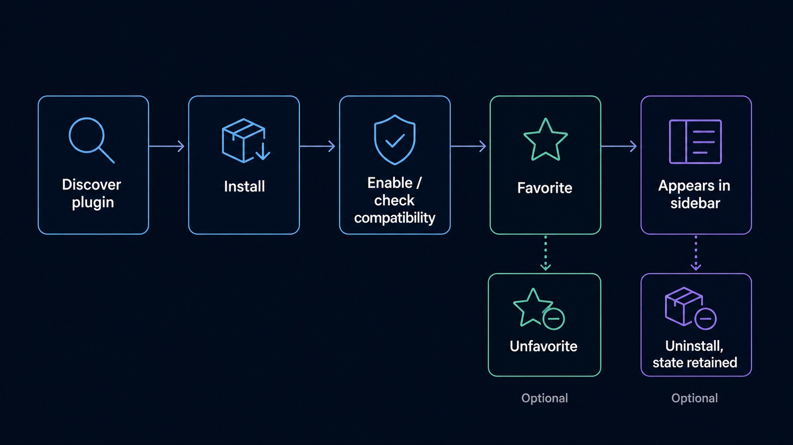
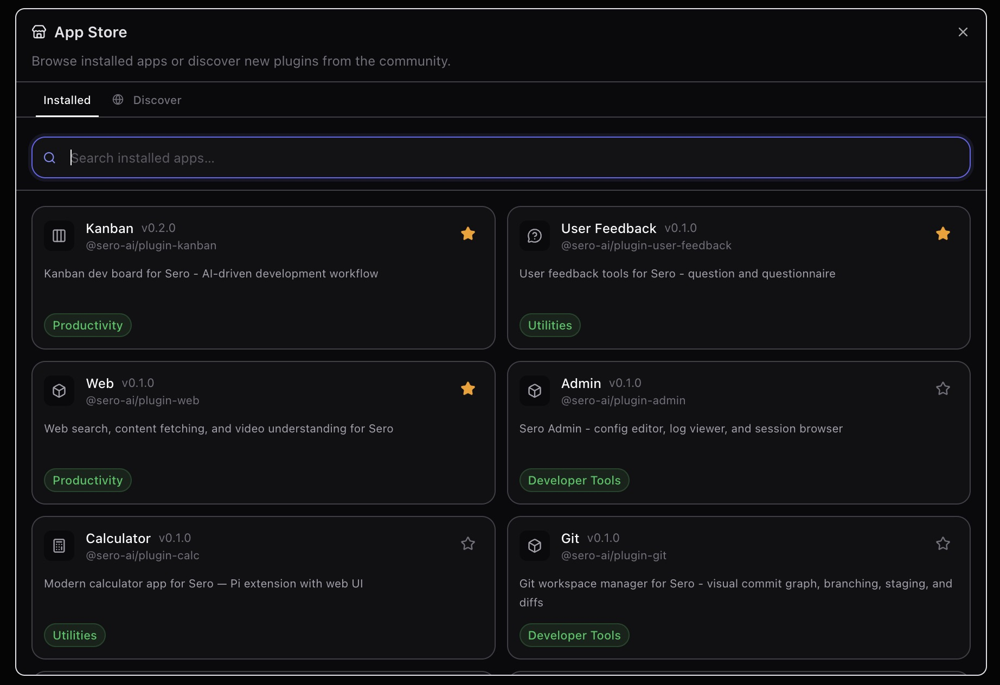
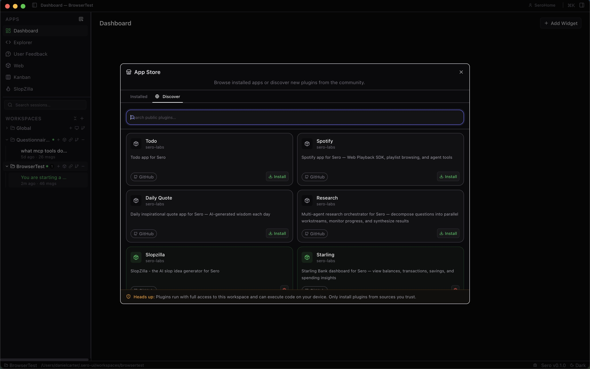
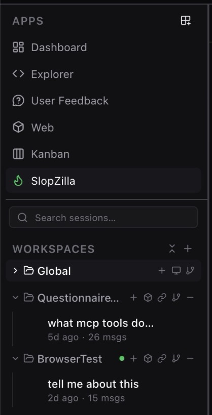
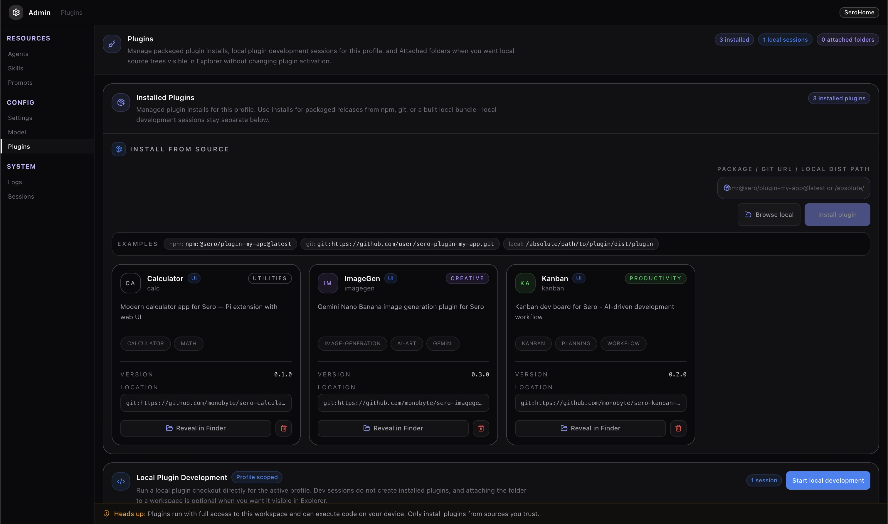

# App Store, Favorites, and Installed Plugins

Sero's App Store dialog is the current user-facing place to browse installed app
surfaces, discover community plugins, install or uninstall plugins, and choose
which discovered apps appear in the main sidebar.

This is a beta management surface, not a stable commercial marketplace. Treat
third-party plugins as trusted source code and install only from sources you are
comfortable running locally.

The App Store view is the high-level entry point for installed app surfaces,
discovery, favorites, and plugin management.





## Core apps, bundled plugins, and installed plugins

Sero shows a few categories of app-like surfaces:

- **Core shell apps** such as Dashboard, Agent Board, and Explorer are built into the desktop
  shell and are always present.
- **Bundled plugin apps** ship with the Sero source tree but are still surfaced
  through the plugin/discovered-app path. Examples can include internal apps
  such as Admin, Scheduler, or Git depending on the current build.
- **Installed plugins** are separate packages stored in your active Sero profile.
  They may come from npm, git, or local source paths when supported by the
  installer.

A plugin, whether bundled or installed, can provide an app UI, agent tools,
commands, background behavior, provider metadata, or dashboard widgets. See
[Dashboard and Widgets](/guide/dashboard-widgets) for the dashboard user flow. Not every
plugin provides every kind of surface.

For the broader plugin model, see [Plugins and Apps](/guide/plugins-and-apps),
the [Plugin Catalog](/plugins/catalog), and [Plugins](/reference/plugins).

## App Store tabs

The App Store dialog has two main views.

### Installed

The Installed tab shows app/plugin surfaces already known to your local Sero
profile. It supports local searching by installed app metadata.

Installed cards can show details such as whether an app is active, favorited, or
unsupported by the current host.

### Discover

The Discover tab searches remote/community plugin sources through Sero's plugin
search bridge. Discover results may include source badges and install or
uninstall actions when Sero can match a result to a local plugin.

Use Discover carefully:

- do not treat search results as reviewed or officially supported by Sero
- review source repositories before installing source plugins
- expect compatibility and packaging behavior to evolve during beta
- do not assume every external example is supported by maintainers



## Favorites and the sidebar

The main sidebar intentionally stays small. It shows core shell apps first, then
favorited discovered app manifests that pass host compatibility checks.

Favorites are for plugin-backed/discovered app surfaces. Core shell apps such as
Dashboard, Agent Board, and Explorer are always available and are not favorited or unfavorited
through the same mechanism. Bundled plugin apps may still appear through the
favorites path, so unstarring them can remove them from the sidebar without
uninstalling them from Sero.

Practical expectations:

- starring an installed or plugin-backed app can promote it into the main sidebar
- unstarring can remove that discovered app from the sidebar
- sidebar ordering keeps core shell apps first, followed by favorited discovered apps
- favorite state is saved in profile layout state
- unsupported apps may stay installed but not appear as launchable sidebar apps

If an installed plugin does not appear in the sidebar, check whether it is
favorited, compatible with the current host, and actually exposes an app UI.



## Installing plugins

Sero can install plugins through the plugin management bridge. Public plugin
distribution modes include npm, git repositories, and local paths, depending on
what the current installer and plugin source support.

During beta:

1. Install only from trusted sources.
2. Check plugin metadata and compatibility notes.
3. Prefer small, understandable plugins when testing a new install path.
4. Restart or switch apps if a newly installed app surface does not appear
   immediately.
5. Include redacted logs if filing an install issue.

Install/uninstall changes trigger host-side reconciliation and active-session
resource reloads. In normal cases, Sero should refresh discovered apps and agent
resources quickly, but this is not a guarantee of universal update reliability.

The management view is where install and uninstall actions become explicit. Use
it when you need to verify what is actually installed in the active profile.



## Uninstalling and retained state

Uninstalling a plugin removes the installed plugin package and related settings
from the profile's plugin install area. It does **not** promise to delete every
piece of app data the plugin may have created.

State can remain in places such as:

- global app state under `<SERO_HOME>/apps/<app-id>/`
- workspace app state under `<workspace>/.sero/apps/<app-id>/`
- logs or exported files you created manually

This retention is useful when reinstalling or debugging, but it means uninstall
is not a secure wipe. For storage locations and redaction guidance, see
[State and Folders](/reference/state-and-folders).

## Compatibility and unsupported apps

Plugins can declare host compatibility requirements, such as minimum Sero
versions or required host capabilities. The App Store and sidebar may hide or
label unsupported plugin apps instead of launching them.

Compatibility checks help avoid some broken combinations, but they are not a
security review and they do not guarantee feature parity across every runtime.
Container-backed mode may expose capabilities that reduced host mode does not.

## Trust and security

Plugin code is part of Sero's security surface. A plugin can include UI code,
Pi extension code, tools, runtime behavior, and integrations that touch local or
remote services.

Conservative rules:

- install third-party plugins only from trusted sources
- treat local source plugins like any other code you run on your machine
- review credential-heavy integrations before using them
- do not assume Discover results are sandboxed or reviewed
- keep secrets out of screenshots, logs, bug reports, and plugin issue reports

See [Security / Privacy](/reference/security-privacy) for Sero's current beta
security posture.

## What Sero does not claim during beta

The current beta does **not** claim:

- a stable commercial marketplace
- reviewed or officially supported third-party plugins
- automatic plugin updates as a public guarantee
- plugin APIs that will never change
- sandboxed third-party plugin execution to a production security standard
- that every plugin works in every profile, workspace, or runtime mode
- that uninstall removes all plugin-created state

## Troubleshooting checklist

If a plugin app is missing or behaves unexpectedly:

1. Confirm whether it is built-in or installed.
2. Check the App Store Installed tab.
3. Check whether the app is favorited if you expect it in the main sidebar.
4. Look for unsupported-host messaging on the card.
5. Confirm whether the plugin actually exposes an app UI.
6. If the issue follows install/uninstall, restart Sero and retry.
7. Include runtime mode and redacted logs when filing an issue.

Useful logs can include:

```text
/tmp/sero-electron.log
/tmp/sero-vite.log
/tmp/sero-remote-<plugin>.log
```

## Related docs

- [Plugins and Apps](/guide/plugins-and-apps)
- [Plugin Catalog](/plugins/catalog)
- [Plugins](/reference/plugins)
- [Security / Privacy](/reference/security-privacy)
- [State and Folders](/reference/state-and-folders)
- [Support Scope](/reference/support-scope)
