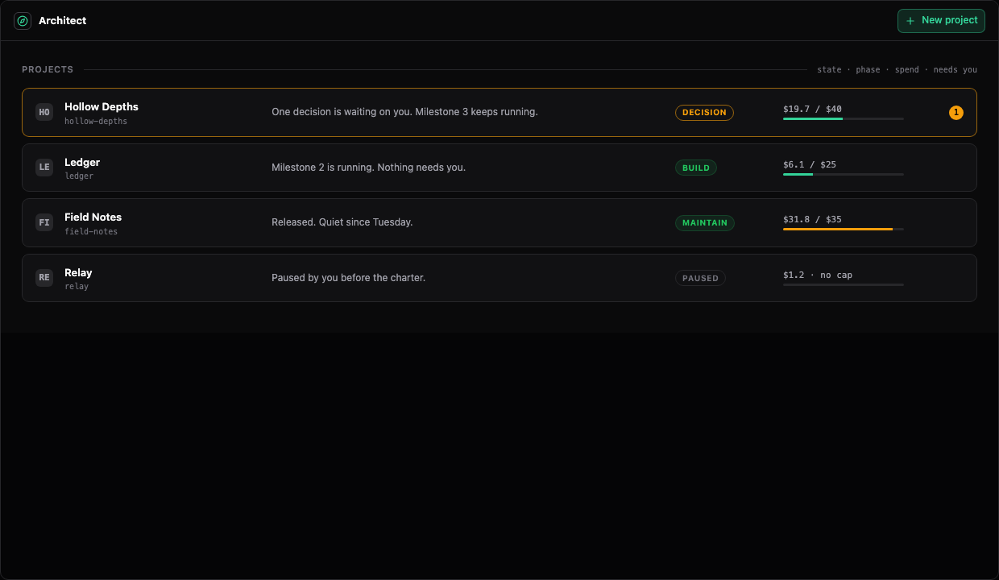
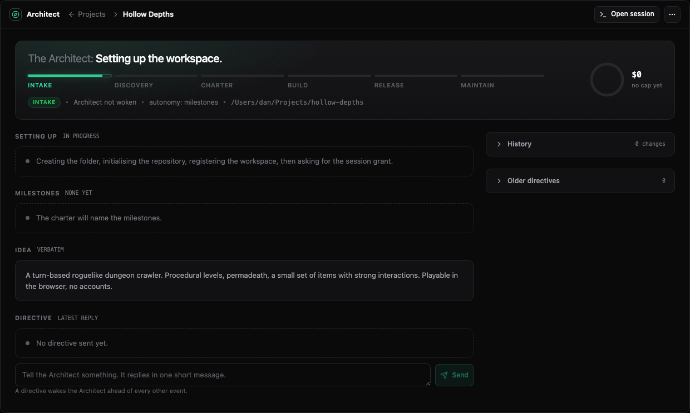
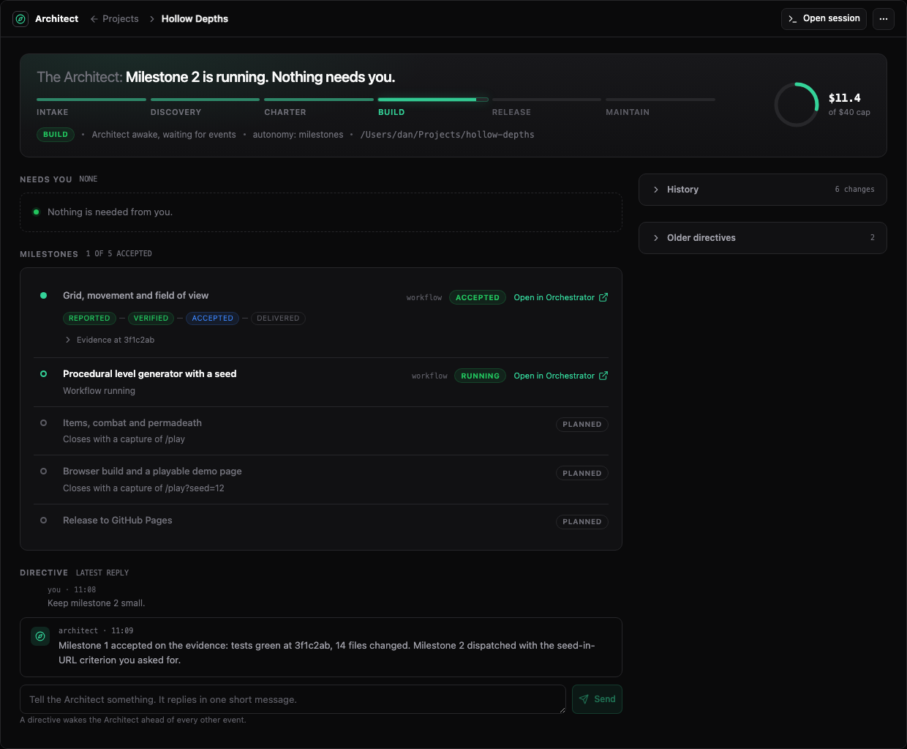

# Architect

Sero Architect manages work across a product instead of one task. Give it a
request and a start cap. It plans the work, builds it through Workflows and
Rooms or does small pieces itself, and checks the result inside that cap.
Architect checks the result before it moves on to release and maintenance. It
asks for your input when it needs a decision.

Use Architect when you want Sero to take a product from idea through
maintenance. Use [Orchestrator](/guide/orchestrator) when you want to run one
Workflow, Room or Goal yourself.

## Before you start

1. [Install and open Sero](/guide/getting-started).
2. [Configure a model](/guide/models-and-providers). Architect runs its owner
   session on the **MED** tier: the project default if you set one, otherwise
   the global selection in Admin. Delegated Workflows and Rooms resolve the same
   way per tier. Set `SERO_ARCHITECT_MODEL` to override the owner regardless of
   tier. Architect never falls back to another provider: if the selected model
   is unavailable, it says so and asks you to choose.
3. Make sure Orchestrator is available. Architect dispatches its work through
   Workflows and Rooms.

Architect keeps one persistent agent session for each project. When a project
starts, Sero asks for permission to run that session, as it does for a Room
member. The session can access only the project folder and the tools you
approve.

## Create a project

1. Open **Architect** from the app bar and select **New project**.
2. Under **What do you want?**, write the request in your own words. Architect
   keeps the text exactly as you wrote it. You do not need a plan, a team or a
   quality level: Architect chooses the agents and the steps.
3. Choose **New folder** and give a name and a location inside your home
   directory, or choose **Existing workspace** and select one. A workspace that
   already has an Architect project, and the Global workspace, cannot be chosen.
4. Set the **Start cap ($)**. Research, building, checks and repairs all use
   this one budget. Architect cannot spend more without your approval.
5. Select **Continue**. Sero then shows its own approval prompt with the access
   the project asks for. Paid work starts only after you allow it.

If you do not allow the access, the project stays **Not started**. Select
**Review access** on the project page to see the prompt again.

A project made this way runs under a delivery agreement: it continues on its
own inside the cap and the access you approved, and it asks you only when a
decision is yours to make. A project made before this change runs on the
**charter flow**, which is deprecated. It keeps its saved charter and its
approvals, and it is marked "charter flow · deprecated" on the list and on its
page. Sero does not convert it. New behaviour, such as the Architect doing work
itself, applies to projects made under an agreement and not to the charter flow.

For an experimental OpenSpec path, turn on **Use OpenSpec for coding changes**
at creation. This project flag initialises `openspec/` in the selected folder.
The proof of concept uses **Workspace** execution. The first build still uses
the ordinary Architect charter and milestones; the flag applies to later
change requests in maintenance. For an existing Workspace project already in
maintenance, use **Enable OpenSpec changes** in the project controls menu.

Architect creates the folder, runs `git init`, registers the folder as a Sero
workspace, and then asks you to allow the owner session. The project stays in
`intake` until you allow it. After that, discovery starts.

## Phases

Every project moves through six phases in this order. Architect never skips a
phase and never moves back.

| Phase | What happens | What you do |
| --- | --- | --- |
| `intake` | The folder, repository and workspace are created. | Allow the owner session. |
| `discovery` | The owner reads your idea and runs research. | Nothing, unless you send a directive. |
| `charter` | The owner proposes a brief, milestones, a cost cap and an autonomy setting. | Approve the charter, or ask for a change. |
| `build` | Milestones run one at a time. Each closes only on evidence. | Approve milestone plans and answer decisions. |
| `release` | The last milestone is delivered, for example as a pull request. | Approve delivery outside the workspace. |
| `maintain` | A maintenance Workflow listens to issues, CI failures and a weekly review. | Answer the decisions it raises. |

### Request later changes with OpenSpec

In an OpenSpec enabled project that has reached `maintain`, type a request in
the project page composer and select **Start OpenSpec change**. Repeat this for
each later change. The `architect_projects` tool also accepts
`action: "request_change"`, `projectId` and `text`. A normal directive remains
available for instructions that are not a new coding change.

Architect creates a separate `openspec/changes/<name>/` scaffold and a linked
milestone for each request. It sends the question to a read only Room to
investigate the codebase, options, requirements and unresolved choices. The
Room reports findings to Architect; it does not edit the implementation.
Architect then writes the proposal, capability specs, design and tasks in that
change folder, following the OpenSpec CLI's artifact instructions. The runtime
requires completed planning artifacts and strict CLI validation before the
milestone can be planned or dispatched. With the default `milestones` autonomy,
you approve its plan on the project page.

The approved milestone goes to a Workflow with the change path in its prompt.
The Workflow implements the tasks and updates `tasks.md`; Architect runs its
usual evidence checks and compares the result with the requirements before
accepting it. The next request creates another change in the same project.
The PoC leaves completed changes in place for inspection and does not archive
or sync them into the project's durable OpenSpec specs automatically. The
Room reproduces the investigation part of `/opsx:explore` within Sero; it is
not an interactive OpenSpec command session.

An overlay describes a stop or wait during a phase. It does not add a phase:

- `decision`: a question waits for you. Nothing that depends on it moves.
- `paused`: you paused the project. Running work finishes, but Architect does
  not start more work until you resume.
- `limited`: spend reached the cap. Raise the cap to continue.
- `blocked`: the owner needs help it cannot get on its own. The page says why.

## The project page

The project page is short on purpose. It has:

1. **The goal**, in one sentence.
2. **What is happening now**: the state, the work in progress, and when the
   work last reported. A model request that is slow shows as "waiting for the
   model" with its time, so a quiet project does not look stopped. If Sero
   cannot confirm that work is live in this session, the page says "Last known"
   and never "Working".
3. **The controls for this state**: for example **Review access**, a new cap,
   or **Retry step**. Beside them are **Open preview**, **Watch work** and
   **Evidence**.
4. **Spend** against the start cap.
5. **Decisions that need you.** Each card shows the question, the reason, the
   options with their effects, and the recommended option already selected.
   Select **Answer** to submit your choice.
6. **A note box** at the foot of the page. Send Architect a short note at any
   time. Its answer shows above the box. Current work continues.

## The Work view

**Watch work** opens the work behind the project page. It has four tabs:

- **Live** lists each agent that works now, grouped by its Room or Workflow,
  with the tool it runs or the model request it waits for. Select the eye
  button on a row to read what that agent writes at this moment. The text is
  sent only while the row is open. **Open Room** and **Open Workflow** open the
  same work in Orchestrator. While the Architect does a milestone itself, its
  group is headed with that milestone's name.
- **Plan** shows your request as written, the working plan and its acceptance
  criteria, each step with its state, Architect's last report and every note
  you sent with its answer.
- **Research** shows each research question and its findings.
- **Evidence** shows the checks that ran for each step.

History is its own view, opened from the project controls menu (⋯). Older
directives stay behind a disclosure in the side column. The page never shows an
event log and never streams agent output. To read the owner's session, select
**Open session**.

## Work the Architect does itself

The Architect can do a milestone itself instead of starting a Workflow or Room.
It chooses by the work: a task one agent can finish stays with the Architect,
and work that needs specialists, parallel effort or an independent reviewer is
dispatched. A small task needs no Workflow, Room or planning step. Workflows and
Rooms work as before.

- **Available when.** The project was made under an agreement, it runs in
  **Workspace** execution mode, and the milestone is not linked to an OpenSpec
  change. A Worktree project, a charter flow project and an OpenSpec change
  always dispatch.
- **Saved identity.** Before any file changes, Sero records the work with an
  execution id, its run, the owner session, the folder, the starting commit and
  the requirement revision it answers. Starting the same work again returns the
  same record.
- **Continuing.** The Architect can ask for another turn. Your instructions,
  answered decisions and events from running work are handled first. A pause, a
  block or the cost cap stops it. There is no automatic stop for a lack of
  progress: the cost cap is the hard limit. The run inspector shows how many
  continuations in a row changed no file.
- **Interruption.** A stopped turn, a time limit or a restart marks the work
  interrupted. The files and the saved identity stay, nothing counts as
  complete, and the Architect resumes the work.
- **One writer.** The Architect's own work and a Workflow or Room that writes
  the project folder never run at the same time.
- **Reporting is a claim.** When the Architect says the work is complete, the
  milestone is `reported` and the evidence rules below apply unchanged. Its own
  test runs are a self-check, never an independent review. If you require an
  independent review, a reviewer that did not do the work still runs.
- **Delivery.** Work reported with the destination `workspace-files` is
  delivered once it is accepted. Any other destination goes through a dispatch
  and its user decision. With no destination, the milestone can be accepted
  without being delivered.

In the project's milestone list, such a milestone shows `architect` as its kind.
It links to **Watch work** while it runs and to **Evidence** after it reports.

## Milestones close on evidence

A milestone is complete only when Architect has checked it. The owner cannot
mark a milestone done by saying so. Architect runs the project's check
commands, reads the git diff, and for a milestone with a preview route it
starts the dev server, loads the route in a hidden window and saves a
screenshot. The capture does not change what the user is looking at. The result
is recorded on the milestone as one of four states:

| State | Meaning |
| --- | --- |
| `reported` | the work claims it is complete |
| `verified` | Architect's checks passed at a named commit |
| `accepted` | the owner accepted the verified result |
| `delivered` | the result was delivered, for example a merged pull request |

A lower state never stands in for a higher one. If files change after the
evidence was taken, the evidence is marked stale and the checks run again.

## Decisions

Architect asks for your approval before it:

- changes an approved charter;
- delivers anything outside the workspace, such as an email or webhook;
- spends beyond the cap.

Other decisions depend on the autonomy setting you chose at the charter:

| Setting | What you approve |
| --- | --- |
| `milestones` (default) | the charter and each milestone plan |
| `charter-only` | the charter only |
| `model-judged` | the charter; the Architect decides what else to raise |

A decision has no timeout and no default. Work that depends on your answer
waits. Other milestones keep running.

### Research that must run something

A research Room reads by default: one shared checkout, no shell. When the
owner knows a question can only be answered by running commands, such as a
test suite or a build, it asks for a Room with command access. Each member
then works in its own worktree and may run commands, but still must not
implement the product.

If a Room's planner asks for something it does not have, that question comes
to you as a decision instead of stopping the project:

- **Let the Room run commands** plans the research again with command access.
- **Answer in a note** withdraws the research and gives your note to the
  owner, which rewords the question.
- **Withdraw the question** drops the research and the owner continues without
  it.

## Cost

Every project has a cost cap set at the charter. Spend includes the owner
session, research runs and every dispatched Workflow and Room. When the project
reaches the cap, Architect stops starting new work. Work already in progress
can continue and add cost before the next budget check. Raise the cap from the
project page to continue.

The cap limits the work Architect starts. It is not a ceiling on what a project
can spend: a Workflow or Room already running has its own limit and can keep
adding cost until it stops. The spend line shows a lower bound. When a source
reported a total without per-call detail, or did not report at all, the amount
is marked as incomplete rather than filled in.

## Run inspector

Open **Run inspector** from the controls menu. It shows where a project's time
and money went, and it opens on the totals: reading the individual operations is
a separate action named **Load activity**.

- **View** selects **Shared activity** or one run. A project groups its work by
  objective, so each run answers one thing rather than one session.
- **Cumulative spend**, **By activity** and **By model** are computed from the
  operations shown. A row in the activity chart sets the timeline filter, so the
  two always describe the same records.
- **Selected activity** shows an operation's own cost and, separately, its
  inclusive cost with everything below it. The inclusive figure is never added
  into a total that already counts those operations.
- Shared activity is charged once to the project and is reported beside a run's own figure, never inside it.
- A filtered view says which scope its total covers, rather than presenting part
  of a run as the whole of it.

Model and thinking level are shown together, because the same model at two
effort levels is two decisions. An operation that recorded no model says so
rather than showing a blank.

## Controls

The controls menu on the project page offers:

- **Pause** and **Resume**. Pause prevents Architect from starting or planning
  new work. Work in flight continues.
- **Stop**. Stops future work. Work in flight continues. Work that stops after
  Stop still appears in the run inspector with its usage.
- **Raise cap**.
- **Autonomy**. Cycles through the three settings.
- **Models…**. Sets a project model default per tier. A tier with no project
  default inherits the global selection in Admin.
- **Run inspector…**. Opens the run inspector for this project.
- **Delete project**. Removes the record and the owner session. Files in the
  project folder stay.

## The dashboard widget

The Architect widget shows your projects with their state lines and the
number of items that need you. With no projects it offers one action, **New
project**.

## Related pages

- [Architect reference](/reference/architect): tools, record fields, statuses
  and storage.
- [Orchestrator](/guide/orchestrator): Workflows, Rooms and Goals.
