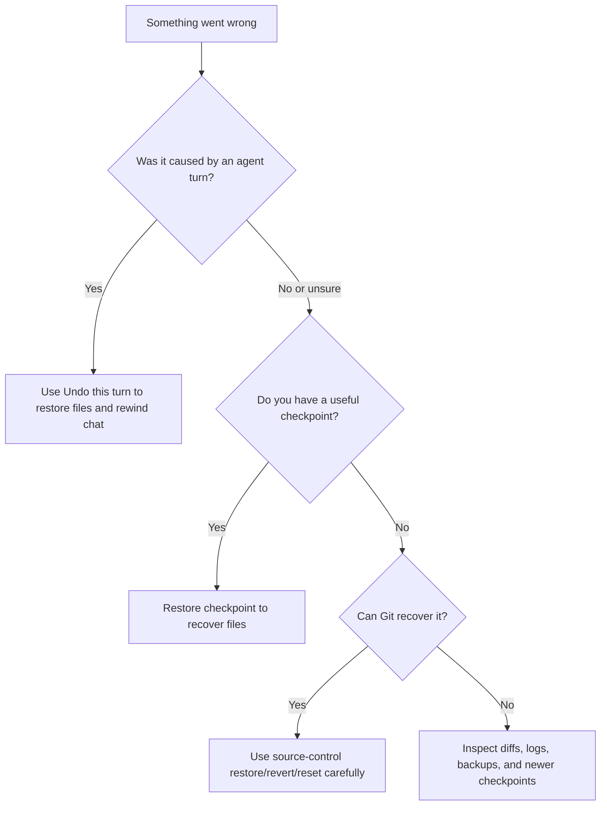
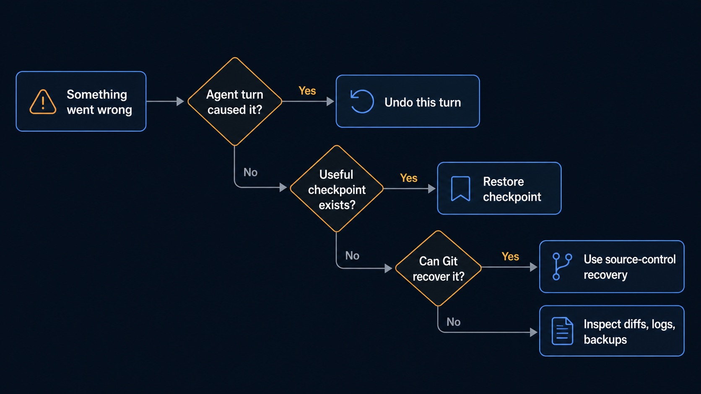

# Checkpoints and Undo

Sero has two related recovery actions. A manual checkpoint creates a Git commit from all current workspace changes. **Undo this turn** restores an internal snapshot and rewinds the selected chat session. Both actions change real workspace files.

## Which tool should I use?

| Action | Restores files? | Rewinds chat/session? | Typical use |
| --- | ---: | ---: | --- |
| Manual checkpoint | No | No | Commit the current file state before risky work. |
| Restore checkpoint | Yes | Usually no; legacy restore may branch if tied to a turn | Return workspace files to a saved checkpoint. |
| Undo this turn | Yes | Yes | Retry after an agent turn made unwanted changes. |
| Git restore/revert/reset | Yes, depending on command | No | Source-control recovery or branch/history work. |

None of these replace reviewing file changes.

## Manual checkpoints

Use a manual checkpoint before a risky change, large refactor, or experimental prompt. Sero runs `git add -A` and creates a commit. This includes tracked changes, new files, and deletions. If the workspace has no changes, Sero does not create a checkpoint.

Good moments to checkpoint:

- before asking the agent to edit many files
- before dependency upgrades or generated changes
- before testing unfamiliar Git/source-control operations
- after a clean test/build result

Before you create a checkpoint, review all staged and unstaged changes because Sero stages the full workspace scope. Remove credentials, generated secrets, and unrelated files. Then create the checkpoint.

## Restore checkpoint

Restoring a manual checkpoint changes files. Sero creates a restore commit only when the restore changes files. It checks out the files from the selected commit, removes tracked files added after it, and runs `git clean -fd`. This command permanently deletes untracked files and directories. Ignored files are not removed by `git clean -fd`.

Before restoring:

1. Review current diffs.
2. Protect all work that you still need. An ordinary Git stash does not include untracked files. Use a stash that includes untracked files, commit the work, or copy it outside the workspace before restore.
3. Confirm you are in the intended workspace.
4. Expect source-control views to refresh after restore.

## Undo this turn

Use **Undo this turn** when an agent turn made unwanted changes. Sero first rewinds the session tree to the related user message. It then restores the internal file snapshot and puts the original prompt text back in the composer when that text is available.

Use it when:

- the agent edited the wrong files
- you want to retry a prompt with clearer constraints
- an agent turn generated a messy intermediate state

The confirmation dialog shows the files that will change. Review this list before you confirm. Changes made after the snapshot can be lost, including manual edits that are not part of the agent turn.

## Source-control safety

Git operations still affect the real repository. Checkpoints can help, but they do not make destructive commands safe.

Practical habits:

- keep important work committed or backed up before destructive operations
- avoid force operations unless you understand the repository state
- resolve merge/cherry-pick conflicts with normal source-control discipline
- check branch/worktree identity before restore, reset, branch delete, or push
- use disposable repositories for testing unfamiliar flows

## Recovery examples

### A bad agent edit

1. Stop the agent if it is still running.
2. Review the diff to understand what changed.
3. Use **Undo this turn** if you want to restore files and retry the prompt.
4. Rewrite the prompt with explicit file scope and constraints.

### A manual edit went wrong

1. Check current source-control status.
2. If you made a manual checkpoint, restore it.
3. If the repository has a clean commit to return to, use Git recovery tools instead.

### A source-control operation conflicted

1. Stop and inspect status.
2. Resolve or abort the Git operation using the appropriate source-control commands.
3. Refresh Sero's source-control view.
4. Use checkpoints only if you are intentionally restoring workspace files.

## Troubleshooting

| Symptom | What to check |
| --- | --- |
| Restore is blocked while agent runs | Stop/finish the streaming turn first. |
| Files changed but chat did not rewind | You likely used VCS/checkpoint restore rather than turn undo. |
| Chat rewound but diff still looks stale | Refresh the source-control/Git view after restore. |
| Restore overwrote work you wanted | Check Git history, stash, backups, and any newer checkpoints. |

## Related docs

- [Agent Sessions and Context](/guide/agent-sessions-and-context)
- [Explorer Workspace](/guide/explorer-workspace)
- [Git](/guide/git-integration)
- [Sero CLI](/reference/sero-cli)
- [Troubleshooting](/reference/troubleshooting)
