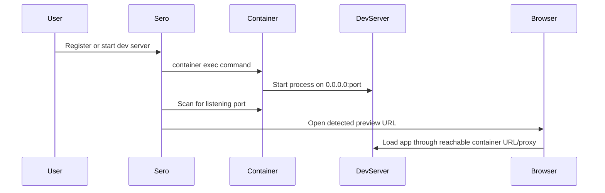
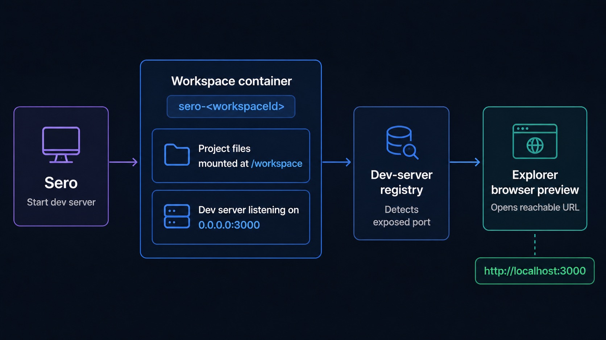

# Containers and Dev Servers

Sero can run each workspace through a runtime backend: Apple Container, Docker, or reduced host mode. Container-backed runtimes give the agent, terminals, tools, and dev servers a shared Linux-like workspace at `/workspace` while the project remains stored on your host machine.

Use this guide when you want to start a project server and preview it in Sero without fighting runtime networking details.

## Quick path

1. Open a workspace in Sero.
2. Choose a container-backed runtime for the workspace when one is available: Apple Container or Docker.
3. Start your server from the workspace terminal or agent, binding to all interfaces when your framework needs it:

```bash
npm run dev -- --host 0.0.0.0
```

4. Register the server so Sero can show and reopen it:

```bash
sero devserver register --name "Web app" --port 3000 --command "npm run dev -- --host 0.0.0.0" --framework vite
```

5. Open the URL from Explorer's dev-server panel, or ask the agent to preview the registered URL:

```bash
sero devserver list
sero app preview <registered-url>
```

## What runs where

```text
Agent / Explorer terminal
        ↓
workspace runtime container `sero-<workspaceId>`
        ↓
project files mounted at `/workspace`
        ↓
dev server listens on runtime port
        ↓
Sero registers a reachable preview URL for the active runtime
        ↓
Explorer browser or in-app preview displays the app
```

Sero creates one runtime container per workspace when Apple Container or Docker is selected and a runtime action needs it.





## Why this helps with ports

A dev server running inside a workspace container listens inside that runtime. Apple Container and Docker previews use runtime-managed host-reachable URLs, usually localhost forwarding URLs. Host-mode previews use the normal host URL.

This reduces port and network confusion, but it does not eliminate every issue. A preview can still fail if:

- the server only binds `localhost` inside the container instead of `0.0.0.0`
- the container or forwarded preview URL changed after a restart
- the server process stopped but the registry entry remains
- container networking, proxy, Docker port forwarding, or DNS is unhealthy
- the workspace is in host mode and the server is only reachable from a different environment

## Register, list, and stop servers

| Command | Use it for |
|---|---|
| `sero devserver list` | List registered servers for the current workspace. |
| `sero devserver register --name <name> --port <port> --command <cmd> [--framework <name>]` | Add a server entry with the command Sero can show/restart. |
| `sero devserver stop <id>` | Stop the registered server through the active runtime backend. |

The registry is in memory. Do not treat registered dev servers as durable state across app restarts.

## Attached folders and references

A workspace has a primary project root. Sero can also show attached roots and references in Explorer. When container-backed execution is active, roots that need agent access are mounted into the workspace container according to workspace configuration.

Attaching a folder or mounting plugin source can require container recreation before the new mount is visible inside the container. If a terminal does not see a newly attached folder, restart or recreate the affected workspace container.

## Host mode

If Apple Container and Docker runtimes are unavailable, Sero can continue in host mode. Host mode is useful for core chat, files, editing, and regular local development. It can register normal localhost dev servers, but it is not feature-equivalent for container networking, browser automation, or Linux/container parity.

Use [Containers and Host Mode](/reference/containers-host-mode) for the fallback matrix and [Container Isolation](/reference/container-isolation) for lifecycle and mount details.

## Troubleshooting quick checks

- Server works in terminal but preview fails: for container-backed runtimes, confirm it binds to `0.0.0.0`, then re-register with the current port/URL.
- Host port already used: prefer a container-backed workspace so Sero can manage the runtime preview URL.
- URL stopped working after restart: run `sero devserver list`; if the container IP or forwarded URL changed, open the fresh URL or register again.
- Stop does nothing: copy the exact server id from `sero devserver list` and run `sero devserver stop <id>`.

## Related docs

- [Explorer](/guide/explorer-workspace)
- [Browser and Capture](/guide/browser-and-capture)
- [Container Isolation](/reference/container-isolation)
- [Sero CLI](/reference/sero-cli#devserver)
- [Troubleshooting](/reference/troubleshooting)
