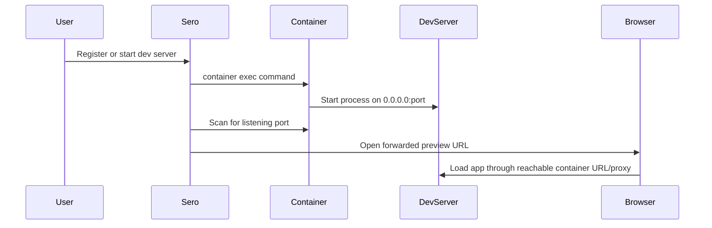

# Containers and Dev Servers

Sero can run a workspace through a runtime backend: Apple Container, Docker/Podman, or explicit Host mode where supported. Container-backed runtimes mount the project at `/workspace` inside the runtime. Host mode runs commands in the real host workspace directory and uses normal localhost preview URLs.

Use this guide when you want to start a project server and preview it in Sero without mixing up container and Host networking rules. For exact platform support, see [Support Scope](/reference/support-scope).

## Quick path

### Container-backed runtime

1. Open a workspace in Sero.
2. Choose Apple Container or Docker / Podman for the workspace.
3. Start your server from the workspace terminal or agent, binding to all interfaces when your framework needs it:

```bash
npm run dev -- --host 0.0.0.0
```

4. Register the server so Sero can show and reopen it:

```bash
sero devserver register --name "Web app" --port 3000 --command "npm run dev -- --host 0.0.0.0" --framework vite
```

5. Open the URL from Explorer's dev-server panel, or ask the agent to preview the registered URL:

```bash
sero devserver list
sero app preview <registered-url>
```

### Host runtime

1. Explicitly choose Host for the workspace where it is supported.
2. Start your normal local dev server from the workspace directory:

```bash
npm run dev
```

3. Register the server with the localhost port it uses:

```bash
sero devserver register --name "Web app" --port 3000 --command "npm run dev" --framework vite
```

4. Open the registered localhost URL from Explorer or preview it through Sero.

## What runs where

### Container-backed runtime

- commands run inside the selected workspace runtime
- the primary project is mounted at `/workspace` inside that runtime
- dev servers should bind to `0.0.0.0` when the framework needs external runtime access
- Sero exposes a host-reachable forwarded URL for preview
- browser automation is provided by the runtime image

```text
Agent / Explorer terminal
        ↓
workspace runtime container `sero-<workspaceId>`
        ↓
project files mounted at `/workspace`
        ↓
dev server listens on runtime port
        ↓
Sero registers a forwarded host-reachable preview URL
        ↓
Explorer browser or in-app preview displays the app
```

Sero creates one runtime container per workspace when Apple Container or Docker / Podman is selected and a runtime action needs it.




### Host runtime

- commands run in the real host workspace cwd
- shell examples should use relative paths or real host paths, not container-only paths
- dev servers listen on normal host ports such as `http://localhost:3000`
- previews use the normal localhost URL
- browser automation requires a ready host browser pack; otherwise use a container-backed runtime for browser-driven workflows

## Why this helps with ports

A dev server running inside a workspace container listens inside that runtime. Apple Container and Docker/Podman previews use runtime-managed host-reachable URLs, usually localhost forwarding URLs. Host-mode previews use the normal host URL.

This reduces port and network confusion, but it does not eliminate every issue. A preview can still fail if:

- the server only binds `localhost` inside the container instead of `0.0.0.0`
- the container or forwarded preview URL changed after a restart
- the server process stopped but the registry entry remains
- container networking, proxy, Docker/Podman port forwarding, or DNS is unhealthy
- the workspace is in Host mode and the registered localhost port is not reachable on the host

## Register, list, and stop servers

| Command | Use it for |
|---|---|
| `sero devserver list` | List registered servers for the current workspace. |
| `sero devserver register --name <name> --port <port> --command <cmd> [--framework <name>]` | Add a server entry with the command Sero can show/restart. |
| `sero devserver stop <id>` | Stop the registered server through the active runtime backend. |

The registry is in memory. Do not treat registered dev servers as durable state across app restarts.

## Attached folders and references

A workspace has a primary project root. Sero can also show attached roots and references in Explorer. When container-backed execution is active, roots that need agent access are mounted into the workspace container according to workspace configuration.

Attaching a folder or mounting plugin source can require container recreation before the new mount is visible inside the container. If a terminal does not see a newly attached folder, restart or recreate the affected workspace container.

In Host mode, attached paths are accessed through the normal host filesystem. Use paths as they exist on the host.

## Host mode

Explicitly select Host mode for core chat, files, editing, and regular local development when it is supported for your platform. Sero does not switch a selected container runtime to Host execution by itself. Host mode can register normal localhost dev servers, but it is not feature-equivalent for container networking, Linux/container parity, image-provided compiler stacks, or browser automation without a ready browser pack.

Use [Containers and Host Mode](/reference/containers-host-mode) for the runtime matrix and [Container Isolation](/reference/container-isolation) for lifecycle and mount details.

## Troubleshooting quick checks

- Server works in terminal but preview fails: for container-backed runtimes, confirm it binds to `0.0.0.0`, then re-register with the current port/URL.
- Host port already used: stop the host process using the port, choose another port, or use a container-backed workspace when runtime forwarding better fits the workflow.
- URL stopped working after restart: run `sero devserver list`; if the container IP or forwarded URL changed, open the fresh URL or register again.
- Stop does nothing: copy the exact server id from `sero devserver list` and run `sero devserver stop <id>`.

## Related docs

- [Explorer](/guide/explorer-workspace)
- [Browser and Capture](/guide/browser-and-capture)
- [Container Isolation](/reference/container-isolation)
- [Sero CLI](/reference/sero-cli#devserver)
- [Troubleshooting](/reference/troubleshooting)
