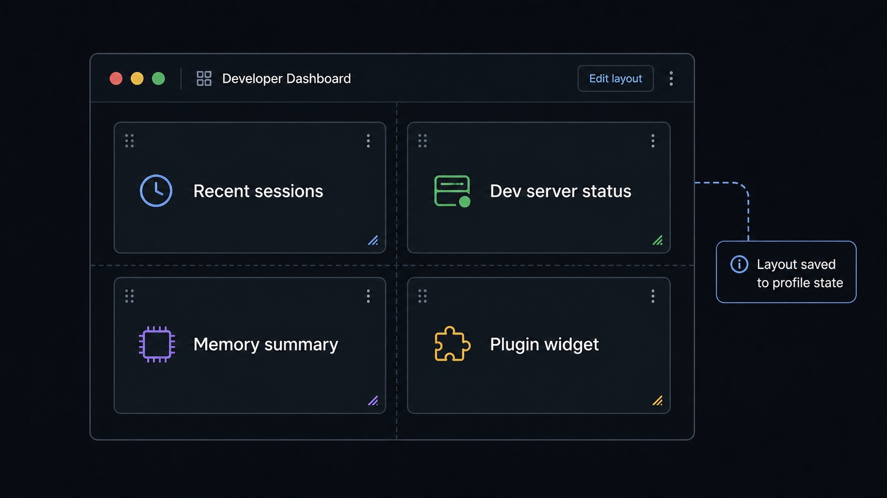

# Dashboard and Widgets

Dashboard is Sero's home surface for compact app and workspace summaries. Widgets are small panels contributed by the host or by installed apps/plugins; they are useful for status at a glance, not a replacement for opening the full app.

## Add a widget

1. Open **Dashboard** from the app sidebar or command menu.
2. Click **Add Widget**.
3. Choose a widget exposed by an installed app/plugin.
4. Place it on the grid.
5. Drag or resize it when you need a different layout.

Sero saves the widget instance when you add it. It saves position and size after
you finish a drag or resize action. The layout belongs to the active profile.



## Empty state

If the Dashboard is empty or the widget list is short:

- no installed app/plugin may expose widgets
- a plugin may not be enabled or compatible in the current profile
- runtime widgets may only appear while the plugin UI/runtime is loaded
- a runtime widget may require its app renderer to be active

Do not assume every app has a widget.

## Widget types

| Type | Plain-language meaning | Notes |
| --- | --- | --- |
| Manifest widget | Declared by an app/plugin package manifest | Available when the host discovers the app manifest. |
| Runtime widget | Registered by app code during a renderer session | Can appear/disappear with the app/runtime lifecycle. |

Both types mount inside Sero's app runtime provider so they can read app/workspace context where supported.

## Move, resize, and remove

Dashboard uses a draggable and resizable grid. The grid adjusts to the available
width.

Typical actions:

- drag a widget to rearrange it
- resize from the widget frame/handle where available
- remove a widget from its widget controls
- add it again later from **Add Widget** if still available

## Persistence and storage

Dashboard layout is stored with profile layout state:

```text
<SERO_HOME>/layout.json
```

That state can include widget instances and grid layout details. It is local profile data and can reveal installed apps, workspace habits, and private project names through widget titles or state. Redact before sharing.

Sero does not use browser `localStorage` as the public persistence model for dashboard layout.

## Good uses for widgets

Widgets are best for:

- counts and recent activity
- scheduler/reminder status
- web or plugin activity summaries
- quick links into a full app
- lightweight workspace health information

Open the full app when you need rich editing, long lists, detailed settings, or sensitive data review.

## Troubleshooting

| Symptom | What to try |
| --- | --- |
| Widget not listed | Confirm the plugin/app is installed, enabled, compatible, and actually exposes a widget. |
| Widget disappeared | Runtime widgets may depend on app/runtime lifecycle; reopen the app or restart Sero. |
| Layout looks wrong | Resize the window, drag/resize widgets again, or restart from the same profile. |
| Widget shows stale data | Open the owning app or refresh the relevant plugin/runtime state. |

## Building a widget

Plugin authors build widgets from the shared `@sero-ai/ui` dashboard components,
which give one consistent look for spacing, typography, status colours and
overflow. See [Dashboard Components](/reference/dashboard-components).

A static widget is a federated component under
`sero.app.contributes.components` with
`"extensionPoint": "ui.dashboard.widget"`. Use `useWidgetRegistration()` only
for a runtime widget that must appear and disappear with the current renderer
lifecycle. Both use host-owned widget chrome. See
[Plugin Extension Points](/reference/plugin-extension-points).

## Widgets in the browser

Sero Remote shows widgets too, in its own Dashboard view. A widget must opt in:
its plugin sets `"remote": true` on the contribution. See
[Remote widgets](/reference/plugin-extension-points#remote-widgets).

## Related docs

- [Workspace and Chat](/guide/workspace-and-chat)
- [Plugins and Apps](/guide/plugins-and-apps)
- [App Store, Favorites, and Installed Plugins](/guide/app-store-favorites)
- [Dashboard Components](/reference/dashboard-components)
- [Plugin Extension Points](/reference/plugin-extension-points)
- [State and Folders](/reference/state-and-folders)
