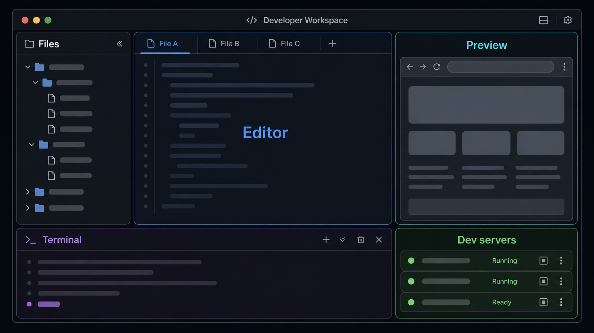
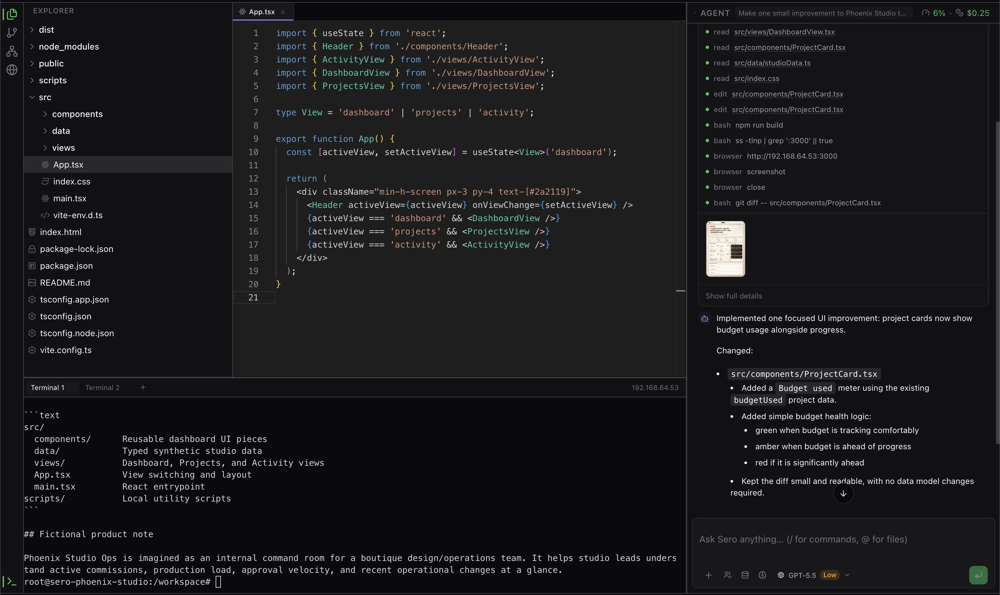
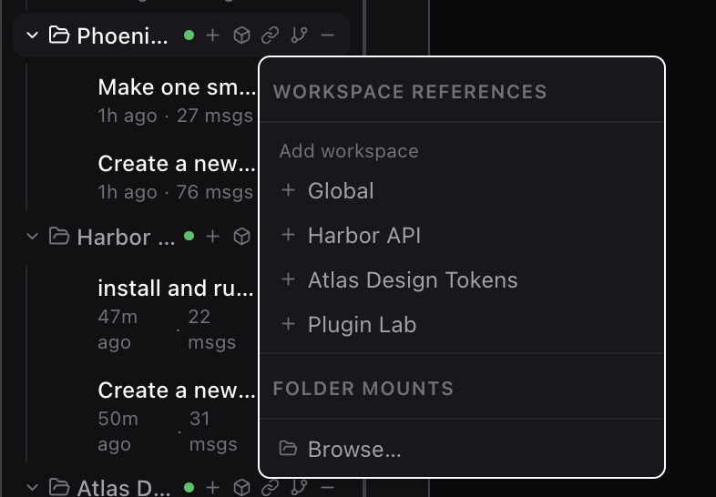
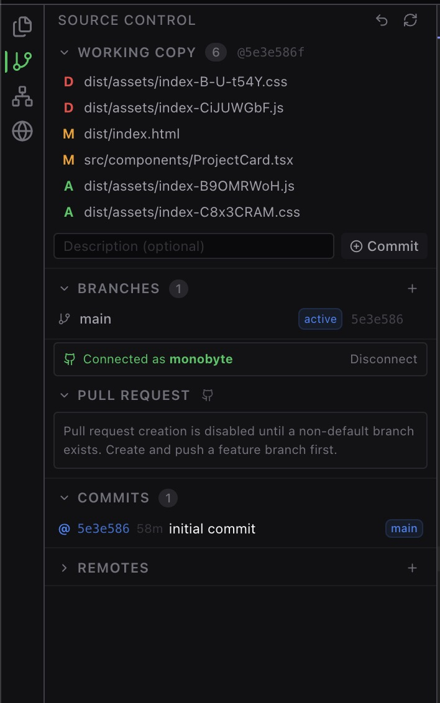
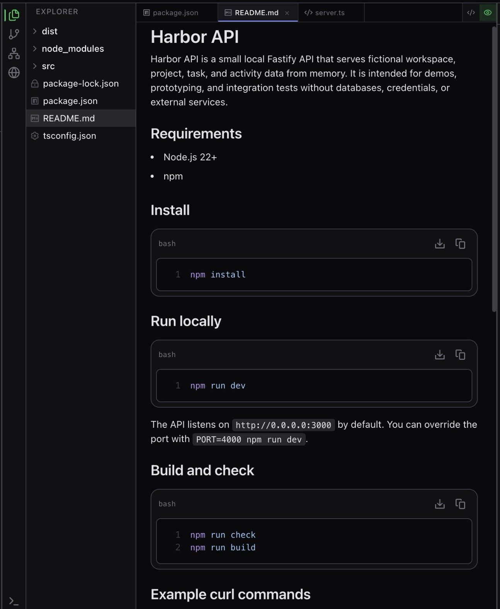
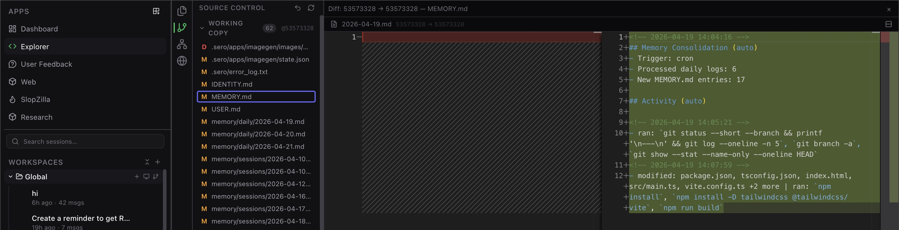
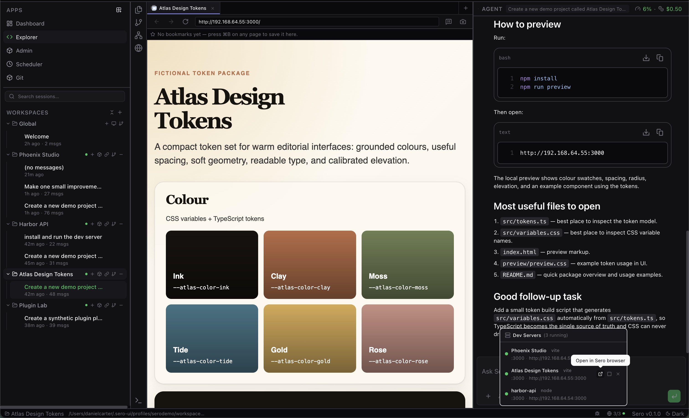
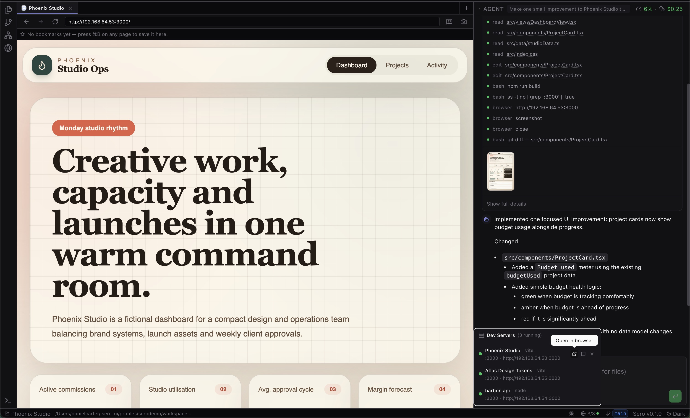
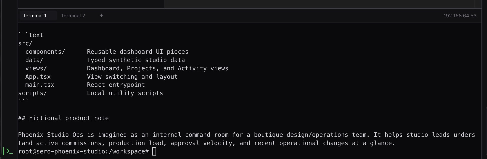
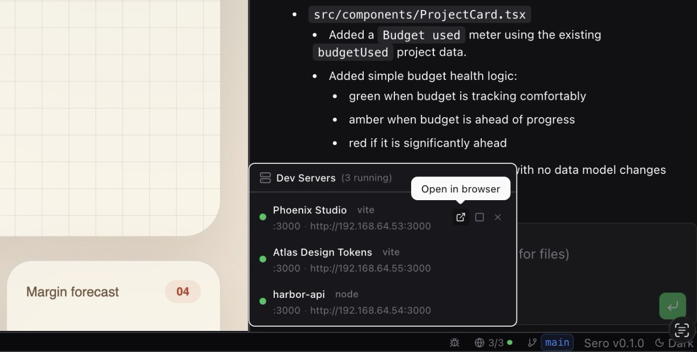

# Explorer

Explorer is Sero's project workspace editor. It brings together files, editor
previews, browser/preview tabs, source-control views, and workspace terminals
around the active workspace and agent session.

Explorer is useful today, but it is not a promise of full IDE parity during the
alpha. For runtime expectations, see [Containers and Host Mode](/reference/containers-host-mode); for dev-server setup, see [Containers and Dev Servers](/guide/containers-dev-servers).





## Where Explorer fits

Sero's shell has a global chat panel on the right and an active app area in the
center. Explorer lives in that active app area. You can keep the same agent
session open while switching between Explorer, Dashboard, and other apps.

Explorer itself is split into three main regions:

- **Sidebar** — workspace navigation panels such as files, source control, and
  orchestration.
- **Main area** — editor tabs, file previews, browser/preview tabs, and diff
  views.
- **Terminal panel** — workspace terminal tabs at the bottom of Explorer.

The sidebar and terminal panel can be resized or collapsed. Sero restores
Explorer layout state per profile/workspace where supported.

## Workspace sidebar basics

The main Sero sidebar lists registered workspaces and their sessions. From the
workspace tree you can select a workspace, create or resume sessions, and use
workspace actions.

Current user-facing workspace controls include:

- expand or collapse a workspace
- select the active workspace and session
- create a new session under a workspace
- inspect references and attached roots when present
- see a remote origin when Sero knows one
- view container status
- enable or disable container use for that workspace
- close a workspace from the sidebar

Container status may show states such as starting, running, stopped, or error.
The container toggle is per workspace, not a global switch for every workspace.

## Files and roots

Explorer's file panel is multi-root aware. The primary workspace root is shown
alongside any attached roots discovered from the workspace configuration.
Attached roots appear as separate collapsible sections and can be detached when
they are not the primary root.

Typical file-tree actions include opening files and using context-menu actions
such as rename or delete where available.

Keep these alpha caveats in mind:

- The primary root and attached roots are runtime/workspace concepts, not a
  stable public plugin API.
- File operations can depend on the selected runtime. Container-backed
  workspaces are the preferred path; host mode has fallbacks but is not full
  parity.
- Avoid using Explorer as the only copy of important work until you are
  comfortable with the current alpha behavior.

Workspace references make attached roots and related project context visible
without requiring every path to be part of the primary root.



Explorer's source-control panel gives a quick view of repository state alongside
the file tree. For manual checkpoints, turn undo, and restore safety, see
[Checkpoints and Undo](/guide/checkpoints-and-undo).



## Editor and previews

Explorer's main area can show several kinds of tabs:

- Monaco-backed code editing for text files
- read-only previews for files Sero can display but not edit directly
- binary, media, or document previews where supported
- dev-server previews for known local servers
- revision-based Git diff views

The diff view is designed around comparing Git revisions and changed files. Do
not treat it as a complete arbitrary file-comparison product.

The editor view is the normal path for reading and changing text files in the
active workspace.



Diff tabs are for reviewing changes and revisions before asking the agent or Git
surfaces to act on them.



## Browser and preview tabs

Explorer includes a workspace-scoped browser surface for project previews and
web workflows. It uses Sero's in-app browser chrome around native Electron
content.

Current safe expectations include:

- browser tabs belong to a workspace
- navigation and history are managed inside the Explorer browser surface
- bookmarks can be used from the browser UI
- page sharing and screenshot capture can feed chat attachments where supported

This browser surface is part of Sero's local development workflow. It is the visible in-app browser, separate from Sero's UI-backed app screenshot/recording bridge. It should not be described as a general-purpose hardened browser or a guarantee that every web app behaves like it would in your default browser. See [Browser and Capture](/guide/browser-and-capture) for screenshots, interactions, and recording.

The browser surface keeps local preview navigation inside the workspace context.



Preview tabs are useful when Sero can render a file or dev-server output more
naturally than raw text.



## Terminal panel

The terminal panel is workspace-scoped. Terminal tabs are created and opened for
the active workspace, and terminal output can be restored when the panel remounts.

Runtime matters:

- in a container-backed workspace, terminals are expected to run through the
  workspace container path
- in host mode, terminals use the host fallback path

If terminal behavior differs between runtimes, include the runtime mode when
filing an issue.



## Dev servers

Sero has a status-bar dev-server panel for servers the runtime already knows
about. The panel can display details such as framework, port, URL, and status.

Current actions include:

- open the server in the browser
- stop a registered server
- restart a registered server
- remove/unregister an entry

This panel reflects registered dev servers; it is not a guarantee that Sero will
automatically discover, start, or manage every project server. Container-backed
runtime is the preferred path for managed preview and dev-server flows because previews can use container-IP URLs instead of binding every server to a host port. This reduces host port conflicts, but it does not guarantee that every network, proxy, DNS, or framework binding issue disappears. Host mode is reduced and should not be treated as feature-equivalent for dev-server automation.

Typical command flow:

```bash
sero devserver register --name "Web app" --port 3000 --command "npm run dev -- --host 0.0.0.0" --framework vite
sero devserver list
sero app preview http://<container-ip>:3000
```



## Runtime caveats

For the current alpha:

- macOS Apple Silicon is the supported platform baseline
- Apple container-backed workspaces are recommended for the full Explorer
  experience
- host mode supports core chat, file browsing/editing, terminals, and general
  host-shell workflows, but with reduced automation
- browser automation, containerized tooling/language servers, and managed
  preview/dev-server parity are container-oriented capabilities
- containers are not documented as a hardened multi-tenant security boundary

See [Support Scope](/reference/support-scope) for the canonical support matrix.

## Troubleshooting checklist

When Explorer behavior is confusing:

1. Confirm the active workspace and session in the main sidebar.
2. Check whether the workspace is using container-backed mode or host mode.
3. If container-backed, verify the container runtime with the checks in
   [Containers and Host Mode](/reference/containers-host-mode).
4. If a dev server is missing from the status panel, confirm the project server
   is actually registered/running rather than assuming Sero auto-discovered it.
5. If a preview fails, confirm the server binds `0.0.0.0`, use the current URL from `sero devserver list`, and re-register after container restarts if needed.
6. Check logs before filing an issue:

```text
/tmp/sero-vite.log
/tmp/sero-electron.log
/tmp/sero-web-remote-watch.log
/tmp/sero-remote-<plugin>.log
```

When reporting a bug, include the runtime mode, workspace type, and the smallest
redacted log excerpt that shows the failure.

## Related docs

- [Workspace and Chat](/guide/workspace-and-chat)
- [Containers and Dev Servers](/guide/containers-dev-servers)
- [Browser and Capture](/guide/browser-and-capture)
- [Checkpoints and Undo](/guide/checkpoints-and-undo)
- [Containers and Host Mode](/reference/containers-host-mode)
- [Container Isolation](/reference/container-isolation)
- [Sero CLI](/reference/sero-cli)
- [Support Scope](/reference/support-scope)
- [Troubleshooting](/reference/troubleshooting)
