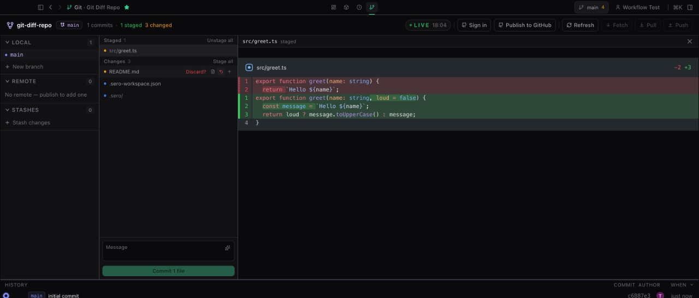
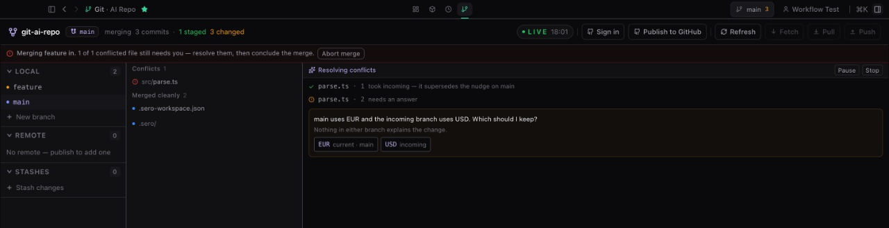

# Git

Sero has a built-in **Git** app for working in a repository. It gives you and the
agent the same view of branches, changes, commits, diffs and stashes, and it can
carry out most everyday Git operations.

Sero is in **public beta**. Treat the Git app as a practical workspace tool, not
a replacement for understanding Git. Anything that changes the repository does so
for real, in the active workspace.



## Where you find Git

- **The Git app** — the full-screen surface above. Everything git-related lives
  here.
- **The Git view in the Explorer** — the same working tree and diff, beside your
  files, for when you are already reading code.
- **The title-bar button** — the branch name in the top-right corner, from any
  view. It lists what has changed, commits all of it with one message, and offers
  Fetch, Pull and Push. Committing only *some* of the changed files is what the
  Git app is for.
- **The agent** — the `git_manager` tool and the `/git` command, for asking the
  agent to inspect or change the repository.

For how Git relates to Sero's own undo and checkpoints, see
[Checkpoints and Undo](/guide/checkpoints-and-undo). They are separate systems:
checkpoints restore workspace files through Sero, Git operations change the real
repository.

## The Git app

The layout is three columns with history underneath:

- **The rail** on the left — branches, remotes and stashes. It always answers
  "where am I".
- **The working tree** in the middle — your changes, grouped by what you need to
  do about them, with the commit box at the bottom.
- **The diff** on the right — whatever you last selected: a changed file, a file
  inside a commit, the pull request composer, or the conflict resolver.
- **History** along the bottom, with a divider you can drag to give the graph
  more or less room.

Unavailable actions are disabled rather than hidden, and the reason sits with the
control — "2 conflicts left to resolve" appears under the commit button rather
than in a pop-up.

### Writing the commit message

The sparkle inside the commit message box drafts a message from what you are
about to commit. It spins in place and the message appears; you can then edit it
like anything you typed. If nothing useful comes back, the box is left alone.

It describes exactly what that button would commit — what you have staged in the
Git app, or everything in the list in the title-bar panel.

### Pull requests

With a GitHub remote connected, the right-hand pane becomes a pull request
composer: pick the source and target branches, and draft a title and description
from the changes. If the repository has no remote yet, the same slot offers to
publish it to GitHub instead.

## When a merge stops

If a merge, pull or cherry-pick hits a conflict, the app says so in a banner and
stays in that mode until you leave it. **Abort merge** is in the banner, and it
is the only place it appears.

While the merge is unfinished:

- Changed files are grouped as **Conflicts**, **Resolved** and **Merged
  cleanly**, so the list is your to-do list.
- Fetch, Pull, Push and pull requests are switched off.
- The commit button counts down — "2 conflicts left to resolve" — and turns into
  **Conclude merge** once nothing is left.

Selecting a conflicted file turns the right pane into a resolver. It shows the
two sides in Git's own words — *current* is what your branch has, *incoming* is
what is being merged in — with buttons to accept either side or both, per
conflict or for the whole file. Accepting writes the file and stages it, because
staged is Git's own definition of resolved.

### Resolving conflicts with AI

**Resolve with AI** in the banner works through the conflicts for you. It fixes
what it can and applies each one as it goes, so the file list drains while it
works, and the pane on the right keeps a running account: one line per conflict
saying what it changed and why.



It interrupts only when it genuinely cannot decide, and then it asks a specific
question with the real options rather than handing the file back. A question
holds up that one conflict; anything independent carries on behind it. Your
answer is carried forward, so a later conflict about the same thing is decided
rather than asked about again.

- **Pause** and **Stop** are both available. Stopping keeps everything already
  resolved — those are ordinary working-tree changes.
- **Undo AI resolutions** takes back only the machine's work and leaves the
  answers you gave.
- Files it resolved are grouped under **Resolved by AI** so you know what to
  review.
- Nothing is committed, and **Abort merge** is untouched throughout.

You still review the result. The account of what it did stays on screen, and
every line jumps to its file, so it doubles as a review checklist.

## Other states the app handles

- **A repository with no commits.** The branch is shown even though nothing is on
  it, new files get their own status, and **Publish to GitHub** takes the place
  of the pull request button.
- **A detached HEAD.** The app says plainly that commits made here belong to
  nothing, and offers both ways out: create a branch here, or return to the
  default branch. Committing is disabled with the reason attached; fetch stays
  on, because it is harmless.
- **Switching branch with uncommitted changes.** The only dialog in the app,
  because it is the only action that can destroy work. Three named outcomes:
  bring the changes along, stash them first, or discard them.

## Asking the agent

The `/git` command is a conversational shortcut that routes your request to the
`git_manager` tool. It is not a separate Git implementation.

```text
/git show the status of this disposable demo repo

Use git_manager to show the last five commits in this synthetic repository.
```

Use disposable repositories when trying unfamiliar actions — a small throwaway
repo with a README is enough to test commits, branch deletion, stash pop, merge,
cherry-pick, or force flags.

### Read-only actions

Prefer these when you want the agent to explain the repository without changing
anything:

- `refresh` — rescan the repository and update the app's view.
- `status` — changed files and index state.
- `log` — recent commit history.
- `branches` — local and remote branch information.
- `diff` — one file's diff; needs `file`, and `staged` picks the staged or
  unstaged side.
- `show_commit` — one commit; needs a `hash`.

Their output can still include private file names, commit messages, paths and
code. Redact before sharing logs or screenshots.

### Actions that change the repository

These change the real repository, working tree, index, remotes or worktrees.
Review the request before running it, especially bulk ones.

- **Files and index** — `stage`, `unstage`, `discard`.
- **History and state** — `commit`, `stash`, `stash_pop`, `stash_apply`.
- **Remotes** — `fetch`, `pull`, `push`.
- **Branches and worktrees** — `checkout`, `create_branch`, `delete_branch`,
  `remove_worktree`.
- **Integration** — `merge`, `abort_merge`, `cherry_pick`.

Parameters worth knowing:

- `file` — for `stage`, `unstage`, `discard` and `diff`.
- `message` — required for `commit`, optional for `stash`.
- `branch` — required for branch actions, `merge` and `checkout`.
- `hash` — required for `show_commit` and `cherry_pick`.
- `worktreePath` — required for `remove_worktree`.
- `stashIndex` — selects a specific stash entry.
- `all` — bulk stage/unstage, auto-stage on commit, pre-stash on cherry-pick.
- `force` — destructive overrides: force branch or worktree deletion, and
  discarding local changes when switching branch.

```text
Use git_manager to stage README.md in this disposable repo.

Use git_manager to commit the staged changes with message "docs: add demo note".

Use git_manager to create_branch named demo/git-guide in this throwaway repo.
```

Avoid prompts like "stage everything and push" unless you have already reviewed
the diff and know the target remote and branch.

## Connecting a remote

When a workspace has no remote, Sero offers to create a new GitHub repository or
connect an existing URL as the origin. Treat it as a repository-changing step:
confirm the account, organisation, visibility and URL first.


If you create a new repository from Sero, review the name, description and
visibility before creating it.


Afterwards Sero shows the resolved owner, repository and URL so you can confirm
which remote the workspace will use.


## Safety rails

The app has guardrails, but they are not a guarantee that an action is safe.

- Checkout refuses a branch already checked out in another worktree.
- Branch deletion refuses the current branch, the default branch, and branches
  checked out in a worktree.
- Worktree removal refuses the main worktree.
- Dirty or locked worktrees are protected unless `force` is used.
- Cherry-pick refuses a dirty working tree unless `all=true`, which stashes your
  changes first — you may need to pop that stash afterwards.
- `commit` with `all=true` stages everything before committing.
- Push can fall back to `push --set-upstream` when there is no upstream.

Take particular care with `force` and `all`. They are convenient in a throwaway
repo and can skip important review steps in a real one.

## State and storage

The Git app keeps workspace-local state at:

```text
<workspace>/.sero/apps/git/state.json
```

Both the app and the agent read it, so they share one view of the repository.
Missing state falls back to an empty default; malformed state may need removing.
Sero adds an ignore rule so this folder never shows up as an untracked change:

```text
**/.sero/apps/git/
```

Treat it as local metadata. It can include branch names, file paths, commit
metadata, status summaries and timestamps.

## Troubleshooting

### The app shows no repository

Check the active workspace is inside a Git repository, then refresh. Outside a
repository there is no branch or status data to show.

### The app and the command line disagree

Refresh from the app, or ask `git_manager` to `refresh`. The app's view is
file-backed, so changes made on the command line may need a refresh to appear.

### A branch or worktree action was refused

Check whether the branch is current, the default, or checked out in another
worktree. For worktrees, check whether the path is the main worktree, dirty or
locked. Avoid `force` unless you know what Git will remove.

### A conflict needs something the app cannot do

Resolve it with normal Git tools in the same workspace, continue or abort as Git
instructs, then refresh so the app catches up.

### Push went to the wrong place

Check the current branch and its upstream before pushing. If there is no
upstream, push may set one. Verify remotes and branch names in a disposable repo
before relying on this in a real project.

## Privacy and safety

- Use disposable repositories for demos, screenshots and testing.
- Review diffs before staging, committing, pushing, merging or cherry-picking.
- Avoid sharing screenshots with private paths, branch names, remotes, commit
  messages or code in them.
- Assume anything that changes the repository takes effect immediately.
- Be careful with `all=true`, `force=true`, stash pop and apply, branch deletion,
  worktree removal, push, merge and cherry-pick.
- Prefer `status`, `log`, `branches`, `diff` and `show_commit` when you only want
  the agent to explain things.

## What to read next

- [Workspace and Chat](/guide/workspace-and-chat)
- [Plugins and Apps](/guide/plugins-and-apps)
- [Plugin Catalog](/plugins/catalog)
- [Checkpoints and Undo](/guide/checkpoints-and-undo)
