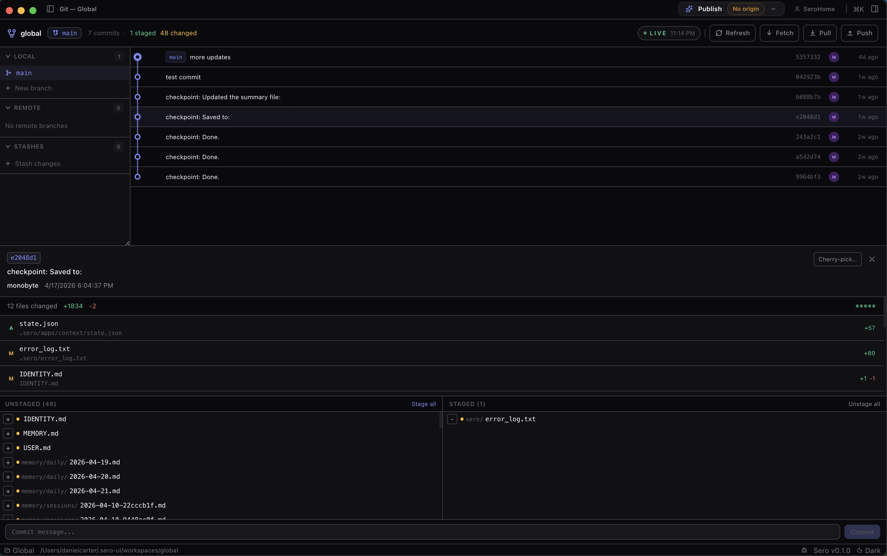
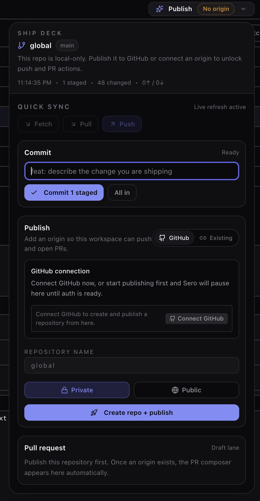
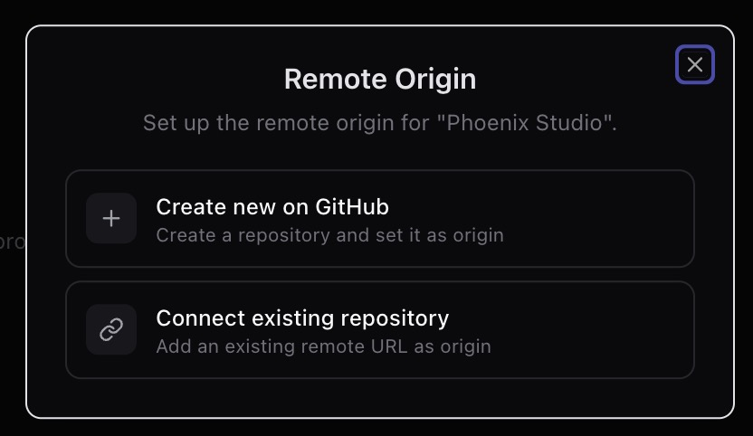
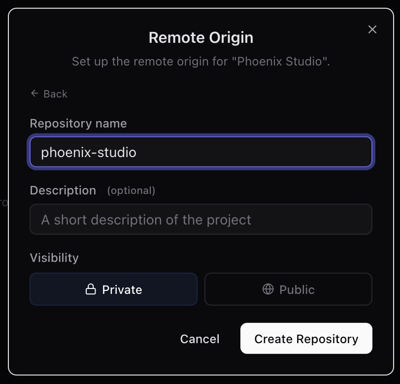
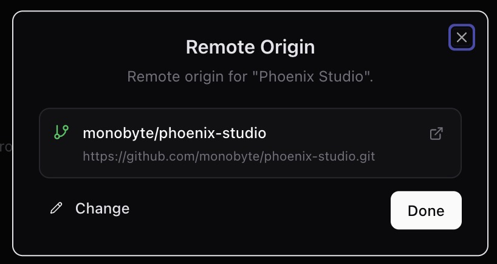

# Git Integration

Sero's **Git** app is a built-in Git Integration for developers working in a Git
repository. It gives the agent and the app UI a shared view of repository status,
branches, commits, diffs, stashes, and selected Git operations.

Sero is still a **source-only OSS alpha**. Treat Git Integration as a practical
workspace tool, not a replacement for understanding Git. Mutating actions run
against the real repository in the active workspace.



## Git Integration vs Explorer Source Control

Sero currently has more than one version-control surface:

- **Git Integration** is the built-in app named **Git** with app id `git`. It is
  Git-native and centered on branches, staging, commits, stashes, remotes,
  worktrees, commit history, and diffs.
- **Explorer Source Control** is a separate Explorer workflow documented in the
  [Source Control User Flow](https://github.com/sero-labs/sero/blob/main/docs/guides/version-control-user-flow.md).
  That reference covers the Git-backed Explorer Source Control flow: Working
  Copy, Bookmarks, Pull Request, Changes, and Remotes.

Do not assume actions or wording from one surface apply directly to the other.
For example, Git Integration talks about Git branches and staging, while the
Explorer guide talks about bookmarks and manual checkpoints. For the shared
recovery model across manual checkpoints, chat turn undo, restore checkpoint,
and source-control operations, see [Checkpoints and Undo](/guide/checkpoints-and-undo).

## Where you interact with Git Integration

You can use Git Integration from two main surfaces:

- **Git app** — a visual app surface for inspecting and operating on repository
  state.
- **Agent bridge** — the `git_manager` tool and `/git` command for asking the
  agent to inspect or modify the repository.

The `/git` command is a conversational shortcut. It routes your request toward
use of the `git_manager` tool; it is not itself a separate Git implementation.

Synthetic examples:

```text
/git show the status of this disposable demo repo

Use git_manager to show the last five commits in this synthetic repository.
```

Use disposable repositories when trying unfamiliar actions. For example, create a
small throwaway repo with a README before testing commits, branch deletion, stash
pop, merge, cherry-pick, or force flags.

## Visual Git app surfaces

The current source-supported Git app layout includes these visible surfaces:

- **Header actions** for Refresh, Fetch, Pull, and Push.
- **Branch panel** with local branches, remote branches, stashes, and a new
  branch form.
- **Branch context menu** with actions such as switch, delete, force delete,
  remove worktree, and force remove worktree when available.
- **Staging area** with staged and unstaged file lists, per-file stage/unstage
  controls, stage all/unstage all, and a commit message box.
- **Commit graph** for browsing history and selecting commits.
- **Commit detail** with commit metadata, changed files, and a cherry-pick
  action.
- **Diff viewer** for selected file, status, or commit diffs.

This guide does **not** claim that every `git_manager` action has a polished,
first-class visual control. Some actions are primarily agent/tool-driven, and
screenshots plus runtime verification are still needed before publishing precise
step-by-step UI how-to instructions.

The main Git surface is meant for scanning branch, staging, and history context
before making a repository-changing decision.



GitHub connection can happen during onboarding or later when a workflow needs
repository-host access that is not available from the local Git checkout alone.
See [Workspace and Chat](/guide/workspace-and-chat#first-run-and-profiles) for
the onboarding flow.

## Read-only actions

Prefer read-only actions when you want the agent to explain repository state
without changing files, branches, index state, or remotes.

The `git_manager` tool supports these read/query actions:

- `refresh` — rescan repository state and update Git app state.
- `status` — inspect changed files and index state.
- `log` — inspect recent commit history.
- `branches` — list local/remote branch information.
- `diff` — inspect a file diff; requires `file`; optional `staged` selects the
  staged or unstaged diff.
- `show_commit` — inspect a specific commit; requires a `hash`.

Example prompts:

```text
Use git_manager to refresh the state of this disposable repo and summarize it.

/git show status and explain which files are staged versus unstaged.

Use git_manager to show_commit for hash abc123 in this throwaway repo.
```

Read-only actions are safer, but their output can still include private file
names, commit messages, paths, and code excerpts. Redact before sharing logs or
screenshots.

## Mutating actions

Mutating actions change the real Git repository, working tree, index, remotes, or
worktree setup. Review the request before running it, especially if the agent
proposes bulk actions.

The `git_manager` tool supports these mutating action groups:

- **File/index operations** — `stage`, `unstage`.
- **History/state operations** — `commit`, `stash`, `stash_pop`, `stash_apply`.
- **Remote sync operations** — `fetch`, `pull`, `push`.
- **Branch/worktree operations** — `checkout`, `create_branch`,
  `delete_branch`, `remove_worktree`.
- **Integration operations** — `merge`, `cherry_pick`.

Important parameter patterns:

- `file` may be used for `stage` and `unstage`.
- `message` is required for `commit` and optional for `stash`.
- `branch` is required for branch actions and merge/checkout requests.
- `hash` is required for `show_commit` and `cherry_pick`.
- `worktreePath` is required for `remove_worktree`.
- `stashIndex` selects a specific stash entry.
- `all` enables bulk stage/unstage, commit auto-stage behavior, and
  cherry-pick pre-stash behavior.
- `force` enables destructive overrides for some branch/worktree operations.

Synthetic examples:

```text
Use git_manager to stage README.md in this disposable repo.

Use git_manager to commit the staged changes with message "docs: add demo note".

Use git_manager to create_branch named demo/git-manager-guide in this throwaway repo.
```

Avoid prompts such as "stage everything and push" unless you have already
reviewed the diff and know the target remote/branch.

### Remote origin setup

When a workspace has no remote origin, Sero can prompt you to either create a
new GitHub repository or connect an existing repository URL as the origin. Treat
this as a repository-changing setup step: confirm the target account,
organization, visibility, and remote URL before continuing.



If you create a new GitHub repository from Sero, review the generated repository
name, optional description, and visibility before creating it.



After a remote is configured, Sero can show the resolved owner/repository and URL
so you can confirm which remote the workspace will use.



## Branch and worktree safety

Git Integration includes guardrails, but guardrails are not a guarantee that an
action is risk-free.

Known source-supported protections include:

- Checkout refuses to switch to a branch already checked out in another
  worktree.
- Branch deletion refuses the current branch, the detected default branch, and
  branches already checked out in a worktree.
- Worktree removal refuses to remove the main worktree.
- Dirty or locked worktrees are protected unless `force` is used.
- Cherry-pick refuses dirty working trees unless `all=true` is set. With
  `all=true`, the operation can stash uncommitted and untracked changes before
  cherry-picking; you may need to inspect, apply, or pop that stash afterward.
- Commit with `all=true` auto-stages all changes before committing.
- Push can fall back to `push --set-upstream` when upstream is missing.

Use extra care with `force` and `all`. They are convenient for disposable test
repos, but they can hide important review steps in a real project. Force delete
and force worktree removal can be destructive.

## Conflicts and command-line fallback

Merge and cherry-pick conflicts may require normal Git conflict resolution. Git
Manager can report conflict guidance, but you may still need to resolve files,
continue, abort, or inspect state from the command line in the same workspace
runtime.

If an operation fails:

1. Stop and inspect `git status` before trying another mutating action.
2. Resolve conflicts manually if Git asks you to.
3. Continue or abort using normal Git commands when needed.
4. Refresh Git Integration after command-line resolution so the app state catches up.

## State and storage

Git Integration stores workspace-local app state at:

```text
<workspace>/.sero/apps/git/state.json
```

That state is used by the Git app and agent bridge to keep a shared view of the
repository. Missing state falls back to an empty/default state. Malformed state
may need repair or removal.

Git Integration also adds an ignore rule for the state folder so the app state does
not appear as an untracked change in the repository:

```text
**/.sero/apps/git/
```

Treat this state as local workspace metadata. It can include branch names, file
paths, commit metadata, status summaries, and timestamps.

## Checkpoints, undo, and recovery

Git Integration is not the same thing as Sero's checkpoint/turn-undo system.
Manual checkpoints and chat turn undo restore workspace files through Sero's
checkpoint layer; Git operations modify the real repository. Use
[Checkpoints and Undo](/guide/checkpoints-and-undo) as the canonical recovery
matrix before mixing these tools.

## Privacy and safety

Practical habits:

- Use synthetic/disposable repositories for demos, screenshots, and testing.
- Review diffs before staging, committing, pushing, merging, or cherry-picking.
- Avoid sharing screenshots that include private paths, branch names, remotes,
  commit messages, or code.
- Assume mutating actions affect the real repository immediately.
- Be cautious with `all=true`, `force=true`, stash pop/apply, branch deletion,
  worktree removal, push, merge, and cherry-pick.
- Prefer read-only `status`, `log`, `branches`, `diff`, and `show_commit` when
  asking the agent to explain repository state.

## Troubleshooting and limits

### The Git app shows no repository

Confirm the active workspace is inside a Git repository and refresh the Git app.
If you are in the wrong workspace or outside a repo, Git Integration will not have
normal branch/status data to show.

### The UI and command line disagree

Run a refresh from the Git app or ask `git_manager` to `refresh`. Git Integration's
view is file-backed state, so command-line changes may need a refresh before the
UI reflects them.

### A branch or worktree action is refused

Check whether the branch is current, default, or checked out in another worktree.
For worktrees, check whether the path is the main worktree, dirty, or locked.
Avoid `force` unless you understand what Git will remove.

### Pull, merge, or cherry-pick produced conflicts

Resolve conflicts with normal Git tools in the same workspace runtime. After
resolving, continue or abort the operation as Git instructs, then refresh Git
Manager.

### Push targets the wrong place

Inspect the current branch and upstream before pushing. If no upstream exists,
push may set one automatically. Verify remotes and branch names in a disposable
repo before relying on this behavior in a real project.

### A visual action is not present

The `git_manager` tool exposes more actions than the obvious visual buttons. If
you do not see a polished UI control for an action, use a cautious agent prompt
or the Git CLI, and prefer a disposable repository until the workflow is runtime
verified.

## What to read next

- [Workspace and Chat](/guide/workspace-and-chat)
- [Plugins and Apps](/guide/plugins-and-apps)
- [Plugin Catalog](/plugins/catalog)
- [Checkpoints and Undo](/guide/checkpoints-and-undo)
- [Source Control User Flow](https://github.com/sero-labs/sero/blob/main/docs/guides/version-control-user-flow.md)
  for the separate Git-backed Explorer Source Control workflow.
