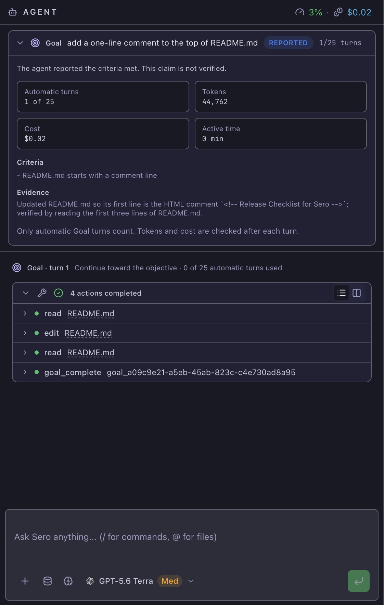
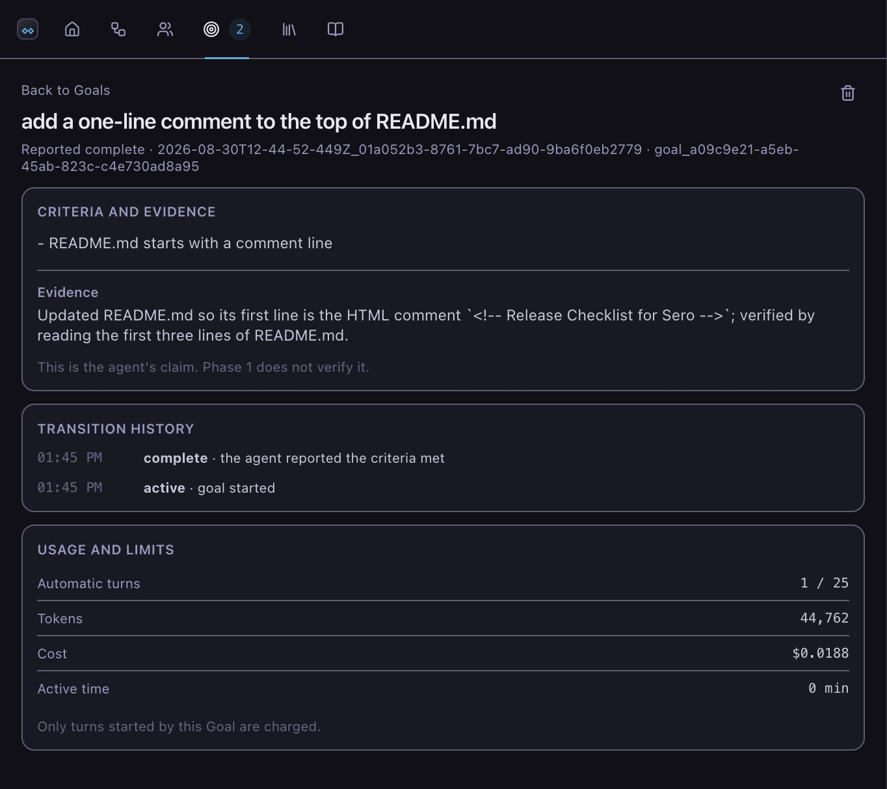

# Goals

A Goal keeps one chat session working toward a result. Give Sero an objective
and, when useful, a short list of checks. The session continues after each
reply until the agent reports completion, needs your help, reaches a limit, or
you stop it.

Use a Goal when the result is clear but the route is not. Use a
[Workflow](/guide/workflows) when Sero can plan the steps first. Use a
[Room](/guide/rooms) when the work needs several agents.

| | Goal | Workflow | Room |
| --- | --- | --- | --- |
| Sero creates | Nothing to review first | A plan of steps | A team of agents |
| Work happens | In your chat session | Step by step | Members share findings |
| Use it for | One result, unknown route | A task with clear stages | A task that needs several roles |

## Before you start

You need an [open workspace](/guide/getting-started), a
[configured model](/guide/models-and-providers), and a chat session. A Goal
uses the tools and access settings of that session. It does not ask for broader
access on its own.

Use a normal chat message for a single answer. Use a Workflow when you want to
review the plan before work starts. Use a Room when separate agents need to
investigate or review the work at the same time.

## Start a Goal

Type `/goal` in the chat session you want to run, then the result you want:

```text
/goal get the release build green
```

Add the checks that must pass after two hyphens. Separate them with semicolons:

```text
/goal get the release build green -- pnpm build exits zero; no new lint errors
```

Sero starts the Goal in the current session. The Goal banner shows its state,
automatic turns, and controls. Select the banner to see the criteria, evidence,
and usage limits.



The objective is also the completion criterion when you do not add checks. Add
checks when the result needs a clear test, file, or other evidence.

Here are some other examples:

```text
/goal update the installation guide for Windows -- every command works in PowerShell; all links resolve
```

```text
/goal find and fix the flaky checkout test -- the test passes 20 times in a row; the full test suite passes
```

## Follow the work

Open **Orchestrator**, then select **Goals** to see Goals from the current
workspace. Select a Goal to review its criteria, evidence, usage, limits, and
status history.



The Goal detail also has controls to pause, resume, stop, or raise the turn
budget when those actions apply. A completed or stopped Goal stays in the list
until you delete it.

## Access and permissions

A Goal gives the agent no new tool, approval, or permission. It gets exactly
the access the session already had. If your access settings hide
the tools a Goal needs to stop itself, Sero refuses to start the Goal and says
which tool is missing.

Sero treats the objective as task data. If it contains an instruction to widen
access, the agent reports that instruction instead of following it.

## Stay in control

- **Send a message.** Your message takes priority. Sero cancels the next automatic
  turn instead of racing it.
- **Press Escape.** The Goal pauses at once and is not started again until you
  resume it.
- **Use the commands.** `/goal status`, `/goal pause`, `/goal resume` and
  `/goal stop` all work in the session that holds the Goal. `/goal list` shows
  every Goal in the workspace.

A session runs one Goal at a time. A Goal cannot run while a Workflow step is
using the same session, and a Workflow step cannot start while its Goal is
active. Sero refuses the second action and identifies what holds the session.
Pause or stop the Goal to release the session.

`/goal pause`, `/goal resume` and `/goal stop` control the Goal of the session
you type them in. Use the Orchestrator to manage a Goal you left running in
another session.

## Limits

Every Goal has separate budgets for:

- automatic turns, 25 by default;
- total tokens;
- cost;
- active time.

Only turns started by the Goal count against these budgets. Your messages do
not. A Goal turn still counts if you cancel it or send a message while it runs,
because the turn has already used tokens and time. Change the turn budget with
`/goal turns 40`.

Reaching a budget stops the Goal. **A limit is not completion.** Sero names the
budget that was reached. Raise the limit, then resume the Goal if you want it to
continue.

A cost budget bounds the Goal's own turns. It is not a guaranteed spend
ceiling, because one turn can run a long sequence of tools before the budget is
checked again.

Sero holds a Goal after three replies repeat the same result without a tool
call. Review the session before you resume it.

## How a Goal ends

The agent ends a Goal with an explicit report, never by going quiet:

- **Reported complete.** The agent says every check is met and gives its
  evidence. Sero records the claim, but does not verify it. Check the evidence
  yourself.
- **Blocked.** The agent cannot continue without you. Sero notifies you and the
  Goal waits for your answer.
- **Waiting.** The agent must wait for something outside the session, such as a
  check finishing. Nothing restarts a waiting Goal for you yet, so resume it
  when the condition is met.

A Goal survives a restart. Sero re-checks every budget before anything resumes,
so a Goal that used its budget while Sero was closed comes back stopped.

## Check the result

Before you accept a completed Goal:

1. Read the recorded evidence in Orchestrator.
2. Review the files or external systems that the Goal changed.
3. Run the checks from your criteria yourself.
4. If the result is incomplete, start a new Goal or continue in chat with
   corrected instructions.

## Turn Goal mode off

Set `SERO_GOALS=0` before Sero starts. Goal records are kept. Workflows and
Rooms are not affected.
