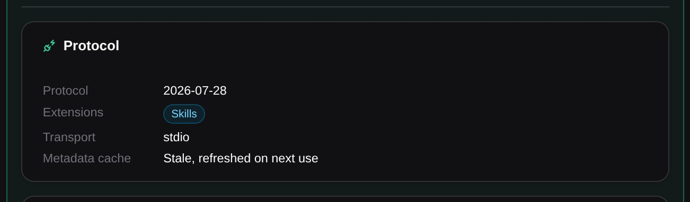
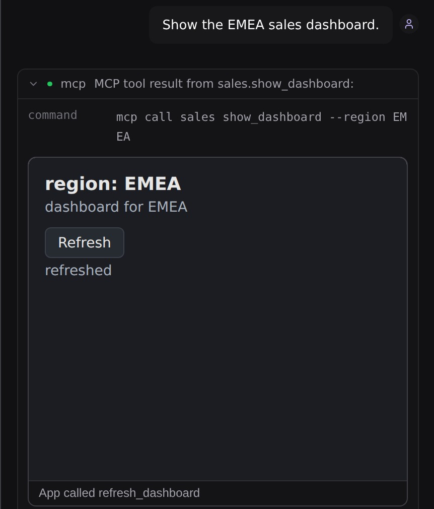
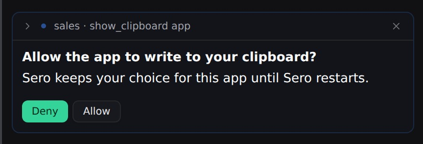
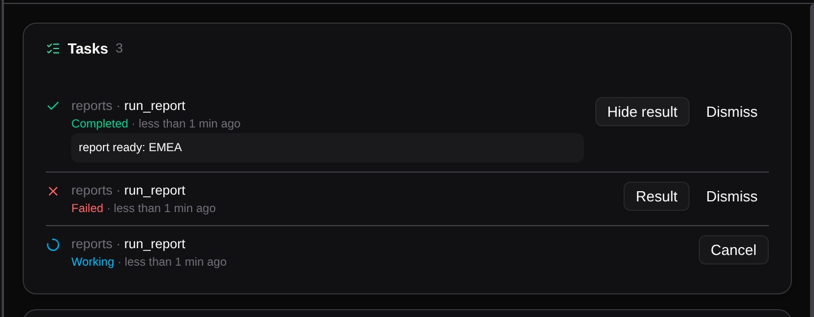
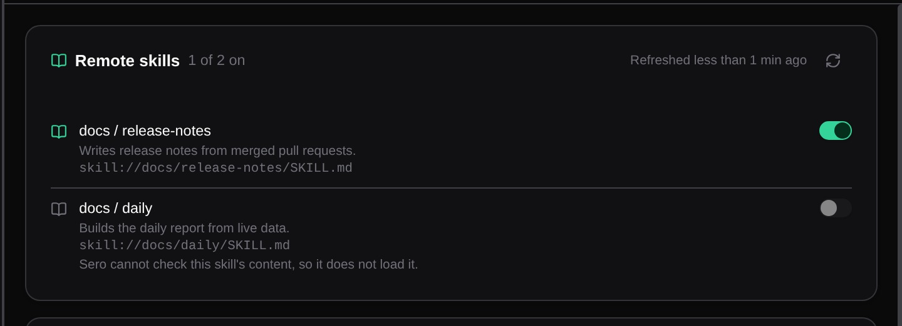
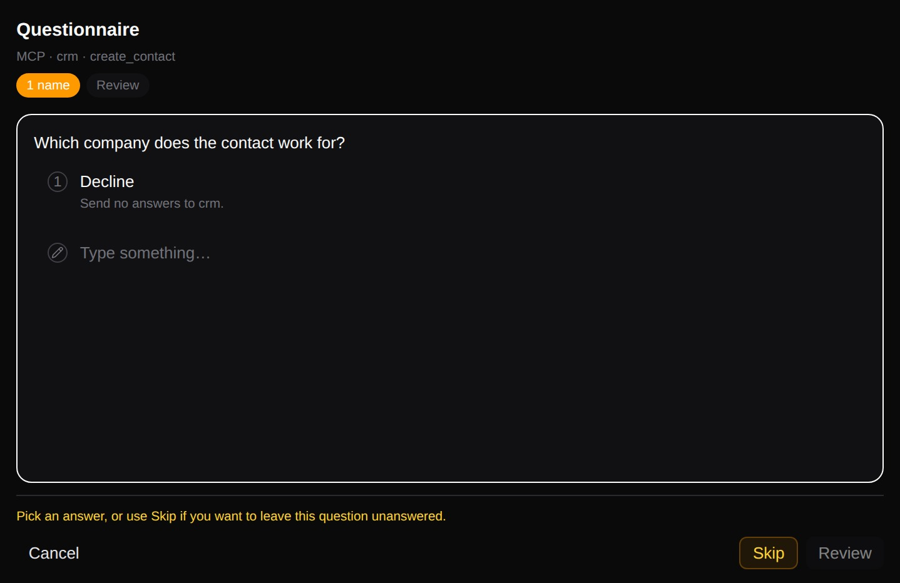

# MCP

An MCP (Model Context Protocol) server gives the agent more tools and data, for example access to an issue tracker or a database. Use the MCP app to add, inspect, change, and remove the MCP servers of the active profile. A server can be a local command that Sero starts, or a remote service that Sero connects to.

Each server row shows the server status, for example **connected**, and the protocol revision in use.

## Add a server

1. Open **MCP**.
2. Select **Add server**. To start from a template, select a button next to **Start with**, for example **GitHub**.
3. Enter a unique server name.
4. Choose the transport. For **stdio**, enter the command and one argument on each line. For **Streamable HTTP**, enter the server URL.
5. If the server needs a sign-in, choose **oauth** or **bearer** in **Auth**. For **bearer**, enter the name of the environment variable that holds the token.
6. Select **Save server**, then check that the server shows **connected**.

To add headers or environment variables, select **Raw config** and edit the server entry in the JSON.

For a local server, verify the executable and each argument before you save. For a remote server, use the authentication method that its provider requires. Do not put a secret in a screenshot or support report.

## Change or remove a server

Select **Edit** to change the transport, command, URL, or authentication of a server, then select **Save server**. Select **Remove** when you no longer want Sero to expose the server to agent sessions. Select **Disable** to keep the definition but stop the server.

A saved definition does not prove that the command or remote service is available. Check the server status after each change. Select **Show details** to see the protocol, the tools, and the resources of a server. Use the tool runner in the details to run one tool with JSON input.

MCP configuration can contain local paths, network addresses, and credentials. Treat it as sensitive profile configuration. See [Settings and Admin](/guide/settings-models-admin) for other profile settings and [Security / Privacy](/reference/security-privacy) for sharing guidance.

## Protocol versions

Sero supports MCP revision `2026-07-28` and the older 2025 revisions. When Sero connects to a server, it asks the server for `2026-07-28` first. If the server does not support it, Sero uses the 2025 handshake. You do not need to change a saved server.

Select **Show details** on a server to see its **Protocol** card. The card shows the revision in use, the extensions that the server offers, the transport, and the state of the metadata cache: the tool and resource list that Sero keeps. When a connection fails, the card names the step that failed, for example **Sign-in failed**.

A server that uses the older SSE transport shows **SSE, deprecated**. Sero keeps it working, but you cannot add new SSE servers. Ask the server owner for a Streamable HTTP URL.

Sero checks the protocol version again after you change a server. If the server owner upgrades the server, select **Reconnect**.

## MCP apps in the chat

Some MCP tools come with an app: a small interactive page from the server, such as a chart or a form. When the agent calls such a tool, the tool call in the chat shows the app between the input and the text result. The text result stays, so the agent and you see the same data.

Sero keeps each app apart from Sero and from other servers:

- The app runs in a sandboxed frame on a separate local address. It cannot read Sero data or other apps.
- The app has no network access, unless the server declares the domains that it needs. Sero then allows only those domains.
- The app can call only tools of its own server that the server marks for apps. Sero blocks other calls and shows the reason under the app.
- When an app needs the camera, the microphone, or the clipboard, Sero asks you before it shows the app. **Deny** is the default. Sero keeps your choice for that app until Sero restarts. Sero never gives an app your location.
- When the app asks to open a web page, Sero shows the full address. Select **Open page** to open it in your browser, or **Decline**.

An app can send a message to the chat. The message shows the server and the tool, for example `sales · show_dashboard app`, and the agent answers it. An app can also add context that the agent reads on its next turn.

When Sero cannot show an app, the tool call shows one line with the reason, for example **App not shown**, and the text result stays. When you open an older session, Sero loads the app again from the stored call. If the tool result was larger than 256 KB, Sero does not store it, and the app gets only the input.

The agent does not see tools that a server marks for its app only.

## MCP tasks

Some MCP servers run a long tool call as a task. The tool call then ends at once with a task ID, and the agent continues with other work. When the task ends, Sero adds its result to the chat that started it. The result does not start a new agent turn; the agent reads it with your next message. If that chat is closed, the result appears when you open the chat again.

The agent can follow a task with these commands:

- `sero mcp task status <id>` shows the current status.
- `sero mcp task wait <id>` waits until the task ends.
- `sero mcp task cancel <id>` stops the task on the server.

Select **Tasks** in the MCP app to see every task. The button shows the number of active tasks. Each row shows the server and the tool, the status and the age. Select **Result** to see the result of a finished task, **Cancel** to stop a running task, or **Dismiss** to remove a finished task from the list. Dismiss removes the task only from Sero; the server keeps it.

Sero keeps tasks when it restarts and continues to follow them. A task continues only while its server keeps it:

- When the connection to the server is lost, the task shows **Disconnected**. Sero tries again after a short wait, and waits longer after each attempt, up to one minute.
- When you sign in to the server with another account, the task shows **Cannot continue**. Sign in with the account that started the task.
- The server sets how long it keeps a task. After that time, Sero removes the task from the list.

A task can ask you a question while it runs. The question opens in **User Feedback**, like the other server questions below.

## Skills from MCP servers

An MCP server can offer skills: instructions and files that teach the agent a task. Sero supports the stable Skills extension (SEP-2640, extension ID `io.modelcontextprotocol/skills`).

A remote skill starts off. Select **Remote skills** in the MCP app to see the skills of every connected server, and turn on the ones that you trust. The agent sees only the skills that you turned on. Each skill shows its server, for example `docs / release-notes`. When a server has two skills with the same name, the agent uses the skill path, for example `docs / team/release-notes`. Select the refresh button to get the skill lists again.

The agent uses a remote skill with these commands:

- `sero mcp skill load <server> <skill>` loads the skill.
- `sero mcp skill read <server> <skill> <path>` reads a file of the skill.
- `sero mcp skill ls <server> <skill> [path]` lists a folder of the skill, when the server supports it.

Sero checks a skill before the agent reads it:

- Each file must have the size and the SHA-256 digest that the server listed.
- The `SKILL.md` frontmatter must be the same as the listed entry.
- A skill can have at most 512 files and 16 MiB.
- Sero does not load a dynamic skill, because it cannot check its content.

When a check fails, Sero does not use the content and marks the skill **Changed**.

Sero treats a remote skill as content from its server, not as a local skill:

- The skill gets no tools. Sero ignores `allowed-tools`.
- While the agent acts on a remote skill, Sero asks you before the agent runs a command or code. **Deny** is the default. Select **Allow for this skill** to keep your choice until the skill changes. When no person can answer, Sero blocks the command.
- A skill from one server cannot read resources of another server.

## Answer questions from a server

Some MCP tools ask you for information while they run. When a server asks, Sero opens its questions in **User Feedback**. The line under **Questionnaire** shows who asks, for example `MCP · crm · create_contact`: the server name from your MCP settings and the tool that asks. Answer each question, then select **Submit All Answers**. A server can ask again during the same tool call. After you answer, Sero goes back to the app that you used before.

You have two ways to stop:

- Select **Decline** on the first question to send no answers. The server gets a decline and decides what to do next, and the tool call continues.
- Select **Cancel** to stop the tool call.

If an answer does not fit the question, for example text where a number is required, Sero shows the reason and asks once more. After a second answer that does not fit, Sero declines for you.

A server can also ask you to open a web page, for example to sign in or to pay. Sero shows this request in the chat with the full address. Select **Open page** to open it in your browser, or **Decline** to send no answer. Sero offers only `http` and `https` addresses.

When no person can answer, for example in a headless session or the plain Pi CLI, Sero declines every server question at once.
