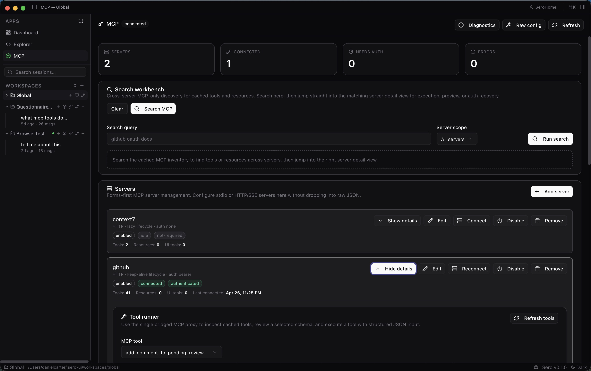
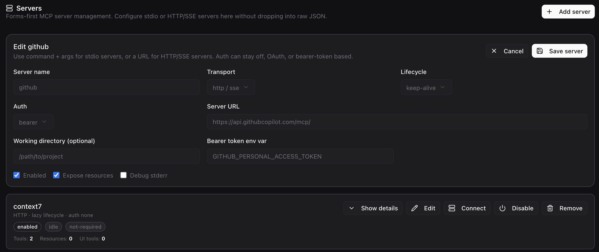
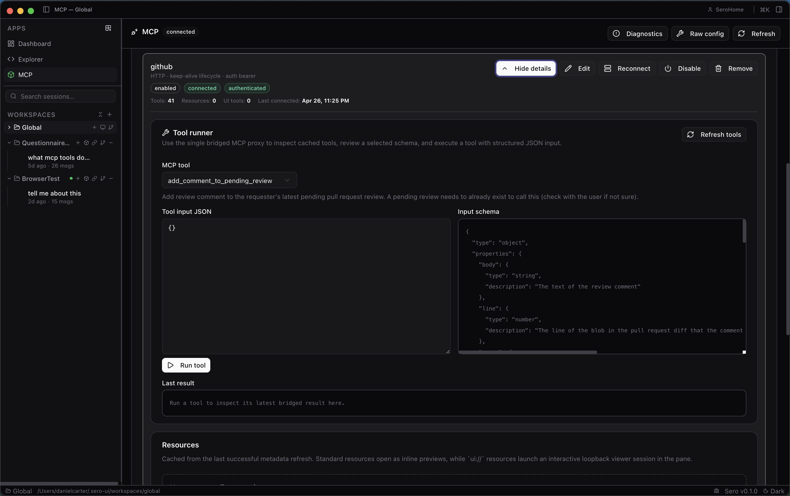

# MCP

Sero includes MCP management surfaces for inspecting and maintaining configured
MCP servers. MCP server definitions can point at commands, local paths, network
services, and environment variables, so treat them as sensitive configuration.

## MCP management

MCP-related screens help inspect and manage configured MCP servers. Treat server
configuration as sensitive: it can include local paths, command arguments,
network endpoints, and credentials or environment-variable references.

The MCP overview shows the configured server set and is the safest starting
point before editing individual server definitions.

Server detail views expose the command or connection shape for one configured
server. Review these carefully before sharing screenshots.

The manager view is for broader maintenance: checking status, adjusting entries,
and confirming what the active profile can expose to agent workflows.

## Related docs

- [Settings and Admin](/guide/settings-models-admin)
- [Models and Providers](/guide/models-and-providers)
- [Plugins and Apps](/guide/plugins-and-apps)
- [Plugin Catalog](/plugins/catalog)
- [State and Folders](/reference/state-and-folders)
- [Security / Privacy](/reference/security-privacy)
