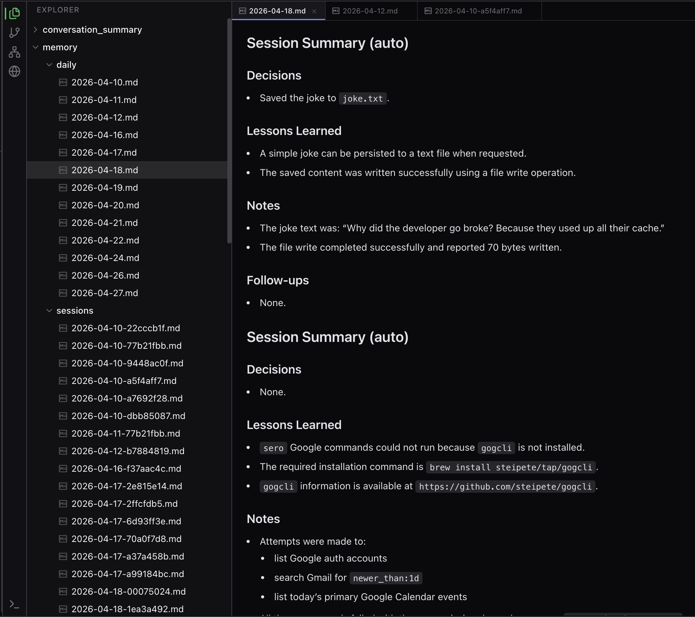
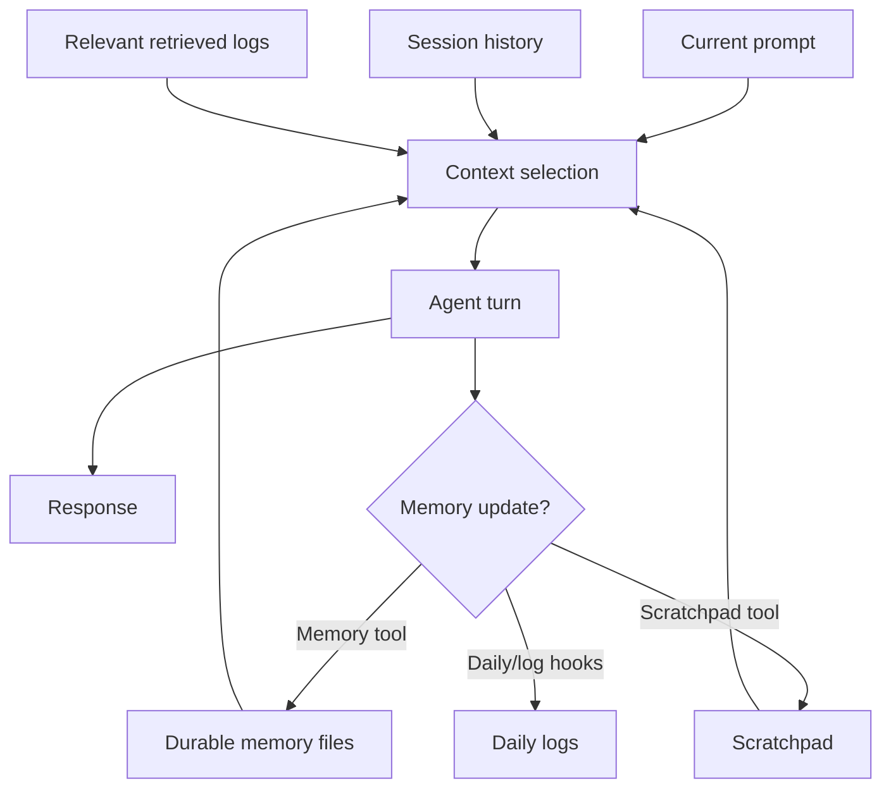
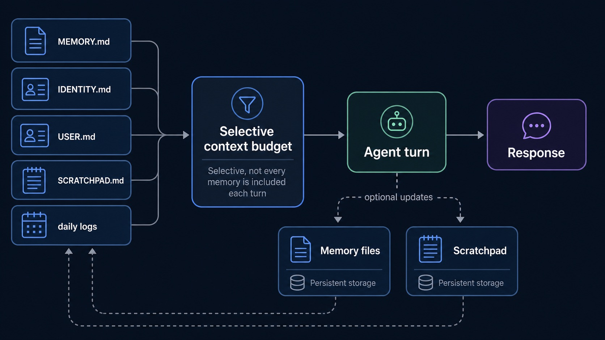
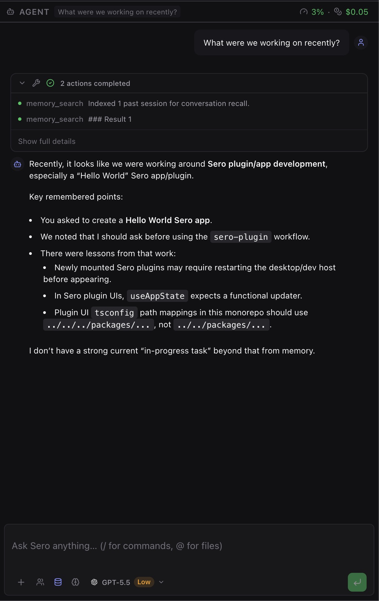
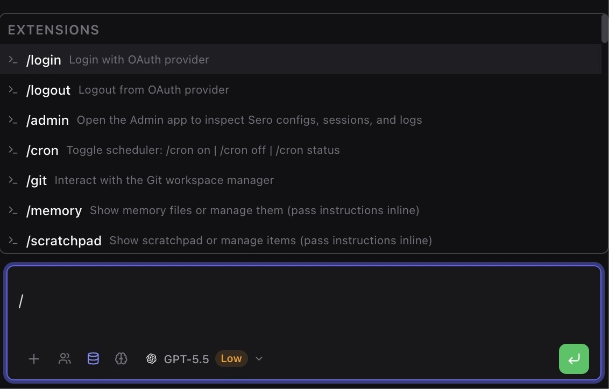

# Memory

Sero Memory is a built-in plugin (`@sero-ai/plugin-memory`) that gives the agent
durable context across sessions. It is meant for practical recall: preferences,
project notes, identity/profile details, scratchpad items, and daily work logs
that help future conversations start with less repeated setup. See the [Plugin Catalog](/plugins/catalog)
for the built-in plugin inventory.

Sero is still a **source-only OSS alpha**. Treat memory as helpful local context,
not perfect recall or a complete audit log.

## What memory stores

Memory stores markdown files in the active Sero profile's global workspace:

- `MEMORY.md` — durable facts, decisions, preferences, lessons learned
- `IDENTITY.md` — agent identity, behavior rules, communication style
- `USER.md` — user profile details such as role, stack, and preferences
- `SCRATCHPAD.md` — a persistent checklist for active working notes
- `memory/daily/YYYY-MM-DD.md` — append-only daily activity logs

Use synthetic, non-sensitive examples when testing memory. For example:

```text
Remember that this demo project uses pnpm and prefers small focused PRs.
```

Avoid storing secrets, access tokens, private customer data, or anything you
would not want included in local profile state or debug output.



## How memory appears in chat

Before an agent turn starts, the Memory plugin can add selected memory context
to the agent's system prompt. This is selective, budgeted context — not every
memory file and not every daily log is always included.

At a high level:

1. Core profile and long-term memory files can be included directly.
2. Open scratchpad items can be included so active tasks stay visible.
3. When search support is available, relevant older logs or transcript-derived
   entries may be retrieved and included.
4. Daily logs are not pasted wholesale into every turn.

When the renderer exposes memory context for a message, it may appear as a
collapsed memory-context block in the chat UI. Use that as a debugging aid: it
shows what context was attached to that turn, not everything Sero knows.







## Inspect and update memory

The agent can use bridged CLI tools to read, write, list, and search memory.
You can ask for these in chat, or use the command-shaped examples below when
working in a Sero session.

### List and read memory

```bash
sero memory list
sero memory read --target memory
sero memory read --target user
```

Useful targets include `memory`, `identity`, `user`, and `daily`.

### Add or update a durable note

```bash
sero memory write --target memory --content "Demo preference: keep release notes short and action-oriented."
```

By default, writes append. Overwriting managed memory files is possible through
the tool, but should be used carefully because it replaces existing context.

### Search memory

For keyword-style search across memory files:

```bash
sero memory search --query "release notes"
```

For QMD-backed memory search, when available:

```bash
sero memory_search --query "how does this demo project handle releases" --mode keyword
sero memory_search --query "release process preferences" --mode semantic
```

`memory_search` supports keyword, semantic, and deeper hybrid search modes in
the technical implementation, but semantic/deep behavior depends on QMD being
available and indexed for the current profile.

## Scratchpad basics

The scratchpad is a lightweight persistent checklist for current work. It is
separate from long-term memory and is useful for short-lived reminders the agent
should keep visible while helping you.

```bash
sero scratchpad add "Check failing docs build"
sero scratchpad list
sero scratchpad done "docs build"
sero scratchpad clear_done
```

Keep scratchpad items short. Move durable lessons or preferences into memory
when they should survive beyond the current task.

## Slash commands

The Memory plugin registers these slash commands:

- `/memory` — ask the agent to list or manage memory with the memory tool
- `/scratchpad` — ask the agent to list or manage scratchpad items
- `/memory-log` — show the memory plugin debug log path

Examples:

```text
/memory list my memory files
/scratchpad add check docs links before committing
/memory-log
```

Slash commands route through the agent/session flow. Exact UI presentation may
change during alpha.



## Where the data lives

Memory files live under the active profile's global workspace:

```text
<SERO_HOME>/workspaces/global/MEMORY.md
<SERO_HOME>/workspaces/global/IDENTITY.md
<SERO_HOME>/workspaces/global/USER.md
<SERO_HOME>/workspaces/global/SCRATCHPAD.md
<SERO_HOME>/workspaces/global/memory/daily/YYYY-MM-DD.md
```

Memory debug logs live under:

```text
<SERO_HOME>/debug/memory/
```

`<SERO_HOME>` is profile-resolved. For the default profile it is usually
`~/.sero-ui/`, but custom profiles can use another root. For the canonical
storage map, see [State and Folders](/reference/state-and-folders).

## Privacy and safety

Memory is local/profile-scoped Sero state, but it can still be sensitive:

- Memory context may be sent to whichever model/provider is handling a turn.
- Debug logs and screenshots can expose private facts if you include memory
  content in support reports.
- Profile folders can contain auth material, settings, workspaces, and app
  state; treat them as sensitive local data.
- Do not store passwords, API keys, recovery codes, financial data, or private
  third-party data in memory.

Before sharing logs or screenshots, redact names, paths, project details,
credentials, and memory content that should remain private.

## Limits and troubleshooting

### Recall is selective

Memory helps the agent recover useful context, but it is not guaranteed to
remember every fact. If something matters for the current task, mention it in
the prompt or ask the agent to inspect memory first.

### QMD search may be unavailable

Core memory tools still work without QMD. If QMD is unavailable, semantic search
and selective retrieval degrade; keyword search and direct reads are the safer
fallbacks.

Try:

```bash
sero memory search --query "demo project"
sero memory read --target memory
```

### Consolidation is not a contract

The plugin has hooks for daily logs, session handoff, transcript backfill, and
memory consolidation. In the current alpha, do not depend on a precise
consolidation cadence, exact generated summaries, or complete transcript recall.

### Memory context may not be visible

The chat UI may show memory context as a collapsed block when available, but
visibility is not the same as storage. If you do not see a memory block, use the
tools to inspect stored memory directly.

### Updates can duplicate or go stale

Memory is markdown managed by tools and agent behavior. If a preference changes,
ask the agent to update the old entry rather than append a contradictory one.
For example:

```text
Update memory: this demo project now uses npm instead of pnpm.
```

## More detail

This guide is the user-facing overview. For implementation details, context
budgets, QMD integration, lifecycle hooks, and exact file behavior, see the
source reference
[`docs/features/memory.md`](https://github.com/sero-labs/sero/blob/main/docs/features/memory.md)
on GitHub.
