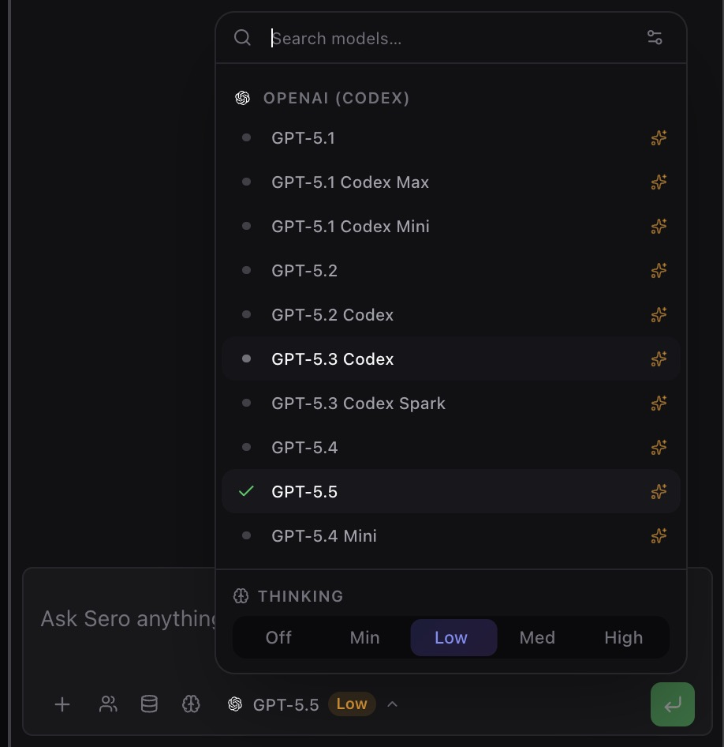
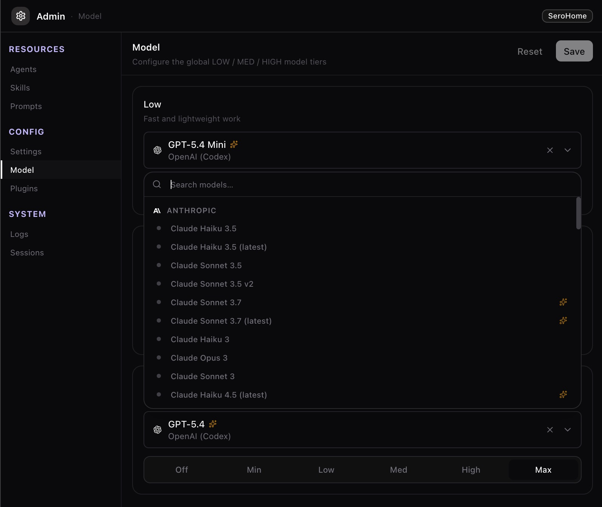
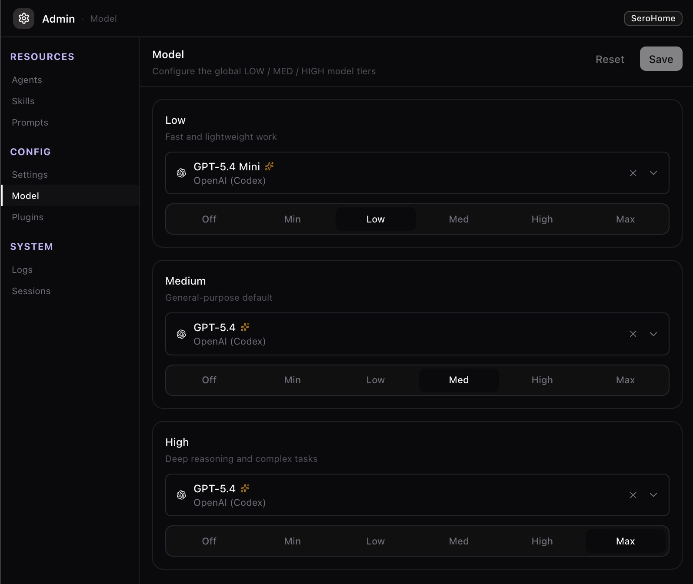
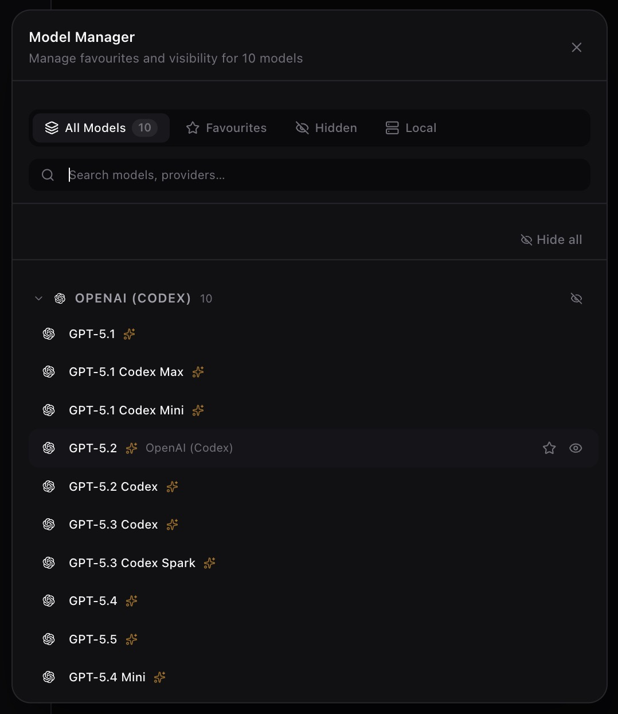
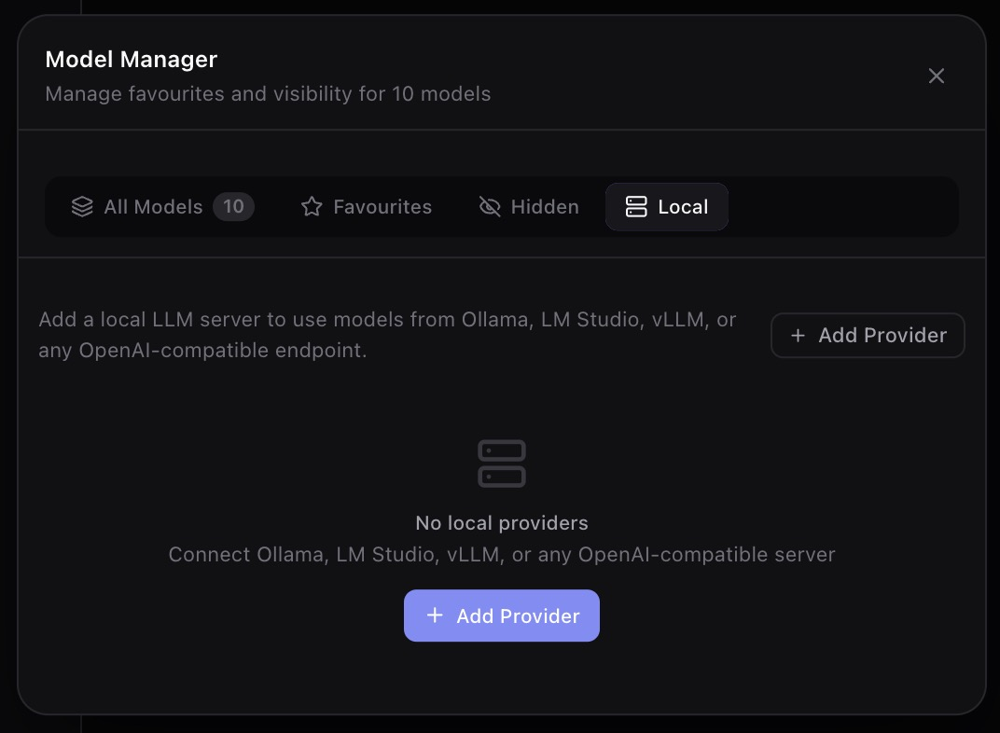
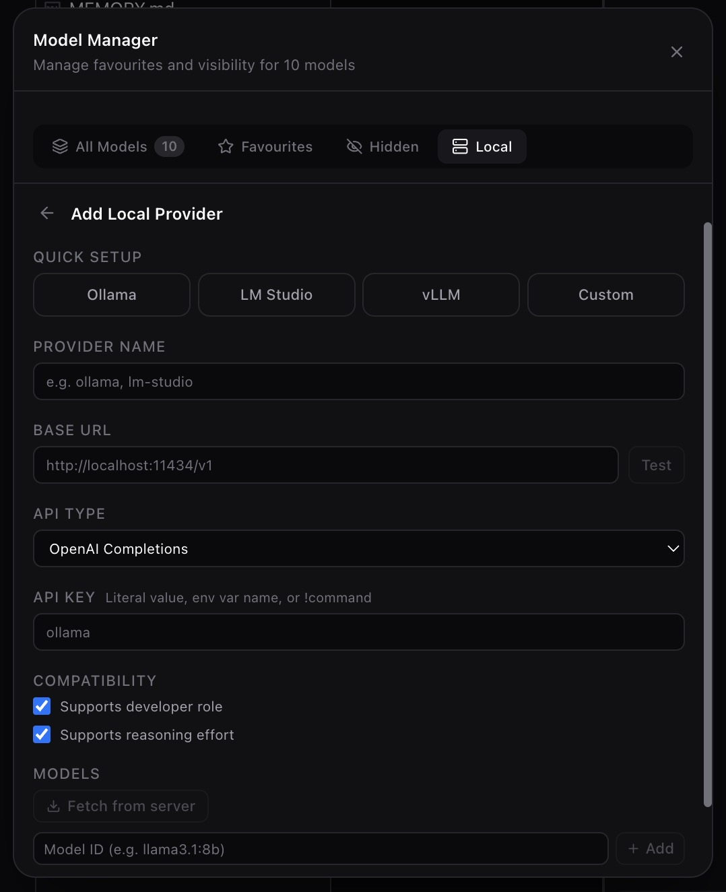
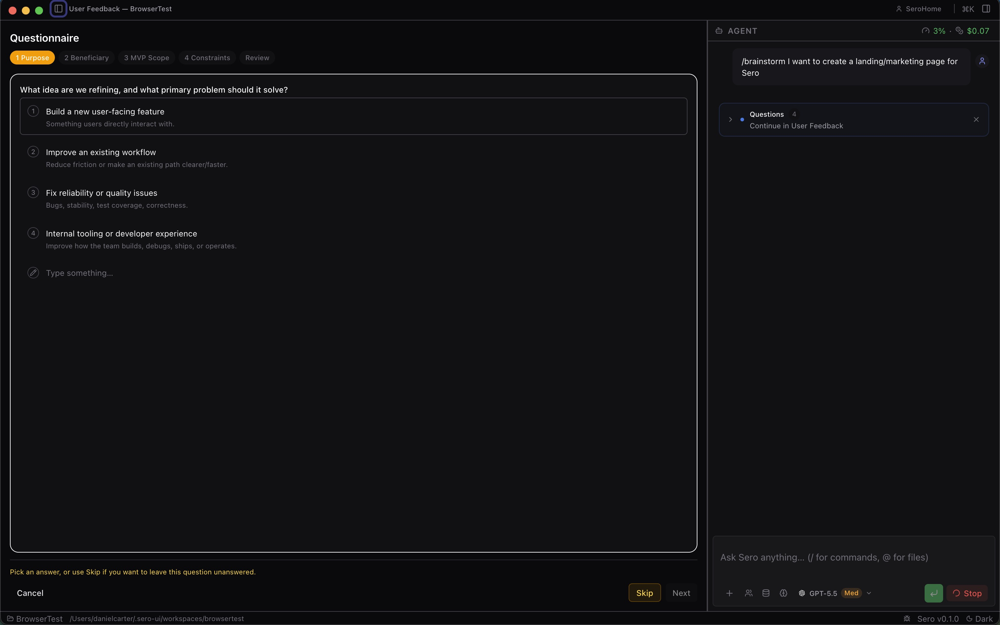
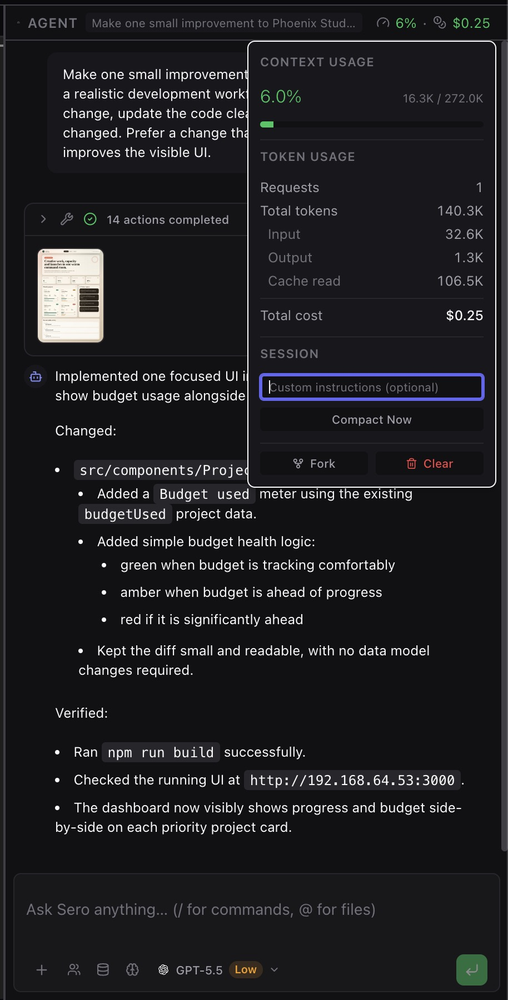

# Models and Providers

Sero exposes model and provider controls in both chat-facing UI and Admin/model
management screens. Exact providers and model names depend on your profile
configuration, installed plugins, and available provider credentials.

Sero does not bundle third-party credentials. Provider availability can change
when keys, OAuth state, local services, or plugins change.

## Model selection and tiers

Model controls are split between the chat-facing selector and Admin/model
management surfaces. Tiers help group models by intended use, cost, or capability
where that metadata is available.

Use the chat-facing selector when you need to switch the active model for a
session without leaving the workspace.

The first-run tier picker is covered in [Workspace and Chat](/guide/workspace-and-chat#first-run-and-profiles).
After onboarding, the Admin model screen is better for persistent configuration
and visibility into what the profile currently knows about available models.

Admin tier configuration gives a more detailed view of how model groups are
organized for the current profile.

## Managing providers and local models

Provider and model-management screens make configured providers, available
models, hidden/favorite state, and local-model options visible. Treat provider
configuration as sensitive when it includes API keys, OAuth state, environment
variables, or private endpoints.

Provider authentication can also appear during onboarding when no usable model is
available. Once setup is complete, model management focuses on the models
themselves: what is visible, hidden, favorited, or otherwise available to the
profile.

Local model setup is for configuring models that run outside hosted provider
APIs. Availability depends on your local services and machine setup.

Local model details expose the selected local configuration more directly, which
is useful when troubleshooting names, endpoints, or runtime availability.

## Input, context, and chat controls

The chat composer includes controls for steering model choice, entering prompts,
attaching or managing context, and using chat-menu actions. Keep important
instructions in the current prompt because history, memory, and attached context
are helpful but not a guarantee that every detail is included in every turn.

The composer is the everyday control surface: it combines the prompt, model
choice, and immediate send controls in one place.

Context controls are where you inspect or adjust what additional material is
being attached to the next turn.

## Related docs

- [Settings and Admin](/guide/settings-models-admin)
- [Workspace and Chat](/guide/workspace-and-chat)
- [Memory](/guide/memory)
- [Security / Privacy](/reference/security-privacy)
