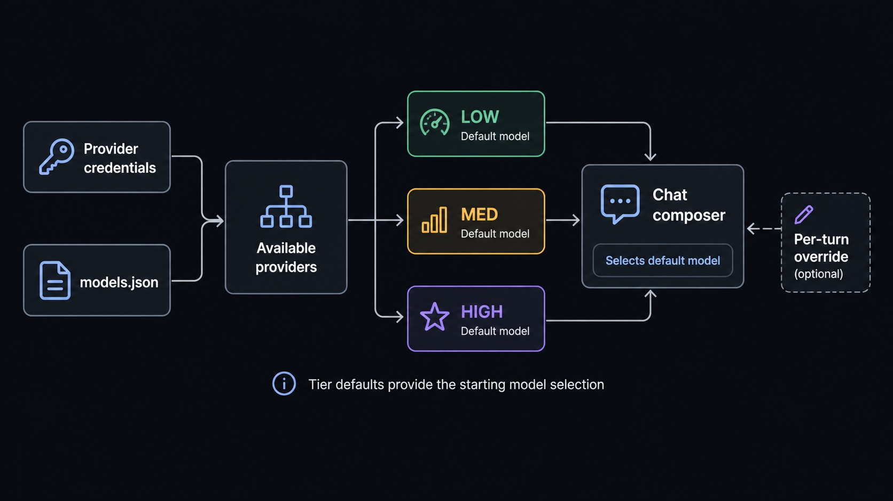

# Models and Providers

Sero uses providers for model access and model tiers for everyday choices. A profile can use hosted API-key providers, OAuth-backed providers from the Pi SDK, plugin-defined providers, and local/custom providers from `models.json`.

Sero does **not** bundle third-party credentials. You connect your own accounts, API keys, environment-backed credentials, or local endpoints.

Sero reads authentication methods from the active Pi provider metadata. Saved
credentials stay in the desktop main process. Environment credentials are shown
as environment-backed and are not overwritten when you change a saved key.

## Quick path

1. Create or open a profile.
2. Connect at least one provider during onboarding or in Admin.
3. Confirm provider health shows usable models.
4. Pick LOW, MED, and HIGH defaults.
5. Use the chat model selector only when you need a session-specific override. For the broader composer/context workflow, see [Agent Sessions and Context](/guide/agent-sessions-and-context).



## Provider types

| Provider type | How it is configured | Typical status |
| --- | --- | --- |
| API-key provider | Add a key in Sero or provide an environment-backed key. | `healthy`, `env`, `missing`, or `broken_invalid` |
| OAuth provider | Sign in through the OAuth flow exposed by the Pi SDK provider catalog. | `healthy`, `missing`, or `broken_expired` |
| Plugin-defined provider | Installed/built-in package manifest exposes `sero.providers` metadata. | Same as API-key providers when auth type is `apiKey` |
| Local/custom provider | Configure `<SERO_HOME>/agent/models.json` through Local models or by editing the file. | `local`, `healthy`, `missing`, or `unknown` depending on registry results |

## Provider inventory

| Provider | Provider ID | Auth mode | Notes |
| --- | --- | --- | --- |
| Anthropic | `anthropic` | API key or env-backed key | Models appear when credentials and registry data are available. |
| OpenAI | `openai` | API key or env-backed key | Also used by voice transcription features that require OpenAI credentials. |
| Google (Gemini) | `google` | API key or env-backed key | Hosted Gemini model provider. |
| OpenRouter | `openrouter` | API key or env-backed key | Aggregated model provider. |
| xAI | `xai` | API key or env-backed key | Hosted xAI models. |
| Groq | `groq` | API key or env-backed key | Hosted Groq models. |
| Cerebras | `cerebras` | API key or env-backed key | Hosted Cerebras models. |
| Mistral | `mistral` | API key or env-backed key | Hosted Mistral models. |
| Azure OpenAI | `azure-openai-responses` | API key or env-backed key | Azure OpenAI Responses-compatible provider. |
| Hugging Face | `huggingface` | API key or env-backed key | Hosted Hugging Face provider. |
| Vercel AI Gateway | `vercel-ai-gateway` | API key or env-backed key | Vercel gateway provider. |
| ZAI | `zai` | API key or env-backed key | Hosted ZAI provider. |
| OpenCode | `opencode` | API key or env-backed key | OpenCode provider. |
| Kimi | `kimi-coding` | API key or env-backed key | Kimi coding provider. |

The active Pi SDK catalog also contains other API-key and OAuth providers. The
provider list in Sero is the current inventory because the catalog can change
when the Pi SDK changes.

Environment-backed keys are detected through Pi's provider auth handling. They
are not copied into the UI as plain Sero-owned credentials. A failed remote
model refresh does not undo a successful login or key change.

## Plugin-defined providers

Packages can add provider metadata through `sero.providers` in their manifest. Sero scans compatible built-in packages, installed profile plugins under `<SERO_HOME>/agent/plugins/`, extensions under `<SERO_HOME>/agent/extensions/`, and configured local package paths.

| Provider | Provider ID | Source | Auth mode | Notes |
| --- | --- | --- | --- | --- |
| Alibaba Coding Plan | `alibaba-coding-plan` | `git:https://github.com/sero-labs/sero-alibaba-plugin.git` | API key; env var `ALIBABA_CODING_PLAN_KEY` | External provider-only plugin. Install it before selecting Qwen-family defaults. |

Plugin-defined providers follow the same health/reconnect behavior as other API-key providers when their manifest declares `auth.type: "apiKey"`.

Provider registrations are shared across active Sero sessions. A plugin must
use `unregisterProvider()` only when it intends to disable that provider for
the whole desktop host.

## Provider health statuses

| Status | Meaning | What to do |
| --- | --- | --- |
| `healthy` | Sero found usable models for the provider. | You can select its models. |
| `env` | Environment-backed credentials were detected. Models may or may not be usable yet. | If no models appear, check the env var value and provider access. |
| `local` | A local/custom provider is configured in `models.json`. | Test the local endpoint and fetch models if the list is empty. |
| `missing` | No saved credential or usable local configuration is available. | Connect, add an API key, or configure a local provider. |
| `broken_expired` | Saved OAuth login looks expired or unavailable. | Reconnect the provider. |
| `broken_invalid` | Saved API key may be invalid or no longer works. | Replace or remove the key, then reconnect. |
| `unknown` | Models are available from a provider Sero cannot classify through the known catalogs. | Use the model if expected; otherwise inspect plugins and `models.json`. |

A provider can have credentials but no usable models. Sero keeps enough information to warn you rather than silently hiding broken saved choices.

## LOW, MED, and HIGH tiers

Tiers are profile-level defaults:

| Tier | Intended use |
| --- | --- |
| LOW | Fast, lightweight, lower-cost tasks. |
| MED | Balanced everyday work. |
| HIGH | Stronger reasoning or complex work. |

Each tier stores both a model and a thinking level. Thinking is tier-based: LOW, MED, and HIGH can each use different thinking levels, and Sero only offers levels supported by the selected model.

Use Admin to change profile defaults. The model selector changes the model for the current session. Its gear icon opens **Model Manager**, where you can manage favourites, hidden models, and local providers.

## Thinking levels

Sero derives available thinking levels from the selected model's provider, model ID, display name, reasoning flag, and whether the model appears to support extra-high reasoning. If a model does not support the selected thinking level, Sero warns instead of pretending the setting is valid.

Good defaults:

- LOW: fast model with thinking off or low.
- MED: everyday model with moderate thinking if supported.
- HIGH: strongest model with higher thinking when useful.

## Local and custom providers

Local/custom providers are stored in:

```text
<SERO_HOME>/agent/models.json
```

Open **Model Manager**, then select **Local**. The quick setup options include LM Studio, Ollama, vLLM, and a custom OpenAI-compatible server.

For a task guide, see [Local LLMs with LM Studio](/guide/local-llms-lm-studio). For exact supported fields, see [`models.json` Reference](/reference/models-json).

## Recovery paths

| Symptom | Recovery |
| --- | --- |
| No providers are usable during onboarding | Connect a provider, add an API key, or configure a local provider. |
| Provider shows `env` but no models | Check that the environment variable is available to Sero and that the provider account can list/use models. |
| OAuth provider shows expired/broken | Reconnect through the provider auth flow. |
| API-key provider shows invalid/broken | Replace the key or remove the stale credential and connect again. |
| Local provider has no models | Start the local server, test the URL, fetch models, and save. |
| Saved tier warns about unavailable model | Reconnect the provider or choose another model in Admin → Model. |
| `models.json` error blocks local editing | Back up and fix `<SERO_HOME>/agent/models.json`, then reopen the model manager or restart Sero. |

## Related docs

- [Profiles and Onboarding](/guide/profiles-and-onboarding)
- [Local LLMs with LM Studio](/guide/local-llms-lm-studio)
- [`models.json` Reference](/reference/models-json)
- [Settings and Admin](/guide/settings-models-admin)
- [Workspace and Chat](/guide/workspace-and-chat)
- [Agent Sessions and Context](/guide/agent-sessions-and-context)
- [Security / Privacy](/reference/security-privacy)
