# Orchestrator

Orchestrator runs **loops** — jobs you describe in plain English. You say what
you want done; Sero works out the steps, runs them, and checks in with you when
it needs a decision. A loop can run once or on a schedule, and it keeps going
across restarts until the work is finished.

You never write the steps yourself. The same machinery can review pull requests,
triage issues, tidy files, draft summaries, or run any other multi-step task —
the steps come from the model, not a fixed template.

Sero is in **public beta**. Treat loops as helpful local automation, not a
guaranteed job runner.

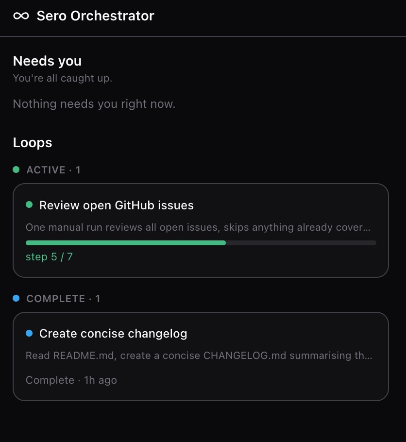

## The idea in one minute

A **loop** is three things:

- **your goal** — the prompt you wrote ("review open issues and fix the simple
  ones");
- **a step plan** — the steps Sero wrote to reach that goal, and how they
  connect;
- **its history** — every run, what each step did, and any decisions you made.

You describe the goal. Sero writes the plan, runs the steps in order — some can
run at the same time — and stops to ask you whenever a step needs a decision
only you should make. It finishes only when the plan says the work is genuinely
done; it never just guesses that it's finished.

That's the whole model. The rest of this guide walks through it twice: once with
a simple loop, then with a more capable one. Both use a throwaway demo project so
nothing real is touched — the [setup steps](#set-up-the-demo-project) are at the
end.

## Walkthrough 1 — your first loop

We'll start small: read a project's README and write a short changelog from it.

**1. Open the panel and click New.** The first step of the wizard asks what you
want done.

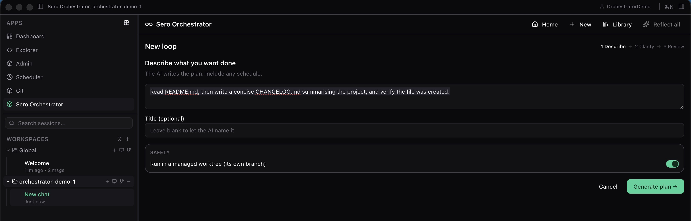

Type your goal in plain English:

> Read README.md, then write a concise CHANGELOG.md summarising the project, and
> verify the file was created.

Leave **Run in a managed worktree** turned on. This runs the loop on its own
copy of your files (its own branch), so your working files are never touched
while it works. Click **Generate plan →**.

**2. Review the plan.** Sero turns your sentence into steps.

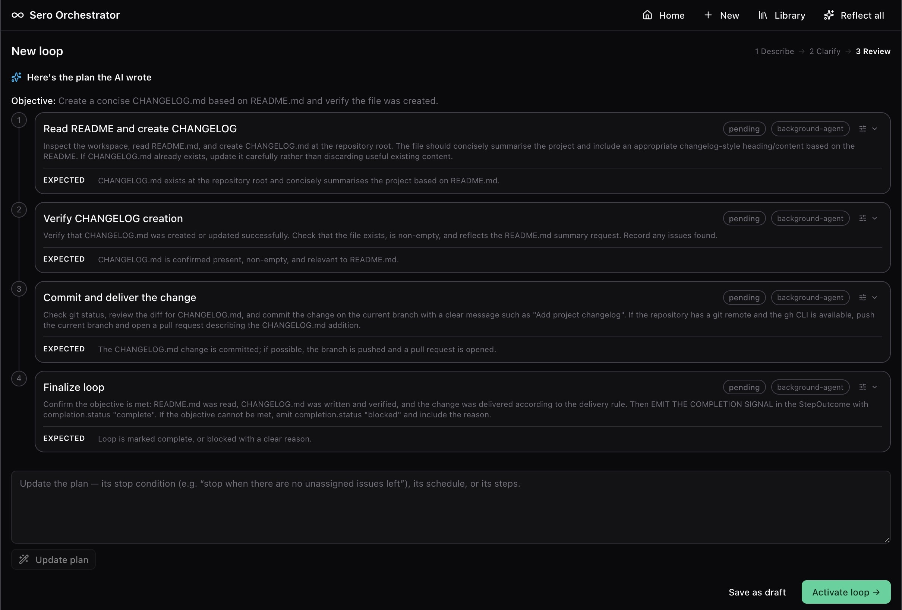

Each box is one step. The line joining them means the second step waits for the
first to finish. You can adjust anything here in plain English using the box at
the bottom of the plan — but this plan is fine, so click **Activate loop →**.

**3. Watch it run.** The loop opens and starts working. A green strip shows what
it's doing right now, with a live count of time and tokens used.

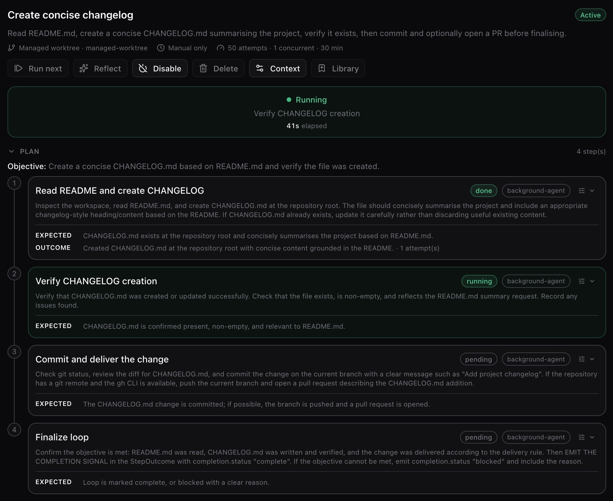

**4. Done.** When the last step finishes, the loop reports that it's complete and
every step shows as finished. The **Attempt history** below records this run.

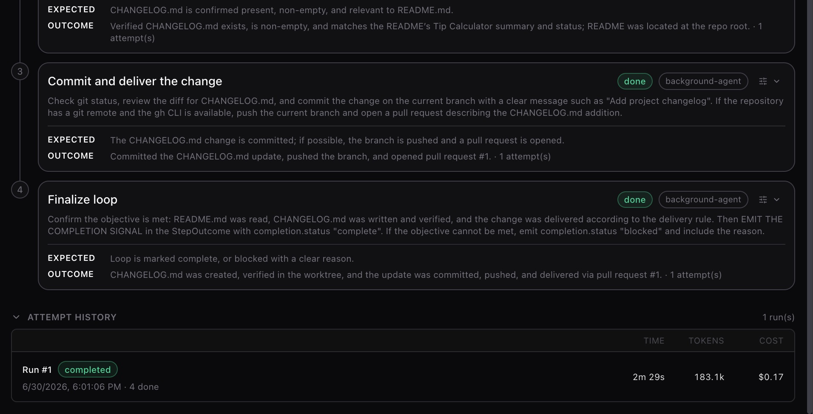

That's a complete loop, start to finish. Everything below is about loops that do
more.

## Walkthrough 2 — a loop that thinks for itself

Now a loop that has to make choices. We'll point it at the demo project's
`issues/` folder, which holds a mix of work: one simple typo fix and two that
need code changes.

Click **New**, and in **Describe** type:

> Review all the open issues in the issues/ folder in one run, working on the
> independent ones at the same time. For each issue: if it's a simple typo or
> docs fix, draft the change directly; if it's a code change, write a short plan
> first and ask me before making any edits. When you're done, summarise what you
> did. Run this only when I trigger it.

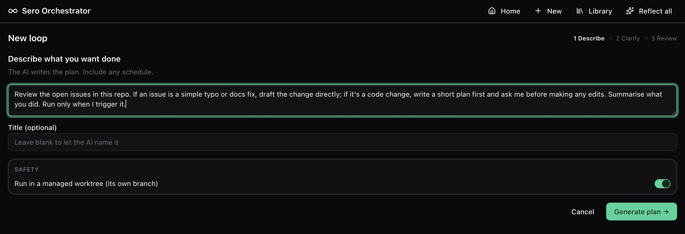

**Sometimes Sero asks first.** If your goal is missing a detail it needs, the
loop is created but not started — it shows the planner's questions, you answer
them, and it builds the plan. For a clear goal like this one it goes straight to
the plan.

**The plan branches on what it finds.** Sero's first step inspects and classifies
the issues; the plan then **branches** on that result — a "simple docs fix" arm
and a "code change" arm, each guarded so it only runs when it applies.

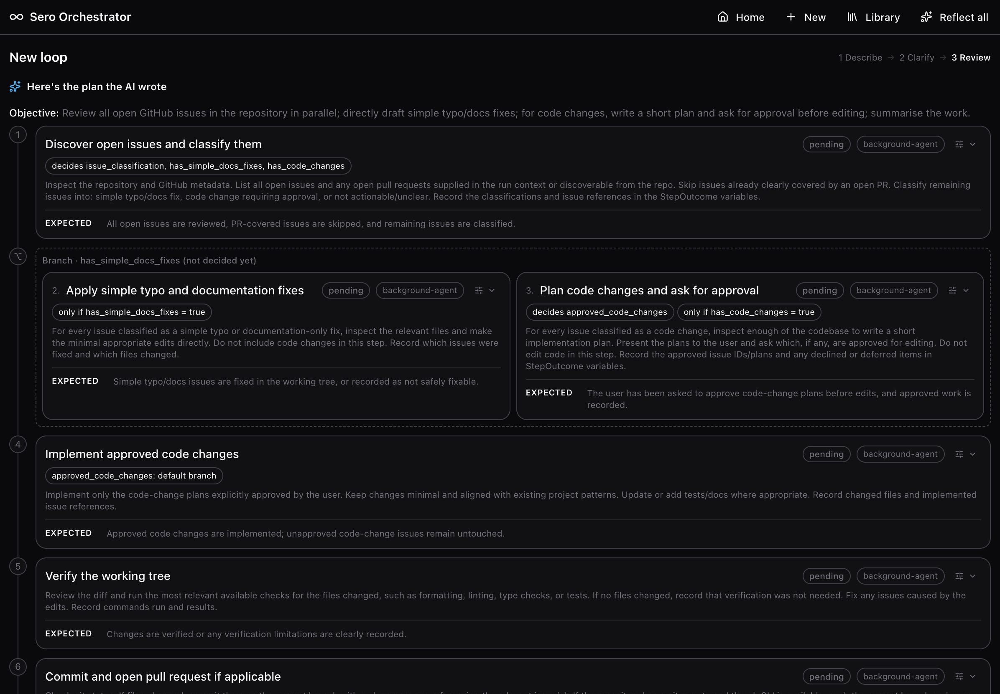

**Independent work runs at the same time.** Because the demo has both kinds of
issue, both arms of the branch are taken — and Sero runs them together instead of
one after another. The live view shows both steps *running* side by side.

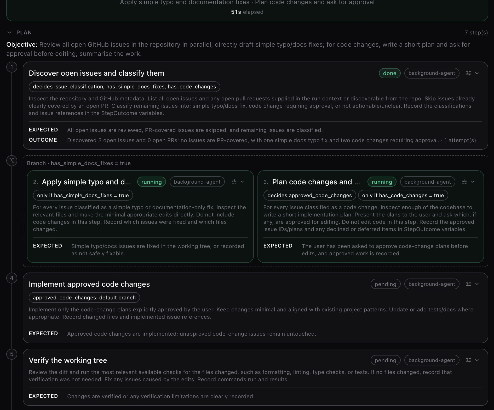

You don't design these shapes yourself — they fall out of how the steps depend on
each other. To nudge the structure, describe what you want in the **Refine** box
(below); loops are authored in plain language, structure included.

**It pauses to ask you.** Your goal said "ask me before making any edits" for code
changes. When the loop reaches that point it stops and shows a **Needs your input**
card — the question, quick-pick buttons, and a box for your own answer — and waits
as long as it takes (there's no timeout). It continues the moment you answer, and
your answer is saved with the loop.

**You can fine-tune a single step.** Every step has a small **Tune** control. Open
it to override, for that step alone, which **model** it uses and any extra **tools**
it may use — the defaults the planner chose are usually fine.

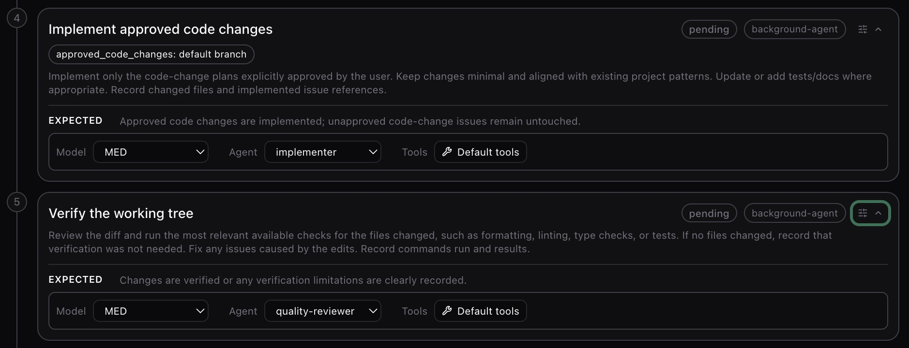

**Custom agent roles.** You can also run a step as one of your workspace's named
**agents** — a specialist role with its own instructions and default model — when
one suits the step better than the default.

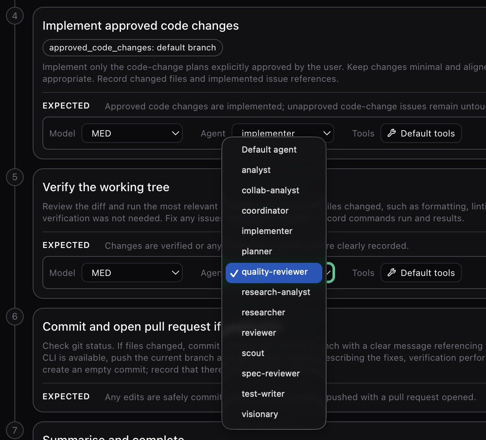

**You can rewrite the plan in plain English.** The **Refine** box changes the plan,
its schedule, or its stop condition — just describe what you want and Sero
re-writes the steps.

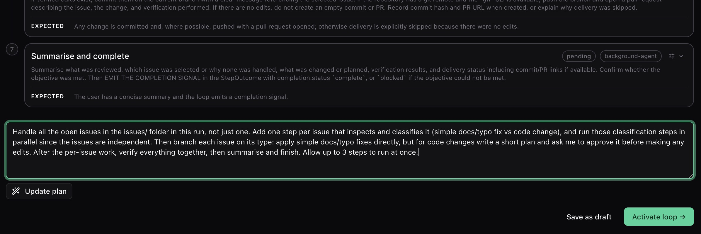

When every step is done, the loop summarises what it did and marks itself complete
— here it reviewed all three issues, made the fixes it was allowed to, and opened a
pull request.

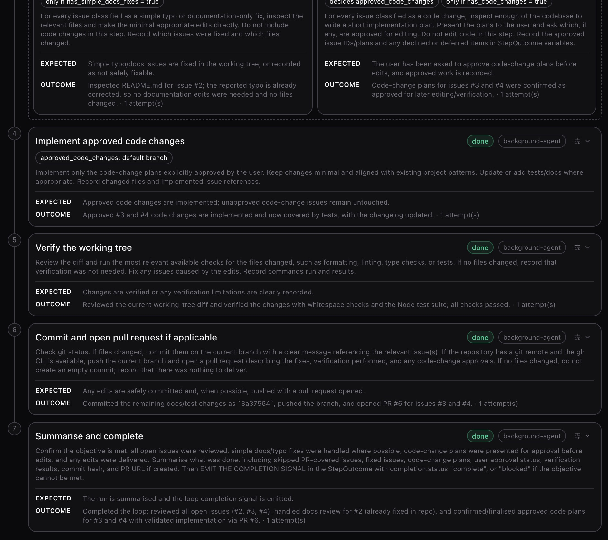

## When a loop gets stuck

A loop **blocks** when it hits a problem it can't get past on its own. It stops,
tells you why, and waits — it never fails silently or loops forever. You have two
ways out:

- **Retry step** — the button on the blocked step itself. It resets *that* step
  and runs the loop on from there, keeping all the finished work. Use it once
  you've fixed whatever caused the block.
- **Restart** — a loop-level button that re-runs the *whole plan from the first
  step*, discarding this run's progress (anything already committed is kept). Use
  it for a clean start — for example to make a different choice this time.

Retrying won't help if nothing has changed — the step will reach the same
conclusion and block again. In that case, Restart and choose differently, or
**Refine** the plan. A blocked loop is never a dead end.

## Clearing your "Needs you" list

The panel opens on **Home**, with a single **Needs you** list that gathers every
loop waiting on you — questions to answer and suggested improvements to approve —
so you can clear them in one place without opening each loop. Below it is an
overview of all your loops, grouped by status.

You don't have to keep the panel open. When a loop **finishes** or **blocks**
while you're away, Sero sends you a notification with the loop's name and what
happened.

## Improving a loop over time

A loop keeps a short record of each run. **Reflect** (on a loop) reads that
history and suggests how the loop could run better next time — a clearer step, a
missing check. **Reflect all** (top of the panel) does the same across every
loop that has run.

Each suggestion waits for you: **Approve** applies it to the plan, **Reject**
keeps a one-line reason so the same idea isn't suggested again. Nothing changes
on its own, and reflection only ever runs when you ask.

## Saving and reusing loops

Build a loop once and reuse it anywhere with the **Loop Library** — a shared
collection that follows you across every workspace in your Sero profile.

On a loop, open **Library → Save to Library**. The first save creates an entry;
later saves add a new **version** with an optional "what changed" note. Saving
stores the loop's plan, schedule, limits, and context — never its run history.

Click **Library** in the panel header to browse what you've saved. **Load** an
entry to drop a fresh copy into the current workspace, then review and activate
it like any new loop. When a newer version is saved from anywhere, a loaded loop
offers to **Update** to it.

## Set up the demo project

The walkthroughs above use a small throwaway project so nothing real is touched.
Open an empty folder as a workspace, start a chat, and paste this to the agent —
it builds the seed files for you:

> Set up a small throwaway demo project in this workspace, then run `git init`,
> stage everything, and commit it. Create:
>
> - **README.md** — a "Tip Calculator" CLI that splits a restaurant bill and tip
>   across a group: a one-line description, a usage example
>   (`node src/tip.js --bill 84.50 --tip 18 --people 3`), and a status note that
>   it's an early prototype. In the description, deliberately misspell
>   "calculates" as "calcuates".
> - **src/tip.js** — a `splitBill(bill, tipPercent, people)` function that adds
>   the tip and divides by people **without rounding to whole cents**, with a top
>   `// TODO` noting the rounding is naive (see issues/002).
> - **issues/001-readme-typo.md** — a simple docs fix: the README says "calcuates"
>   instead of "calculates".
> - **issues/002-fix-rounding.md** — a code change: `splitBill()` never rounds, so
>   odd splits lose a cent; plan the approach before editing.
> - **issues/003-add-currency-flag.md** — a code change: add an optional
>   `--currency` flag (default "USD") that formats each share.
>
> Don't create a CHANGELOG.md — a later loop writes that.

The `issues/` folder ends up with one simple fix and two code changes — exactly
the mix Walkthrough 2 needs so the loop has something real to branch on.

## Looking something up

This guide covers the everyday flow. For exact details — the full list of
`/orchestrator` commands, plan rules, triggers and schedules, the limits that can
block a loop, and where loops are stored on disk — see the
[Orchestrator reference](/reference/orchestrator).
