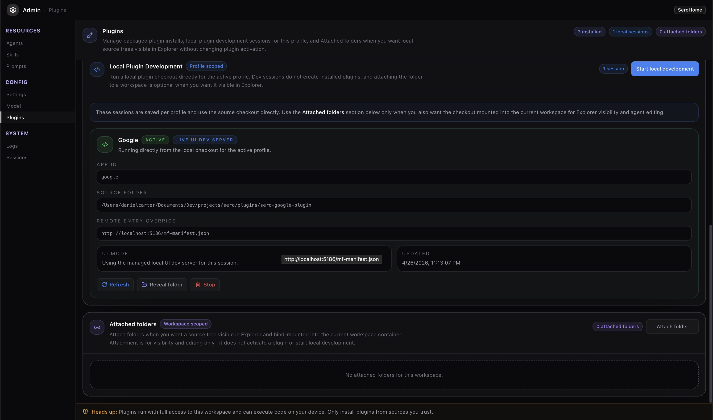
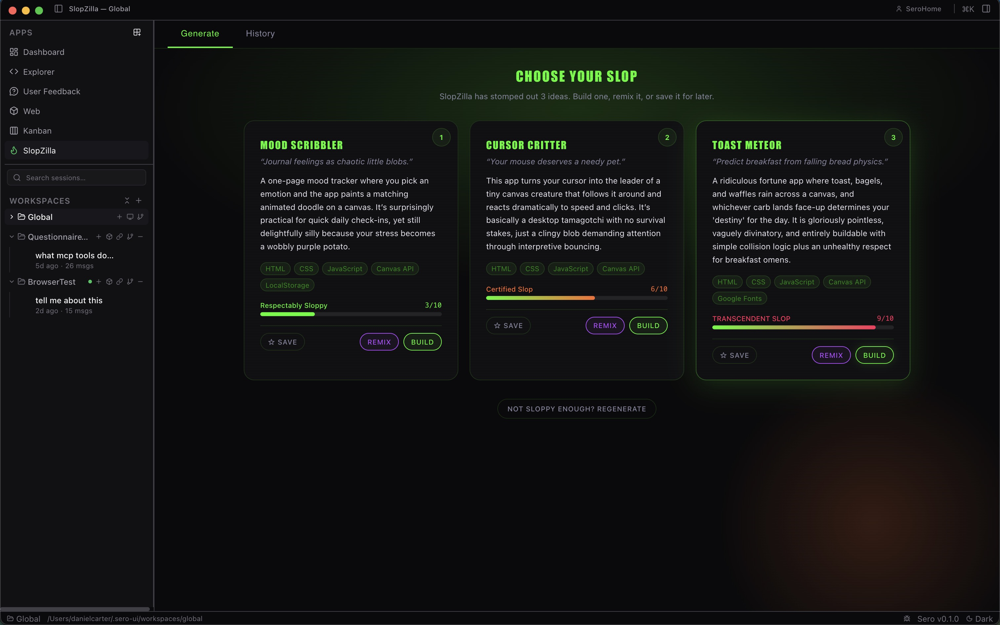
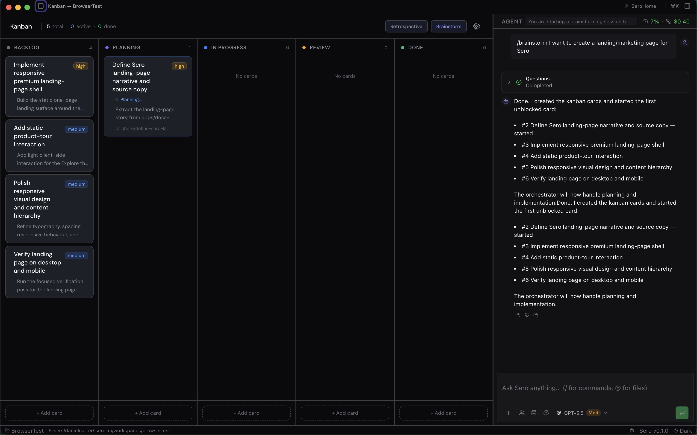
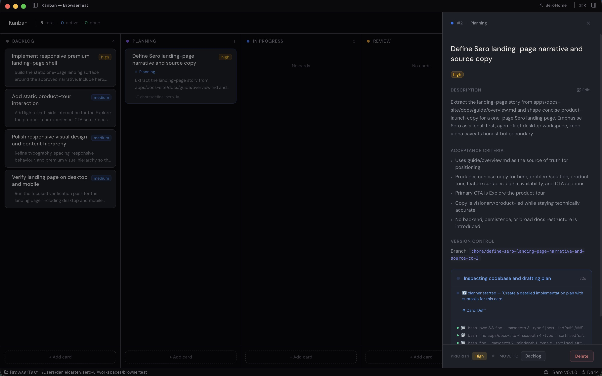
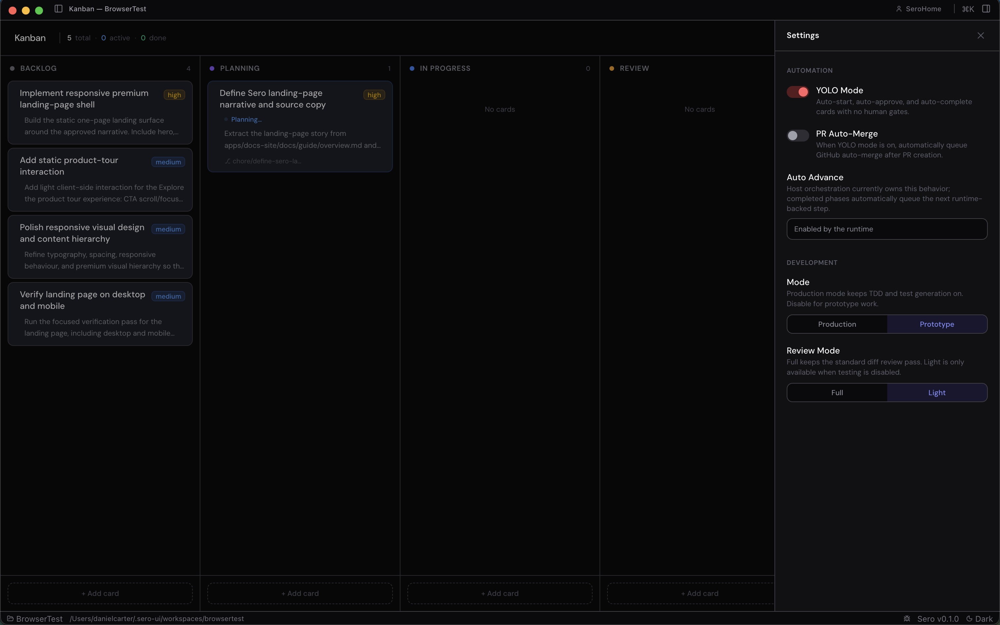
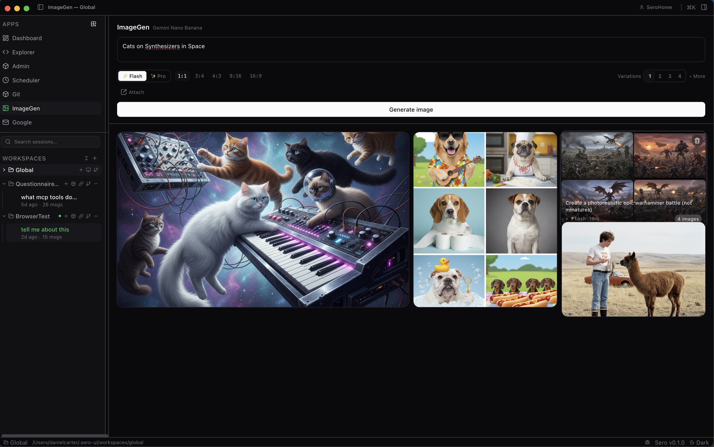
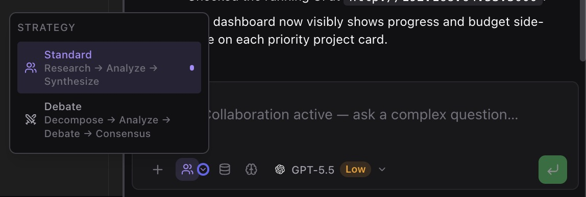
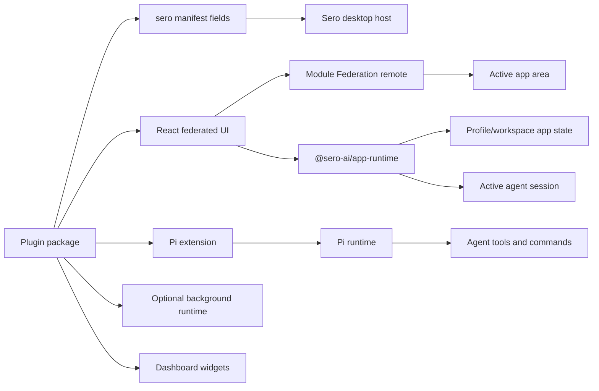
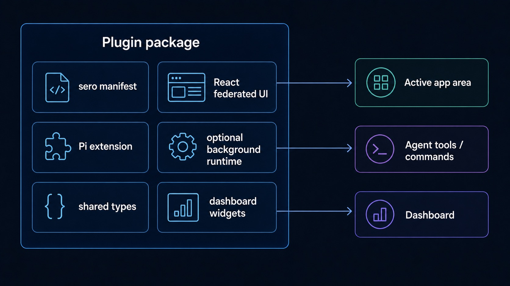

# Plugins and Apps

Sero plugins can add app UIs, agent tools, commands, background runtime behavior,
provider metadata, and dashboard widgets. This guide gives the user-facing and
author-facing mental model without replacing the detailed plugin references.

Sero is still a **source-only OSS alpha**. Treat third-party plugins as trusted
source code, expect plugin APIs to evolve, and do not assume external plugins are
bundled Sero features.

## Using plugins

### Core apps, bundled plugins, and installed plugins

Sero has a few app/plugin categories that users should keep separate:

- **Core shell apps** such as Dashboard and Explorer are built into the desktop
  shell and are always present.
- **Bundled plugin apps** live in the Sero monorepo and ship with the local
  source checkout. They may appear through the same discovered-app/favorites path
  as other plugin-backed app surfaces, but they are not removed like an installed
  third-party plugin.
- **Installed, external, or local plugins** live outside the core app. During
  alpha, install them only from sources you trust.

A plugin can provide one or more surfaces:

- an app in the Sero sidebar
- tools or commands the agent can use
- dashboard widgets (see [Dashboard and Widgets](/guide/dashboard-widgets))
- background/runtime behavior
- provider metadata for model or service integrations

For the at-a-glance list of built-in and external/local plugins, see the
[Plugin Catalog](/plugins/catalog). For the canonical overview, see
[Plugins](/reference/plugins). For the end-user management flow, see
[App Store, Favorites, and Installed Plugins](/guide/app-store-favorites).

### App Store and discovery

The App Store dialog is the current discovery and management surface for plugin
apps. It has two high-level views:

- **Installed** — apps already known to the local Sero profile.
- **Discover** — public or community plugin search results.

Installed search filters local app manifests. Discover searches remote plugin
sources through Sero's plugin search bridge.

Keep the alpha caveats in mind:

- Do not treat Discover as a stable commercial marketplace.
- Do not assume every discovered plugin is official or supported by Sero.
- Do not install source plugins unless you trust the repository.
- Auto-update behavior is not a public promise during alpha.

### Favorites and the sidebar

The main sidebar shows core shell apps plus favorited discovered apps that the
host supports. Discovered apps are not all shown by default.

Favorites are a convenience for keeping frequent plugin apps close at hand:

- core shell apps such as Dashboard and Explorer are always available and are not
  favorited/unfavorited the same way plugin-backed apps are
- bundled plugin apps may be seeded as favorites and can be removed from the
  sidebar without being uninstalled from Sero
- favorited discovered apps can appear alongside core shell apps in the sidebar
- app launch goes through Sero's normal app-opening flow

If a plugin is installed but does not appear where expected, it may be hidden by
compatibility checks, missing capabilities, or alpha discovery behavior.

### Example plugin surfaces

Bundled and installed plugins can provide focused app UIs. Examples include
Kanban boards, image generation, debate/review workflows, and research-oriented
surfaces. Treat these as examples of the plugin model rather than a promise that
every profile has every plugin installed or enabled.

A Kanban-style plugin can use Sero's app surface for project-specific planning
without becoming part of the core shell.

Detail views let a plugin expose richer state for one item while still keeping
that state inside the plugin's own model.

Plugin-specific options belong inside the plugin UI unless they need a host-level
capability or permission.

Other plugins may focus on agent-assisted generation workflows rather than
project management.

Review or debate-style plugins are another example of the same extension model:
a focused UI paired with agent/tool behavior.

### Compatibility and trust

Plugins can declare compatibility requirements such as a minimum Sero version or
required host capabilities. Unsupported plugins may remain installed but not
activate in the sidebar or app surface.

This protects users from some mismatches, but it is not a substitute for trust:

- plugin code can include UI, extension logic, tools, and runtime behavior
- credential-heavy integrations need extra care
- local/source plugins should be reviewed like any other code you run locally
- plugin contracts and host capabilities can change during alpha

## Building plugins

### Basic package shape

A Sero plugin usually combines a few pieces:

- package metadata with `sero` manifest fields
- an optional Pi extension for tools, commands, and hooks
- an optional React UI loaded as a federated remote
- optional shared types
- optional runtime/background behavior
- optional dashboard widget metadata or runtime widget registration

The best starting points are:

- [Plugin Author Quick Path](/reference/plugin-author-quick-path)
- [App Runtime Reference](/reference/app-runtime)
- [Plugin Quickstart](/reference/plugin-quickstart)
- [Plugin End-to-End Example](/reference/plugin-end-to-end-example)
- [Plugins](/reference/plugins)

Use this page as the map; use the reference pages for implementation detail.

### Federated app UIs

Plugin UIs are loaded dynamically. In production, installed plugin remotes are
served through Sero's extension protocol. In development, Sero can fall back to a
plugin dev server when configured.

At a high level, the desktop app resolves a remote entry, loads the exposed React
component, and mounts it inside the active app area. Loaded modules are cached
and evicted over time so Sero can handle dynamic plugin app loading.

Do not rely on internal remote-loading details as a stable public API. Keep
plugin packaging metadata explicit and follow the current quickstart.

### App runtime hooks

`@sero-ai/app-runtime` gives federated app modules a small host bridge. See the
[App Runtime Reference](/reference/app-runtime) for the source-checked hook/API
table. Current public-facing concepts include:

- `useAppInfo` — read app and workspace identity
- `useAppState` — read and update file-backed app state through Sero
- `useAgentPrompt` — send text to the active agent session
- `useAI` — call an app-scoped agent prompt or stream when available
- `useAppTools` — invoke app/plugin tools through the host bridge
- `useAvailableModels` — read available model groups when exposed by the host
- `useTheme` — read effective theme mode and preset
- `useWidgetRegistration` / `registerWidget` — register dashboard widgets for
  the current renderer session

These hooks expect to run inside the Sero shell with the `window.sero` bridge
available. During alpha, some hooks may throw or degrade if a host capability is
missing.

### App state

Plugin app state should go through Sero's app-state bridge rather than browser
storage. In practice, that means using `useAppState` from the app runtime instead
of `localStorage` or ad hoc files from renderer code.

This keeps plugin state aligned with Sero's profile/workspace model and lets the
host own persistence. Exact storage paths and capabilities can vary by app scope
and plugin configuration, so document plugin-specific state only after verifying
it.

### Dashboard widgets

Plugins can expose dashboard widgets through static manifest metadata or runtime
registration. Widgets are intended for compact summaries such as recent activity,
counts, or quick status — not as full replacement app surfaces.

For the user workflow to add, remove, drag, resize, and troubleshoot widgets,
see [Dashboard and Widgets](/guide/dashboard-widgets).

When documenting widgets, keep claims scoped:

- mention dashboard widgets when the plugin manifest or runtime registration
  confirms them
- avoid promising exact placement or sizing beyond declared hints
- verify screenshots in the current app before publishing step-by-step docs

### Runtime commands and host capabilities

Some plugins need host capabilities for command execution, background runtime,
agent-tool bridges, or provider integrations. Manifest requirements help Sero
avoid loading unsupported apps, but they do not guarantee parity across every
runtime mode.

In public alpha docs, prefer conservative wording:

- say a plugin **requires** a host capability when the manifest says so
- mention that container-backed mode may expose more capabilities than reduced
  host mode
- avoid promising every plugin works identically in every profile, workspace, or
  runtime configuration

## What not to assume during alpha

Avoid these claims unless a later product decision and runtime test confirm them:

- external plugins are bundled Sero features
- Discover is a stable marketplace
- auto-update is supported
- every installed plugin can activate on every host
- every dashboard widget placement is fixed
- app-runtime APIs are permanently stable
- source plugins are safe just because they appear in search

## Next steps

If you want to **use** plugins, start with
[App Store, Favorites, and Installed Plugins](/guide/app-store-favorites), then
use the [Plugin Catalog](/plugins/catalog) to distinguish built-in plugins from
external/local examples, read [Dashboard and Widgets](/guide/dashboard-widgets)
for widget behavior, and [Plugins](/reference/plugins) for the broader model.

If you want to **build** a plugin, start with
[Plugin Author Quick Path](/reference/plugin-author-quick-path), then continue to
[Plugin Quickstart](/reference/plugin-quickstart) and
[Plugin End-to-End Example](/reference/plugin-end-to-end-example) for UI,
extension, runtime, and widget structure.
