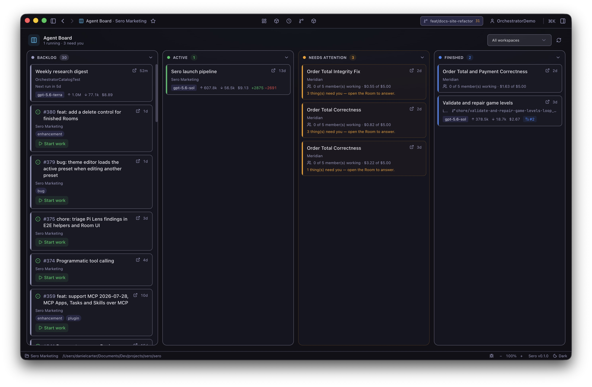
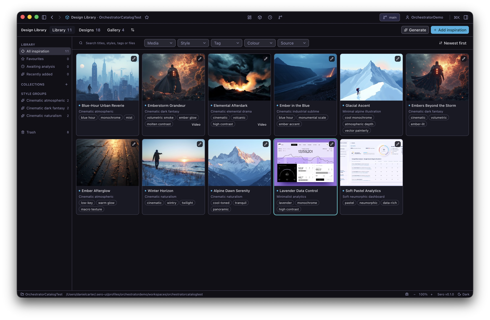
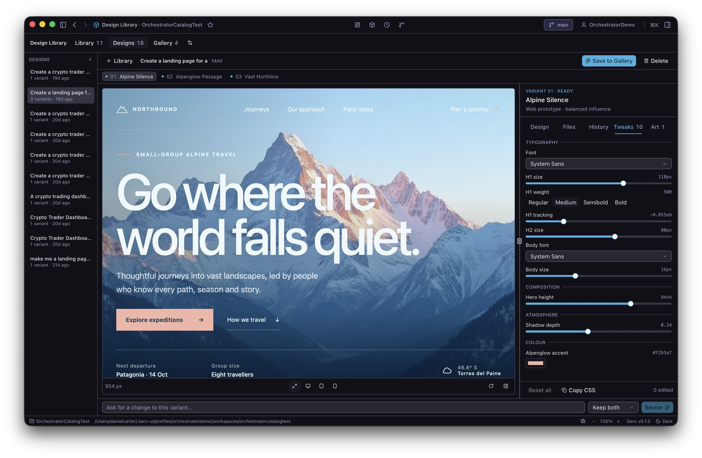
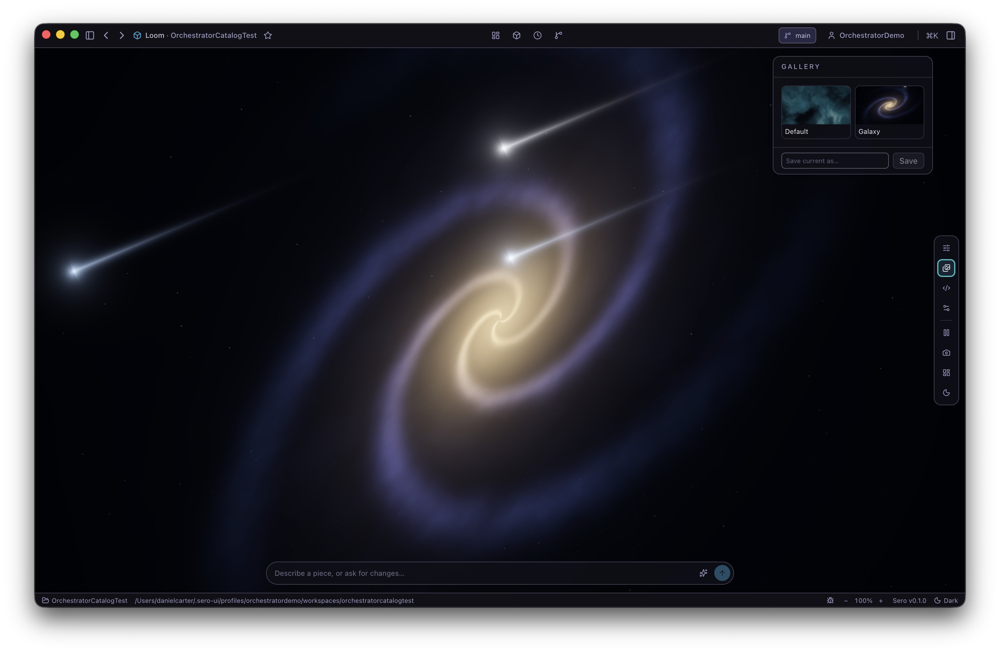
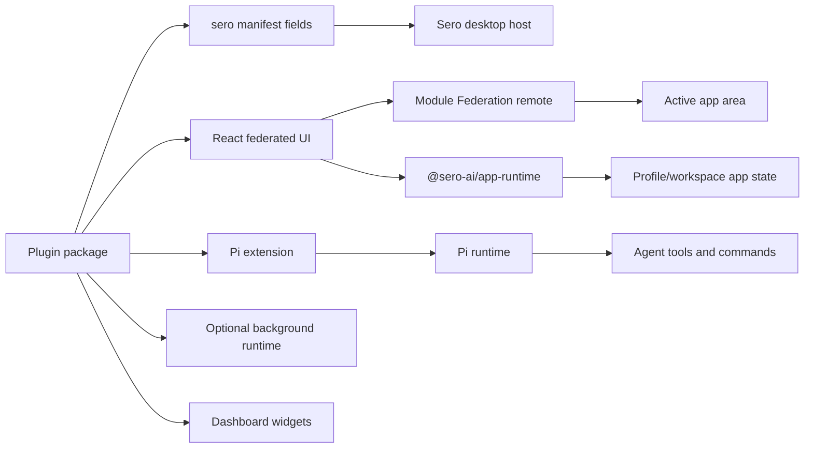

# Plugins and Apps

Plugins extend Sero. They can add an app UI, agent tools and commands, background services, model or service providers, and dashboard widgets.

> **Warning:** An installed plugin can execute code on your device and access your workspace. Install plugins only from sources that you trust.

## Use plugin apps

Core apps, such as Dashboard, Agent Board, and Explorer, are part of the desktop shell. Plugin apps can be built into Sero or installed from an external source. An external plugin is not a built-in Sero feature.

Use [App Store, Favorites, and Installed Plugins](/guide/app-store-favorites) to find, install, favorite, and uninstall plugin apps. Use the [Plugin Catalog](/plugins/catalog) to check whether a documented plugin is built in or external.

Portable **Agent Plugins** are separate. They add Agent Skills and MCP servers, but they do not add an app or sidebar entry. See [Agent Plugins](/reference/agent-plugins).

The local plugin management view shows installed development plugins and their attached source folders.

Plugin apps can provide focused work surfaces. The following group shows a plugin app, its Kanban views, and image generation.

## Build a plugin

A plugin package uses `sero` manifest fields to declare its Sero features. It can contain a Pi extension, a federated React UI, a background runtime, shared types, and widget metadata.

The anatomy diagram shows how one plugin package connects its manifest, UI, extension, runtime, and widgets to Sero.

Plugin UIs use `@sero-ai/app-runtime` to read app identity, use host-backed app state, send prompts, call tools, read available models and themes, and register widgets. Do not use browser storage for persistent plugin state.

Start with [Plugin Quickstart](/reference/plugin-quickstart). Use [App Runtime Reference](/reference/app-runtime) for the React API and [Plugins](/reference/plugins) for manifests, compatibility, installation, and development.
