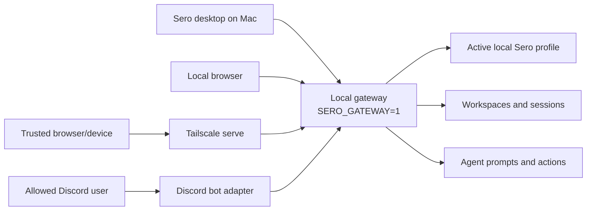
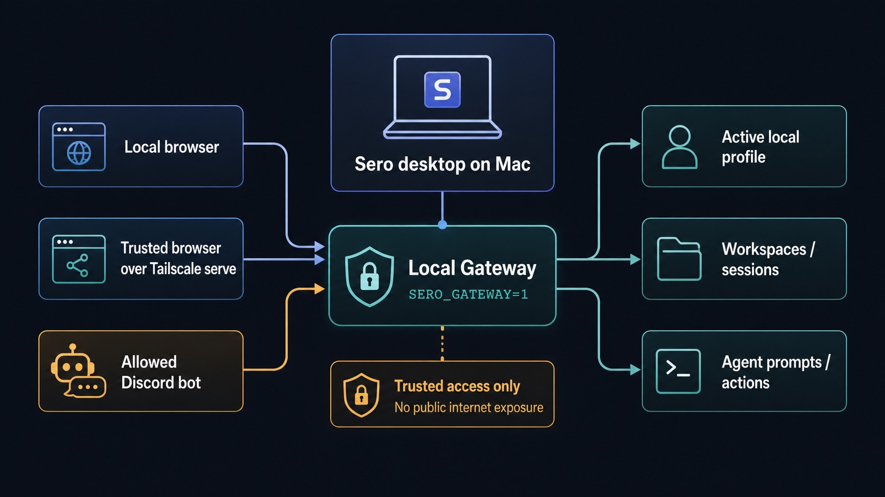
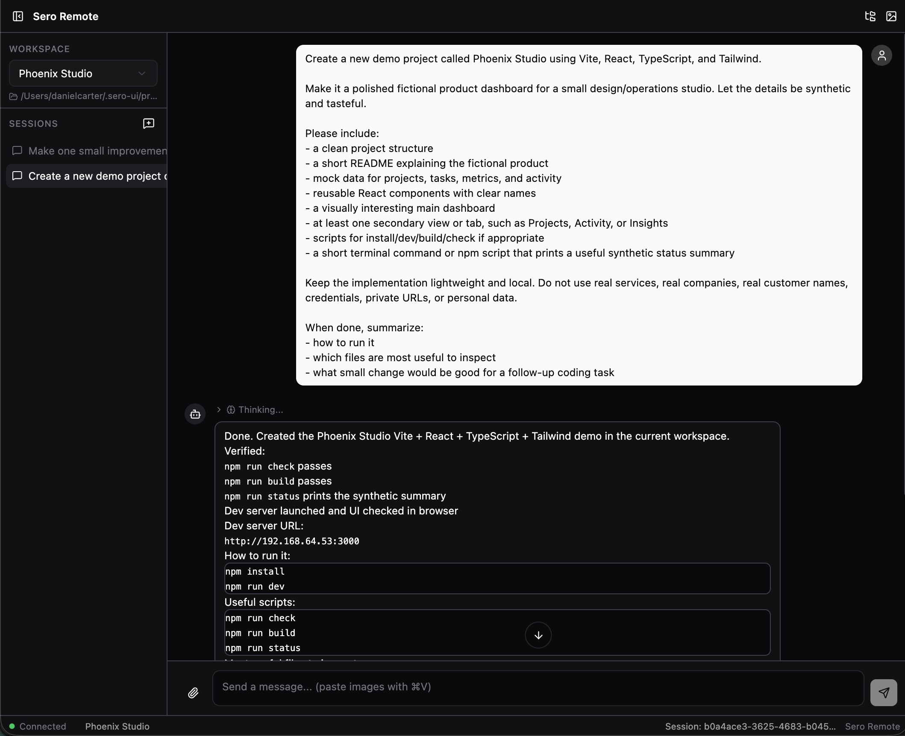
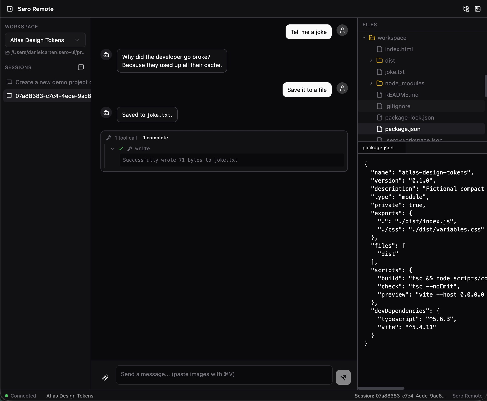

# Remote Control

Remote Control lets you operate your local Sero desktop session from another
client. It has two separate integration paths:

- **Remote web access over Tailscale** — a browser UI called **Sero Remote** can
  connect to your local Sero gateway from another trusted device on your
  Tailscale tailnet.
- **Optional Discord bot** — a configured Discord bot can forward allowed DMs or
  mentions into Sero as prompts.

Tailscale is the private VPN/tailnet layer for remote **web** access. Discord is
a separate optional bot integration; it does not depend on Tailscale and it does
not provide the Sero Remote web UI.

Remote Control is not screen sharing. The work still happens on your Mac, in
your active local Sero profile. Remote clients are alternate control surfaces for
the Sero desktop process that is already running locally.

The gateway is **off by default**. It only starts when the desktop process is
launched with:

```bash
SERO_GATEWAY=1
```

Read [Security / Privacy](/reference/security-privacy) before enabling it.

## Access paths

| Path | What it does | Network dependency |
| --- | --- | --- |
| **Local web gateway** | Serves Sero Remote locally for testing and pairing | Localhost only |
| **Sero Remote over Tailscale** | Lets another browser/device on your tailnet use the web UI | Tailscale VPN / `tailscale serve` |
| **Discord bot** | Lets allowed Discord users send prompts by DM or mention | Discord bot token and allowlist |

Use Tailscale **serve** for tailnet-only exposure. Do not use public Tailscale
funneling or direct public-internet exposure during the alpha.





## Sero Remote web access

Sero Remote is the browser-based remote UI. It can show workspaces and sessions,
send prompts, display streamed responses/tool activity, and expose remote panels
such as files or artifacts where supported.



The web UI is useful when you want to continue a Sero session from another
trusted device without opening the full desktop app on that device. It still
controls the local desktop process and local workspace state on your Mac.



Local gateway endpoints currently include:

```text
127.0.0.1:18800
```

A basic/legacy local web UI may also be available on:

```text
127.0.0.1:18801
```

For remote web access, Tailscale is the recommended transport. Sero can expose
the gateway to your private tailnet through `tailscale serve`; a paired browser
then uses the tailnet URL and a temporary web token/login flow.

## Discord bot access

The Discord path is optional and separate from the web/Tailscale path. When
configured, the gateway starts a Discord adapter that listens for DMs or mentions
and forwards allowed messages into Sero.

Discord setup depends on environment/profile configuration:

- `SERO_DISCORD_TOKEN` — Discord bot token
- `SERO_DISCORD_USERS` — comma-separated allowlist of Discord usernames or user
  IDs

Current behavior is fail-closed: if `SERO_DISCORD_USERS` is empty, the Discord
adapter refuses to start for security. Set an explicit allowlist before relying
on Discord access.

Use Discord for prompt-style interactions, not for full workspace browsing. The
web UI is the richer remote control surface; Discord is a bot channel.

## What Remote Control can access

An authenticated gateway client can interact with the same local Sero profile
that your desktop app is using. Current gateway capabilities include:

- listing workspaces and sessions
- creating sessions
- sending prompts
- steering or aborting running agent turns
- checking status
- reading session history
- listing and reading files through supported gateway file APIs
- listing and fetching artifacts
- creating, listing, and revoking web tokens when authenticated with the master
  token

Because prompts can cause the agent to use tools, a paired web client or allowed
Discord user can have high-impact effects on your workspaces. Treat Remote
Control access like access to the desktop UI.

## Authentication model

Sero uses profile-scoped gateway credentials:

| Credential | Location |
| --- | --- |
| master gateway token | `<SERO_HOME>/agent/gateway-token` |
| gateway config | `<SERO_HOME>/agent/gateway-config.json` |
| web tokens | `<SERO_HOME>/agent/gateway-web-tokens.json` |
| Discord bot token / allowlist env | `<SERO_HOME>/agent/.env` or launch environment |

The master token is a high-privilege secret for the active profile. Web tokens
are used for browser/device pairing and can expire or be revoked.

Current web-token behavior includes:

- tokens can be scoped to explicit workspace IDs or act as owner/profile tokens
- paired-device flows may grant access to all current workspaces and future
  workspaces in the profile
- default expiry is time-limited
- only a limited number of active web tokens are retained

Do not paste gateway tokens, web-token files, login URLs, QR codes, Discord bot
tokens, or Discord allowlists into bug reports, screenshots, chat transcripts, or
public issues. See [State and Folders](/reference/state-and-folders) for the
canonical storage map.

## Pairing a remote web client

Sero includes a pairing flow for connecting a remote browser or web client. The
flow creates a time-limited web token and can produce a login URL or QR code for
the browser. When served over Tailscale, that paired browser can control the
local Sero session from another trusted tailnet device.

Practical guidance:

1. Enable the gateway only when you need it.
2. Use Tailscale serve for private tailnet web access.
3. Pair only browsers/devices you control.
4. Prefer QR pairing or login prompts over manually sharing token URLs.
5. Revoke web tokens when a device no longer needs access.
6. Disable the gateway and reset Tailscale serving when you are done.

Token URLs are sensitive because they can leak through browser history,
autocomplete, screenshots, referrers, logs, or shared terminal output.

## Known alpha limitations

During the current source-only alpha, Remote Control does **not** promise:

- hardened remote administration
- production deployment support
- a stable public gateway API
- safe public-internet exposure
- full per-tool restrictions for gateway clients
- a complete security boundary around agent actions
- feature parity between the web UI and the desktop UI
- feature parity between Discord bot prompts and the web UI

The gateway has authentication and scope checks, but an authenticated client is
still powerful. Master-auth clients can access the profile broadly. Scoped web
tokens may limit gateway file/session/artifact access to specific workspace IDs,
but that is not the same as a comprehensive per-tool permission system.

## What to include in support reports

If Remote Control behaves unexpectedly, include:

- whether the gateway was enabled with `SERO_GATEWAY=1`
- whether the client used localhost, Sero Remote over Tailscale, Discord bot, or
  another path
- whether Tailscale `serve` was active, and whether public funneling was avoided
- whether the issue involved a master token or a web token
- whether the web token was intended to be workspace-scoped
- whether Discord was configured with `SERO_DISCORD_TOKEN` and an explicit
  `SERO_DISCORD_USERS` allowlist
- the active platform and source build details from
  [Support Scope](/reference/support-scope)
- a minimal redacted log excerpt

Useful logs can include:

```text
/tmp/sero-electron.log
/tmp/sero-vite.log
```

Never include raw gateway tokens, web-token files, QR codes, full login URLs,
Discord bot tokens, or private tailnet URLs. Rotate any token that may have been
exposed.

## Related docs

- [Security / Privacy](/reference/security-privacy)
- [State and Folders](/reference/state-and-folders)
- [Support Scope](/reference/support-scope)
- [Troubleshooting](/reference/troubleshooting)
