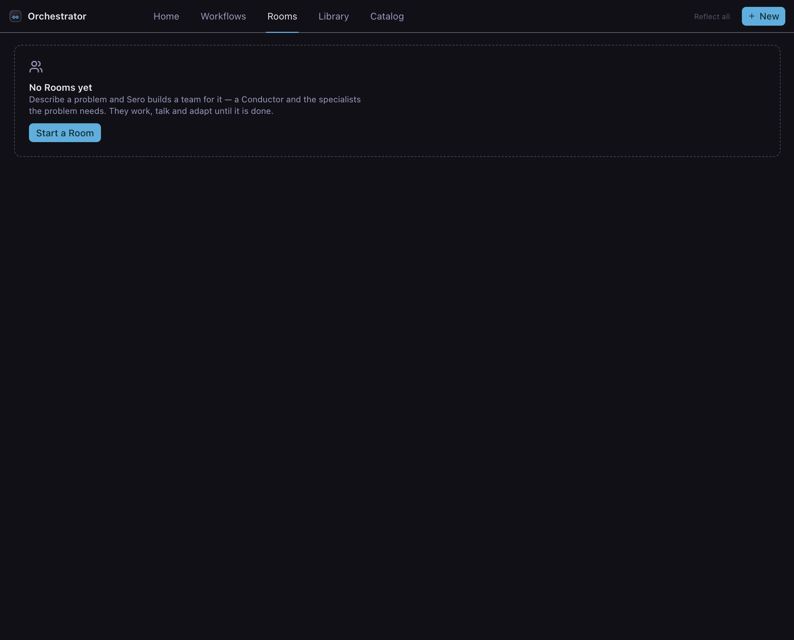

# Rooms

A Room is for a problem you cannot yet write the steps for. You describe what is
wrong, Sero designs a small team, you approve who is in it and what each of them
may touch, and they work on it together — dividing the files, telling each other
what they find, and asking you when a decision is yours to make.

This page follows one Room from an empty list to a finished fix. It uses a demo
project called Meridian: a small orders API whose totals are wrong, for three
unrelated reasons.

Use a [Workflow](/guide/workflows) instead when you can describe the result and
let Sero plan the steps. [Orchestrator](/guide/orchestrator) compares the two.

Sero is in public beta. Check important results before you use or publish them.

## The problem

Meridian's test suite fails four times. The failures look like one bug and are
not:

- a cent goes missing when an order total is split across lines;
- two payments arriving together overwrite each other, so one is lost;
- a retried payment charges the customer more than once.

Three different files, three different causes, and the right rounding rule is a
decision about the business, not the code. Nobody can write a step plan for that
before the first cause is understood — which is what makes it a Room.

## 1. Describe the problem

Open the Orchestrator panel, select **Rooms**, and click **New**.

The first screen asks what you want the team to accomplish. Describe the problem
and what a good result looks like — you do not pick agents, models or tools.

Type this:

> Order totals in this repo are wrong. `npm test` fails four times and the causes
> are not the same: one is in the rounding helper, one is a lost update when
> payments arrive at the same time, and one is a retry that charges the customer
> more than once. Work out each cause separately, fix them, and open a pull
> request. Ask me before you settle on a rounding rule — that is a decision about
> the books, not about the code.

Four controls sit under the box, and they are the limits the team will run
inside:

- **Maximum spend** — a hard stop, not a target.
- **Maximum time** — after which the Room pauses for you.
- **Access** — how much the team may do to your workspace.
- **Deliver to** — where the result goes.

Leave them at $5.00, 1 hour, **This workspace**, and **Workspace files**.

**Access** decides which Sero tools each member holds, and **Deliver to** decides
where the Room writes its result. Neither is a sandbox. A member that holds the
shell can run any command your account can run, so give a Room the shell only in
a repository you are willing to let it change.

Below that are three presets — Software delivery, Adversarial analysis, Parallel
issues — which fill the box with a shape that already works. Ignore them here;
the description above is specific enough.

Click **Design the team →**.

## 2. Read the proposal

Sero works through five things — your problem and limits, what this workspace can
do, the roles and how they fit together, the plan against your limits, and the
access the team needs. It says plainly that no session exists yet and nothing has
been spent.

When it lands, the proposal is the whole agreement in one screen.

**The team.** Four members, each with a job in one line. Ada leads as the
**Conductor** — the member that coordinates the others, puts their work together,
and decides when the job is done. Grace, Leslie and Barbara take one fault each.
Sero names members after the fault they own, so the names read oddly out of
context: Barbara's "idempotency" simply means a payment retried twice must charge
only once.

**What you are approving.** How many members, for how long, for how much, and how
much they may touch. These are read from the plan Sero just made, not written
freehand.

**What your limits changed.** Here it says Ada was lowered from **edit and push**
to **edit workspace**, because that is the access you chose. Anything the design
wanted but your limits do not allow is listed here rather than quietly kept.

Two links sit at the bottom right: **Why this team?** explains the shape, and
**Advanced settings** shows every tool each member will hold.

## 3. Change it in plain English

The proposal is a draft. Press **Adjust** and describe what you want differently.

Type:

> Add a reviewer who checks the three fixes together before the pull request is
> opened.

Press **Rethink the team**. Sero redesigns the roster and shows the new proposal.

You are not editing a form. Anything you can say about the team — a member fewer,
a stricter reviewer, a different split of the work — goes in that box.

When the proposal is right, press **Start room**. Sero asks once for permission
to open the agent sessions. That is the point where the Room becomes real, and
the point where spending starts.

## 4. Watch it work

The Room screen has three parts, and they stay in the same place for the whole
run.

**The header** carries the limits you set, counting up: time used against your
hour, money spent against your $5.00, and how many members are working right now
out of the number allowed to work at the same time.

**The team list**, on the left, is every member and what it is doing — working,
idle, waiting for another member, waiting for you, or finished. Click one to open
its own panel.

**The activity feed** is what has happened. It opens on **Highlights**, which
keeps the turning points and hides the routine entries. Four other filters sit
beside it: **All** shows everything, **Decisions** keeps only the choices that
were made, **Messages** keeps what the members said to each other, and **Work**
keeps changes to the task board.

**Decisions** is the filter to reach for first. It answers "what did this team
settle?" without you reading the whole run.

The buttons at the right of the header switch the view. **Watch** replaces the
feed with one card per member, each showing its latest line, how many turns it
has taken and what it has cost.

### Inside one member

Click a member to see what it is doing and what it was told to do.

**Session** is everything it did, turn by turn, with its totals beside it.

**Info** is its instructions: the role it holds, what it is responsible for, and
how it is meant to work. Sero wrote this when it designed the team, and it
explains most of what the member then does.

## 5. Answer the question

The brief told the team not to guess the rounding rule. About ten minutes in, Ada
stops and asks.

The Room pauses. A banner names the member and repeats the question — here, three
possible rounding rules, and whether amounts with more than two decimal places
are allowed. The team list shows Ada as **needs you** and everybody else as idle,
because they have nothing to do until this is settled.

Answer in the banner. The Room carries on from where it stopped. It does not
start again, and you do not pay twice for the work already done.

This is the biggest difference between a Room and a Workflow. A Workflow stops at
a point you marked in advance. A Room stops when it finds something only you can
decide — at a point nobody knew about beforehand.

## 6. Read the shared record

The **Brief** button opens five tabs. They are the team's own record, not a
summary written for you.

**Brief** is the goal, the work under way, and the conditions the team has to
meet before it can call the job done.

**Work** is the task board: each task, how far it has got, and the member that
owns it.

**Claims** is who is working in which file. Read what the tab itself says: a
claim is a note to the other members, not a lock. What really stops two members
overwriting each other is that each one works in its own copy of the repository.

**Artifacts** is what the members wrote for each other — what they found, the
evidence for it, and their review notes. When a specialist tells the Conductor
"here is the cause", the working is in one of these.

**Changes** is what the Conductor changed about the team, and what it is not
allowed to change. It can add members, retire them and move work between them,
up to the team size you approved. It cannot give the team more access, more
money, more time, or somewhere else to deliver. Those come back to you.

## 7. The finish

Twenty-one minutes and $1.63 after the start, the Room finishes.

The last entry is the result in one paragraph: the rounding rule you chose is in
place, payments that arrive together no longer overwrite each other, a retried
payment charges once, all eleven tests pass, the reviewer approved the three
fixes together, and a pull request is open.

Below it, every member has handed its copy of the repository back. The sessions
are closed but kept, so you can open any member and read what it did.

## What actually happened

Five members, twenty-nine turns, twenty-one minutes, $1.63 — inside limits of one
hour and $5.00.

Three specialists worked at the same time on three unrelated causes, each in its
own copy of the repository. Ada held the decisions that crossed all three, and
stopped the whole team when one of them was yours. Margaret read the three fixes
together and sent one back — a rounding change that would have broken existing
behaviour — and Grace corrected it before the pull request was opened.

None of that order was written down in advance. It is what a team does when
nobody knows the causes when the work starts.

## Check it before you trust it

The Room writes its own report. Read the pull request, run the tests yourself,
and read the reviewer's note rather than only the Conductor's summary.

## Next

- [Rooms in Practice](/guide/rooms-advanced) — presets, access levels, delivery
  destinations, and what to do when a Room stalls.
- [Rooms reference](/reference/rooms) — every field, tool action and status, for
  looking one fact up.
- [Workflows](/guide/workflows) — the other half of Orchestrator, for work whose
  steps you can describe up front.
