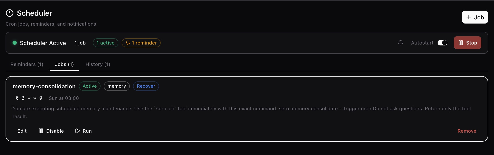
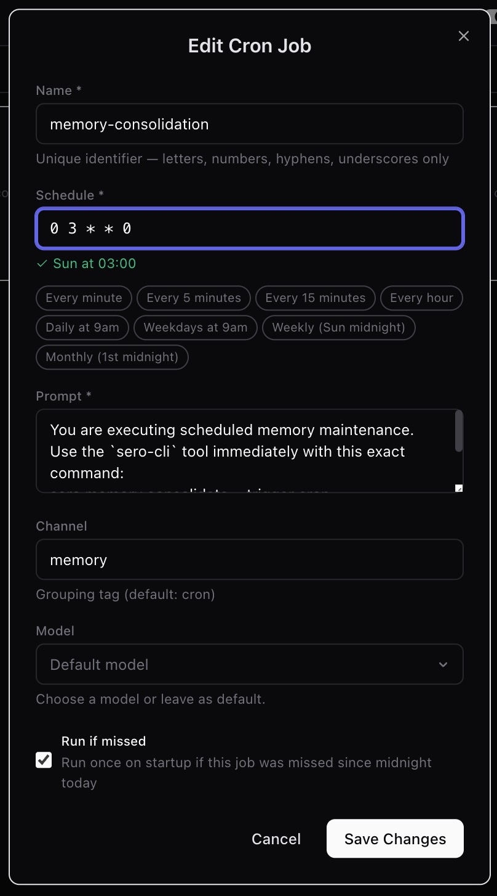
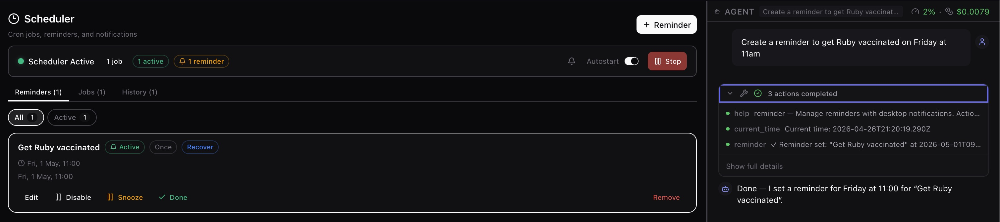

# Scheduler and Reminders

Sero's Scheduler is a built-in plugin (`@sero-ai/plugin-cron`) for simple
automations: recurring agent prompts, one-time reminders, and recurring
reminders. It is useful for lightweight checks such as "summarize this demo inbox
every weekday" or "remind me to review this synthetic plan tomorrow." Source
checked: `plugins/sero-cron-plugin/package.json` and README. See the
[Plugin Catalog](/plugins/catalog) for the built-in plugin inventory.

Sero is in **public beta**. Treat scheduler behavior as helpful
local automation, not guaranteed delivery or a replacement for a dedicated
calendar, monitoring, or notification system.

## Jobs vs reminders

Scheduler has two related concepts:

- **Cron jobs** are recurring agent prompts. They run from a cron expression and
  send a configured prompt to the agent when they fire.
- **Reminders** are notification-first items. They can be one-time or recurring,
  and currently deliver through desktop notifications.

Use a cron job when you want Sero to ask the agent to do something on a schedule.
Use a reminder when you want Sero to notify you about something without making it
an agent task.

Synthetic examples:

```text
Create a cron job named "demo weekly review" that asks the agent to summarize
open demo notes every Monday at 9:00.

Create a reminder named "check demo build" for tomorrow at 10:30.
```

Avoid scheduling prompts that mutate real files, send messages, publish changes,
or depend on exact delivery time unless you have tested that workflow carefully.

## Where you interact with Scheduler

You can use Scheduler from a few surfaces:

- **Scheduler app** — the main visual surface for jobs, reminders, history, and
  notification settings.
- **Scheduler dashboard widget** — a compact dashboard summary labeled
  **Scheduler**. The widget id is `scheduler-status`; the component is
  `CronWidget`.
- **`/cron` command** — a session command for turning the scheduler on or off or
  checking status.
- **Agent tools** — `current_time`, `cron`, and `reminder`.

The app's main tabs are **Jobs**, **Reminders**, **Workflows**, and **History**. The
app defaults to the Reminders view and includes a top status area for scheduler
state, autostart, and notification settings.

The widget can show whether the scheduler is active or paused, counts for jobs
and reminders, a few upcoming items, and recent job-result dots. Treat widget
countdowns as a quick summary, not a full scheduling explanation.

The Jobs view is where recurring agent prompts are listed and reviewed.



The editor view is where schedule, prompt, model, and missed-run behavior become
explicit. Review these fields carefully before enabling a job.



## Scheduled Orchestrator Workflows

The **Workflows** tab lists the active workspace's Orchestrator Workflows that
run on a schedule, plus Workflows with a pending snoozed retry. Workflows are created and managed
in the Orchestrator app — this tab is a window into them:

- **Edit schedule** changes the Workflow's cron schedule (evaluated in UTC).
- **Pause / Resume** stops or re-arms only the schedule. A Workflow that also runs
  on events (shown with an **Events** badge) keeps firing on those events while
  its schedule is paused.
- **Open in Orchestrator** jumps to the Workflow's details.

A Workflow delayed from an uncommitted-changes confirmation shows a **Snoozed**
badge and the retry time. Snoozing delays the pending Orchestrator run; it does
not change the Workflow's cron schedule. A manually snoozed event-only Workflow
also appears here as a one-off retry without schedule-edit controls. Manage the Workflow
itself in Orchestrator.

A schedule that has reached its run limit shows **Run limit reached** and can no
longer be edited or resumed — restart the Workflow in Orchestrator to run it again.

Workflow schedules are fired by Orchestrator, not by the cron scheduler — they run
even when the scheduler here is stopped.

## Start, stop, and check status with `/cron`

The Scheduler plugin registers the `/cron` command.

Supported command arguments are:

- `/cron on` — start the scheduler
- `/cron off` — stop the scheduler
- `/cron status` — show scheduler status

The command also accepts `start` and `stop` as aliases for `on` and `off`.

Examples:

```text
/cron status
/cron on
/cron off
```

The scheduler is a plugin-level runtime for the current Sero process. Do not
assume each chat session owns a separate independent scheduler.

## Use `current_time` before relative scheduling

The `current_time` tool returns current ISO time, local time, timezone offset,
and Unix time. It exists so the agent can resolve relative wording such as
"tomorrow morning" or "in 45 minutes" without guessing your current clock.

When you ask for a relative reminder or job, it is safest to ask the agent to
check `current_time` first:

```text
Use current_time, then create a reminder for 45 minutes from now named
"stretch break".
```

This is especially useful near midnight, during travel, or when timezone context
matters.

## Cron jobs with the `cron` tool

The `cron` tool manages recurring agent jobs.

Supported actions are:

- `list`
- `add`
- `update`
- `remove`
- `enable`
- `disable`
- `run`

Adding a job requires a `name`, `schedule`, and `prompt`. Updating a job uses
its `name` plus the fields you want to change, such as `schedule`, `prompt`,
`channel`, `model`, or `run_if_missed`.

Example prompts:

```text
Use cron to list my scheduled jobs.

Use cron to add a job named "demo daily summary" with schedule "0 17 * * 1-5"
and prompt "Summarize today's synthetic demo notes without changing files."

Use cron to disable the job named "demo daily summary".
```

The `run` action triggers a transient background session immediately. It is
background/asynchronous: do not expect the command to block until the job is
finished or to reuse your visible chat session.

## Reminders with the `reminder` tool

The `reminder` tool manages one-time and recurring reminders.

Supported actions are:

- `list`
- `add`
- `update`
- `remove`
- `snooze`
- `complete`
- `enable`
- `disable`

Adding a reminder requires a `title` plus either:

- `fire_at` for a one-time reminder, or
- `schedule` for a recurring reminder.

Updating, removing, snoozing, completing, enabling, or disabling a reminder uses
its saved `id` plus the fields you want to change. Reminders can also include
notes, a channel, type, and optional `recover_if_missed` flag. Status is saved
state, not a field you set directly through the tool. The implemented
reminder types are one-time (`once`) and recurring (`recurring`).

Example prompts:

```text
Use reminder to add a one-time reminder titled "review demo notes" for tomorrow
at 9:00.

Use reminder to add a recurring reminder titled "demo standup prep" with schedule
"30 8 * * 1-5".

Use reminder to list my reminders and find the id for "review demo notes".

Use reminder to snooze the reminder with id "<reminder-id>" for 15 minutes.

Use reminder to complete the reminder with id "<reminder-id>".
```

Snooze uses `snooze_minutes`; the default is 15 minutes. The special value `-1`
is documented by the tool/UI as "tomorrow 9am".

## Notifications

Reminder notifications are emitted through Sero's desktop notification path and
routed by the host to macOS notifications. Cron job completion notifications use
the same path and can include success/failure, duration, and optional sound.

The Scheduler UI includes notification settings. Notification sound is
user-configurable, with options such as `Glass`, `Hero`, and `Ping`, and sound
can be turned off.

Important caveats:

- Desktop notifications are **not guaranteed delivery**.
- Sero and the host notification path need to be available.
- macOS notification permissions and focus modes can affect what you see.
- Exact notification timing and presentation should be verified on your machine.
- Email reminders are **not implemented**. The shared types include an `email`
  path, but the shipped reminder tool currently supports `notification` only;
  email falls back to desktop notification with a warning in notifier logic.

Do not use Scheduler as the only alarm for safety-critical, financial, medical,
or production incident workflows.



## Missed-run recovery

Scheduler has conservative missed-run recovery, but it is opt-in per item:

- cron jobs use `run_if_missed`
- reminders use `recover_if_missed`

Recovery only looks at the window from the last scheduler shutdown or today's
midnight, whichever is later. Very short windows under two minutes are skipped.
Missed cron jobs are recovered only if they would have matched during that window
and are not disabled. Missed reminders are recovered only when recovery is
explicitly enabled and the reminder is not completed or disabled.

On startup, recovered cron jobs are executed in the background. Recovered
reminders trigger a notification only.

This is not a full catch-up system for long outages, multi-day downtime, or every
possible missed schedule. It is intentionally conservative.

## State and storage

Scheduler state is stored as app state for the built-in `cron` plugin. When
`SERO_HOME` is available, the state file resolves to the active profile root:

```text
<SERO_HOME>/apps/cron/state.json
```

For the default profile, `<SERO_HOME>` is usually `~/.sero-ui/`. If `SERO_HOME`
is not present, the plugin falls back to a workspace-relative path:

```text
./.sero/apps/cron/state.json
```

The app manifest advertises the state file as:

```text
.sero/apps/cron/state.json
```

State includes jobs, reminders, scheduler active state, autostart,
`lastTickMinute`, `lastSchedulerShutdown`, recent run results, and notification
settings. Writes are serialized and persisted atomically with a temporary-file
rename.

Treat this file as local app state. It may include reminder titles, notes, job
prompts, schedules, and timestamps.

## Privacy and safety

Cron jobs send their configured prompts to the agent when they run. Depending on
your selected model/provider and local setup, prompt content and resulting tool
use may leave the local machine.

Practical safety habits:

- Keep scheduled prompts narrow and low-risk.
- Use synthetic examples when testing.
- Avoid secrets, access tokens, private customer data, or sensitive personal
  details in job prompts and reminder notes.
- Disable or remove jobs you no longer need.
- Prefer reminders over cron jobs when no agent work is required.
- Review scheduled jobs before switching projects, profiles, or providers.

## Troubleshooting and limits

### A job or reminder did not fire

Check `/cron status`, confirm the scheduler is active, and verify the job or
reminder is enabled. Also check that the cron expression or `fire_at` time is
what you intended. If you used relative time, ask the agent to use
`current_time` and inspect the saved schedule.

### A notification did not appear

Check macOS notification permissions, focus modes, whether Sero is running, and
Scheduler notification settings. Delivery through desktop notifications is best
effort and should not be treated as guaranteed.

### Email did not send

Email reminders are not shipped. Use the `notification` channel only.

### Run-now did not show an immediate result

The cron `run` action starts a transient background session and records history
asynchronously. It does not block until completion and does not run inside your
visible chat session.

### Recovery did not catch up an item

Confirm `run_if_missed` or `recover_if_missed` was enabled before the miss,
check that the item was not disabled or completed, and remember that recovery is
same-day/conservative. It is not designed to catch up long outages.

### Duplicate or stale scheduler state

The scheduler is a module-level singleton, not multiple independent schedulers
per chat session. On startup, stale `schedulerActive` state can be corrected if
the scheduler is not actually running. Restart Sero and check `/cron status` if
state looks inconsistent.

### Cron expressions are easy to get wrong

Use simple schedules first, verify with disposable examples, and ask the agent to
explain the expression before saving it. If exact timing matters, test it before
relying on it.
