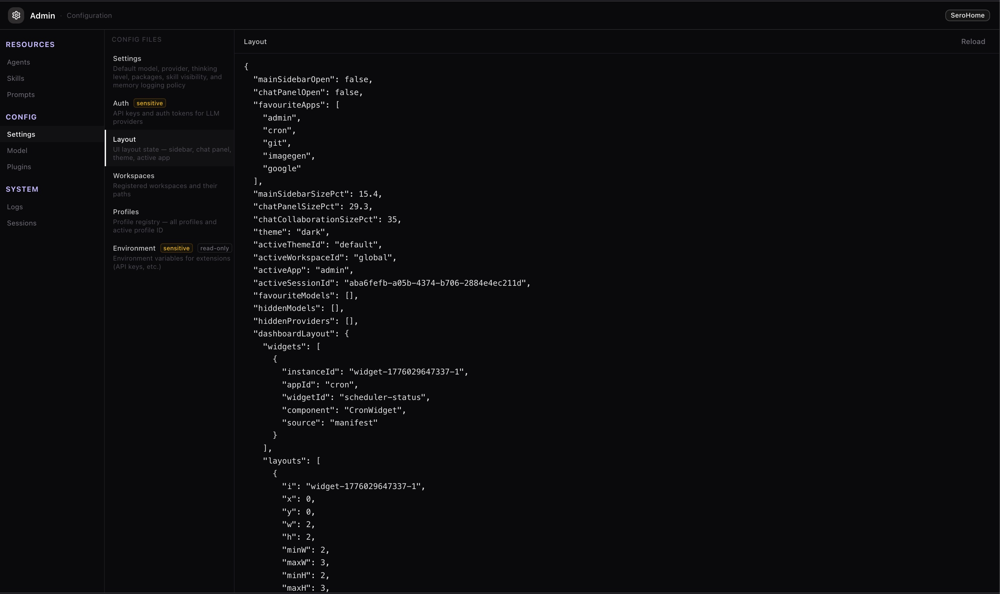
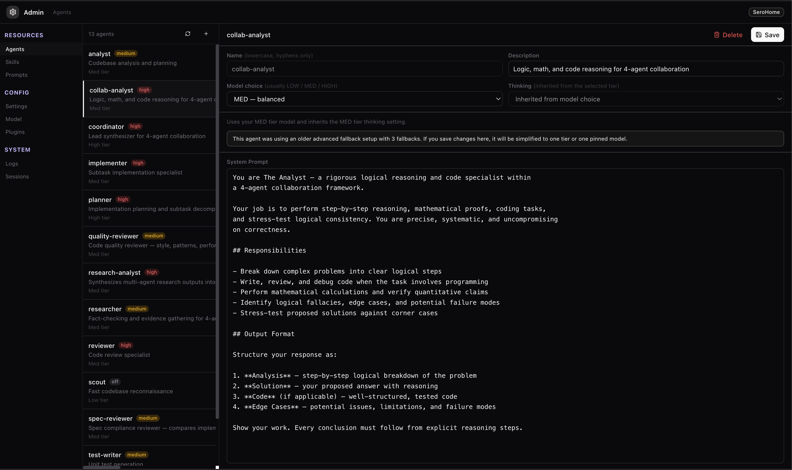
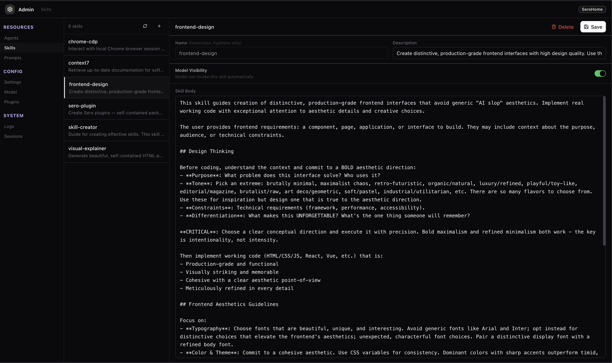
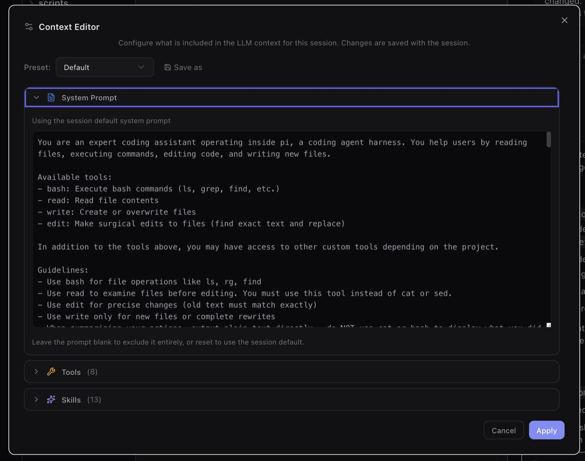
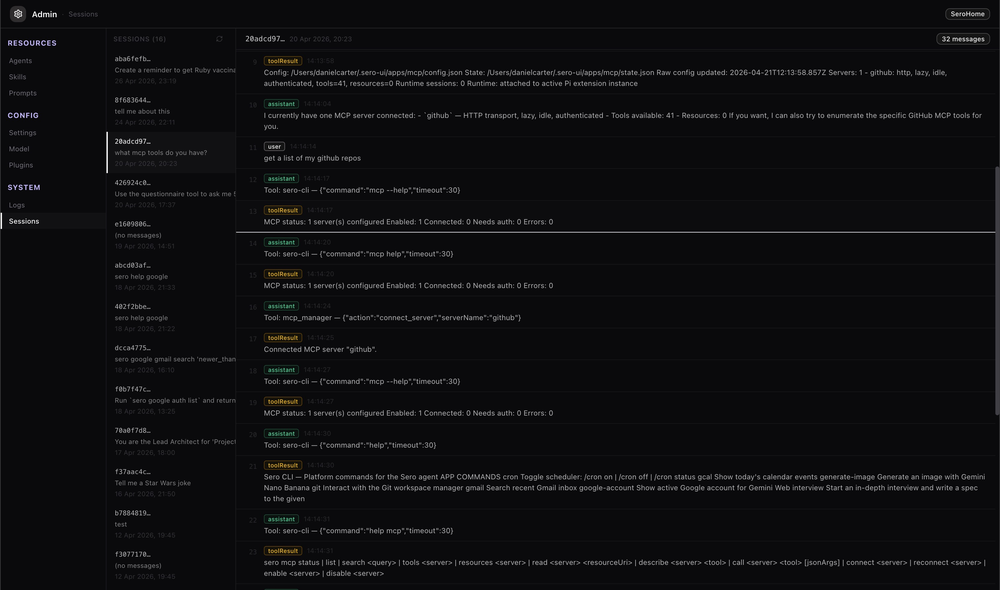

# Settings and Admin

Sero's Admin app collects profile-level configuration, local agent resources,
session inspection, and other support-oriented surfaces. Use this page as the
entry point for Admin-related documentation.

These screens are useful for understanding what the local profile is using, but
they remain alpha UI and should not be treated as a stable public API.

## What lives here

Admin-related docs are split into a few focused pages:

- **This page** — configuration files, agents, skills, prompts, and sessions.
- [Models and Providers](/guide/models-and-providers) — model selection,
  provider lists, local models, tiers, and chat context controls.
- [Themes](/guide/themes) — theme selection and editing.
- [MCP](/guide/mcp) — MCP server management.

## Configuration files

The Admin configuration view exposes profile-scoped files such as layout,
settings, auth-related configuration, workspace/profile registries, and
environment-derived values. Treat these files as sensitive when sharing
screenshots or support reports.

## Agents, skills, and prompts

Agent resources live under the Sero agent directory for the active profile. The
Admin app can help inspect configured agents, installed skills, and prompt
templates without leaving the desktop shell.

The Agents view shows the configured agent definitions available to the active
profile.

Skills are reusable instruction bundles. Use the Skills view to inspect what is
installed before assuming a workflow-specific skill is available.

Prompt management is for profile-scoped prompt templates. Prompts may include
private workflow details, so review them before sharing screenshots.

## Sessions

The Sessions view is for inspecting local agent session metadata and history
while troubleshooting or resuming work. Session data can include private prompts,
paths, outputs, and tool activity, so redact it carefully before sharing.

## Related docs

- [Models and Providers](/guide/models-and-providers)
- [Themes](/guide/themes)
- [MCP](/guide/mcp)
- [Workspace and Chat](/guide/workspace-and-chat)
- [State and Folders](/reference/state-and-folders)
- [Security / Privacy](/reference/security-privacy)
