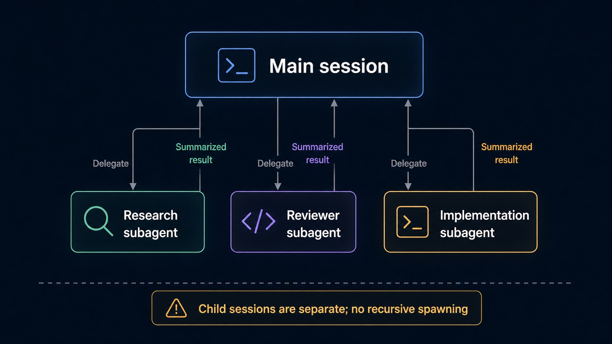

# Subagents and Collaboration

Subagents let the main Sero agent delegate bounded work to specialist child sessions. Use them when one task can be split into independent research, review, testing, or implementation tracks. Collaboration mode is related but distinct: it runs a fixed multi-agent collaboration/debate flow for one prompt.

## Quick path

1. Start in a normal workspace chat session.
2. Ask for delegation explicitly, for example: “Use the scout subagent to map this folder before editing.”
3. Keep each delegated task narrow and file-scoped.
4. Watch subagent activity/results in the chat or orchestration panel when visible.
5. Review the final main-agent answer before accepting file changes.

Subagents are helpful for parallel investigation, but they are not a replacement for reviewing diffs, tests, or source-control state.



## Built-in and custom agents

Sero can discover named agent definitions from the active profile:

```text
<SERO_HOME>/agent/agents/
```

The default profile path is usually:

```text
~/.sero-ui/agent/agents/
```

Built-in templates may be copied there on first launch. Common specialist roles include scout/research, review, test-writing, and analysis. You can add custom Markdown definitions; see [Agent Definitions](/reference/agent-definitions) for the exact frontmatter format.

## Delegation patterns

| Pattern | Use it for | Caveats |
| --- | --- | --- |
| Single specialist | A focused scan, review, or implementation task | Best when one agent owns the whole subtask. |
| Parallel/fan-out | Independent files, modules, or hypotheses | Parallel agents share the workspace/container, so avoid overlapping writes. |
| Chain | Sequential steps where later work depends on earlier output | Slower; inspect intermediate assumptions. |
| Ad-hoc specialist | One-off system prompt without saving a definition | Useful for experiments; less reusable than named agents. |

Ask for clear boundaries:

```text
Use parallel subagents to review these three files independently. Each subagent should only inspect its assigned file and report risks; do not edit files yet.
```

## Visible results and controls

Subagent runs can emit lifecycle state such as queued, running, completed, failed, aborted, and timed out. Result cards may show the specialist name, task preview, live output, tool activity, duration, model, usage, and final response preview.

Current controls include aborting active subagents and clearing completed entries from the visible activity list. Clearing completed entries does not mean the main session forgot the answer it already received.

## Limits and no-recursion rule

Important limits:

- Child sessions do **not** receive `subagent` or `create_agent` tools.
- Subagents cannot recursively spawn more subagents.
- Child sessions do not load external extension packages in the current v1 design.
- The `tools` field in agent definitions is parsed but not enforced in v1; do not use it as a security boundary.
- Parallel subagents share the same workspace runtime/container.
- Costs and latency can grow quickly with fan-out.

## Collaboration mode

Collaboration mode is a separate chat strategy, not the same as every subagent run. In the standard collaboration flow, Sero uses a four-role framework:

```text
researcher
    ↓
analyst + visionary (parallel)
    ↓
coordinator synthesis
```

Use collaboration when you want a broader answer with multiple perspectives rather than a narrow delegated tool task.

## Debate strategy

The collaboration framework also has a debate strategy. It can decompose the question, run independent analysis, perform one or more debate rounds, and synthesize a final response. Current debate config includes a max round count, time limit, and optional per-role model choices.

If one specialist fails or times out, Sero can continue in a degraded mode and mark errors in the collaboration result. Treat degraded output as partial and inspect the specialist details before acting on it.

## Good prompts

```text
Use the reviewer subagent to inspect apps/docs-site/docs/guide/web.md for stale provider claims. Report findings only.
```

```text
Use collaboration mode with debate for this architecture choice. I want risks, tradeoffs, and a final recommendation, not code changes.
```

## Related docs

- [Agent Sessions and Context](/guide/agent-sessions-and-context)
- [Agent Definitions](/reference/agent-definitions)
- [Models and Providers](/guide/models-and-providers)
- [Settings and Admin](/guide/settings-models-admin)
- [State and Folders](/reference/state-and-folders)
