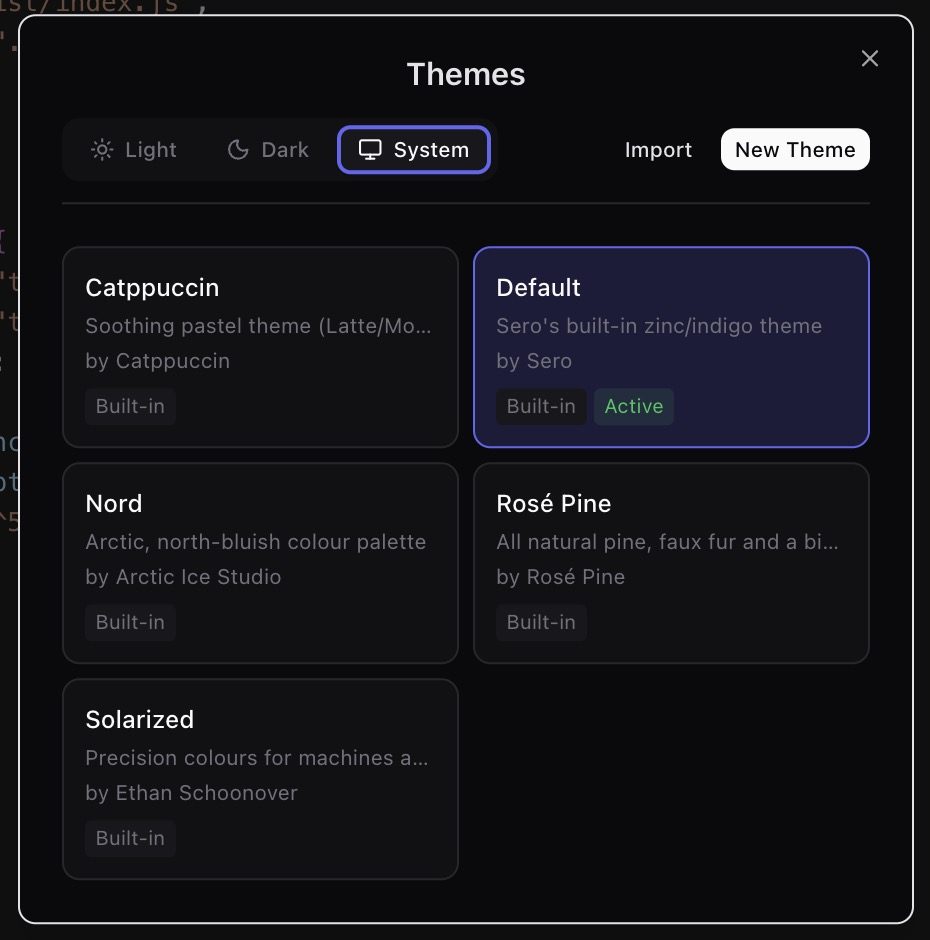
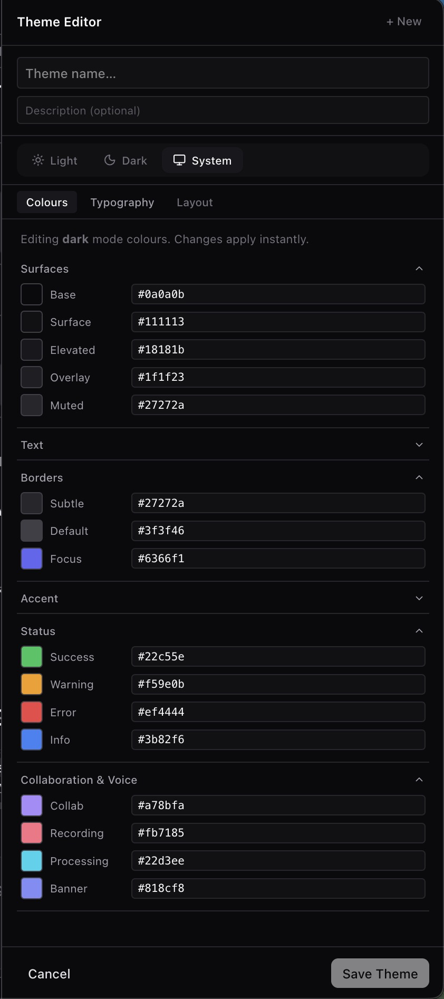
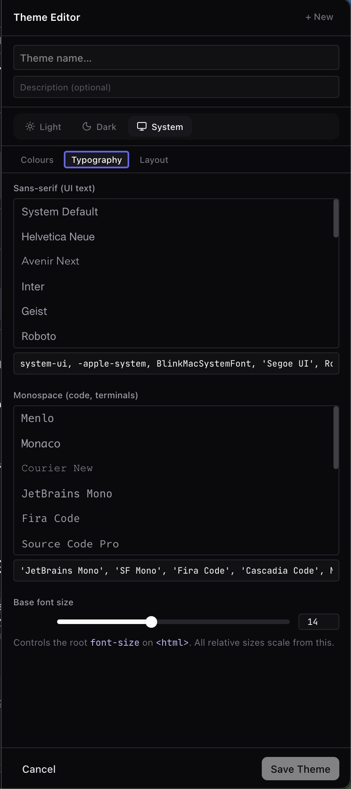
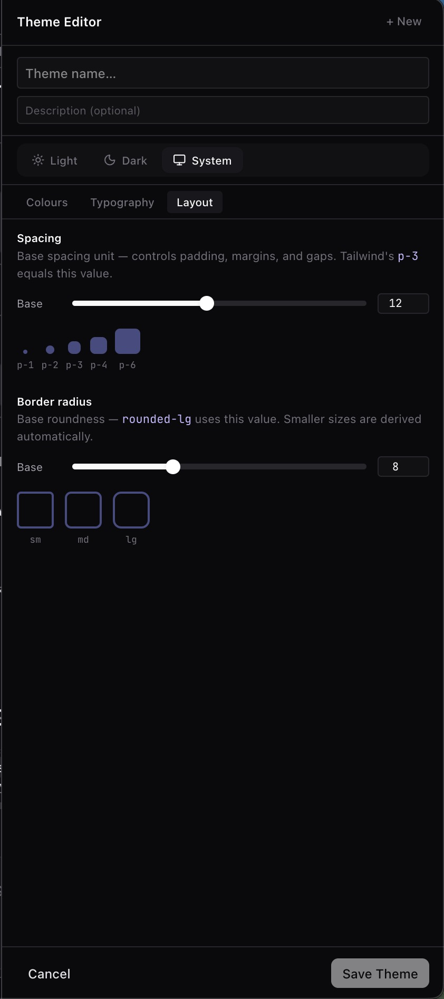

# Themes

Sero includes profile-scoped theme customization. Theme state is local profile
state and may change as the beta design system continues to evolve.

## Selecting a theme

Start with theme selection when you only need to switch between saved presets or
verify the current profile's active theme.



## Editing a theme

Use the theme editor when you need to inspect or modify the preset itself rather
than simply selecting it.



Color-token editing is useful for understanding which named values drive the
shell and plugin surfaces.



The preview area helps confirm whether a theme change reads correctly across
common UI elements before you keep it.



## Checking theme coverage

Sero has a local styleguide app for testing theme behaviour away from the main
desktop shell and plugin runtime:

```bash
pnpm styleguide
```

Use the Diagnostic Swap preset to catch token mistakes. Brand accents should use
primary or secondary brand tokens. Success, warning, error, and code colours
should only change the UI they describe.

## Related docs

- [Settings and Admin](/guide/settings-models-admin)
- [Workspace and Chat](/guide/workspace-and-chat)
- [State and Folders](/reference/state-and-folders)
