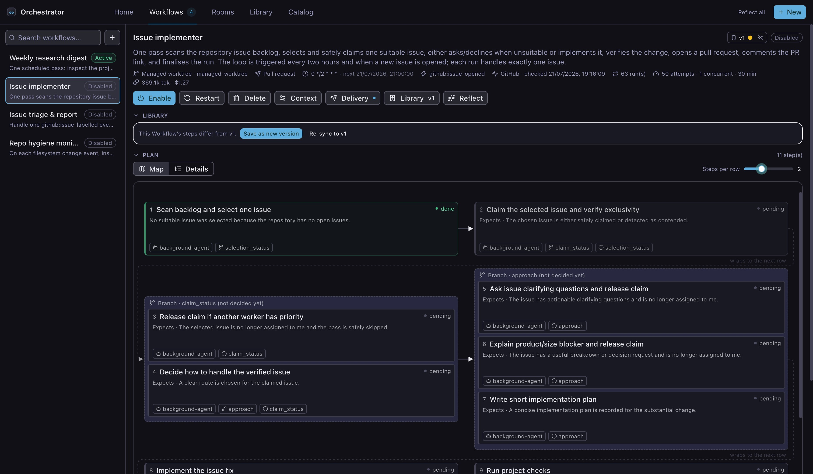
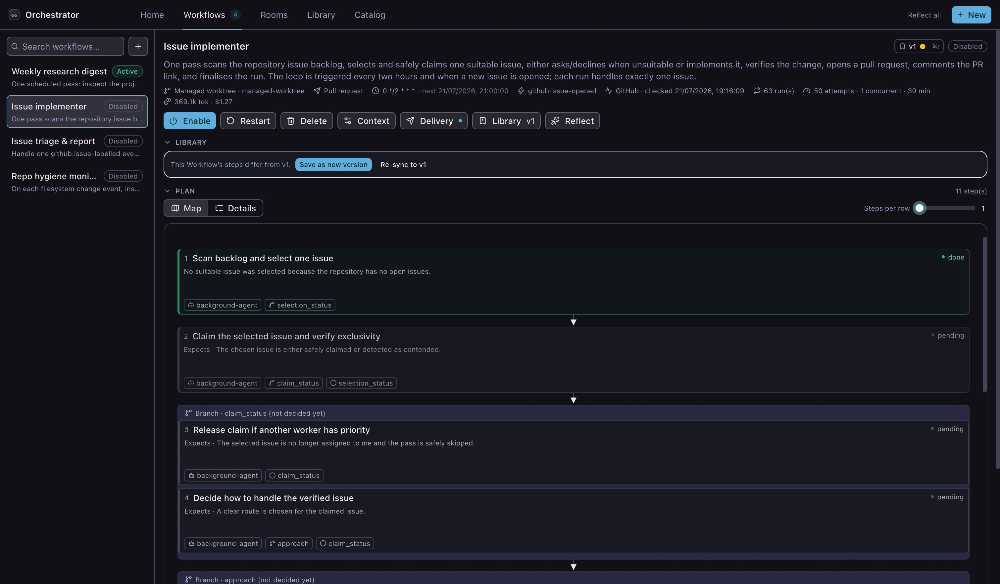
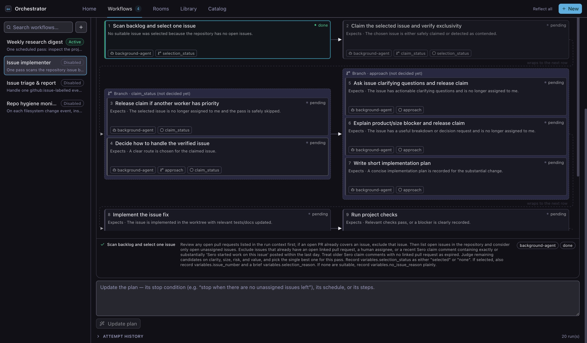
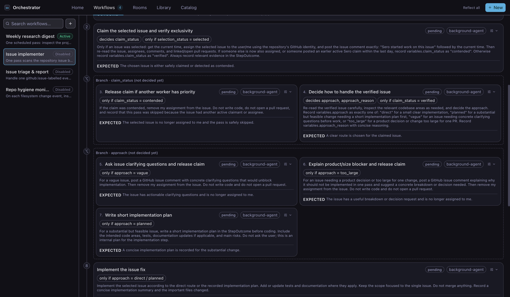
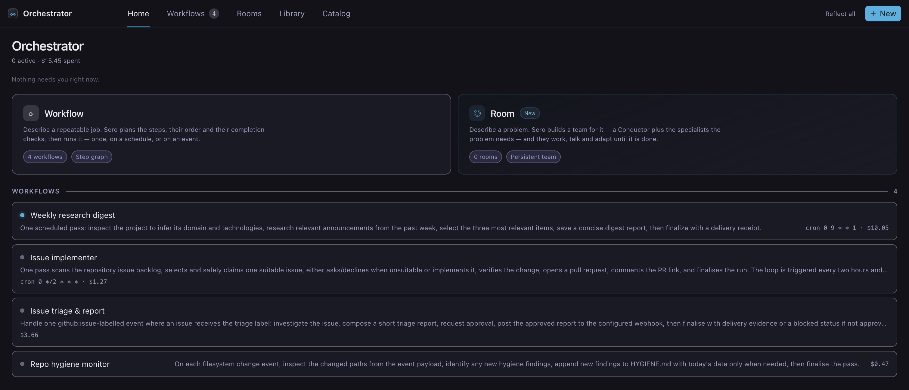

# Workflows

A Workflow turns a requirement into a plan that Sero can run more than once.
Describe the result in plain language. Sero chooses the steps, their order, and
the routes through the work.

The plan is not a fixed template. A research Workflow might collect sources in
parallel and then write a report. A maintenance Workflow might stop when there
is nothing to fix. A coding Workflow can inspect an issue, choose an approach,
run checks, and open a pull request.

Use a [Room](/guide/rooms) when several agents need to work as a team. See
[Orchestrator](/guide/orchestrator) for a comparison.

## Before you start

1. [Install and open Sero](/guide/getting-started).
2. [Configure a model](/guide/models-and-providers).
3. Open the project that the Workflow will use.
4. Install or sign in to any tool required by the result. For example, a
   Workflow that opens pull requests needs Git and an authenticated GitHub CLI.

This guide uses an issue-handling Workflow as an example. Your requirement can
describe a different job, trigger, result, or set of constraints.

## Describe the requirement

Open Orchestrator, select **Workflows**, then select **New**.

The example asks Sero to:

- check for work every two hours and when an issue opens;
- choose one suitable issue;
- ask questions, plan, or implement as the issue requires;
- run the relevant checks and open a pull request;
- handle one issue per run and never merge it.

Describe the result and the important constraints. You do not need to design the
steps yourself. Sero uses the requirement and the workspace context to write the
plan.

Select **Generate plan**.

## Review the generated plan

Sero shows the proposed Workflow before it starts any work.

Each card is one step. Arrows show which result a later step waits for. A framed
group contains steps that can run together or steps for different routes.

This example can finish after the first step when there is no suitable issue. If
it selects an issue, later results decide whether the Workflow releases a claim,
asks a question, records a plan, implements a change, or opens a pull request.
Another requirement produces a different plan.

Check that the plan can reach the result you asked for. Also check that it stops
or asks for input in the cases where it must not continue by itself.

The summary above the plan shows the workspace, delivery method, triggers, time
limit, token limit, and concurrency limit. A managed worktree keeps code changes
on a separate branch. These controls apply even when the generated plan changes.

## Change how the plan is displayed

Use **Steps per row** to trade width for overview. Sero can place one to four
dependency stages on each row. It uses fewer when the panel is too narrow.

Select a card to read its complete instructions, expected result, route, and
execution settings.

Select **Details** to read the complete plan as a list. Select **Map** to return
to the diagram. Sero keeps this choice for all Workflows and workspaces in the
current profile.

See the [Workflows reference](/reference/workflows#reading-a-plan) for the map
labels, route fields, and per-step settings.

## Refine the plan

If the plan needs a change, describe it in the box below the map. You can change
the sequence, add a route, set a limit, require approval, or change what a step
must produce.

Select **Update plan**, then review the complete plan again. Sero can change the
plan structure to satisfy the new requirement. It does not start the Workflow
while you refine it.

## Start and reuse the Workflow

Select **Activate** when the plan is correct. A Workflow can run:

- when you select **Run next**;
- on a schedule;
- when a configured event occurs.

The example combines a two-hour schedule with an issue-opened event. Each run
uses the same reviewed plan, but follows only the routes that match that run's
results.

Disable a Workflow to stop new scheduled or event-driven runs. A disabled
Workflow keeps its plan and attempt history.

## Check each run

Open a Workflow to see the latest outcome for every step. A route that the run
did not need stays pending or is marked as skipped. This example found no
suitable issue, so it stopped after the backlog scan instead of making a
meaningless change.

When a run does implement an issue, inspect the changed files, check results,
and delivery link before you accept the pull request. If a step needs a decision
or approval, Sero pauses the affected route and shows the request on **Home**.

**Attempt history** records each run, its result, duration, token use, and cost.
Use it to compare runs or investigate a failure.

**Home** shows active Workflows, recent outcomes, and requests that need your
input.

## Next steps

- [Manage Workflows](/guide/workflows-advanced) for schedules, events, recovery,
  saved Workflows, and the Catalog.
- [Workflows reference](/reference/workflows) for controls, commands, limits,
  and storage paths.
