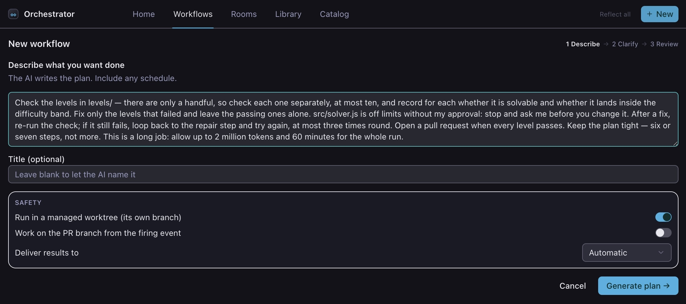
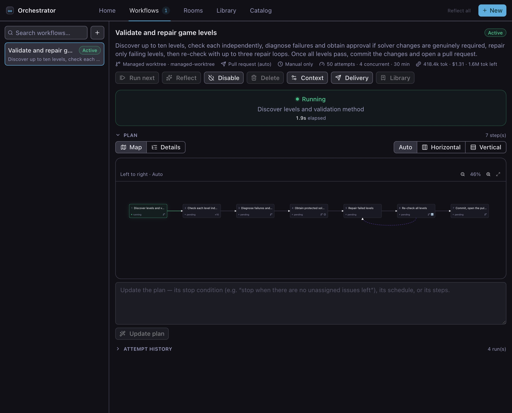
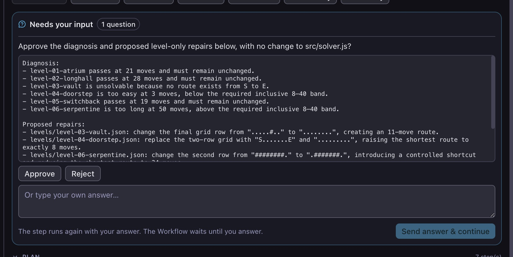
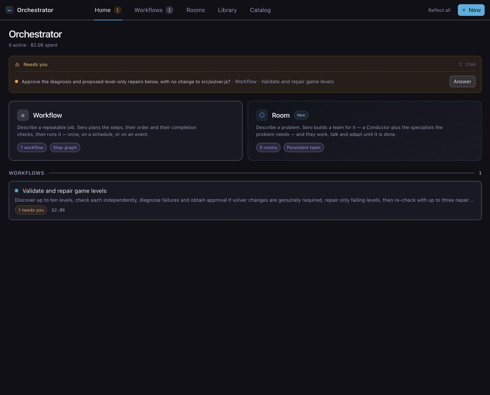
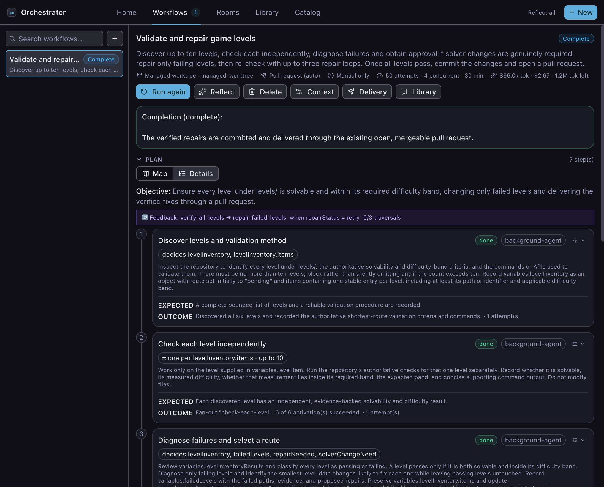

# Workflows

A Workflow gives Sero a plan to follow. You describe the result, review the
steps that Sero creates, and approve the plan before work starts.

Use a [Room](/guide/rooms) instead when several agents need to work as a team.
[Orchestrator](/guide/orchestrator) explains the difference.

## Before you start

This tutorial uses [Lattice](https://github.com/monobyte/lattice-levels-demo), a
small puzzle project with six files to check. Three contain valid puzzles and
three need repairs. A valid puzzle must have a route from its start to its exit
that takes between 8 and 40 moves.

Before you continue:

1. [Install and open Sero](/guide/getting-started).
2. [Configure a model](/guide/models-and-providers).
3. Make sure Git, Node.js, and the GitHub CLI (`gh`) are available.
4. Sign in to the GitHub CLI, then confirm the sign-in:

   ```bash
   gh auth status
   ```

Set up the project:

1. [Fork the Lattice repository](https://github.com/monobyte/lattice-levels-demo/fork)
   to your GitHub account.
2. Clone your fork. Replace `<your-name>` with your GitHub user name:

   ```bash
   git clone https://github.com/<your-name>/lattice-levels-demo.git
   ```

3. Open the cloned `lattice-levels-demo` folder as a workspace in Sero.
4. Open a terminal in the workspace and run:

   ```bash
   npm run check
   ```

The check reports three failed puzzles. This is the expected starting state.
Make sure the Git working tree has no changes before you continue.

This tutorial creates a Workflow that checks every puzzle, repairs the failed
ones, tests the repairs, and opens a pull request. It also asks for your approval
before it changes the shared solver in `src/solver.js`.

## 1. Create the Workflow

Open Orchestrator from the app bar, select **Workflows**, then select **New**.



Enter this description:

> Check each puzzle file in `levels/` separately, with a maximum of ten files.
> Record whether each puzzle has a solution and whether its shortest route is
> between 8 and 40 moves. Repair only the puzzles that fail. Do not change
> `src/solver.js` without asking for my approval first. Test each repair. If a
> repaired puzzle still fails, repair and test it again, up to three times. Open
> a pull request when all puzzles pass. Use no more than seven steps, 2 million
> tokens, or 60 minutes.

This description tells Sero to:

- check each puzzle separately;
- leave passing puzzles unchanged;
- ask before it changes `src/solver.js`;
- test each repair up to three times;
- stop after 60 minutes or 2 million tokens;
- open a pull request when all checks pass.

Keep **Run in a managed worktree** selected. A managed worktree is a separate
copy of the repository on its own branch. The Workflow changes that copy, not
the files in your open workspace.

Keep **Deliver results to** set to **Automatic**. For a Workflow that uses a
managed worktree, Automatic delivery opens a pull request.

Select **Generate plan →**.

## 2. Review the plan

Sero shows the proposed steps as a map. No work has started yet. The example
below shows Issue Implementer, a longer Workflow with several branches. Each
box is one step. An arrow means that the next step waits for the previous one.
A step with the `pending` status has not started.


For the Lattice plan that you generated, check that the plan will:

1. find the puzzle files;
2. check each puzzle;
3. identify the failed puzzles;
4. ask before changing the solver;
5. repair the failed puzzles;
6. test the repairs;
7. commit the changes and open a pull request.

The summary above the map shows where the work will happen, where Sero will send
the result, what starts the Workflow, and the time and token limits.

### Read branches and step labels

A branch groups steps that run only when an earlier step records a matching
result. In the example, one branch releases an issue that another worker has
claimed. Another branch chooses whether to ask a question, request a product
decision, write a plan, or implement the issue.

Labels at the bottom of a step show its agent and the values that it reads or
records. The status at the top right shows whether the step is pending, running,
complete, or blocked.

The map places one or more steps on each row. Use **Steps per row** to make the
cards wider or to see more of the plan at once. Sero reduces the number when the
available width is too small.

See the [Workflows reference](/reference/workflows#node-badges) for all step
labels and plan rules.

### Change the plan view

Select a step to read its full instructions and expected result.


Select **Details** to read the complete plan as a list. Select **Map** to return
Sero keeps this choice for your profile, including when you open another
workspace.


## 3. Change the plan

Use **Refine** to request any change before you start the Workflow. Describe the
change in plain language. Sero creates a revised plan for you to review.


For example:

> Ask for my approval before changing the solver.

Or:

> If a repaired puzzle still fails, return it to the repair step. Try no more
> than three times.

You can also use **Refine** to change instructions, limits, schedules, events, or
the order of the steps. Review the complete plan again after each change.

## 4. Start the Workflow

When the plan is correct, select **Activate workflow →**.



The active step is highlighted. The summary above the plan shows the time and
tokens used. Steps that do not depend on each other can run at the same time.

You can close Orchestrator while the Workflow runs. Sero notifies you when it
finishes, needs your input, or cannot continue.

## 5. Approve or reject a change

The Workflow pauses before it can change `src/solver.js`.



Read the proposed change. Select an available answer or enter your own response,
then select **Send answer**. The Workflow continues from the same point after
you answer. There is no time limit for your response.

The request also appears in the **Needs you** list on **Home**. This list shows
all Workflows that need your input.



## 6. Check the result

When all steps finish, the Workflow has the **Complete** status. Open each step
to read what it changed and the result of its checks.



Before you accept the result:

1. Open the pull request from the link in the Workflow result.
2. Confirm that only the failed puzzle files changed.
3. Confirm that `src/solver.js` did not change unless you approved it.
4. Review the check output and run `npm run check` yourself.

**Attempt history** shows each run, its duration and cost, and the steps that it
used. Use it to compare runs or investigate a failure.

**Home** groups all Workflows by their current status.


## Next steps

- [Manage Workflows](/guide/workflows-advanced) — schedules and events,
  recovery, saved Workflows, and the Catalog.
- [Workflows reference](/reference/workflows) — controls, commands, limits, and
  storage paths.
