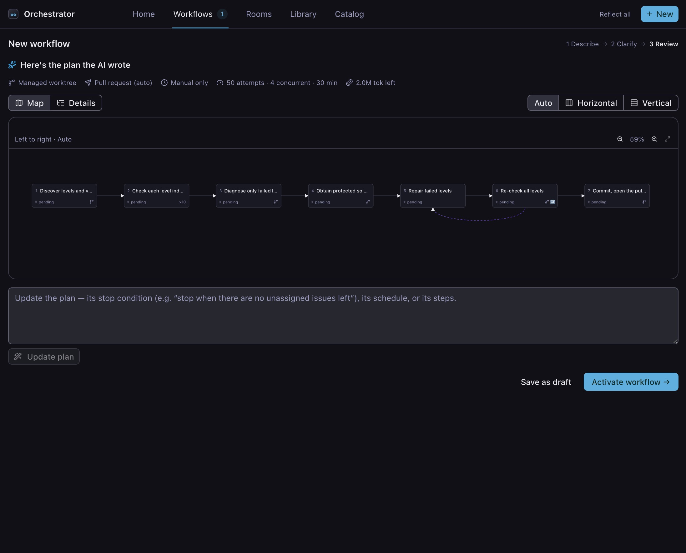
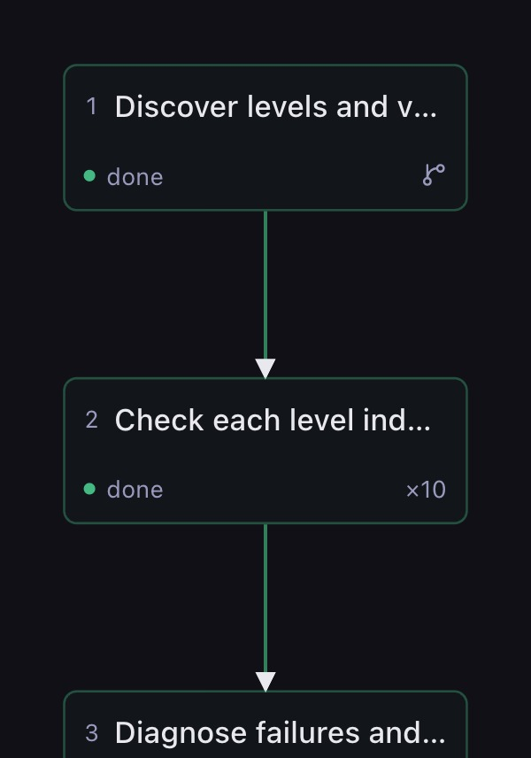
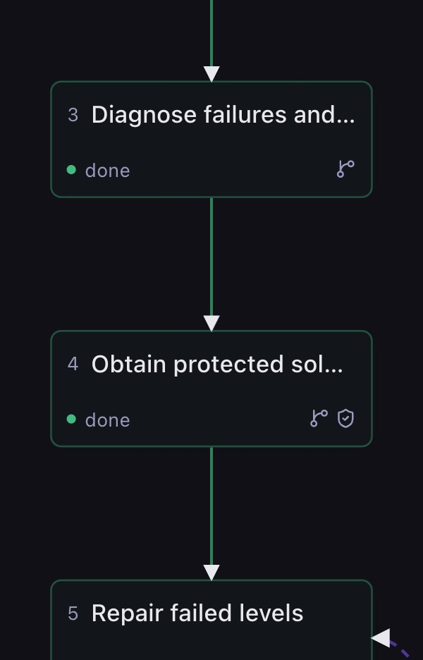
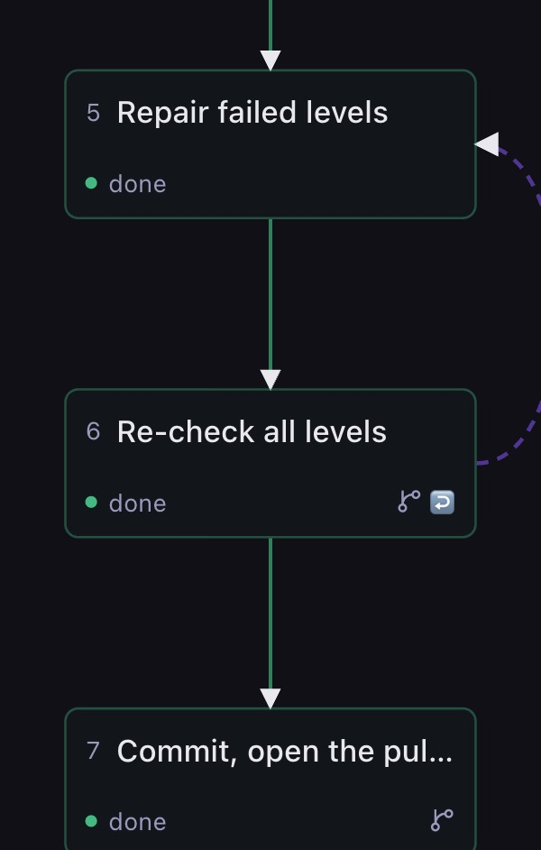
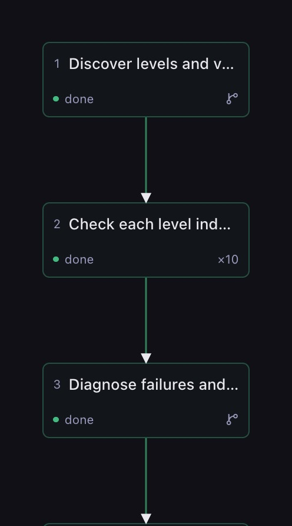
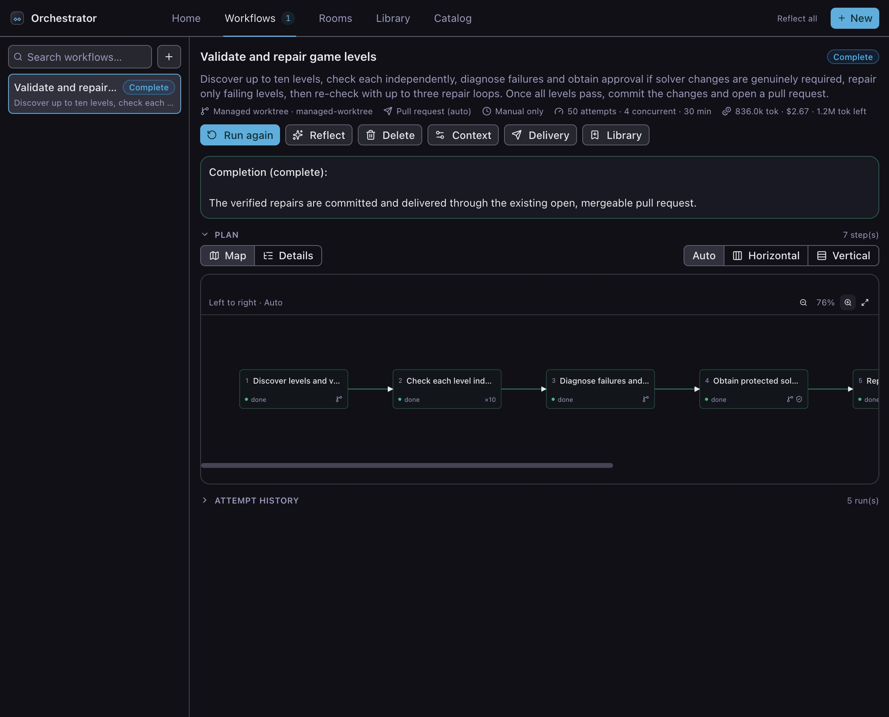

# Workflows

A Workflow is for work you can describe as a result: "check every level is
solvable and open a pull request when they all pass." You write the goal, Sero
writes the steps, and you decide whether the plan is right before anything runs.

This page follows one workflow from a sentence to an open pull request.
It uses a small demo project called Lattice — a puzzle game with a folder of
levels, a solver, and a script that checks each level can be finished. The
[setup steps](#set-up-lattice) are at the end, and the whole walkthrough takes
about ten minutes.

Use a [Room](/guide/rooms) instead when several agents need to talk to each
other while they work. [Orchestrator](/guide/orchestrator) compares the two.

Sero is in public beta. Check important results before you use or publish them.

## What you are about to build

Lattice has six levels. Three are fine. Three are broken, each for a different
reason: one cannot be solved at all, one is finished in three moves, one takes
fifty. The project's rule is that a level must be solvable and must land between
8 and 40 moves.

The workflow you write will check each level on its own, repair only the broken
ones, ask you before it touches the solver, re-check its own repairs, and open a
pull request. You will not draw any of that. You describe the result and Sero
plans the steps.

## 1. Describe the goal

Open the Orchestrator panel, select **Workflows**, and click **New**. The first
screen asks what you want done.

Type this:

> Check the levels in levels/ — there are only a handful, so check each one
> separately, at most ten, and record for each whether it is solvable and whether
> it lands inside the difficulty band. Fix only the levels that failed and leave
> the passing ones alone. src/solver.js is off limits without my approval: stop
> and ask me before you change it. After a fix, re-run the check; if it still
> fails, loop back to the repair step and try again, at most three times round.
> Open a pull request when every level passes. Keep the plan tight — six or seven
> steps, not more. This is a long job: allow up to 2 million tokens and 60
> minutes for the whole run.

Three things in that description are worth noticing, because each one becomes a
part of the plan you will see in a moment.

- "check each one separately" asks for one run per level, rather than one run
  that looks at all six.
- "stop and ask me before you change it" asks Sero to pause and wait for you.
- "allow up to 2 million tokens and 60 minutes" sets the run's limits. Sero reads
  them from this description. Left unsaid, it picks its own — and a first attempt
  at this workflow ran out of tokens halfway through the level checks.

Leave **Run in a managed worktree** on. A **worktree** is a second copy of your
repository on its own branch, so the workflow edits that copy and your own files
are never touched. Leave **Deliver results to** on **Automatic**,
which opens a pull request for a worktree workflow. Click **Generate plan →**.

## 2. Read the plan

Sero turns the sentence into steps and shows them as a map.

Each box is a **step**. Each arrow means the step at the point of the arrow waits
for the one behind it. Nothing has run yet — every step reads `pending`.

The seven steps are the shape of the sentence you wrote: discover the levels,
check each one, diagnose the failures, ask about the solver, repair, re-check,
then commit and open the pull request.

The strip above the map is the workflow's own summary: the worktree, the delivery
destination, the trigger, and the limits it will run under.

### The marks on a step

A step carries small marks that say how it behaves. They matter more than they
look, because they are the difference between a list of instructions and a plan
that can make decisions.

- The **branch mark** means the step records a decision. Step 1 records what it
  found in `levels/`; later steps read that decision and act on it.
- **×10** is a **fan-out**: the step runs once per item it finds, up to ten times.
  This is "check each one separately" — six levels, six independent checks.

- The **shield** on step 4 is an **approval gate**. The step will not start until
  you say yes. This is "ask me before you change the solver".

- The **violet dashed arrow** curving backwards is a **feedback route**, and the
  matching badge is on the step it leaves from. If the re-check finds a level
  still broken, the plan returns to the repair step and tries again. It carries a
  counter, so a loop that cannot converge stops rather than running forever —
  here, at most three times round.

One badge is missing from this plan: a **circle**, which marks a step that runs
on one route only. Sero decided it did not need one here — the repair step reads
the list of failures and does nothing when the list is empty, rather than being
routed around. The [Workflows reference](/reference/workflows) lists every badge,
including the ones this plan does not use.

### Ways to read the same plan

The map has three controls, all in the strip above it.

**Auto / Horizontal / Vertical** sets the direction. Auto chooses for you.
Vertical is the one to reach for on a narrow screen or a long plan, because a
single column stays readable however many steps there are.

**Zoom** and **Fit** are on the right, with the current percentage between them.
Fit scales the whole plan to the panel; zoom takes you closer when you want to
read a particular step.

**Click a step** to open its detail underneath the map — what the step is told to
do, and what it is expected to produce.

**Map / Details** switches the whole presentation. Details is the same plan as a
list, with every instruction in full. Use the map to see the shape and Details to
read the words.

### If a step is missing

You do not edit the plan by hand. Describe the change in the **Refine** box under
the map and Sero rewrites the steps.

"Add an approval gate before the solver is changed" and "loop back to the repair
step if the re-check still fails" are both ordinary requests. The planner is not
perfectly consistent — the same goal sometimes produces a plan without the gate —
so read the marks before you activate, and ask for whatever is missing.

## 3. Activate and watch

Click **Activate workflow →**. The workflow opens and starts working.

A running step is lit and the strip at the top counts time and tokens as they are
spent. Independent steps run at the same time where the plan allows it.

You do not have to keep the panel open. Sero notifies you when a workflow
finishes or gets stuck.

## 4. Answer the gate

The run reaches the solver step and stops.

This is the shield mark doing its job. The workflow explains what it wants to
change and waits — there is no timeout, and it waits as long as you need. Answer
with one of the offered buttons or type your own reply, then press **Send
answer**. Your answer is kept with the workflow.

The same question also appears on **Home**, in a single **Needs you** list that
gathers every workflow waiting on you, so you can clear several at once without
opening each one.

## 5. Read the result

When the last step finishes, the workflow marks itself complete. Each step
records what it actually did, not just that it ran.

For this run: levels 03, 04 and 06 were repaired, all six now pass inside the
8–40 move band, `src/solver.js` was left unchanged, and the work was delivered as
a pull request.

**Attempt history**, at the bottom, keeps every run — how long it took, what it
cost, and which steps it went through. It is the fastest way to see why one run
behaved differently from another.

Back on **Home**, all your workflows are grouped by status.

## What you have learned

You described a result, read the plan Sero wrote for it, and approved one
decision while it ran. The plan branched, ran six checks in parallel, waited for
you, and delivered a pull request — and you wrote one paragraph.

Next:

- [Workflows in practice](/guide/workflows-advanced) — schedules and event
  triggers, blocked runs, uncommitted changes, saving to the Library, and
  installing from the Catalog.
- [Workflows reference](/reference/workflows) — every command, trigger, delivery
  option, limit, and storage path.

## Set up Lattice

The walkthrough uses a throwaway project so nothing real is touched. Open an
empty folder as a workspace, start a chat, and paste this to the agent:

> Set up a small throwaway puzzle-game project in this workspace, then run
> `git init`, stage everything, and commit it. Create:
>
> - **levels/01.json** … **levels/06.json** — each a small grid puzzle with a
>   start, a goal, and some walls. Levels 01, 02 and 05 must be solvable in
>   between 8 and 40 moves. Level 03 must be impossible. Level 04 must be
>   solvable in 3 moves. Level 06 must need about 50 moves.
> - **src/solver.js** — a breadth-first solver exporting `solve(level)`, which
>   returns the shortest move list or null.
> - **scripts/check.js** — checks one level: prints whether it is solvable and
>   how many moves the solution takes, and fails if it is unsolvable or outside
>   8–40 moves.
> - **README.md** — states the rule: every level must be solvable and land
>   between 8 and 40 moves.

Three levels pass and three fail, each for a different reason. That mix is what
gives the plan something to decide.
