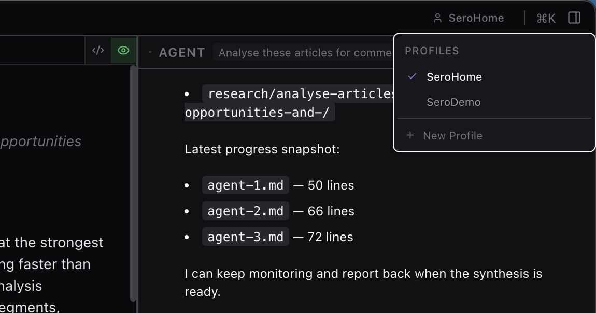
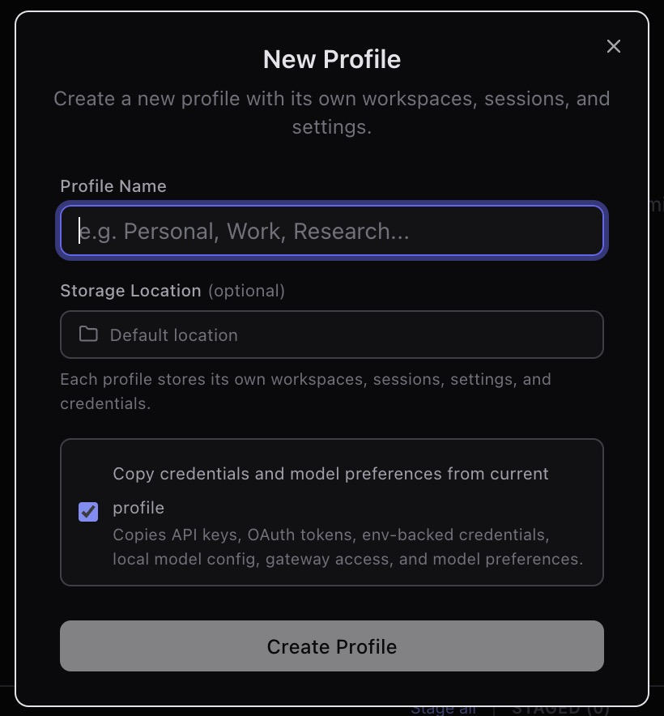
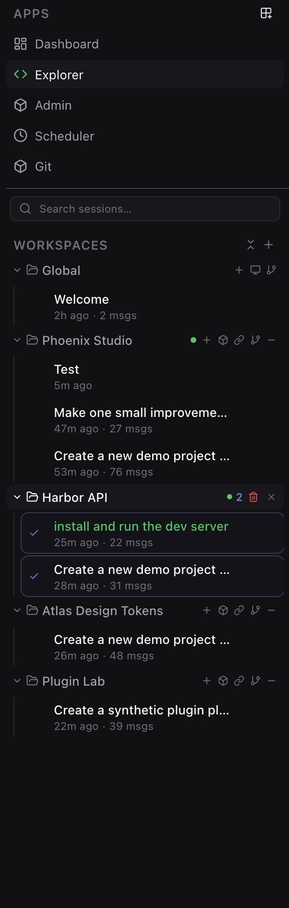
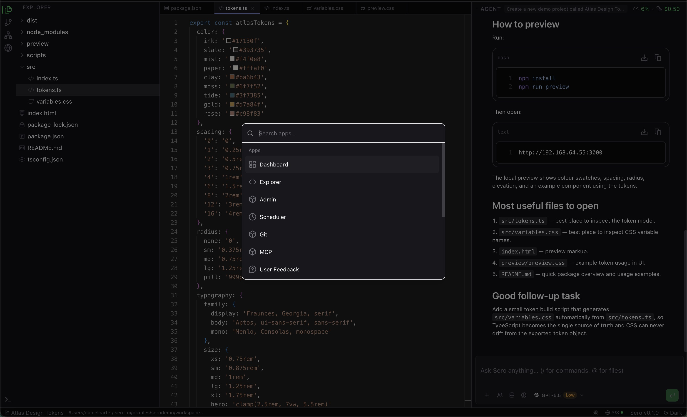

# Workspace and Chat

Sero opens into a persistent desktop workspace: a left navigation sidebar, a
central app surface, and a global chat panel that can stay available while you
move between apps.

This guide explains the basic mental model. It intentionally avoids detailed
Explorer workflows, attachment types, and slash-command catalogs because those
surfaces are still being documented and verified during alpha.

## Alpha expectations

Sero is currently a **source-only OSS alpha** for **macOS on Apple Silicon**.
The preferred runtime is Apple container-backed workspaces; host mode is a
supported fallback with reduced capabilities.

For the current support matrix, see [Support Scope](/reference/support-scope).
For the high-level implementation model, see [Architecture](/reference/architecture).

## First run and profiles

On first launch, Sero asks you to set up or choose a profile before entering the
workspace. A profile owns the local Sero home, workspace registry, app state,
layout state, and profile-scoped browser data.

Practical expectations:

- Treat each profile as its own local working environment.
- Do not put secrets in screenshots, logs, memory, or support reports.
- Exact onboarding screens may change during alpha.
- Profiles are useful separation, not a hardened multi-tenant security boundary.

## Shell regions

The desktop shell has a few stable regions:

- **Title bar** — window controls, current app context, and shell actions.
- **Main sidebar** — app switching plus workspace and session navigation.
- **Active app area** — the central surface for Dashboard, Explorer, and other
  app UIs.
- **Global chat panel** — the right-side Pi-backed agent conversation for the
  focused session.
- **Status bar** — current workspace/runtime state and related status.

The sidebar and chat panel can be collapsed. Panel sizes and open/closed state
are restored between launches for the active profile.

## Apps: Dashboard and Explorer

Sero starts with core built-in apps:

- **Dashboard** — a home surface for workspace/app summaries and widgets.
- **Explorer** — the project workspace surface for files, editors, previews,
  diffs, and terminal-related work.

Use the sidebar to switch between built-in apps and pinned or discovered apps.
Explorer is central to development workflows, but this page only covers the
workspace mental model. For file tree, editor, terminal, browser, and dev-server
surfaces, see [Explorer Workspace](/guide/explorer-workspace).

## Workspaces and sessions

Workspaces are the main organizing unit for project work. The sidebar shows
registered workspaces and the sessions that belong to them.

In the session tree you can expect to:

- return to a registered workspace
- create or resume agent sessions under that workspace
- search sessions by session name or first message
- keep project conversations separate instead of mixing all history together

The workspace registry is profile-scoped local state. It is not browser storage
and it is restored when you relaunch Sero with that profile.

## Global chat mental model

The chat panel is global to the shell, not tied to one app view. You can switch
from Dashboard to Explorer or another app while keeping the focused agent
session available on the right.

A session is the unit of agent history and lifecycle. When you select a session,
Sero opens or focuses the Pi-backed agent session, loads history when available,
and keeps new prompts associated with that session.

Useful habits:

- Create separate sessions for separate tasks.
- Resume an existing session when the history matters.
- Collapse the chat panel when you need more room for the active app.
- Keep important current context in the prompt; memory and history are helpful,
  but not a guarantee that every detail is included in every turn.

Detailed attachment behavior, model controls, prompt steering, abort states, and
slash-command catalogs are intentionally out of scope for this overview.

## Command menu

Use the command menu as a quick navigation and shell-actions palette. The
current public-safe mental model is:

- open registered apps
- connect a remote device when that workflow is enabled
- browse or adjust theme actions

On macOS, the usual shortcut is `⌘K`; on other keyboard layouts or environments
it may appear as `Ctrl+K`. Do not treat the command menu as a complete catalog
of agent slash commands or every possible action in Sero.

## Layout persistence

Sero saves shell preferences to profile-scoped local files. The restored state
can include things like:

- sidebar and chat open/closed state
- sidebar and chat panel sizes
- active app, workspace, and session
- theme-related choices
- dashboard and browser-related layout state

This is meant to make restarts feel continuous. If a layout looks wrong during
alpha, try switching apps, collapsing/reopening panels, or restarting from the
same profile before filing an issue.

## What to read next

- [Getting Started](/guide/getting-started)
- [Explorer Workspace](/guide/explorer-workspace)
- [Memory](/guide/memory)
- [Support Scope](/reference/support-scope)
- [Architecture](/reference/architecture)
