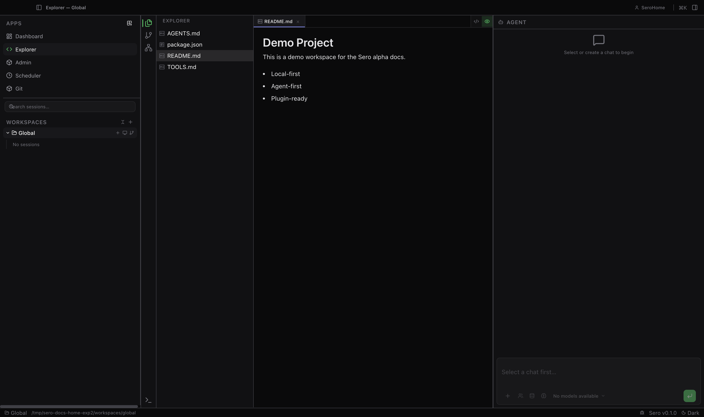
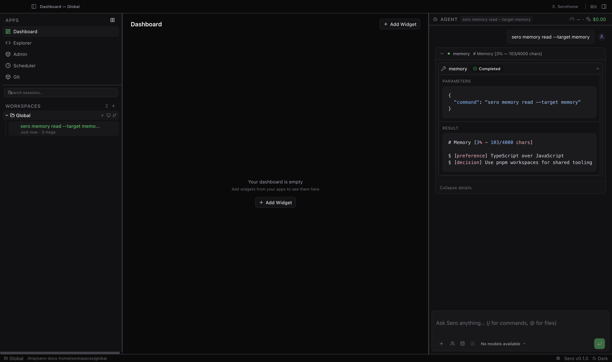

## Current alpha preview

These screenshots were captured from the current **source-only alpha** on the
maintainer-validated baseline: **macOS on Apple Silicon**.

### Desktop shell overview

*Explorer workspace in the main panel, the app/workspace sidebar on the left,
and the global agent chat on the right. See [Workspace and Chat](/guide/workspace-and-chat),
[Architecture](/reference/architecture), and [Support Scope](/reference/support-scope).*

### Example workflow

*Direct `sero memory` commands running inside a live session via the chat
panel. See [Memory](/guide/memory), [Start Here](/guide/overview), and
[Support Scope](/reference/support-scope).*

## OSS alpha status

Sero is currently a **source-only OSS alpha** for macOS, Linux, and Windows.

Current alpha posture:
- build from source
- use Apple Container or Docker-backed workspaces for the full experience when available
- choose Host explicitly on macOS/Linux when you want non-container execution; selected container runtimes fail closed when unavailable
- expect some plugin and runtime contracts to evolve during alpha

For the canonical current support contract, see
[Support Scope](/reference/support-scope).

## Start here

- [Overview](/guide/overview) — product shape, alpha scope, and first reading path.
- [Installation / Requirements](/guide/installation-requirements) — supported platforms, local dependencies, and runtime setup.
- [Profiles and Onboarding](/guide/profiles-and-onboarding) — first-run setup, profile state, and deletion caveats.
- [Models and Providers](/guide/models-and-providers) — provider auth, tiers, local models, and recovery.
- [Workspace and Chat](/guide/workspace-and-chat) — shell layout, sessions, chat, and the command menu.
- [Explorer Workspace](/guide/explorer-workspace) — files, editor, terminal, previews, and source control.
- [Agent Sessions and Context](/guide/agent-sessions-and-context) — composer controls, context, voice, steering, and queues.
- [Containers and Dev Servers](/guide/containers-dev-servers) — workspace runtime, container previews, and Host mode.
- [Plugins and Apps](/guide/plugins-and-apps) — installed apps, local development sessions, widgets, and plugin concepts.
- [Plugin Catalog](/plugins/catalog) — built-in and external/local plugins at a glance.
- [Reference](/reference/) — architecture, CLI, state, plugin authoring, evals, security, and troubleshooting.
- [Support Scope](/reference/support-scope) — current alpha support contract.
- [Contributing](https://github.com/sero-labs/sero/blob/main/CONTRIBUTING.md)
- [Security Policy](https://github.com/sero-labs/sero/blob/main/SECURITY.md)
- [Open an Issue](https://github.com/sero-labs/sero/issues/new/choose)

Use the guide pages for workflows and the reference pages for exact behavior,
state paths, plugin authoring, testing, security, troubleshooting, and known
limitations.
