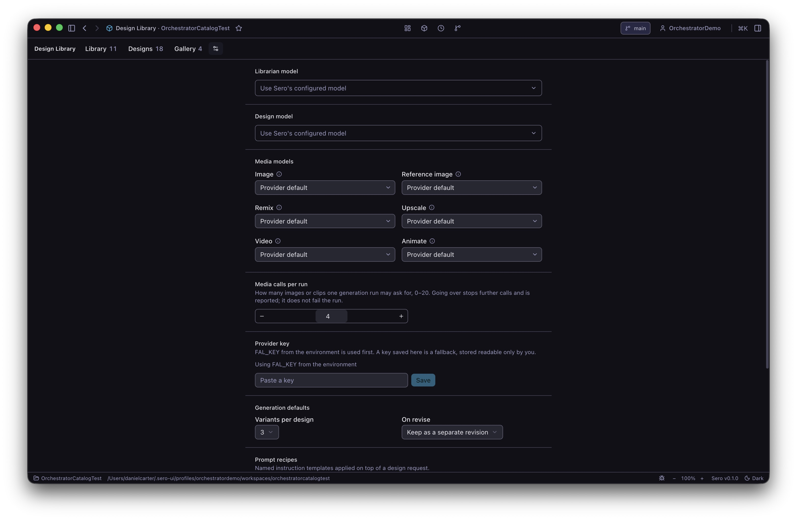
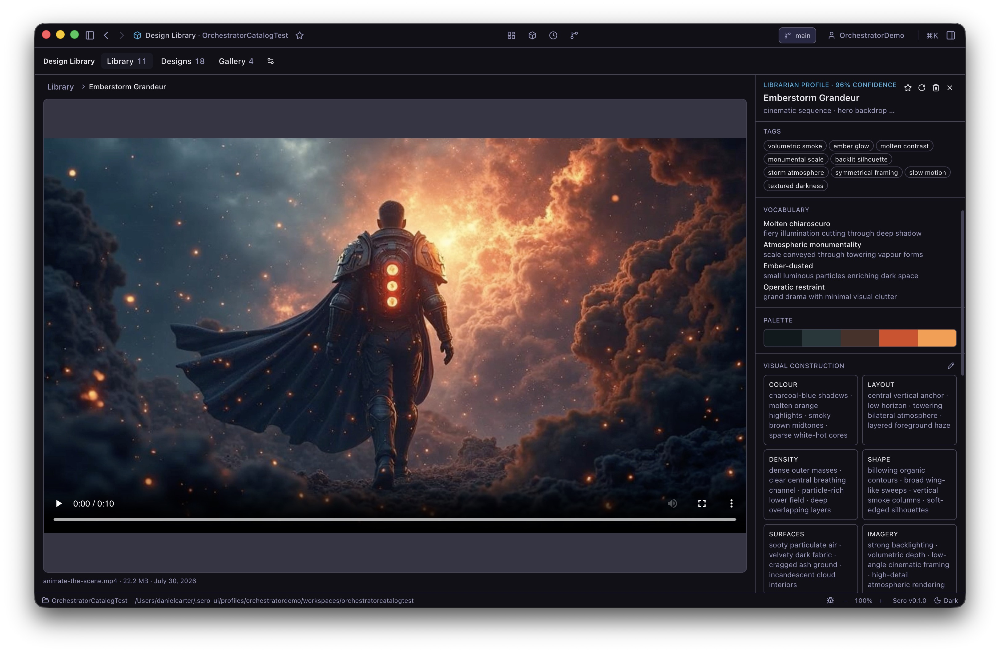
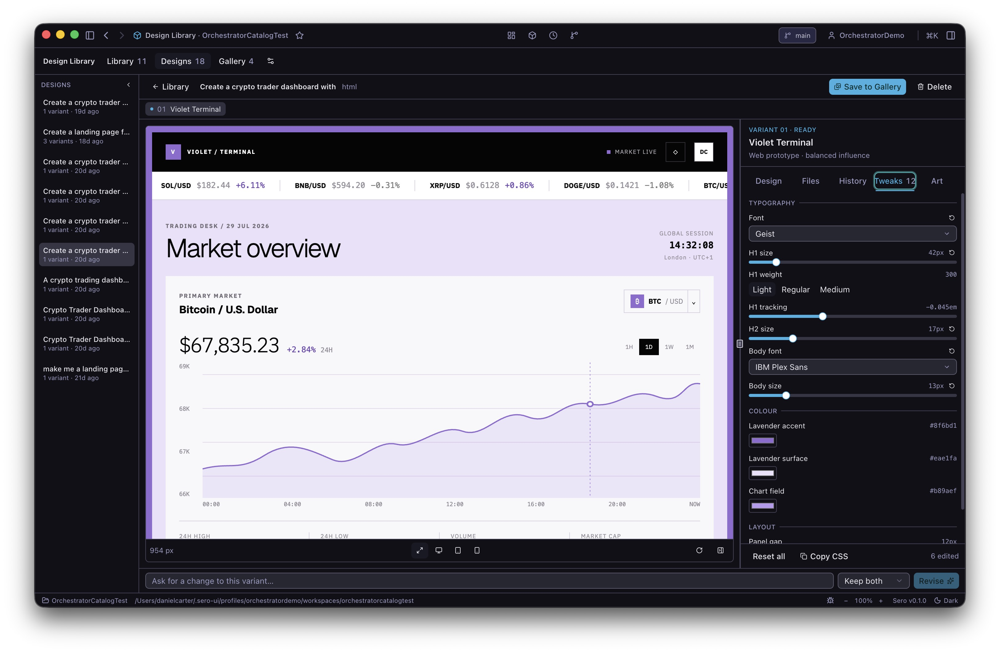

# Design Library

Design Library turns visual references into generated web designs. It keeps references, work in progress, and saved Gallery versions in the active Sero profile.

## Prepare the models

Open **Design Library**, then open **Settings**. By default, the Librarian and Design tasks use Sero's configured model. A new design creates three variants, revisions replace the visible result, and each design run can make up to four media calls.

Image and video generation uses fal.ai. Set `FAL_KEY` in the environment or save a key in **Settings**. An environment key takes priority. The plugin stores a saved key in a local `secrets.json` file with owner-only file permissions, and it does not put the key in app state.

Media generation can incur provider charges. The plugin asks for confirmation before it generates video. Check the selected model, clip length, and media-call limit before you confirm.

## Add and check a reference

In **Library**, drag in an image, paste one from the clipboard, or select **Add inspiration**. The Librarian then analyzes its visual design. Open the item and check the title, style, tags, palette, observations, and **Always** and **Never** rules.

Edit a field when the analysis is not correct. **Reset** restores the generated value for that field. **Reanalyse** updates generated fields but keeps your edits. Design Library detects a duplicate import and opens the existing item instead of adding a second copy.

The analysis request sends the image to your configured model. Do not import an image that contains a secret or private data that the model provider must not receive.

## Create a first design

1. Select up to six analyzed references. The first selected reference leads the visual direction.
2. Select **Create design**.
3. Enter a clear request and select the output target, variation mode, variant count, and inspiration strength.
4. Review **Applied guardrails**. Resolve any conflict between an **Always** rule and a **Never** rule.
5. Start generation and wait for a named variant to appear.

Each variant runs as separate work. **Stop** cancels one variant without cancelling the others. **Try again** starts a new attempt and keeps the earlier attempt in **History**.

Check the result at desktop, tablet, and phone widths. Use the **Files** tab to inspect the generated files. Use **History** to return to an earlier revision. The **Tweaks** tab changes the preview without a new model call, and **Copy CSS** copies the current tweak values.

## Preview generated work safely

The preview runs generated code in a sandboxed frame with scripts enabled and without same-origin access. The generated page cannot read Sero state, profile files, browser storage, or the workspace through the frame.

The preview policy blocks network resources and reports blocked capabilities below the frame. A generated page can still try to navigate the frame to another address. That request can leave the machine before the renderer detects it. Design Library then empties the frame and shows a warning. For this reason, do not put secrets in a design request or generated page, and do not treat the preview as a security review.

Before export, inspect the source for remote URLs, unexpected scripts, forms, and navigation. Run exported code only in an environment that matches your trust in the generated files.

## Save, export, and recover work

Select **Save to Gallery** for a revision that you want to keep. Each save makes an immutable Gallery version with its own source, assets, references, guardrails, and preview. Deleting the source design or a Library reference does not change that saved version.

From a Gallery card, use **Export to Downloads** or **Export to workspace**. A workspace export uses a managed folder at the active workspace root. A later export of the same design replaces that managed export, but it does not replace an unrelated folder with the same name.

Deleting a Library reference or Gallery version moves it to the applicable Trash view. Restore it there, or delete it permanently. A design revision remains in **History** when **Replace it** was selected, so you can return to it. If generation was interrupted, reopen the design and use **Try again** on the failed or recoverable item instead of deleting the design.

Design Library stores its data under `<SERO_HOME>/apps/design-library/`. Important locations include:

- `state.json` for app settings and view state;
- `items/` for references and analysis;
- `designs/` for designs, revisions, and design assets;
- `gallery/` for saved Gallery families and versions;
- `jobs/` and `exports/` for background job and export records;
- `secrets.json` for a saved fal.ai key.

The manifest also declares `.sero/apps/design-library/state.json` as the host app state file. Generated media is downloaded into the profile. There is no cloud backup managed by Design Library, so back up the profile before you delete it.

## Work from Chat

The manifest bridges six tools to the main Sero agent:

| Tool | Use |
| --- | --- |
| `design_library_items` | Search and manage references. |
| `design_library_analysis` | Check, start, cancel, or retry analysis. |
| `design_library_designs` | Create, inspect, revise, and recover designs. |
| `design_library_media` | Generate and manage design media. |
| `design_library_gallery` | Manage saved versions and Gallery Trash. |
| `design_library_export` | Export a saved Gallery version and check progress. |

The extension also registers asset and settings tools for the plugin UI, but the manifest does not bridge those tools to the main agent. Change provider keys and defaults in **Settings**.

## Related docs

- [Plugin Catalog](/plugins/catalog)
- [Models and Providers](/guide/models-and-providers)
- [State and Folders](/reference/state-and-folders)
- [Security / Privacy](/reference/security-privacy)
