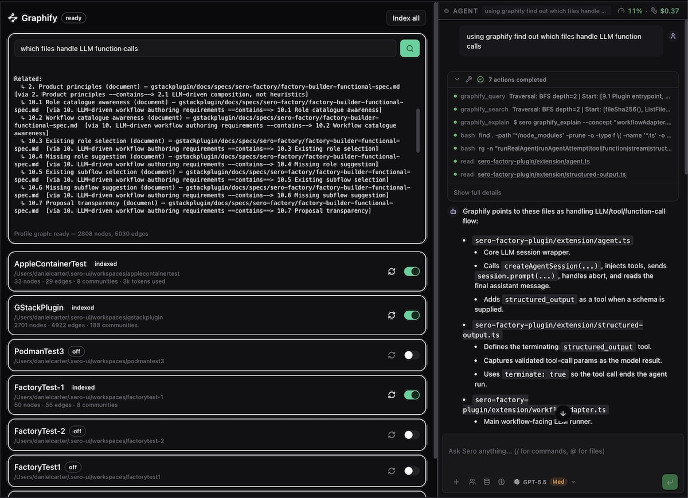

# Graphify

Graphify builds a local knowledge graph for selected workspaces. It also merges those graphs so that you and the agent can search across projects.

## What it costs

Only the first build of a workspace, and each rebuild, use the AI model. Everything else is local and free: incremental updates, the profile merge, and every search.

Graphify does not spend on a default. Before the first build you must select a backend and a model in the Graphify panel. While no model is selected, Graphify indexes nothing.

Before each paid build, Graphify counts the files and bytes it will read, estimates the cost for your model, and asks you to approve it. If Sero has no price for your model, the panel shows **cost unknown** and always asks. It never shows a guess.

These limits stop a build, and Sero shows the reason:

| Limit | Default |
| --- | --- |
| Maximum cost for one build | $2 |
| Maximum cost for one day | $10 |
| Maximum files in one workspace | 5000 |

The **Spent today** line shows the total against the daily limit. Use **Pause** to stop all paid work.

## Choose a backend and model

1. Open **Graphify**.
2. Select a backend. **Claude Code subscription** uses your Claude Code plan instead of API credit.
3. Select or type a model. The list shows the models Sero knows. You can type any model name.
4. Select **Use this model**.

Sero sends this model to both AI steps. If you select the Claude Code subscription, always set a model: that backend uses Opus when you do not.

## Index your first workspace

When you create a workspace, **Enable Graphify indexing** is off. Turn it on only if the code can go to your selected provider.

For an existing workspace:

1. Open **Graphify**.
2. Turn on the switch for the workspace.
3. Approve the estimate.
4. Wait until the workspace status is **indexed**.
5. Enter a question in **Search across all indexed workspaces…** and select the search button.

**Index all** enables every workspace and asks before each paid build.

Graphify does not index the global workspace, which holds your memory files. That content is dense text and costs much more than its file count shows.

Graphify installs its Python tools in Sero's shared machine tool area. It does not install them in the active profile.

## Check and update the graph

Each workspace card shows its state and, after a build, the cost, the node and edge counts, the token use, the model, and the Graphify version. Use the **Rebuild** icon to pay for a new build after you change the model or when a graph is not correct.

Graphify queues a free AST update after an agent edits files in an enabled workspace. It also runs an update when Sero starts, so it can include changes made while Sero was closed. These updates do not use the AI model.

A restart never starts a paid build. A workspace with no graph shows **not built** and waits for you. A workspace whose build failed shows **error** with the reason and a **Try again** button. Graphify does not repeat a failed build on its own.

Turning off a workspace stops its updates but keeps its graph files. Turning the workspace on again costs nothing, because the graph is still there. If you remove the workspace from the profile, Graphify removes its graph files, records what the build cost, and rebuilds the profile graph.

## Update the Graphify tool

The panel shows the installed Graphify version. When a newer version is available, the panel offers an update.

An update is always your decision. A new version invalidates the cached extractions, so the next build of each workspace costs the full price again. Graphify does not rebuild any workspace after an update until you ask.

## Ask the agent about code

The agent can use these tools:

| Tool | Use |
| --- | --- |
| `graphify_search` | Search the merged profile graph. |
| `graphify_query` | Search the current workspace graph, with fallback to the profile graph. |
| `graphify_path` | Find the shortest connection between two concepts. |
| `graphify_explain` | Show the connections for one concept. |
| `graphify_status` | Show provisioning, graph, and workspace states. |
| `graphify_index` | Enable, disable, rebuild, refresh, synchronize indexing, or update the tool. |

The agent can ask for a workspace to be indexed, but it cannot select a directory: it names a workspace, and Sero checks that name against its own workspace list. A build that Sero cannot confirm does not run.

For example, ask, `What calls the authentication module?` Then check the file paths and relationships in the result against the source. A graph can be out of date while an update is queued or after a failed build.

Graphify can also add graph context to an agent session. Session orientation and search-result augmentation are on by default. Automatic query augmentation is off by default.

## Storage and recovery

Graphify stores profile data under `<SERO_HOME>/apps/graphify/`:

- `state.json` contains settings, workspace state, the day's spend record, and queued requests.
- `graphs/<workspace-id>/graphify-out/` contains each workspace graph.
- `profile/graph.json` contains the merged graph.

The app manifest also declares `.sero/apps/graphify/state.json` as its host state file. Do not edit either state file while Sero is running.

When you create a profile with **Copy credentials and model preferences**, the new profile keeps your Graphify settings — the model and the limits. It does not copy the workspace list or the build history, so the new profile indexes nothing until you ask.

If indexing fails, read the error on the workspace card. Confirm that the selected backend has valid credentials, then select **Try again**. If provisioning fails, the Graphify header shows **failed** and the panel shows the provisioning error. Do not delete the graph folders as a first recovery step because **Rebuild** replaces the affected graph safely.

## Related docs

- [Plugin Catalog](/plugins/catalog)
- [Agent Sessions and Context](/guide/agent-sessions-and-context)
- [Models and Providers](/guide/models-and-providers)
- [State and Folders](/reference/state-and-folders)
- [Security / Privacy](/reference/security-privacy)
