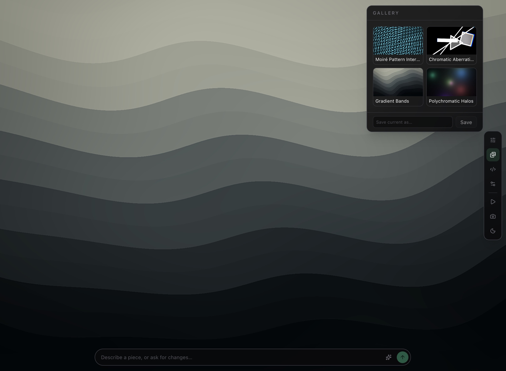
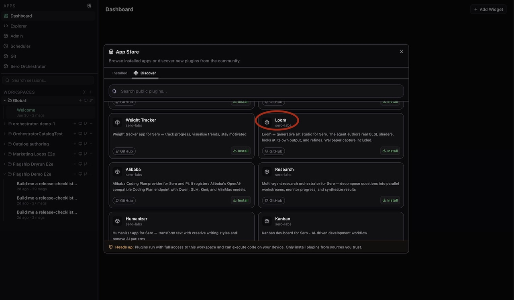
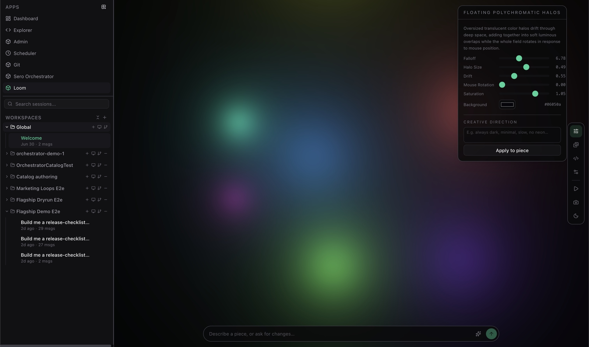

# Loom

> Status: **external plugin**. Loom does not ship with Sero. Its source is maintained in [the Loom repository](https://github.com/sero-labs/sero-loom-plugin).

Loom is an infinite generative-art studio where you describe an idea and Sero creates a living shader artwork. It can inspect the rendered result, make a refinement when needed, and give the finished piece a small set of controls that suit that particular artwork.

## Install from the App Store (recommended)

The default way to install Loom is through Sero's **App Store**. The App Store
finds Loom on GitHub and installs the plugin directly from its repository.

1. Open the **App Store** from Sero's sidebar.
2. Select **Discover**, then search for `Loom`.
3. Choose the Loom result from GitHub and select **Install**.
4. Reopen the App Store's **Installed** tab to open Loom, or favourite Loom so it
   stays in the sidebar.

Review the [Loom repository](https://github.com/sero-labs/sero-loom-plugin)
before installing it. Sero builds source plugins locally during installation,
and the host must support Loom's required agent-tool capability.

### Manual source install

Use **Admin → Plugins** only when the App Store is unavailable or you are
developing the plugin. Under **Installed plugins**, paste this trusted source:

`git:https://github.com/sero-labs/sero-loom-plugin.git`

Select **Install plugin**, then open Loom from the App Store or add it to your
favourites.

## Make a piece

Open Loom, then describe the work you want in the prompt bar. Start with a clear visual brief, for example:

> A slow, inky midnight ocean. Sparse silver moonlight, gentle swells, and no neon.

Loom asks the agent to compose real GLSL shaders, render the result, and check the image. The agent may revise a broken or clearly off-brief first pass. Each piece can expose a few controls, such as colour, motion, intensity, or composition, that update live without rebuilding the shader.

Use the floating rail to:

- open **Controls** and set the piece's creative direction;
- save, reload, or riff on work in the **Gallery**;
- inspect or carefully edit the multi-pass GLSL in **Code**;
- pause the artwork, enter ambient mode, or capture a wallpaper.

The code view is best for power users. For normal use, describe the change you want and let Loom handle the shader work.

## Gallery and wallpaper capture

Save a piece to the gallery when you want to revisit it. **Riff** uses a saved piece as the starting point for a new direction rather than overwriting the original.

The capture action renders a fresh PNG at the selected display, 1080p, 1440p, 4K, or custom resolution. You can also save the piece JSON beside the image, which makes it easier to recreate or adjust the result later.

## Requirements and limits

- Loom needs a WebGL2-capable desktop environment.
- It uses real GLSL fragment shaders, including optional multi-pass and feedback effects. Compilation errors are shown in the Code panel; the last working piece stays visible.
- Loom adapts rendering resolution when a piece is too expensive and reverts a piece that repeatedly loses the GPU context.
- The agent can generate shaders and inspect rendered frames, so do not put private information in a prompt or artwork brief unless you are comfortable with your configured AI provider handling it.

Loom's state is global to the active Sero profile, under `<SERO_HOME>/apps/loom/state.json`. Saved wallpapers and JSON sidecars are local files you choose to create; remove them separately if you no longer want them.

## Example prompts

- `A study of rain on a dark window: soft bokeh, slow rivulets, muted amber streetlights.`
- `A restrained desert horizon at blue hour. One pale sun, wind-blown haze, minimal movement.`
- `Turn this into a colder, more spacious version with half the detail and a single icy-blue accent.`
- `Make a 4K wallpaper from the current piece and save its piece JSON too.`

## Related docs

- [Loom source repository](https://github.com/sero-labs/sero-loom-plugin)
- [Plugin Catalog](/plugins/catalog)
- [Plugins and Apps](/guide/plugins-and-apps)
- [App Store, Favorites, and Installed Plugins](/guide/app-store-favorites)
- [Security / Privacy](/reference/security-privacy)
