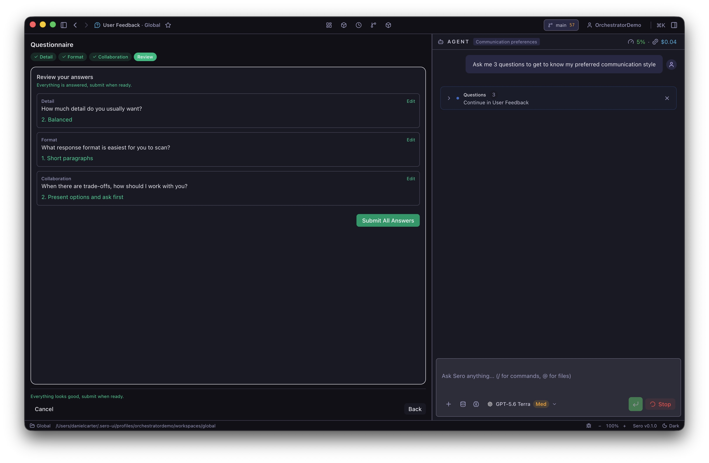

# User Feedback

User Feedback lets an agent stop and ask for a decision. It provides a compact Chat question, a step-by-step questionnaire, and an open-ended interview.

You do not install or configure this built-in plugin. Its tools are available to agent sessions, but the manifest sets `bridgeTools` to `false`. Other plugin apps cannot call them through the app tool bridge.

## Answer a Chat question

A single `question` appears in Chat. Select one of the choices, or use the custom answer control to enter your own response. Your answer returns to the waiting tool call, and the agent can continue.

Read the complete question before you answer. If it asks for an irreversible change, choose a safe option or enter a narrower instruction. Closing the card cancels the question; it does not approve a default choice.

## Complete a questionnaire

Questionnaires appear in the **User Feedback** app, not in the Chat question card.

1. Open **User Feedback** when the agent says that a questionnaire is ready.
2. Select an answer for the first step. Some choices can open a nested question.
3. Use **Next**, **Back**, or the named step buttons to move through the form.
4. Use **Skip** when you do not want to answer a question.
5. On **Review**, inspect each answer. Select **Edit** to return to a step.
6. Select **Submit All Answers**.

A questionnaire can use single-choice or multi-select questions. It can also allow a custom text answer. You can submit partial answers, but you must answer at least one question. Select **Cancel** to return a cancelled result to the agent.

The app keeps multiple pending questionnaires and interviews in arrival order. After you submit or cancel the first form, it shows the next one.



## Use an interview for a specification

An interview shows all open-ended questions on one page. Enter one or more answers, then select **Submit**. You can leave questions empty. The agent can use your answers to ask another set of questions.

To start the built-in specification flow, enter this command in Chat:

```text
/interview <output-path>
```

Use a path in the active workspace, for example `/interview docs/checkout-spec.md`. The command asks the agent to continue the interview and write the final specification to that path. Review the generated file before you use it as an implementation plan.

## Pending questions and recovery

Pending questions are held in Sero's main process for up to 10 minutes. They are not durable across a Sero restart. If a form disappears before you answer it, ask the agent to send it again.

The profile state file `.sero/apps/userfeedback/state.json` records only the last activity time after a submitted questionnaire or interview. It does not store the question text or your answers. The active agent session receives the answers as the tool result and can retain them in its session history.

If the **User Feedback** app shows its idle screen while an agent waits, return to Chat for a single question. For a questionnaire or interview, reopen the app. If it is still empty, cancel the waiting tool call and ask the agent to repeat the questions.

Answers can contain private project decisions. Remove private text before you share a session transcript or screenshot.

## Related docs

- [Agent Sessions and Context](/guide/agent-sessions-and-context)
- [Plugins and Apps](/guide/plugins-and-apps)
- [State and Folders](/reference/state-and-folders)
- [Security / Privacy](/reference/security-privacy)
