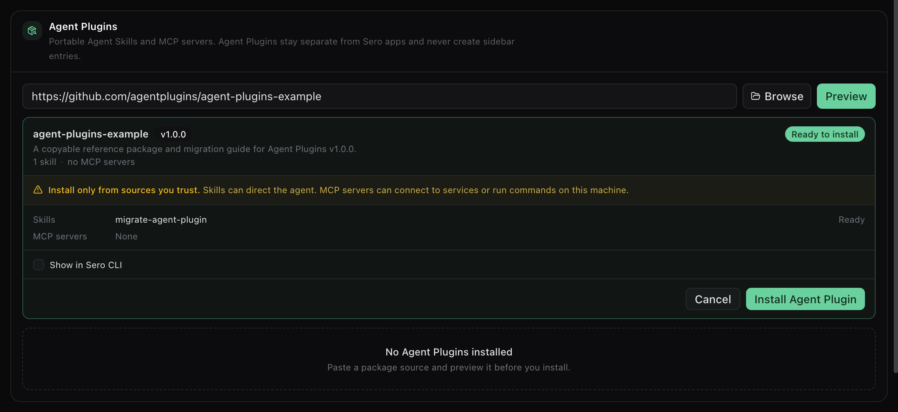
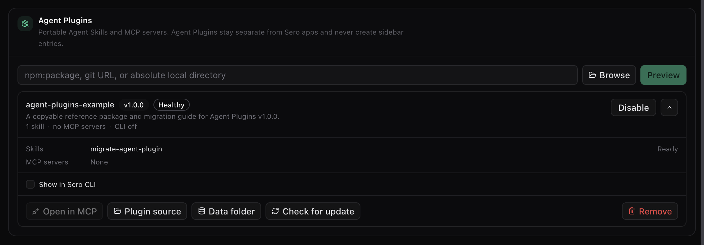
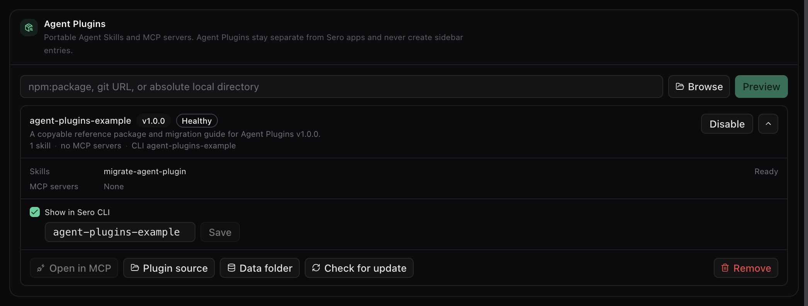
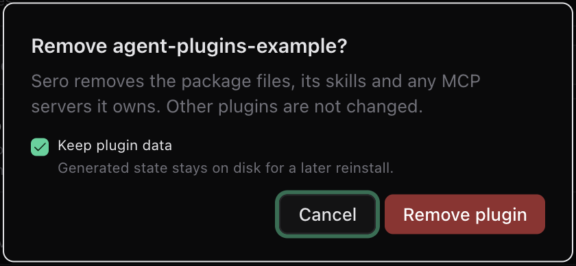

Agent Plugins are portable packages defined by
[agent-plugins.org](https://agent-plugins.org/). They are separate from Sero
plugins and do not create Sero apps or sidebar entries.

An Agent Plugin can provide:

- Agent Skills from immediate child directories under `skills/`
- stdio, Streamable HTTP, or legacy SSE servers from `mcp.json`
- optional Sero CLI access, disabled by default

## Preview before you install

Open **Admin > Plugins > Agent Plugins**. Enter an npm source, Git URL, or
absolute local directory, then select **Preview**. Npm sources accept registry
package names with an optional version or tag. Git sources accept HTTPS, SSH,
and Git URLs.

The preview lists each skill and MCP server by name. Beside each MCP server it
shows the exact local command or remote URL, and it shows why a component was
skipped. Approve only definitions that you trust: no MCP server can start
before you approve it. Sero stops the installation if the package content
changes after the preview.

## Manage an installed plugin

The installed card shows the plugin state, its components, and the actions for
the package. Select the arrow to open the details.

- **Open in MCP** goes to the servers this plugin owns.
- **Plugin source** and **Data folder** open the two directories on disk.
- **Check for update** compares the source with the installed content and lists
  the changes. An update that changes an MCP definition needs new approval.
- **Disable** stops the skills and MCP servers but keeps the package.

The MCP app labels managed servers with their owning Agent Plugin. Managed
definitions do not appear in the raw user MCP config. MCP stores its own
enable and authentication state against the stable installation and server
identity.

## Show a plugin in the Sero CLI

CLI access is off by default. Select **Show in Sero CLI** to turn it on. Sero
takes the namespace from the package name. To use a different one, type it in
the field and select **Save**.

CLI skill commands use `<namespace>/<skill-name>`. Discovered MCP tools use
`<namespace>/<server-name>/<tool-name>`. Sero maps safe object schemas to CLI
arguments and uses an explicit JSON object for other schemas. These commands
use the active Sero agent and existing MCP runtime.

## Storage and removal

Sero keeps installed package content separate from writable `PLUGIN_DATA`.
Data survives an update. When you remove a plugin, you choose to keep or delete
that data.

Container workspaces mount installed Agent Plugin packages read-only at the
same absolute path. Restart an existing workspace container after the first
Agent Plugin installation so this mount is present.
