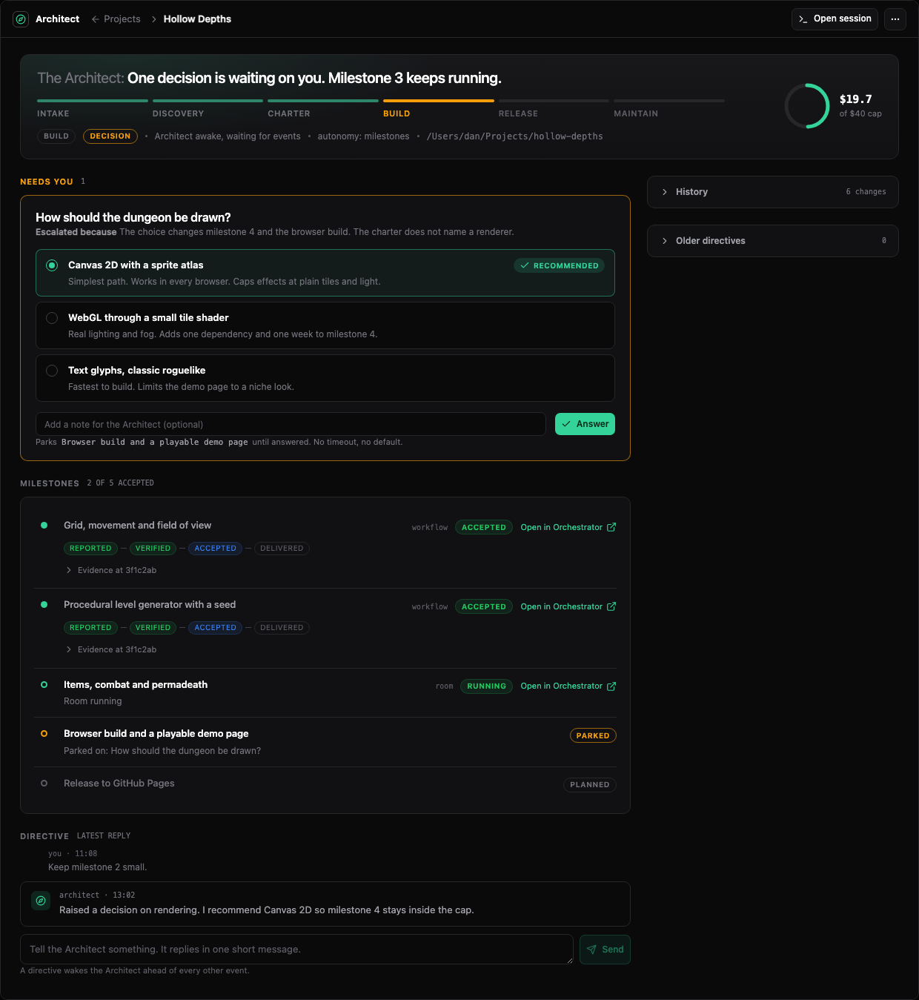
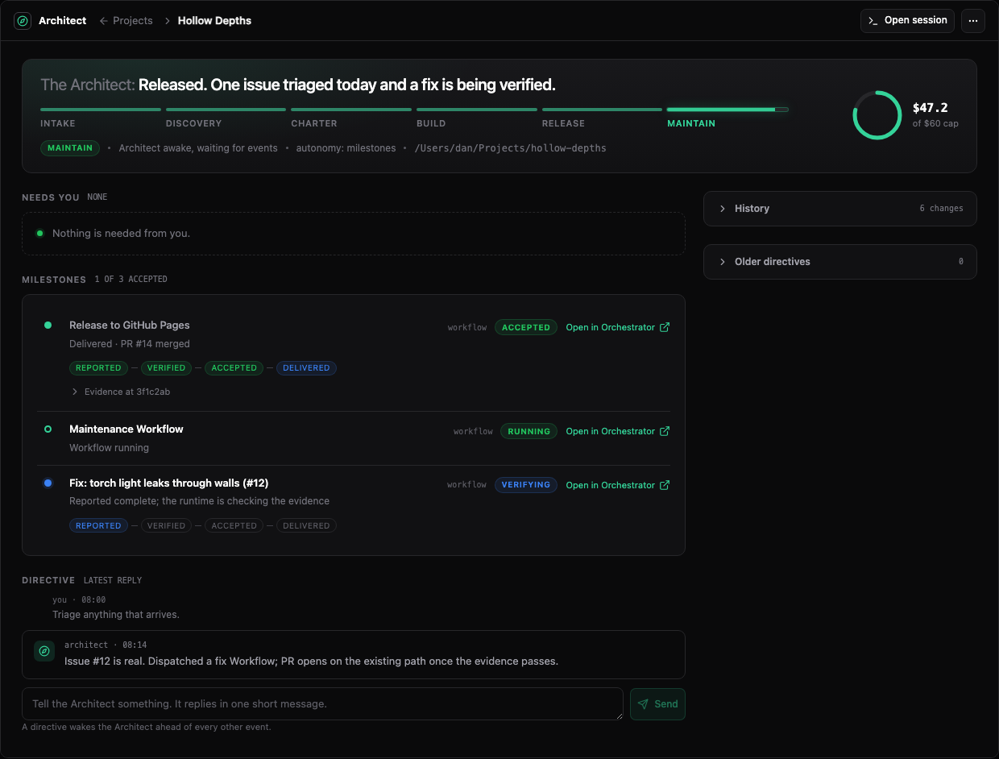

# Architect reference

This page lists runtime facts for Sero Architect. See
[Architect](/guide/architect) for the user guide.

## Availability

Architect is the built-in `@sero-ai/plugin-architect` plugin. It has global
scope, so each profile has one project list. It requires persistent agent
sessions, the Orchestrator plugin, and the host capabilities
`appAgent.invokeTool`, `tool.cli`, `appRuntime.background` and
`appRuntime.workspaceCreate`.

`SERO_ARCHITECT_MODEL` names the owner's model as `provider/model`, with an
optional `:thinking` suffix. Without it, the owner uses the **MED** tier: the
project default when you set one, otherwise the global selection in Admin. A
tier never falls back to another provider. An unavailable model or an
unsupported thinking level is refused, and the reason is reported.

## Terms

| Term | Meaning |
| --- | --- |
| Project | one idea, its folder, workspace, owner session, charter, milestones, decisions, directives, budget and history |
| Owner | the persistent agent session for one project; the runtime runs it on the project's behalf |
| Charter | the brief, milestone list, cost cap and autonomy setting proposed after discovery and approved by you; only the deprecated charter flow uses it |
| Milestone | one unit of work, dispatched as a Workflow or a Room or done by the owner itself, and closed only on evidence |
| Decision | a question raised to you with options, consequences, a recommendation and a reason |
| Directive | a message from you to the owner; it replies once |
| Evidence | command results and a diff summary recorded by the runtime at a named commit; preview milestones also include a capture |
| Wake | one turn of the owner session, started by the runtime for an event |

## Phases and overlays

Phases, in order: `intake`, `discovery`, `charter`, `build`, `release`,
`maintain`. A project never moves back.

Overlays: `decision`, `blocked`, `paused`, `limited`. An overlay is derived on
every write from the record's flags and is never set by hand.

## Milestone statuses

| Status | Meaning |
| --- | --- |
| `planned` | on the charter, no plan approved yet |
| `approved` | the plan is approved; the owner may dispatch it |
| `running` | a Workflow, a Room or the owner is running it |
| `verifying` | the work reported completion; the runtime is checking the evidence |
| `done` | accepted on verified evidence |
| `parked` | waiting on an open decision; returns to its previous status when answered |

Verification states on a milestone: `reported`, `verified`, `accepted`,
`delivered`. A lower state never stands in for a higher one.

## Wake sources

The runtime wakes the owner for these events, highest priority first:

| Kind | Cause |
| --- | --- |
| `directive` | you sent a directive |
| `decision` | you answered a decision, approved a charter or plan, or raised the cap |
| `dispatch-blocked` | a Workflow or Room needs input or stopped |
| `dispatch-complete` | a Workflow or Room finished and the evidence check ran |
| `external-event` | the maintenance Workflow ran for an issue, a CI failure or its schedule |
| `wait` | work the owner waited for ended, failed or passed its deadline; see [Waits](#waits) |
| `continue` | the owner asked for another turn on a milestone it does itself |
| `quiet` | the project was created, research finished, or planned work remains |

One wake runs at a time. Wakes of the same kind merge. Ordinary work does not
wake the owner while the project is paused, limited, blocked or stopped.
Directives and decision responses can still wake it. Every wake ends with one
of `sleep`, `decide`, `blocked`, `work --operation continue` or
`work --operation wait`; three turns in a row with no outcome
block the project.

## Owner tool

The owner reaches the runtime through one bridged tool, `architect`, run as
`sero architect --action <name> --projectId <id>`. Every call carries the
project id and is refused for any session that is not that project's owner.

| Action | Effect |
| --- | --- |
| `brief` | records the brief |
| `charter` | proposes the charter; on an approved charter it raises a decision instead |
| `milestone` | adds a milestone, sets its plan, or claims completion (`--done`), which is refused without evidence |
| `decide` | raises a decision and parks the milestones it names |
| `research` | asks the runtime to run a structured research subagent |
| `dispatch` | asks the runtime to create a Workflow or a Room for a milestone |
| `work` | does a milestone itself: `--operation begin --milestoneId <id>`, `--operation continue`, `--operation report --executionId <id> --text "..." [--destination workspace-files]`, or `--operation wait --source child --target <id> [--deadlineMinutes <n>]`; see Direct work and Waits |
| `evidence` | asks the runtime to run the checks; the owner cannot attach results itself |
| `status` | reads the record |
| `reply` | answers the open directive |
| `blocked` | ends the wake blocked, with a reason |
| `sleep` | ends the wake |

The owner session holds only the `architect` command and the platform tools.
The `architect_projects` management tool refuses an owner caller, so the owner
cannot approve its own charter, raise its own cap or answer its own decisions.

## Management tool

The user's chat and the project page use `architect_projects`.

| Action | Parameters |
| --- | --- |
| `list` | none |
| `show` | `projectId` |
| `create` | `idea`, `folder` or `workspaceId`, `capUsd` (the start cap; with it the project runs under a delivery agreement) |
| `feedback` | optional `projectId`. Returns what the project's owner, research, Workflows and Rooms do now, as bounded metadata with no output text |
| `watch_owner`, `unwatch_owner` | `projectId`, `observerId`. Opens or ends one view's watch on the owner's current turn |
| `watch_room`, `unwatch_room` | `projectId`, `roomId`, `observerId`. The same for a Room the project started; any other Room is refused |
| `pause`, `resume`, `stop`, `delete` | `projectId` |
| `raise_cap` | `projectId`, `capUsd` |
| `set_autonomy` | `projectId`, `autonomy` (`milestones`, `charter-only`, `model-judged`) |
| `approve` | `projectId`, `target` (`charter` or `milestone`), `milestoneId` |
| `answer` | `projectId`, `decisionId`, `optionId`, optional `note` |
| `directive` | `projectId`, `text` |

`pause` and `stop` do not cancel a running Workflow or Room. `delete` removes
the record and the owner session's grant; files in the folder stay.

## Direct work

The owner can do a milestone itself instead of dispatching it. The `work`
action refuses the request unless all of these hold:

- the project was made under an agreement, not the deprecated charter flow;
- the project runs in **Workspace** execution mode;
- the milestone is not linked to an OpenSpec change;
- the project is in `build`, `release` or `maintain` and has no overlay;
- no Workflow or Room is writing the project folder.

| Operation | Effect |
| --- | --- |
| `begin` | saves the execution identity and starts the work. A repeated call returns the same execution |
| `continue` | ends the wake and requests a `continue` wake. A directive without a reply must be answered first |
| `report` | records a completion claim for the current execution and moves the milestone to `verifying` |

The identity holds the execution id, the run, the owner session, the folder,
the starting commit and content, and the requirement revision. It is saved
before any file changes. A report for replaced work, or for requirements that
changed after the work started, is refused.

A `continue` wake queues behind every other wake. A pause, a block or the cost
cap holds it. No rule stops the work for making no progress. The run inspector
shows the continuations in a row that changed no file.

A stopped turn, a stalled turn or a restart sets the work to `interrupted`. The
files and the identity stay and nothing is taken as complete. The owner resumes
with `continue`.

A report is a claim and leaves the milestone at `reported`. Evidence,
acceptance and delivery follow the same rules as for dispatched work. The
owner's own test runs are a self-check, not an independent review. With
`--destination workspace-files`, the project folder is the delivery receipt and
the milestone is `delivered` once it is accepted. Any other destination is
refused: dispatch the delivery. With no destination, the milestone can be
accepted and not delivered.

On the project page, the milestone list shows `architect` as the kind. The link
reads **Watch work** while the work runs and **Evidence** after the report.

## Waits

The owner can end a wake by waiting for work it started. It runs
`work --operation wait --source child --target <id>`, where `<id>` is the
milestone or research id of a Workflow or Room that the project is linked to.
Sero saves the wait, and wakes the owner once when the work completes, fails or
is gone.

| Part | Rule |
| --- | --- |
| Source | `child` only: a linked Workflow or Room. Name it by its milestone or research id |
| Deadline | `--deadlineMinutes`, from 1 minute to 7 days. Without it the wait has no deadline |
| Wake | one per wait. The wake is saved before it is sent and marked used when its turn starts, so a restart does not send it twice |
| Not available yet | `process` and `ci`. Sero refuses them. The owner ends the wake with `sleep` or `blocked` and says what you must check. You resume the project |
| Already finished | the call is refused and returns the result |

An expired wait and a failed wait wake the owner with that fact. Neither is
completion: the milestone still closes on evidence. If Sero cannot confirm how
the work ended, it holds the project and names the work. A pause, a block, the
cost cap or an approval that is not given prevents the wake. The ended wait
stays on the record. **Stop** ends every open wait, and none of them wakes the
owner afterwards, even if you resume the project.

A wait does not poll. Sero reads the work's saved state when it changes, when
the runtime starts and when a deadline passes.

## Stall recovery and limits

Sero does not stop an owner turn at a fixed time. A turn that keeps working
runs as long as it needs. Any tool call, result or text restarts a silence
timer.

| Silence | What happens |
| --- | --- |
| 10 minutes | the owner is asked to save its work and end the turn with an outcome |
| 5 more minutes | the turn is interrupted and the owner is woken once more |
| a second stall in a row | the project is held for you. Resume it when you are ready |

These are internal safety values. You cannot change them. Limits that you set,
such as the project cost cap, are hard stops and are checked as before. Three
turns in a row with no declared outcome also hold the project. The run
inspector lists each limit and who set it: you, a safety value, a default or an
agent.

## Tools and skills

The owner session registers every tool your approval allows. It starts with a
small loaded set, and it finds and loads another approved tool in the same
session with Pi's `tool_search`. A tool outside your approval is not
registered, so the owner cannot find or call it. One line in the owner's prompt
lists the approved tools it does not have, and why: its plugin is not
installed, you turned it off, it is not available to this kind of session, or
it is outside the approval. Code Mode is not available to the owner. After
the session reopens, the owner can search for the tool again.

A new project asks, in its start approval, for the skills that are enabled in
its workspace. The session starts with no skill loaded and finds them with
`tool_search`. A project that already exists keeps exactly the access it had.
To give it more, the host amends the grant and you approve the addition. See
[Rooms reference](/reference/rooms#change-a-running-room) for how a grant
amendment works.

## Forced escalations

The runtime raises a decision itself, with the proposal attached, when the
owner tries to change an approved charter, deliver to a destination outside
the workspace (`email-send`, `chat-post`, `webhook-post`), or spend over the
remaining cap. The proposal is applied only when you pick `apply`.

## Delivery

A release milestone names a destination. Inside the workspace: `pr`,
`workspace-files`, `saved-artifact`, `email-draft`. Outside it, always a
decision first: `email-send`, `chat-post`, `webhook-post`. A delivery receipt
is recorded on the milestone; it never substitutes for verification.

## Maintenance

On entering `maintain`, the runtime creates one Workflow subscribed to
`github:issue-opened`, `github:ci-failed` and the schedule `0 8 * * 1`
(Mondays at 08:00 UTC). Each run wakes the owner to triage. A fix is a
milestone and moves through the same four verification states.

## Runs and telemetry

A project groups its work by objective. One objective has one run, so the run
inspector can show what an answer cost without mixing it with the next one.
Several objectives can be in flight at once.

| Term | Meaning |
| --- | --- |
| Run | one objective's work, opened before its first model call and closed when it ends |
| Shared activity | work charged once to the project and linked from the runs it served, never split by a guessed share |
| Attributable cost | cost charged to the run itself |
| Aggregate coverage | a total a source reported without per-call detail |
| Observed wait | a wait whose start and end were both recorded, by cause |

Each charge is written to the run journal as the same delta the budget takes, so
a run's total and the project spend for the same scope reconcile. A replay of a
cumulative report adds nothing.

Coverage is never smoothed. A source that reported no tokens, a run that predates
run identity, or a restart that lost part of its telemetry all report as
incomplete. Counters nobody reported stay absent rather than showing zero, and an
older record keeps the amount it recorded without inventing the calls behind it.

### Strategy comparisons

Sero developers can compare the Architect with one persistent chat agent on the
same task. The comparison holds these inputs equal: the request, the starting
files, the acceptance checks, the model and effort, the capabilities, the cost
cap and the time limit. Each strategy chooses how it does the work.

| Rule | Effect |
| --- | --- |
| The outcome comes from the task's checks | no dispatch failure is not acceptance |
| A run that did not finish is `incomplete` | it is kept, and it supports no claim |
| An input that differs is named | the difference is not credited to the strategy |
| A record is not compared with itself | two distinct runs are necessary |
| Missing model or cost data stays missing | no total-cost claim from partial cost |
| An intervention is recorded | that run does not show unassisted completion |

The first baseline records have partial cost coverage and no run identity. They
stay available with that classification. The procedure is in the Architect
plugin README.

## State and storage

| Path | Content |
| --- | --- |
| `~/.sero-ui/apps/architect/state.json` | the index: one row per project (id, name, phase, overlay, state line, spend, cap, needs-you count) |
| `~/.sero-ui/apps/architect/projects/<id>.json` | the full project record; the runtime is its only writer |
| `~/.sero-ui/apps/architect/runs/<project>/<run>.*` | one run's journal and its checkpoint |
| `<folder>/.sero/apps/architect/evidence/<milestone>/<commit>.png` | captures taken by the verifier |
| `<folder>/.sero/apps/architect/research/<id>.md` | a finished research report, referenced from the owner contract instead of repeated in it |

The UI, widget and management tool read the index and project record. **Open
session** also reads persistent owner-session history. Layout preferences
persist through the host layout service, never through browser storage.

## Related pages

- [Architect](/guide/architect)
- [Orchestrator reference](/reference/orchestrator)
- [Workflows reference](/reference/workflows)
- [Rooms reference](/reference/rooms)
- [Goals](/guide/goals)
- [Sero CLI reference](/reference/sero-cli)
