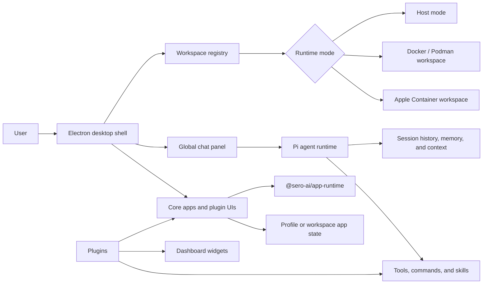
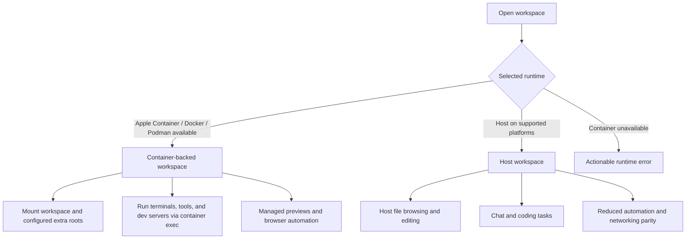

# Architecture

## High-level model

Sero combines three major layers:
- **Electron desktop shell**
- **workspace/runtime orchestration**
- **Pi-based agent intelligence**

At a high level:
- the Electron app provides the shell and UI
- workspaces define project scope and runtime mode
- Pi powers the agent sessions, tools, commands, and plugin extensions




## Shell model

The shell has:
- a main sidebar for apps and workspace/session context
- an active app area
- a chat panel for the focused agent session
- a status bar for current state

```text
┌──────────────────────────────────────────────────────────────┐
│ Title bar: window controls, back/forward, app context,        │
│ pinned shortcuts, command menu, shell actions                 │
├──────────────┬──────────────────────────────┬────────────────┤
│ Main sidebar │ Active app area              │ Global chat    │
│              │                              │ panel          │
│ Apps         │ Dashboard / Agent Board /    │ Pi-backed      │
│ Workspaces   │ Explorer / Plugin UI         │ session        │
│ Sessions     │                              │                │
├──────────────┴──────────────────────────────┴────────────────┤
│ Status bar: workspace/runtime/session state, zoom control     │
└──────────────────────────────────────────────────────────────┘
```

App zoom changes the active app area. It does not change the title bar or status bar.


## Workspaces

Workspaces are the main organizing unit. Each workspace has:
- a root directory on disk
- its own runtime mode
- its own sessions and context
- a `.sero-workspace.json` configuration surface

## Runtime modes

### Container-backed (explicit choices)

Use Apple Container or Docker / Podman-backed workspaces when you want:
- better isolation
- containerized tooling
- browser automation from the runtime image
- better Linux parity

### Host mode (default on supported platforms)

Host keeps core workflows available on supported platforms, but it is not feature-equivalent to container runtimes.
Expect limits around browser automation, containerized tooling, and some managed
preview/runtime behavior. See [Support Scope](/reference/support-scope) for the canonical platform matrix and [Containers and Host Mode](/reference/containers-host-mode)
for runtime-specific guidance.



## Plugins

Sero supports plugin-provided UI, Pi extensions, runtime behavior, and provider
metadata. Built-in plugins ship in-repo; external plugins can be installed from
trusted sources.

## See also

The deeper architecture source material currently lives in the repository under:
- [`docs/architecture.md`](https://github.com/sero-labs/sero/blob/main/docs/architecture.md)
- [`docs/decisions.md`](https://github.com/sero-labs/sero/blob/main/docs/decisions.md)
