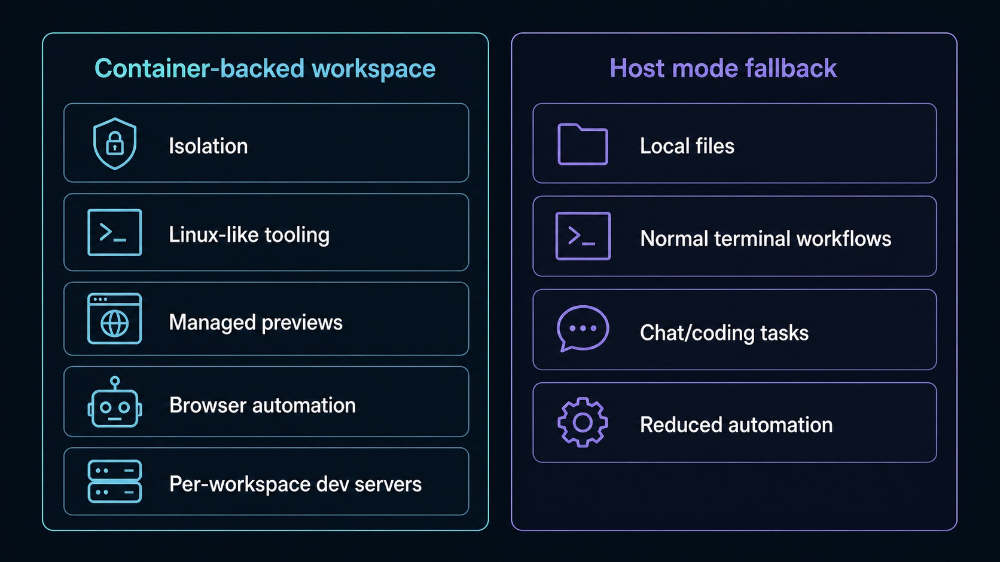

# Containers and Host Mode

Sero can run each workspace through Host, Apple Container, or Docker / Podman. This page records runtime behavior and failure rules. For choosing a runtime, see [Choose a Workspace Runtime](/guide/choose-workspace-runtime). For the canonical platform support matrix, see [Support Scope](/reference/support-scope).

Selected container runtimes fail closed when unavailable: Sero reports diagnostics for the selected runtime. It does not silently run that selected container workspace on Host. Fix the container runtime or explicitly choose another supported runtime.

For dev-server steps, see [Preview Dev Servers](/guide/containers-dev-servers). For lifecycle, mounts, and networking details, see [Container Isolation](/reference/container-isolation).



## Runtime modes

### Host

Host runs commands in the real workspace directory on your computer. It is the default on supported platforms listed in [Support Scope](/reference/support-scope).

Host is appropriate for:

- core agent chat and coding tasks
- file browsing and editing
- normal host terminal workflows
- running and registering localhost dev servers
- onboarding and provider setup

Host does not provide:

- container isolation
- Linux/container networking semantics
- image-provided compiler stacks or toolchains
- browser automation unless a published browser pack is available and Environment Doctor confirms it launches

In Host, shell commands run from the actual host workspace directory. Use relative paths such as `src/App.tsx` or real host paths in terminal commands. `/workspace` is reserved for container runtimes and Sero API compatibility aliases; it is not a Host shell path to rely on.

### Apple Container

Apple Container runs workspace commands inside a Sero-managed container through Apple's container CLI. Use [Support Scope](/reference/support-scope) for current platform availability.

Apple Container provides:

- workspace execution inside a Sero-managed container
- project access at `/workspace` inside the container
- tooling and browser automation from the Sero runtime image
- container networking semantics and managed preview URLs

### Docker / Podman

Docker / Podman runs workspace commands inside a Sero-managed Linux container through Docker-compatible tooling. The runtime picker labels this option **Docker / Podman**, while the persisted backend ID remains `docker`.

Docker / Podman provides:

- workspace execution through a Docker-compatible engine
- project access at `/workspace` inside the container
- tooling and browser automation from the Sero runtime image
- container networking semantics and managed preview URLs

## Requirements for container runtimes

For Apple Container, the public setup checks are:

```bash
/usr/local/bin/container --help
/usr/local/bin/container system status
```

If the system is installed but not running, start it:

```bash
/usr/local/bin/container system start
```

For Docker / Podman, install and start a compatible engine, then check one of:

```bash
docker info
podman info
```

Sero prefers Docker when both CLIs are available, can retry Podman if auto-selected Docker cannot reach its daemon, and respects explicit overrides such as `SERO_CONTAINER_ENGINE=podman` or `SERO_DOCKER_BIN=/path/to/binary`.

Sero expects the workspace image:

```text
ghcr.io/sero-labs/sero-node:latest
```

If you change `apps/desktop/images/Dockerfile.sero-node` or container-installed tools, rebuild the image and recreate affected workspace containers before expecting new or existing containers to use those changes.

## Runtime selection in the app

Sero checks runtime availability during startup and onboarding. The workspace runtime picker is per workspace; do not assume one global switch controls every workspace.

User-facing runtime surfaces include:

- onboarding and preflight diagnostics for runtime availability
- a per-workspace runtime picker in the workspace tree
- a workspace status indicator for runtime state
- terminal creation through the selected workspace runtime

Container startup failures are non-fatal to the app, but the selected workspace runtime reports an actionable failure until you fix it or explicitly select another supported runtime.

## Logs and troubleshooting

Useful local logs include:

```text
/tmp/sero-vite.log
/tmp/sero-electron.log
/tmp/sero-web-remote-watch.log
/tmp/sero-remote-<plugin>.log
```

For container-specific problems, start with:

```bash
/usr/local/bin/container --help
/usr/local/bin/container system status
/usr/local/bin/container system start
docker info
podman info
```

Common situations:

### Container runtime command is missing

Sero treats that runtime as unavailable. It will not execute that selected container workspace through Host unless you explicitly select Host and your platform is supported for it. Install the relevant runtime and retry, or choose another supported runtime.

### Container system is installed but unavailable

For Apple Container, run `container system start`, wait for `container system status` to report a healthy/running state, then retry the affected Sero workflow. For Docker / Podman, start Docker Desktop, the Docker daemon, or the Podman machine/service and retry.

### A workspace behaves incorrectly after changing the image

Rebuild `sero-node:latest` and recreate affected workspace containers. Existing containers do not automatically receive changes made to the Dockerfile or base tooling.

### A feature works in one runtime but not another

Check whether the feature requires browser automation, containerized language servers, image-provided tools, or container networking. If Host browser automation is relevant, confirm your platform has an available browser pack and that Environment Doctor reports it ready.

## Caveats

During the current beta, do not treat container runtimes as:

- a hardened multi-tenant security boundary
- identical behavior on every operating system
- a promise of full Host/container feature parity
- a guarantee that proxy, cleanup, or status reporting is perfect in every local setup

Do not treat Host as:

- container isolation
- Linux/container networking parity
- a compiler-stack manager
- browser automation without a ready browser pack
- an automatic rescue path for a selected container runtime

## Related docs

- [Choose a Workspace Runtime](/guide/choose-workspace-runtime)
- [Preview Dev Servers](/guide/containers-dev-servers)
- [Container Isolation](/reference/container-isolation)
- [Explorer Workspace](/guide/explorer-workspace)
- [Support Scope](/reference/support-scope)
- [Troubleshooting](/reference/troubleshooting)
- [Architecture](/reference/architecture)
- [Security / Privacy](/reference/security-privacy)
