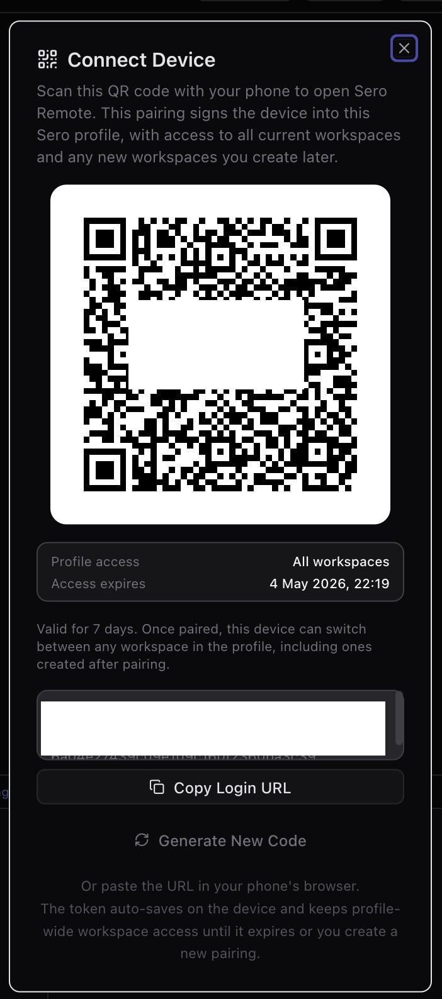

# Security / Privacy

Sero is a local-first developer tool. It runs on your machine,
stores profile state locally, and can optionally connect
to remote services such as model providers, GitHub, plugin registries, Discord,
Tailscale, or the Sero gateway.

This page is practical guidance, not a claim of hardened isolation. Treat Sero
like a powerful local automation environment: protect the
profile directory, review what plugins and remote clients can reach, and report
security issues privately.

## Security reports

Do not put sensitive details in a public GitHub issue or pull request. If the
repository enables GitHub private vulnerability reporting or security
advisories, use that feature. Otherwise, contact the maintainers through a
verified private channel.

Include impact, reproduction steps, commit/build context, and whether the issue
requires local access, profile access, network access, or a malicious plugin or
workspace.

## Local/profile state is sensitive

Sero's active profile contains auth stores, settings, workspace metadata, plugin
state, memory files, and logs. The canonical path map is
[State and Folders](/reference/state-and-folders); use that page when checking
what to redact from bug reports, screenshots, terminal output, and shared logs.

Common sensitive paths include:

| Surface | Current location |
| --- | --- |
| provider auth store | `<SERO_HOME>/agent/auth.json` |
| profile-local env vars | `<SERO_HOME>/agent/.env` |
| GitHub auth | `<SERO_HOME>/agent/github-auth.json` |
| local/custom model config | `<SERO_HOME>/agent/models.json` |
| gateway token | `<SERO_HOME>/agent/gateway-token` |
| gateway config | `<SERO_HOME>/agent/gateway-config.json` |
| gateway web tokens | `<SERO_HOME>/agent/gateway-web-tokens.json` |
| layout and UI state | `<SERO_HOME>/agent/layout.json` |
| workspace registry | `<SERO_HOME>/agent/workspaces.json` |
| global memory files | `<SERO_HOME>/workspaces/global/` |
| app state | `<SERO_HOME>/apps/` and `<workspace>/.sero/apps/` |
| source-development logs | `~/.sero-ui/logs/` or `$SERO_LOG_DIR` |
| compatibility log links | `/tmp/sero-*.log` |

Before sharing diagnostics:

- never paste raw API keys, OAuth tokens, gateway tokens, Discord bot tokens, or
  full auth files
- redact private local paths, project names, prompts, Tailscale serve URLs,
  Remote Control login URLs/QR codes, and workflow details when they are not
  needed for the report
- rotate any secret that may already have been exposed
- prefer private reporting when security impact is plausible

Profile-scoped storage helps keep Sero state organized, but it is not a
cryptographic boundary. Someone who can read your active profile files may be
able to recover useful secrets or steer connected integrations. For setup,
custom profile locations, switching, deletion, and credential-copy behavior, see
[Profiles and Onboarding](/guide/profiles-and-onboarding).

## Local vs remote/networked surfaces

### Local by default

These surfaces are local/profile-scoped unless you explicitly copy, sync, or
expose them elsewhere:

- profiles and the profile registry
- provider auth/settings and local/custom model config under `<SERO_HOME>/agent/`
- workspaces under `<SERO_HOME>/workspaces/`
- global app state under `<SERO_HOME>/apps/`
- installed plugins under `<SERO_HOME>/agent/plugins/`
- memory files, daily logs, layout state, and debug output

### Remote or networked when enabled

These surfaces can talk to external systems, while their Sero-side state remains
stored locally:

- model/provider API calls and OAuth flows
- GitHub authentication and repository access
- plugin installs from npm, git, or local source paths
- gateway remote-control clients
- Discord and Tailscale integrations
- plugin-specific third-party integrations

Remote integrations can expand what an attacker can do with a stolen token,
profile file, or malicious plugin. Enable them intentionally and remove or
rotate credentials you no longer need.

## Stored-secret and renderer safeguards

Sero exposes Electron safe storage to plugins that need to store a secret. When operating-system encryption is available, Electron encrypts the value before Sero stores it. If encryption is not available, Sero uses base64 encoding and shows a security warning. Base64 does not protect a secret. Do not assume that all profile credentials use safe storage.

GitHub authentication uses safe storage when it is available. Other auth files and plugin state can have different storage rules. Check the integration before you copy or share its state.

### Renderer and browser controls

Sero applies Electron/browser safeguards intended to reduce accidental exposure
and common renderer risks. These are defense-in-depth controls, not a guarantee
that arbitrary content or untrusted plugins are safe.

Current safeguards include:

- main-window navigation is restricted to trusted app origins; development also
  allows the local Vite origin
- popups for `http` and `https` URLs are opened externally through the operating
  system shell, while other popup attempts are denied
- webviews are configured conservatively: no Node integration, context isolation
  enabled, sandbox enabled, insecure content disabled, and preload scripts
  stripped from untrusted webviews
- permission requests are deny-by-default except for limited cases such as media
  and sanitized clipboard writes
- the renderer Content Security Policy is intentionally narrow, with allowances
  for Sero extension assets, required media domains, `blob`/`data` where needed,
  and loopback HTTP/WebSocket sources used by local auth and viewer flows

These controls should not be described as a hardened browser sandbox for all
possible plugin or web content. Treat plugin code and embedded remote content as
part of the security surface.

## Permission prompts and user feedback tools

Sero has a focused permission gate for some dangerous `bash` tool calls. It does
**not** gate every tool, every filesystem action, every plugin action, or every
agent decision.

The current gate checks `bash` commands for a limited set of risky patterns,
including examples such as:

- recursive destructive delete patterns like broad `rm -rf`
- `sudo`
- `chmod` / `chown` patterns such as `777`
- disk-writing or formatting commands such as `mkfs` and `dd ... of=`
- redirection to raw disk devices
- shutdown/reboot/halt/poweroff commands

Simple workspace-scoped cleanup can be auto-allowed when it parses as a plain
recursive remove inside the current workspace and does not target the workspace
root or `.git` paths. Complex shell constructs, globs, and shell-control
characters are treated conservatively.

In Sero mode, the gate asks through the user-feedback bridge and times out by
default. In CLI/non-interactive contexts where confirmation is unavailable,
dangerous matched commands are blocked by default.

Sero also includes user-feedback tools such as question, questionnaire, and
interview flows. Those tools are for collecting user input; they are not the
permission gate and should not be treated as a general security approval system.

## Admin and MCP management surfaces

Some powerful configuration and inspection features are intentionally UI-first.
That keeps the agent-facing tool surface smaller, but it is not a hard security
boundary by itself.

- The Admin plugin is a UI-only surface for inspecting configuration, sessions,
  and logs. Do not assume it is an agent tool just because it appears in the app.
- The MCP plugin keeps the agent-facing surface small: the agent uses the bridged
  `mcp` tool, while `mcp_manager` is a UI/runtime management surface.

These distinctions reduce accidental exposure and clarify intent. They do not
replace careful handling of profile files, plugins, MCP servers, or gateway
access.

## Gateway and remote-control access

The gateway is **off by default**. It only starts when explicitly enabled with
`SERO_GATEWAY=1`.

When enabled, a master-token gateway client has the same effective power as the
desktop UI. It can open sessions on any workspace, send prompts, steer or abort
agent turns, and list workspaces and sessions. Scoped web tokens may limit
supported gateway workspace/session/file/artifact access to explicit workspace
IDs, but that is not a comprehensive per-tool or agent-action permission system.
Because prompts can lead the agent to run tools, treat gateway credentials like
high-privilege secrets.

### Writes a remote client can make

Most gateway requests only read. These change something:

- **Send a prompt, steer, or abort a turn.** Any authorized token. A prompt can
  lead the agent to run tools, which is why a gateway token is a
  high-privilege secret.
- **Create a session.** Any token authorized for that workspace.
- **Answer a pending question.** A question that names a workspace can be
  answered by any token that reaches it. A question that names no workspace can
  be answered only by the master token.
- **Mark notifications read.** Any authenticated token. This changes no file.
- **Upload a file (`upload_file`).** Any token authorized for that
  workspace. A bare name lands in `uploads/`; the path may not escape the
  workspace, and an upload never overwrites — a taken name gets a numeric
  suffix. The cap is 20 MB. Workspace scope is the right bar here because
  a token that can prompt a workspace can already have the agent write a
  file in it; refusing the direct path would buy nothing.
- **Write a widget's state (`app_state_set`).** Any token authorized for
  that workspace. The client names the file by an opaque key, never by
  path, and the key resolves only to a file a `remote: true` widget owns
  in a workspace that token reaches. The write is the same atomic,
  etag-checked write the desktop makes.
- **Register this browser for notifications (`push_subscribe`).** Any
  authenticated token. See [Web Push](#web-push) below.
- **Commit changed files (`git_commit`).** Master token only. A scoped web
  token is refused even for a workspace it can otherwise read.

The commit is the only request that changes a git repository. Its limits:

- it commits exactly the paths the client sends, and nothing else. The commit
  is built in a temporary index, so a file staged on the desktop but not
  selected stays staged and out of the commit. A selected file that has a
  staged copy commits that copy, which is the diff the phone showed; a file
  with no staged copy commits its working-tree content
- it refuses while a merge, rebase, cherry-pick or revert is part-way through
- it never pushes, amends, discards or stashes; there is no gateway request for
  any of those
- the commit runs as the desktop user, with that user's git identity and
  signing configuration. The repository's pre-commit, prepare-commit-msg,
  commit-msg and post-commit hooks run as they would for `git commit`, and a
  hook that fails refuses the commit with its own message. Running the hooks
  this way needs git 2.36 or later
- a hook that stages a file the client did not select refuses the commit;
  nothing is committed and nothing is left to undo
- if a commit lands on the desktop while the phone's commit is being made, the
  phone's commit is refused rather than placed on top of a base it did not see

Important gateway limits:

- the master token is profile-scoped and should be stored/handled like a root
  password
- scoped web tokens may limit supported gateway workspace/session/file/artifact
  APIs to explicit workspace IDs, but master-token clients remain profile-wide
- there are no comprehensive gateway-specific tool restrictions beyond the
  normal Sero/Pi tool behavior and focused `bash` permission gate described
  above
- failed master-token authentication is limited per source IP: the fifth
  attempt within one minute starts a five-minute block, and successful
  authentication resets the counter; there is no general authenticated-request
  or model-spend rate limit
- the gateway accepts at most 50 concurrent WebSocket connections in total and
  10 per source IP
- unauthenticated connections time out after 10 seconds; authenticated idle
  connections time out after 30 minutes
- a WebSocket message is limited to 36 MiB before request-specific validation
- Tailscale exposure depends on tailnet trust and should use `tailscale serve`,
  not public funneling
- Discord stays disabled when `SERO_DISCORD_USERS` is empty; configure an
  explicit user allowlist before starting the adapter
- token URLs, QR codes, Tailscale serve URLs, Discord bot tokens, and gateway
  token files are redaction-sensitive because they can grant access or reveal
  private routing details

Prefer login prompts or ephemeral shell variables over putting tokens in URLs or
command history. Stop Tailscale serve, disable the gateway, and rotate tokens
when remote access is no longer needed.

The pairing dialog is security-relevant because it shows both the access scope
and expiry for a remote web device. Treat real QR codes and login URLs from this
screen as secrets; redact them from screenshots and rotate exposed tokens.

### Web Push

Sero Remote can notify a phone with the app closed. This is the one part
of remote access that leaves your tailnet, so it is worth reading.

What leaves the machine, and where it goes:

- A push travels through the browser vendor's push service — Google,
  Mozilla or Apple — because that is the only way to wake a closed app.
  Your tailnet cannot do it.
- The payload carries the source, the kind of event, the workspace id and
  a path to open. **It never carries message content, session content, or
  a token.** The phone fetches the details over the tailnet when you tap.
- The payload is encrypted to that browser's own key, so the push service
  moves it without reading it.

What controls it:

- Push is off until someone turns it on, per device, from the
  notification feed. The browser asks its own permission on top.
- A subscription is filed under the token that made it, with that token's
  workspace scope frozen in. A scoped token's phone is only pushed events
  from the workspaces it may see.
- An event that names no workspace is pushed to owner tokens only.
- Revoking or expiring a web token drops its subscriptions at once, and every
  send checks the token again first, so a token that expired since the last
  prune gets nothing.
- A token with a client connected right now is not pushed to. It already
  has the event over the socket.
- A push service answers `410 Gone` for a browser that dropped its
  subscription. Sero forgets it then.

The subscription endpoint is a capability: whoever holds it can send that
browser a message. It is stored with the same file permissions as the
gateway token, in `gateway-push-subscriptions.json`.

## Security boundaries

Sero does **not** claim:

- universal permission prompts for every tool or action
- comprehensive blocking of all dangerous agent behavior
- hardened multi-tenant isolation
- cryptographic isolation between profiles
- that containers are a complete security boundary against malicious code
- that Admin or MCP UI-only management is a hard access-control boundary
- that gateway access is a comprehensive per-workspace, per-tool, or
  per-agent-action permission system
- that third-party plugins are reviewed or sandboxed to a production security
  standard

Use Sero on machines and workspaces where you are comfortable running a powerful
local developer assistant, and review remote access, plugin installs, and stored
credentials accordingly.

## See also

- [Profiles and Onboarding](/guide/profiles-and-onboarding)
- [Remote Control](/guide/remote-control)
- [State and Folders](/reference/state-and-folders)
- [Support Scope](/reference/support-scope)
