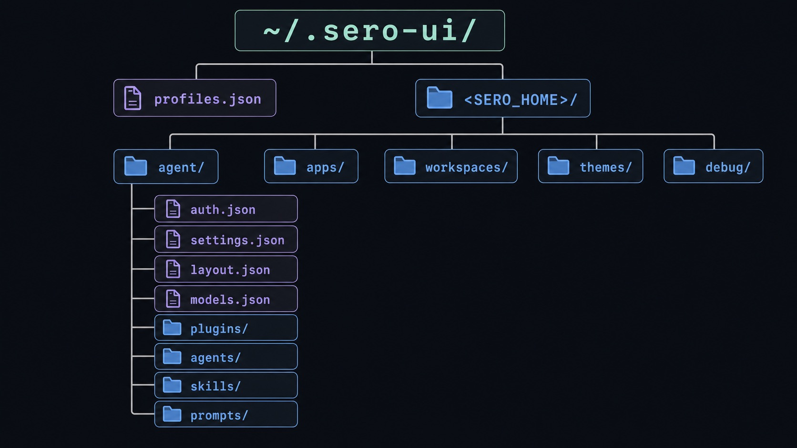

# State and Folders

This page maps where Sero stores profile state, app state, auth files, and debug
artifacts during the public beta. Use it when troubleshooting, filing issues, or
checking what should be redacted from screenshots and logs.

Sero is local-first, but local state can still be sensitive. Treat the active
profile directory as private developer-machine data. For the user-facing setup
flow, see [Profiles and Onboarding](/guide/profiles-and-onboarding).

## Core path model

Sero has one fixed root for the profile registry:

```text
~/.sero-ui/profiles.json
```

Each profile points at an active profile root. In docs, that root is written as:

```text
<SERO_HOME>
```

For the default profile, `<SERO_HOME>` is usually `~/.sero-ui/`. Custom profiles
can use another folder.

Inside the active profile, Sero uses an agent directory:

```text
<SERO_HOME>/agent/
```

Sero sets `PI_CODING_AGENT_DIR` to this path so Pi uses Sero's profile-scoped
agent directory instead of a separate non-Sero agent directory.

```text
~/.sero-ui/
├── profiles.json
└── <SERO_HOME>/
    ├── agent/
    │   ├── auth.json
    │   ├── settings.json
    │   ├── layout.json
    │   ├── models.json
    │   ├── workspaces.json
    │   ├── plugins/
    │   ├── extensions/
    │   ├── agents/
    │   ├── skills/
    │   └── prompts/
    ├── apps/
    │   └── <app-id>/state.json
    ├── workspaces/
    │   ├── global/
    │   │   ├── MEMORY.md
    │   │   ├── IDENTITY.md
    │   │   └── memory/daily/YYYY-MM-DD.md
    │   └── <workspace-id>/
    ├── themes/
    └── debug/
        └── memory/
```



## Important profile files

| Path | Purpose |
| --- | --- |
| `~/.sero-ui/profiles.json` | Fixed profile registry and active profile ID |
| `<SERO_HOME>/agent/auth.json` | Pi-managed provider auth/OAuth store |
| `<SERO_HOME>/agent/settings.json` | Profile-scoped settings and package/plugin config |
| `<SERO_HOME>/agent/layout.json` | Shell layout, theme, active workspace/session, dashboard widget layout/browser state |
| `<SERO_HOME>/agent/.env` | Profile-local environment variables and local secret config |
| `<SERO_HOME>/agent/models.json` | Local/custom model provider configuration |
| `<SERO_HOME>/agent/workspaces.json` | Workspace registry for the active profile |
| `<SERO_HOME>/agent/github-auth.json` | GitHub device-flow auth token store |
| `<SERO_HOME>/agent/gateway-token` | Gateway master token |
| `<SERO_HOME>/agent/gateway-config.json` | Gateway config and limits |
| `<SERO_HOME>/agent/gateway-web-tokens.json` | Scoped web/gateway tokens |
| `<SERO_HOME>/agent/plugins/` | Installed optional plugins |
| `<SERO_HOME>/agent/extensions/` | Additional extension packages/resources |
| `<SERO_HOME>/agent/agents/` | Subagent definition Markdown files; see [Agent Definitions](/reference/agent-definitions) |
| `<SERO_HOME>/agent/skills/` | Installed skills |
| `<SERO_HOME>/agent/prompts/` | Prompt templates |
| `<SERO_HOME>/themes/` | User theme presets |
| `<SERO_HOME>/debug/memory/` | Memory plugin debug logs |

Older notes may mention paths such as `~/.sero-ui/layout.json` or
`~/.sero-ui/github-auth.json`. For current Sero beta docs, prefer the
profile-scoped `<SERO_HOME>/agent/...` paths above unless a page is explicitly
describing legacy migration behavior.

## Workspaces

Sero keeps profile-owned workspaces under:

```text
<SERO_HOME>/workspaces/
```

The built-in global workspace is:

```text
<SERO_HOME>/workspaces/global/
```

Each real workspace directory can also contain:

```text
<workspace>/.sero-workspace.json
```

That file stores workspace-level metadata and runtime configuration.

## App state

Sero apps and plugins can store state in one of two places.

### Global app state

Global-scoped apps use:

```text
<SERO_HOME>/apps/<app-id>/state.json
```

For example, Scheduler/Reminders state is currently documented as:

```text
<SERO_HOME>/apps/cron/state.json
```

Some plugin code can fall back to a workspace-relative `.sero/apps/...` path
when running outside the normal Sero desktop environment. Public Sero docs should
prefer the active-profile path when `SERO_HOME` is present.

### Workspace app state

Workspace-scoped app state lives inside the workspace:

```text
<workspace>/.sero/apps/<app-id>/state.json
```

Examples from the current guides:

| App | State path |
| --- | --- |
| Web | `<workspace>/.sero/apps/web/state.json` |
| Git | `<workspace>/.sero/apps/git/state.json` |

The Git app also ignores its state folder with this pattern so the app state does
not appear as an untracked repository change:

```text
**/.sero/apps/git/
```

## Memory storage

Memory uses the global workspace under the active profile:

```text
<SERO_HOME>/workspaces/global/MEMORY.md
<SERO_HOME>/workspaces/global/IDENTITY.md
<SERO_HOME>/workspaces/global/USER.md
<SERO_HOME>/workspaces/global/memory/daily/YYYY-MM-DD.md
```

Memory debug logs live at:

```text
<SERO_HOME>/debug/memory/
```

For the user-facing overview, see [Memory](/guide/memory).

## Agent definitions and dashboard layout

Subagent definitions live in:

```text
<SERO_HOME>/agent/agents/
```

The default profile path is usually `~/.sero-ui/agent/agents/`. Definitions can
include private workflow instructions and model preferences, so redact them like
prompt templates. For the exact format, see [Agent Definitions](/reference/agent-definitions).

Dashboard widget placement and instances are part of profile layout state:

```text
<SERO_HOME>/agent/layout.json
```

See [Dashboard and Widgets](/guide/dashboard-widgets) for the user workflow.

## Local/custom model configuration

Local and custom model providers are configured in:

```text
<SERO_HOME>/agent/models.json
```

This file can include local endpoints, API keys, environment variable names,
command-backed secret lookups, headers, model IDs, and model metadata. Treat it
as sensitive when it contains private endpoints or credentials. For the exact
supported schema, see [`models.json` Reference](/reference/models-json).

## Temporary runtime logs

Some development/runtime logs are written outside the profile tree under `/tmp/`:

```text
/tmp/sero-vite.log
/tmp/sero-electron.log
/tmp/sero-web-remote-watch.log
/tmp/sero-remote-<plugin>.log
```

These are local developer-machine artifacts, not durable profile state. They can
still include private paths, errors, or workflow details, so redact before
sharing.

## What to redact before sharing

Redact or avoid sharing raw copies of:

- `~/.sero-ui/profiles.json`
- `<SERO_HOME>/agent/auth.json`
- `<SERO_HOME>/agent/.env`
- `<SERO_HOME>/agent/github-auth.json`
- `<SERO_HOME>/agent/models.json`
- `<SERO_HOME>/agent/gateway-token`
- `<SERO_HOME>/agent/gateway-config.json`
- `<SERO_HOME>/agent/gateway-web-tokens.json`
- `<SERO_HOME>/agent/layout.json`
- `<SERO_HOME>/agent/workspaces.json`
- `<SERO_HOME>/agent/agents/`
- memory files under `<SERO_HOME>/workspaces/global/`
- app state under `<SERO_HOME>/apps/` or `<workspace>/.sero/apps/`
- debug/runtime logs that include private paths, prompts, tokens, or project data

## Local vs remote behavior

These are local/profile-scoped by default:

- profiles and profile registry
- agent settings/auth/plugins/prompts/skills
- workspaces and workspace metadata
- memory files and debug logs
- app state files

These may talk to remote systems, while still storing state locally:

- model/provider auth and API calls
- GitHub auth and repository access
- gateway remote-control clients when enabled
- plugin installs from npm, git, or local source paths
- App Store discovery and installed-plugin management
- third-party plugin integrations

For security posture and remote-control caveats, see
[Security / Privacy](/reference/security-privacy),
[Profiles and Onboarding](/guide/profiles-and-onboarding), and
[Remote Control](/guide/remote-control), [Agent Definitions](/reference/agent-definitions),
and [Dashboard and Widgets](/guide/dashboard-widgets).
