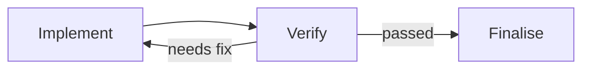
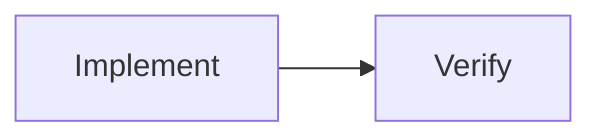

# Decision: Bounded Cyclic Workflows for Sero Orchestrator

Status: Accepted  
Date: 2026-07-21  
Scope: `plugins/sero-orchestrator-plugin`  
Related analysis: [Extending Sero Orchestrator into a Dynamic Workflow Graph](graph-routing-analysis.md)

## Decision summary

Sero Orchestrator will support a deliberately constrained form of cyclic workflow: a completed step may route execution back to one earlier step through an explicit, bounded feedback transition.

The existing dependency DAG remains the forward execution model. We will not replace it with a general token-driven workflow network.

Every visit to a step in a feedback cycle will be recorded as a durable activation. Routing backwards creates a new activation of the target step and preserves all earlier activations. The engine may reset the existing `stepStates` entries for readiness and UI projection, but those entries will no longer be the only record of cyclic execution.

The first implementation will support one feedback transition per plan. Its region must be single-entry, single-exit, barrier-safe, and bounded by a required maximum traversal count. The finalisation step, approval gates, and delivery steps must remain outside the feedback region.

This decision supersedes the implementation recommendation in the related graph-routing analysis. That document remains useful as exploration of the broader design space, but a general workflow graph is not currently approved.

## Context

Orchestrator plans are currently static acyclic dependency graphs. They support:

- sequential and parallel steps;
- dependency joins;
- variable-matched conditional branches;
- retries and LLM-decided recovery;
- plan revision;
- scheduled and event-driven repetition;
- durable outcomes and explicit completion.

They cannot naturally express a common workflow pattern where a later result requires an earlier stage to run again within the same run:



Examples include:

- implement, verify, fix, and verify again;
- research, critique, deepen the research, and critique again;
- draft, review, revise, and review again;
- diagnose, apply a fix, retest, and try another fix.

The current recovery system can approximate these patterns, but it treats iteration as exceptional failure handling. It cannot represent a planned return to a different earlier step without revising or resetting the plan in an ad hoc way.

A fully general workflow graph would solve this, but would also require token routing, arbitrary join semantics, cancellation rules, variable versioning, graph migration, nested scopes, and substantially more complex persistence and UI. That is not justified by the immediate use case.

## Goals

- Express planned feedback from a later step to an earlier step.
- Preserve the history of every visit through the cycle.
- Make every cycle structurally visible and mechanically bounded.
- Preserve restart safety and the single-coordinator execution model.
- Continue using the existing DAG for ordinary sequencing, branches, parallelism, and joins.
- Keep completion, delivery, approvals, recovery, scheduling, and management limits consistent with existing behaviour.
- Provide a clean future path to multiple or richer cyclic regions if real usage demands them.

## Non-goals

- A general workflow-network or Petri-net engine.
- Arbitrary runtime routing to any step.
- Runtime creation or deletion of steps or edges without a plan revision.
- More than one feedback transition per plan in the first version.
- Nested or overlapping feedback regions.
- Multiple terminal or finalisation steps.
- General boolean join semantics.
- Implicit cancellation of parallel work.
- Rollback or compensation for external side effects.
- Using graph cycles to express schedules, polling, event watches, queues, or unbounded repetition.
- A free-form visual workflow editor.

## Core model

### The forward graph remains acyclic

`dependsOn` continues to define the normal forward topology. All existing validation remains:

- dependency references must exist;
- the dependency graph must be acyclic;
- the plan must have a single finalisation sink;
- branches continue to use `produces` and `when`;
- skipped steps continue to satisfy dependencies.

The feedback transition is stored separately and is not treated as a `dependsOn` edge. This allows existing readiness and DAG validation to remain understandable.

### Feedback is declared on the routing step

A step may declare one feedback transition:

```ts
export interface StepFeedbackTransition {
  /** Stable, path-safe identifier used in history and limits. */
  id: string;

  /** Earlier dependency-ancestor step where the next cycle pass begins. */
  toStepId: string;

  /**
   * Match against a variable emitted by this step's own outcome.
   * The feedback route is taken when the value is in this list.
   * A non-match means the workflow exits the cycle and continues normally.
   */
  when: {
    var: string;
    in: Array<string | number | boolean>;
  };

  /**
   * Maximum number of times this transition may be taken in one run.
   * The initial pass is not a traversal. A value of 3 permits at most
   * four visits to the target: the initial visit plus three returns.
   */
  maxTraversalsPerRun: number;
}

export interface LoopStepDefinition {
  // Existing fields remain unchanged.
  feedback?: StepFeedbackTransition;
}
```

The routing step must list `feedback.when.var` in its own `produces`. Its instructions must explicitly require that variable to be recorded in its `StepOutcome.variables`.

The feedback condition reads the completing activation's outcome directly. It must not read a later value from the shared `loop.runtime.variables` map.

There is no separate forward transition. If the feedback condition does not match, the step remains succeeded and existing downstream dependencies become ready normally.

### Example plan fragment

```json
{
  "id": "verify",
  "title": "Verify the implementation",
  "instructions": "Run the relevant checks. Record variables.verificationRoute as either passed or needs-fix. When needs-fix, include concise findings for the next implementation pass.",
  "dependsOn": ["implement"],
  "produces": ["verificationRoute"],
  "feedback": {
    "id": "verify-needs-fix",
    "toStepId": "implement",
    "when": {
      "var": "verificationRoute",
      "in": ["needs-fix"]
    },
    "maxTraversalsPerRun": 3
  },
  "execution": {
    "type": "background-agent",
    "model": "MED"
  }
}
```

`finalise` depends on `verify`. When `verify` selects feedback, the engine rearms the feedback region, including `verify`, so `finalise` remains blocked. When a later `verify` activation records `passed`, no feedback is taken, `verify` remains succeeded, and `finalise` becomes ready.

## Feedback region

### Definition

For a transition from source step `S` back to target step `T`, the feedback region is the set of steps that:

1. are reachable forward from `T`; and
2. can reach `S` through forward dependency edges.

The region includes both `T` and `S`.

In the common case, the region is simply:



It may contain an internal DAG, including parallel steps, provided it satisfies the structural restrictions below.

### Single entry

No step outside the region may be a dependency of an interior region step, except that dependencies into the target `T` are allowed.

This ensures every new cycle pass enters through one known step.

### Single exit

No region step other than source `S` may have a dependent outside the region.

This ensures work cannot leave the region before the routing step decides whether to repeat or continue.

### Barrier-safe source

Every region step must be a dependency ancestor of `S`. Therefore, when `S` becomes ready, no work in the region remains running or unresolved.

The feedback decision occurs only after the entire region has reached the source barrier. Routing backwards cannot implicitly cancel in-flight work.

### No nested or overlapping regions

The initial implementation allows one feedback transition per plan, so nested and overlapping cycles are structurally impossible. This can be revisited after real-world usage demonstrates a need.

## Durable activation history

### Why activations are required

`LoopRuntimeState.stepStates` currently stores one mutable state per step definition. Resetting those entries is sufficient to make the current readiness algorithm run a step again, but it is not sufficient as durable history.

For a cyclic workflow, `Implement #1` and `Implement #2` are separate logical visits. They may have different inputs, attempts, outcomes, usage, and changed files. Both must survive restarts and remain visible in the run trace.

### Activation model

```ts
export type StepActivationStatus =
  | 'pending'
  | 'running'
  | 'succeeded'
  | 'failed'
  | 'blocked'
  | 'skipped'
  | 'needs-revision'
  | 'cancelled'
  | 'orphaned';

export interface StepActivation {
  id: string;
  stepId: string;
  visitNumber: number;
  status: StepActivationStatus;
  attemptIds: string[];
  outcome?: StepOutcome;
  /** Feedback transition that created this visit, absent for the initial pass. */
  triggeredByFeedbackId?: string;
  /** Source activation whose feedback created this visit. */
  triggeredByActivationId?: string;
  startedAt: string;
  endedAt?: string;
}
```

`LoopRun` gains an activation collection:

```ts
export interface LoopRun {
  // Existing fields remain.
  stepActivations?: StepActivation[];
}
```

The field is optional for persisted compatibility. Old runs have attempts but no explicit activations. New runs create an activation before starting a step.

`StepAttempt` gains:

```ts
activationId?: string;
```

This is also optional for compatibility with existing history.

### Runtime projection

`loop.runtime.stepStates` remains the readiness and summary projection in this bounded implementation.

When a feedback transition is taken:

- the completed activation and its outcome remain immutable in `LoopRun.stepActivations`;
- every step state in the feedback region is reset to `pending`;
- per-step attempts for the new visit reset to zero;
- previous attempt and outcome references are cleared from the projection;
- a new target activation is created when normal readiness starts the target;
- steps outside the region remain untouched.

The activation ledger is authoritative for cyclic history. `stepStates` describes only what must happen next and the latest projection of each definition.

## Feedback runtime state

Traversal counts must survive restart and must not be inferred from pruned attempt history.

```ts
export interface FeedbackRuntimeState {
  traversals: number;
  lastSourceActivationId?: string;
  lastTraversedAt?: string;
}

export interface LoopRuntimeState {
  // Existing fields remain.
  feedbackStates?: Record<string, FeedbackRuntimeState>;
}
```

The map is keyed by feedback transition ID.

For recurring loops, `rearmLoop` clears `feedbackStates` because traversal limits apply independently to each run.

For a user-requested `run again`, traversal state is likewise reset with the rest of the run state.

## Execution semantics

### Initial activation

When a step starts for the first time in a run:

1. Create and persist a `StepActivation` with `visitNumber: 1` and `status: running`.
2. Create the existing `StepAttempt` with its `activationId`.
3. Execute and evaluate the step through the existing executor and outcome path.
4. Append further retry attempts to the same activation.

### Feedback decision

After the source step produces an outcome, and after route and delivery contracts have been enforced:

1. Read `feedback.when.var` from that activation's `outcome.variables`.
2. If the value does not match, apply the outcome normally and continue forward.
3. If it matches, finish and persist the source activation.
4. Check `maxTraversalsPerRun` before mutating readiness state.
5. Increment and persist the feedback traversal count.
6. Reset only the feedback region's `stepStates` to `pending` with zero attempts.
7. Clear routing variables declared in `produces` by steps in the region from the shared runtime projection.
8. Preserve the source activation outcome as explicit feedback context for the next target activation.
9. Continue the engine tick. Normal readiness starts the target step again.

The feedback decision must run before the recurring-loop stop checker. Selecting feedback means the current run still has planned work.

### Feedback context

The next activation of the target receives a dedicated feedback block in its execution prompt containing:

- the source step and activation IDs;
- the feedback transition ID and traversal number;
- the source outcome summary;
- the source outcome variables;
- relevant observations and artifact references.

The target must not have to recover these findings from an overwritten global variable or an unstructured notes history.

### Retry versus revisit

These concepts remain distinct:

- A recovery retry creates another attempt on the same activation.
- A feedback traversal creates a new activation with a new visit number.

Retrying the feedback source does not decrement or reset the traversal count. The count changes only when the feedback transition is successfully taken.

### Traversal exhaustion

If the feedback condition matches but the transition has reached its limit:

1. Do not route forward as if verification passed.
2. Do not silently exceed the limit.
3. Convert the source result into a synthetic `needs-revision` outcome explaining that the feedback transition is exhausted.
4. Send it through the existing recovery decider.

Recovery may revise the step or plan, wait, or block the loop. A plan revision may increase the bound only through a validated revised plan. An ordinary retry must not reset it.

### Completion

Existing explicit completion semantics remain:

- the single finalisation step remains the only step allowed to complete the loop successfully;
- it must be outside the feedback region;
- it cannot become ready while the feedback region has been rearmed;
- a blocked completion may still be emitted from any step;
- recurring-loop completion continues to end one run without necessarily ending the schedule;
- delivery receipts and approval consumption follow the existing completion path.

## Variable semantics

The completing source activation is the source of truth for the feedback decision and next-pass feedback context.

When the region is rearmed:

- remove from `runtime.variables` every key listed in `produces` by a region step;
- retain `notes` using its current append behaviour;
- retain variables produced outside the region;
- supply the source activation's outcome separately as feedback context.

Clearing declared region routing variables prevents a previous pass from prematurely selecting a branch before its judge reruns. It does not attempt full variable versioning or ownership tracking.

If richer data-flow requirements emerge, activation-scoped variable snapshots can be considered later. They are not part of this decision.

## Validation

`validateLoopPlan` will retain normal DAG validation and add feedback-specific validation.

A plan with feedback is valid only when:

- there is at most one feedback transition in the plan;
- the feedback ID is path-safe and unique;
- `toStepId` names an existing step;
- the target is a strict dependency ancestor of the source;
- `when.in` is a non-empty primitive list;
- `when.var` is listed in the source step's `produces`;
- `maxTraversalsPerRun` is a positive integer;
- the computed feedback region is single-entry and single-exit;
- every region step can reach the source barrier;
- the finalisation step is outside the region;
- no approval-gated step is inside the region;
- the delivery step identified by delivery validation is outside the region;
- an active-session and background-agent dependency warning continues to apply inside the region when using a managed worktree.

The planner and UI should be warned, but structural validation need not fail, when a feedback region contains instructions that appear to perform an externally visible side effect. Mechanical delivery and approval gates are hard errors inside the region; other side effects remain an authoring and review concern.

## Planner behaviour

The planner must continue to default to linear plans.

It may author feedback only when:

- a later evaluation can legitimately require earlier work to be repeated for the same item;
- the repeated region has a clear start and barrier step;
- a small hard traversal bound is appropriate;
- external delivery occurs after the cycle exits.

The planner must not use feedback for:

- recurring schedules;
- event listeners;
- polling;
- processing an unbounded collection;
- vague instructions such as repeat until perfect;
- retrying a mechanically failed step, which remains recovery's job.

The planner prompt must explain that:

- only one feedback transition is available;
- the source records the exact feedback routing variable;
- a match repeats and a non-match exits forward;
- the source must be a barrier for the region;
- the finalisation and delivery steps remain outside;
- `maxTraversalsPerRun` is mandatory and counts returns, not the initial pass.

Planning repair should receive feedback-region validation errors with the source, target, and offending boundary edge named explicitly.

## UI behaviour

The plan view should render the existing dependency DAG and add one visually distinct feedback edge from source to target, labelled with:

- the routing condition;
- the maximum traversals;
- the current traversal count when a run exists.

The run view should show separate visits:

- `Implement #1`;
- `Verify #1`;
- `Implement #2`;
- `Verify #2`;
- `Finalise #1`.

The UI must not make one historical execution appear to revert from succeeded to pending. `stepStates` may reset internally as a projection, but the user-facing timeline is activation-based.

No visual graph authoring is required. Planner generation and Refine remain the ways topology changes.

## Persistence and restart safety

The coordinator remains the only executor and the existing per-loop lock remains the concurrency boundary.

The source activation outcome, traversal increment, feedback context, and region reset must be persisted in one `updateState` transaction. A restart must observe either:

- the completed source before feedback was taken; or
- the completed source, incremented traversal, and fully rearmed region.

It must never observe a consumed traversal with only part of the region reset.

Activation creation should be idempotent. A stable identity derived from run ID, step ID, and visit number is sufficient for this bounded single-cycle model.

Restart reconciliation should:

- keep existing orphan-attempt behaviour;
- retain the activation containing the orphaned attempt;
- retry or recover that activation rather than creating a feedback revisit;
- preserve `feedbackStates`;
- rebuild visit numbers from activation history if a projection is missing.

## Recovery and plan revision

Existing recovery decisions remain, with activation-aware interpretation:

- `retry-step` retries the current activation;
- `revise-step` revises the definition and retries or replaces the current activation;
- `revise-plan` may add, remove, or change the one feedback transition after full validation;
- `skip-step` skips the current activation;
- `wait` and `block-loop` retain their current meaning.

A plan revision during an active feedback run is applied only at the existing recovery boundary, where no region step is running. Completed activation history remains attached to the run.

If a revision removes or moves the feedback transition, its previous traversal history remains in the run for audit but no longer affects readiness. The new transition starts with zero traversals only if it has a new ID. Reusing an ID preserves its count and prevents a revision from bypassing the limit accidentally.

## Scheduling

Scheduled and event-driven loops continue to describe one complete run. Feedback occurs within that run.

`rearmLoop` will:

- initialise normal step states;
- clear `feedbackStates`;
- clear run-specific feedback context;
- preserve the plan and trigger configuration.

The planner must not translate recurring cadence into a feedback transition.

## Consequences

### Positive

- Covers the highest-value iterative workflows directly.
- Preserves the existing forward DAG and most readiness logic.
- Makes every repeated visit durable and auditable.
- Avoids arbitrary routes and unbounded execution.
- Retains existing completion, recovery, scheduling, and delivery concepts.
- Provides a clear migration path if multiple cycle regions are later justified.

### Costs

- Introduces activation identity alongside existing attempts and step-state projections.
- Requires careful atomic persistence around feedback routing.
- Requires graph validation for the feedback region boundary.
- Makes the run UI activation-aware.
- Requires prompts and recovery to distinguish retry from revisit.

### Accepted limitations

- Only one cycle per plan initially.
- No nested cycles.
- No feedback while parallel work remains active in the region.
- No approval or delivery within the cycle.
- Shared variables remain a latest-value projection rather than a versioned data-flow system.
- Some workflows will still require plan revision instead of runtime routing.

## Implementation outline

### Phase 1: Types and validation

- Add `StepFeedbackTransition` and optional `LoopStepDefinition.feedback`.
- Add `StepActivation`, `StepAttempt.activationId`, and feedback runtime state.
- Compute and validate the single-entry, single-exit feedback region.
- Add schema tests for every accepted and rejected shape.

### Phase 2: Activation recording

- Create activations for all steps, including non-cyclic plans.
- Attach attempts to activations.
- Keep current readiness behaviour unchanged.
- Add persistence, pruning, digest, and restart reconciliation support.
- Update run views to display activation visits.

Recording activations for ordinary plans first reduces risk before feedback can change control flow.

### Phase 3: Feedback execution

- Evaluate feedback from source activation outcomes.
- Persist traversal state and feedback context.
- Atomically rearm the validated region.
- Distinguish retry from revisit.
- Enforce traversal exhaustion through recovery.
- Add engine, crash-replay, limits, variables, delivery, and recurring-loop tests.

### Phase 4: Planner and presentation

- Add restrained planner guidance and repair rules.
- Render the feedback edge and traversal state.
- Update Orchestrator specifications and user documentation.
- Add library and catalog compatibility tests.

## Acceptance criteria

The feature is complete when all of the following hold:

1. A validated `implement -> verify -> implement` plan can repeat and later exit to finalisation.
2. Every repeated visit has a distinct durable activation and visible visit number.
3. A recovery retry remains an attempt on the same activation.
4. Feedback cannot exceed its declared traversal limit.
5. Exhaustion enters recovery and never silently continues or repeats.
6. A restart at any persistence boundary neither loses nor duplicates a traversal.
7. Only the feedback region is rearmed; steps before and after it are not repeated prematurely.
8. Old route variables from the region cannot decide the next pass before their producers rerun.
9. Approval, delivery, and finalisation remain outside the region and retain current enforcement.
10. Recurring runs start with fresh traversal state.
11. Existing plans without feedback behave identically apart from gaining activation history.
12. Existing persisted loops and run history load without migration failure.

## Future reconsideration triggers

Revisit the broader workflow-graph design only when concrete usage demonstrates one or more of these needs:

- several independent feedback regions in one plan;
- nested cycles;
- routing to more than one earlier target;
- cancellation or compensation across concurrent branches;
- reusable subgraphs with independent limits;
- joins that cannot be expressed through the existing dependency DAG;
- runtime-selected forward destinations beyond existing guards.

Until then, bounded feedback is the approved limit of cyclic workflow support.
