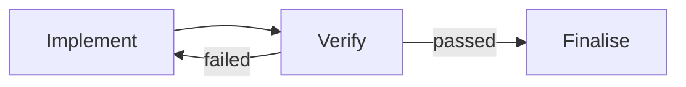
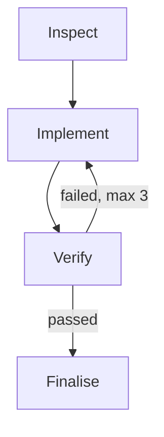

# Extending Sero Orchestrator into a Dynamic Workflow Graph

Status: architecture analysis and recommendation  
Scope: `plugins/sero-orchestrator-plugin` on `main`  
Date: 2026-07-21

## Executive summary

Sero Orchestrator already executes a graph, but it is a deliberately restricted one: a static, acyclic dependency graph with optional variable-matched branches. That gives it deterministic readiness, parallel execution, restart safety, and a single finalisation point. It does not support revisiting a previous step within a run, selecting an undeclared destination at runtime, or treating the plan as a general network.

The important architectural constraint is not the `dependsOn` syntax. It is the runtime state model. `loop.runtime.stepStates` stores one mutable state per step definition. Once a step succeeds, that state represents both the definition and its sole execution in the current iteration. Simply permitting a dependency cycle would therefore create ambiguous questions:

- Is a second visit to a step a retry, a reset, or a new execution?
- Which outcome should downstream steps read?
- Which variables belong to which pass?
- What happens to work already running on another branch?
- How are limits, recovery decisions, logs, and completion attributed?

The recommended direction is a versioned workflow graph with two distinct layers:

1. **Definition layer:** immutable node definitions and declared transitions.
2. **Execution layer:** durable activation instances and transition tokens.

A backward route creates a new activation of the target node. It never erases or reuses the earlier activation. Dynamic routing selects only among transitions declared in the validated plan. Topology changes remain plan revisions.

This is closer to a small durable workflow engine or coloured Petri net than to a more permissive `dependsOn` array. It preserves the existing single-coordinator model while making cycles, sub-loops, joins, and runtime-selected paths explicit and auditable.

The safest delivery path is incremental:

1. Introduce a graph intermediate representation while continuing to run existing DAG plans.
2. Replace singleton step execution state with an activation ledger plus a derived status projection.
3. Add declared dynamic transitions and explicit route selection.
4. Add bounded feedback transitions for controlled cycles.
5. Add nested subgraphs only if reusable or independently governed sub-loops are required.

## What exists today

### The plan is already a DAG

`LoopPlan.steps` is an ordered list, but `LoopStepDefinition.dependsOn` supplies the real topology. The order is a deterministic scheduling and display order. `computeReadySteps` starts any pending or ready step whose dependencies have succeeded or been skipped, subject to attempt and concurrency limits.

The validator enforces:

- unique step IDs;
- valid dependency references;
- no self-dependencies;
- an acyclic dependency graph;
- exactly one sink, used as the finalisation step;
- structurally valid execution targets;
- routing guards whose variables are produced by a dependency ancestor.

This is a strong foundation. The engine already supports fan-out, parallel work, fan-in, durable outcomes, and deterministic resumption.

### Branching is static topology plus dynamic guard values

Branching uses two fields on a step:

- `produces` declares routing variables written by an upstream judge step;
- `when` determines whether a guarded step runs by matching one variable.

Before readiness is computed, `resolveBranchSkips` marks non-matching guarded steps as skipped. Because `skipped` satisfies dependencies, an unguarded convergence step can continue after the selected path completes.

This is effective for optional stages and N-way forks, but the possible routes are fixed at planning time. The runtime changes only values, not topology.

### Repetition currently exists at two outer layers

There are two forms of repetition, neither of which is a graph cycle:

- Recovery can retry a failed step or revise the plan. This mutates or resets the singleton state for that step.
- Scheduled and event-driven loops use `rearmLoop` to reset all step states and variables for a new run.

These mechanisms are intentionally outside the dependency graph. The planner prompt explicitly forbids wait and repeat steps.

### Runtime state assumes one execution per step per run

The main structures that encode this assumption are:

- `LoopRuntimeState.stepStates: Record<stepId, StepRuntimeState>`;
- `StepRuntimeState.outcome`, which holds one latest outcome;
- `LoopRun.startedStepIds`, which identifies definitions rather than execution instances;
- readiness checks that read the single state of each dependency;
- finalisation checks that identify the single graph sink by step ID;
- global variables that are shallow-merged as steps finish.

Attempts provide history, but they are attached to a singleton step state and are treated as retries of that definition. They do not represent multiple successful visits through the same node.

## Why simply allowing dependency cycles will not work

Removing `findCycle` validation would not create a functioning cyclic workflow.

Consider:



After the first `Implement` succeeds, its step state is `succeeded`. If `Verify` routes back:

- resetting `Implement` to `pending` loses the distinction between pass 1 and pass 2;
- leaving it `succeeded` prevents it from running again;
- resetting `Verify` and downstream states creates cascading invalidation rules;
- variables from pass 1 remain in the global map unless selectively removed;
- a concurrent branch may have consumed pass 1 and could already be running;
- the original attempt budget does not clearly describe traversal limits;
- after a restart, readiness cannot tell which traversal was in progress.

Cycles therefore require a different execution identity model. A step definition may be visited many times, and each visit must have its own durable identity, input snapshot, outcome, attempts, and route decision.

## Design options

| Option | Description | Advantages | Problems | Recommendation |
| --- | --- | --- | --- | --- |
| Relax the current DAG | Permit cycles in `dependsOn` and reset step states | Small schema change | Ambiguous history, invalidation, variables, joins, restart behaviour, and limits | Reject |
| Structured `repeat` blocks | Add a bounded repeat construct around a nested DAG | Easy to reason about, safe boundaries | Does not provide general network routing and complicates planner authoring | Useful later for UX sugar |
| Plan revision for every backward route | Ask recovery to generate a revised unrolled DAG | Reuses existing machinery | Expensive, slow, noisy, and destroys stable topology | Keep only for genuine topology changes |
| Token-driven workflow graph | Nodes are definitions; tokens create durable node activations | General routing, cycles, joins, strong history, restart safe | Largest runtime change | Recommended |

## Recommended model

### Separate nodes from transitions

Use a version 2 plan that makes control flow first-class:

```ts
interface LoopPlanV2 {
  schemaVersion: 2;
  revision: number;
  objective: string;
  nodes: WorkflowNodeDefinition[];
  transitions: WorkflowTransition[];
  entryNodeIds: string[];
  finalNodeId: string;
  globalInstructions?: string;
  variablesSchema?: unknown;
}

interface WorkflowNodeDefinition {
  id: string;
  title: string;
  instructions: string;
  expectedOutcome?: string;
  execution: StepExecutionTarget;
  maxAttempts?: number;
  gate?: 'approval';
  join?: {
    mode: 'any' | 'all-resolved';
  };
  routing?:
    | { mode: 'all' }
    | { mode: 'guarded'; variable: string; selection: 'first-match' | 'all-match' }
    | { mode: 'explicit'; minSelections?: number; maxSelections?: number };
}

interface WorkflowTransition {
  id: string;
  from: string;
  to: string;
  kind: 'forward' | 'feedback';
  routeGroup?: string;
  when?: {
    in?: Array<string | number | boolean>;
    default?: true;
  };
  maxTraversalsPerRun?: number;
  label?: string;
}
```

The exact field names can change, but the separation is important:

- Nodes describe work.
- Transitions describe permitted movement.
- An explicit final node retains current completion semantics.
- `feedback` is a visible, validated capability rather than an accidental cycle.
- A route choice can never name an arbitrary step. It selects a declared transition ID.

### Record activations, not only step states

Each visit to a node becomes a durable activation:

```ts
interface NodeActivation {
  id: string;
  runId: string;
  nodeId: string;
  sequence: number;
  status: 'queued' | 'ready' | 'running' | 'succeeded' | 'failed' | 'blocked' | 'skipped' | 'cancelled';
  inputTokenIds: string[];
  variableSnapshotVersion: number;
  attempts: StepAttempt[];
  outcome?: StepOutcomeV2;
  selectedTransitionIds?: string[];
  createdAt: string;
  startedAt?: string;
  endedAt?: string;
}

interface TransitionToken {
  id: string;
  runId: string;
  transitionId: string;
  fromActivationId?: string;
  toNodeId: string;
  status: 'offered' | 'consumed' | 'suppressed' | 'cancelled';
  routeGroupInstanceId?: string;
  createdAt: string;
}
```

`StepRuntimeState` can remain temporarily as a projection for the existing UI and APIs. It should no longer be the source of truth. A projection could show the latest activation status plus counts such as `visits`, `successfulVisits`, and `activeActivationIds`.

### Use transition tokens for readiness

The engine should compute readiness from tokens rather than from a definition's previous outcome.

For each completed activation:

1. Evaluate its outgoing transition policy.
2. Persist selected and suppressed transitions.
3. Emit a token for each selected transition.
4. Create a target activation when its join policy is satisfied.
5. Consume the relevant tokens atomically when the activation is created.

This provides a clean answer to revisiting a node. A feedback token arriving at `Implement` creates `activation-implement-2`; it does not mutate `activation-implement-1`.

### Preserve deterministic joins

Joins are the hardest part of a network workflow. The current DAG gets them for free because every dependency eventually has a succeeded or skipped outcome. The graph model should retain this useful property.

Recommended initial join modes:

- `any`: one incoming selected token creates an activation. Useful for alternatives converging into one continuation.
- `all-resolved`: wait until every transition in the same declared incoming join group has been resolved as selected or suppressed, then create one activation if at least one path was selected.

The engine should persist both selected and suppressed route results. A suppressed transition is the graph equivalent of today's skipped step and prevents an `all-resolved` join from waiting forever for a path that was not chosen.

Do not begin with arbitrary boolean joins. Named join groups plus `any` and `all-resolved` cover the existing branch and parallel patterns while remaining explainable.

### Keep dynamic routing bounded by the plan

Two routing modes cover most needs.

#### Guarded routing

This is the graph equivalent of today's `produces` plus `when` behaviour:

- a node records a route variable;
- outgoing transitions match the value;
- a default transition can catch unexpected values;
- the engine performs mechanical matching.

Moving guards onto transitions removes the need to repeat the same `when` condition on every node in a branch. The route is attached to the edge where the decision actually occurs.

#### Explicit routing

For genuinely dynamic network decisions, allow an outcome to select declared transition IDs:

```ts
interface StepOutcomeV2 extends StepOutcome {
  routing?: {
    take: string[];
    reason: string;
  };
}
```

The executor prompt lists the node's legal outgoing transitions, including IDs, labels, destinations, and descriptions. The runtime validates that:

- every selected transition starts at the current node;
- selection count obeys the node's policy;
- no undeclared destination is selected;
- a required route is present on success;
- feedback traversal limits are still available.

The same defence-in-depth pattern already used by `route-contract.ts` applies: instruct, repair in-session, then convert an invalid success into `needs-revision`.

Dynamic routing should not dynamically create nodes or edges. If the model discovers that the declared graph is inadequate, recovery uses `revise-plan`, just as it does today.

## Controlled feedback and sub-loops

### Feedback transitions must be explicit and bounded

Every transition that closes a cycle should be marked `kind: 'feedback'`. Validation should reject an unlabelled cycle.

Each feedback transition or containing cycle scope needs at least one hard bound:

- `maxTraversalsPerRun` on the feedback transition;
- a loop-level `maxNodeActivationsPerRun`;
- the existing wall-clock, token, cost, and total-attempt limits.

The graph-specific traversal limit is still required even when global limits exist. It produces a useful, local explanation such as `verification-to-implementation exhausted after 3 traversals` rather than a generic token or wall-clock failure.

When a feedback route is selected after its limit is exhausted, send the outcome through recovery. The decider can revise the plan, wait, or block the loop. The engine must never silently take a different route.

### Start with barrier-safe feedback

General cycles mixed with live parallel branches require cancellation and compensation semantics. The first implementation should permit feedback only when the routing activation is a barrier for its cycle scope:

- no other activation in that scope is running;
- the node selects either a feedback path or a forward exit, not both;
- the feedback target is inside the same declared cycle scope;
- external delivery and approval nodes cannot sit inside the cycle unless explicitly marked idempotent.

This supports the common implement, verify, fix pattern without initially solving distributed rollback.

### Model a sub-loop as a scoped graph when isolation is needed

A backward transition is enough for a local iteration:



A nested subgraph is justified when the repeated region needs its own:

- variables and input/output mapping;
- limits and completion rule;
- reusable library identity;
- isolated history in the UI;
- cancellation boundary.

That can later be represented as a `subgraph` execution target or composite node:

```ts
interface SubgraphNodeDefinition extends WorkflowNodeDefinition {
  execution: {
    type: 'subgraph';
    graph: LoopPlanV2;
    inputs?: Record<string, string>;
    outputs?: Record<string, string>;
    limits?: LoopLimits;
  };
}
```

Do not make nested subgraphs a prerequisite for basic feedback. They add useful structure but also recursive validation, nested cancellation, nested limits, and more complex UI.

## Variables and data flow

The current shallow-merged `runtime.variables` works for a DAG where each step usually writes once. Cycles make stale data much more dangerous.

Recommended changes:

- Keep loop-level variables for durable shared facts and user answers.
- Add a monotonic variable version or append-only variable patch log.
- Store the variable snapshot version read by each activation.
- Store the patch written by each activation.
- Provide cycle-scoped variables for pass-local values.
- Require explicit merge policies for parallel writes to the same key.

An initial policy can remain simple:

- last commit wins for ordinary keys, preserving current behaviour;
- `notes` continues to append;
- route variables are activation-local and copied onto transition records;
- validation warns when concurrently executable nodes declare the same produced key.

Route evaluation should use the completing activation's outcome, not a later value read from the global map. This eliminates a class of races where another activation overwrites the routing variable before transitions are resolved.

## Completion semantics

The existing explicit completion signal should remain. It is one of the architecture's strongest safety properties.

For graph plans:

- only an activation of `finalNodeId` may complete the loop;
- the final node is reached through transitions like any other node;
- a `complete` signal is accepted only if no non-cancelled activation or token remains in the same run, unless the graph explicitly declares that finalisation cancels them;
- a recurring loop still completes one iteration without permanently completing the schedule;
- a blocked signal remains valid from any node;
- delivery receipt and approval enforcement remain on the same outcome path.

Initially, retain exactly one final node and require every permitted execution path to reach it or a planned block. Multiple terminal nodes can be added later, but they complicate delivery and completion proof without adding much value.

## Failure and recovery semantics

Recovery should target an activation first, then the definition if it revises topology or instructions.

- `retry-activation`: rerun the same activation with another attempt and the same logical inputs.
- `revise-node`: revise the node definition and create a replacement activation.
- `revise-plan`: create a new graph revision and migrate or terminate outstanding tokens according to a defined migration decision.
- `skip-activation`: mark the activation skipped and resolve its outgoing route according to an explicit skip policy.
- `reroute`: select another declared outgoing transition when the plan allows recovery routing.
- `wait` and `block-loop`: retain their current meaning.

The current `retry-step` name can remain as a compatibility alias, but internally it should address an activation ID. A retry is not the same as a later successful revisit through a feedback transition.

Plan revision while a graph is active needs a conservative rule. The first version should permit revision only at a quiescent point with no running activations. Existing completed activations stay in history; unconsumed tokens are either mapped by stable transition IDs or cancelled with a recorded migration decision.

## Persistence and restart safety

The activation and token ledger should be persisted as part of the run, with a bounded runtime projection on the loop record. Large histories can follow the existing artifact and digest approach.

Each engine tick should atomically persist:

1. completed activation outcome;
2. selected and suppressed transitions;
3. new tokens;
4. newly created activations;
5. the updated projection and limits.

The current per-loop lock and single coordinator remain appropriate. `commit` already protects concurrent trigger, event, disable, and rerun changes. Its merge rules need to be extended so coordinator-enqueued graph events and engine-authored activation changes do not overwrite one another.

On restart, reconciliation should:

- mark orphaned running attempts as it does today;
- retain their activation identities;
- retry or recover those activations according to policy;
- rebuild the derived projection from the ledger;
- consume no token twice;
- create no duplicate activation for the same join resolution.

Stable idempotency keys should be derived from `runId + nodeId + sorted inputTokenIds`. This makes activation creation safe to replay after a crash.

## Validation requirements

`validateLoopPlan` should become version-aware. Version 2 validation should cover:

### Structural validation

- unique, path-safe node and transition IDs;
- valid entry, final, source, and destination references;
- no transition from the final node unless explicitly supported later;
- a routing policy compatible with the outgoing transitions;
- unique defaults per route group;
- legal join definitions and named join groups;
- approval and delivery shape rules adapted from the current plan validation.

### Graph validation

- every node is reachable from an entry;
- the final node is reachable from every forward path;
- every strongly connected component is either a single acyclic node or contains a declared feedback transition;
- every cyclic strongly connected component has a hard traversal bound and a reachable exit;
- feedback targets respect cycle scopes;
- barrier-safe feedback constraints hold in the first implementation;
- no cycle can consist entirely of model-only routing nodes with no management bound or meaningful progress step.

### Data and routing validation

- guarded transitions read a variable produced by their source activation or a declared input;
- explicit routing nodes have at least one outgoing transition;
- selection counts are possible given the outgoing transition count;
- `all-resolved` joins name the exact route or fork group they await;
- parallel producers of the same variable are rejected or require a merge policy.

Validation errors should include a concrete cycle or path, continuing the useful behaviour of `findCycle` today.

## Planner changes

The planner should still default to the smallest linear plan. Graph features should be opt-in when the goal benefits from them.

Prompt guidance should distinguish:

- ordinary forward sequencing;
- fan-out and join;
- guarded alternatives;
- explicit dynamic routing;
- bounded feedback for iterative improvement;
- recurring schedules, which remain outer loop triggers rather than graph cycles.

Important planner rules:

- Use feedback only when a later result can cause earlier work to be repeated within the same item or event.
- Never use feedback to express `every hour`, `watch for events`, or process an unbounded queue. Existing triggers own those behaviours.
- Every feedback edge needs a concrete progress reason and traversal bound.
- Put external side effects after the feedback region wherever possible.
- Route only through declared transition IDs.
- Keep one final node outside all feedback cycles.
- Use plan revision when new work types or destinations are discovered; use routing when choosing among already declared paths.

Planning repair should receive version 2 graph validation errors. A graph summary including entries, exits, strongly connected components, and delivery nodes would give the repair model better context than raw JSON alone.

## Engine changes by current module

| Current area | Change |
| --- | --- |
| `shared/types.ts` | Add versioned graph definitions, activations, transition tokens, graph run limits, and outcome routing. Keep v1 types readable. |
| `runtime/schema.ts` | Add v2 structural and graph validation. Retain v1 DAG validation. |
| `runtime/readiness.ts` | Add token and join-based readiness. Keep current readiness as the v1 adapter. |
| `runtime/branching.ts` | Move v2 routing to transition resolution. Continue using this module for v1 plans. |
| `runtime/route-contract.ts` | Generalise to legal transition selection and activation-local route values. |
| `runtime/run-engine.ts` | Schedule activation IDs, persist routing results atomically, enforce traversal limits, and detect quiescence. |
| `runtime/outcomes.ts` | Apply outcomes to activations, append variable patches, and accept completion only from the final activation. |
| `runtime/recovery-apply.ts` | Address activations, separate retry from revisit, and define graph revision migration. |
| `runtime/scheduler.ts` | Rearm a run by creating entry tokens rather than resetting singleton step states. |
| `runtime/plan-mapping.ts` | Compile v1 plans into graph IR and derive compatibility projections. |
| `runtime/executors/prompt.ts` | Include activation context and legal outgoing transition IDs in the step contract. |
| `ui/lib/plan-levels.ts` | Replace level-only layout for v2 with a graph layout that can render cycles and repeated activations. |

## Compatibility strategy

Do not migrate all persisted loops in place on first load. Introduce an internal graph IR and adapters.

### Version 1 adapter

Compile an existing v1 plan into the graph IR:

- each step becomes a node;
- each `dependsOn` relation becomes a forward transition;
- `when` guards become route metadata on the relevant transition or a compiler-generated route gateway;
- the dependency-free steps become entries;
- the existing single sink becomes `finalNodeId`;
- the adapter uses `all-resolved` joins so skipped branches preserve current convergence behaviour;
- no feedback transitions are generated.

The compiler needs careful handling for v1 guards repeated across multi-step branches. A compiler-generated gateway can preserve exact skip semantics without forcing an immediate persisted schema migration.

### Runtime rollout

1. Execute compiled v1 graphs through a shadow interpreter in tests and compare outcomes with the current engine.
2. Add activation and token persistence behind a feature flag for newly created v2 plans.
3. Keep v1 authoring and execution available until parity is proven.
4. Offer an explicit save-as-v2 action for library definitions rather than silently rewriting them.
5. Version library and catalog definitions independently so old clients can reject unsupported graph plans cleanly.

## UI implications

The current dependency-level layout is suitable for DAGs but cannot faithfully render feedback.

Use two related views:

- **Definition graph:** nodes and transitions, with feedback edges visually distinct, route labels, joins, limits, and the final node.
- **Run trace:** activation instances in chronological order, grouped by node and cycle pass, with the selected path highlighted.

The definition graph answers `what can happen?`; the run trace answers `what did happen?`.

For an iterative path, the UI should show `Implement #1`, `Verify #1`, `Implement #2`, and `Verify #2`, not make one node flicker back to pending. This is another reason activation identity is fundamental.

The first UI need not be a free-form graph editor. The planner can remain the author and Refine can remain the topology-edit mechanism. Read-only graph visualisation plus clear route and traversal history is enough for the first release.

## Observability and limits

Add graph-specific run metrics:

- total activations;
- activations per node;
- traversals per transition;
- feedback traversals per cycle scope;
- selected and suppressed route counts;
- tokens waiting at joins;
- current active path or paths;
- time and usage per activation and per cycle pass.

Suggested new limits:

```ts
interface GraphLimits {
  maxNodeActivationsPerRun?: number;
  maxTransitionTraversalsPerRun?: number;
  maxFeedbackTraversalsPerRun?: number;
  maxActiveTokens?: number;
}
```

Existing `maxAttemptsTotal`, wall-clock, token, cost, and concurrency limits remain and apply across all activations.

## Example plan

This example performs implementation and verification, routing back for at most three fixes before finalisation:

```json
{
  "schemaVersion": 2,
  "revision": 0,
  "objective": "Implement and verify the requested change",
  "entryNodeIds": ["implement"],
  "finalNodeId": "finalise",
  "nodes": [
    {
      "id": "implement",
      "title": "Implement or fix",
      "instructions": "Implement the change. On later visits, use the latest verification findings.",
      "execution": { "type": "background-agent", "model": "MED" },
      "routing": { "mode": "all" }
    },
    {
      "id": "verify",
      "title": "Verify",
      "instructions": "Run verification and select passed or needs-fix. Record concise findings.",
      "execution": { "type": "background-agent", "model": "MED" },
      "routing": { "mode": "explicit", "minSelections": 1, "maxSelections": 1 }
    },
    {
      "id": "finalise",
      "title": "Finalise",
      "instructions": "Confirm the objective is met and emit the completion signal.",
      "execution": { "type": "model", "model": "LOW" },
      "routing": { "mode": "all" }
    }
  ],
  "transitions": [
    {
      "id": "implemented",
      "from": "implement",
      "to": "verify",
      "kind": "forward"
    },
    {
      "id": "passed",
      "from": "verify",
      "to": "finalise",
      "kind": "forward",
      "label": "Verification passed"
    },
    {
      "id": "needs-fix",
      "from": "verify",
      "to": "implement",
      "kind": "feedback",
      "maxTraversalsPerRun": 3,
      "label": "Apply verification findings"
    }
  ]
}
```

At runtime, `Verify #1` selects either `passed` or `needs-fix`. Selecting `needs-fix` creates `Implement #2`. The history of `Implement #1` remains immutable. If the third feedback traversal still fails, the route is refused and recovery decides whether to revise, wait, or block.

## Testing strategy

### Compatibility

- Compile representative v1 linear, parallel, optional, N-way, nested-branch, approval, and recurring plans into graph IR.
- Assert identical start order, skips, outcomes, completion, and delivery enforcement.
- Property-test random acyclic v1 plans against both readiness implementations.

### Graph execution

- one forward path;
- fan-out plus `all-resolved` join;
- exclusive branch plus `any` join;
- explicit single-route selection;
- explicit multi-route selection;
- bounded feedback followed by exit;
- feedback limit exhaustion;
- restart after token emission but before activation creation;
- restart during a repeated activation;
- concurrent route completion into one idempotent join;
- stale or illegal transition selection converted to `needs-revision`;
- final node reached while another activation is live;
- recurring run creates fresh entry tokens and no stale cycle variables.

### Validation

- unreachable node;
- invalid transition endpoint;
- undeclared cycle;
- cyclic component with no exit;
- feedback with no bound;
- feedback through an external side effect;
- ambiguous default route;
- impossible join;
- parallel variable collision;
- final node with outgoing edges.

### Recovery and revision

- retry activation without creating a new logical visit;
- feedback revisit creates a new activation;
- revise node at a quiescent point;
- reject or safely migrate a plan revision with outstanding tokens;
- preserve approval and delivery receipt constraints across revisits.

## Proposed implementation phases

### Phase 0: Semantics specification

Before code, settle the following decisions:

- exact transition selection and join semantics;
- variable snapshot and merge rules;
- barrier-safe feedback restrictions;
- graph revision migration at quiescent points;
- external side-effect idempotency inside cycles;
- ledger retention and projection shape.

### Phase 1: Graph IR and v1 compiler

- Add internal node, transition, and join types.
- Compile v1 plans without changing persisted data.
- Add graph validation and equivalence tests.
- Render the compiled definition graph read-only.

### Phase 2: Activation runtime for acyclic graphs

- Add activation and token persistence.
- Run new acyclic v2 plans through token readiness.
- Derive the existing step-state projection.
- Prove crash replay and join idempotency.

### Phase 3: Declared dynamic routing

- Add guarded and explicit transition selection.
- Generalise route contract enforcement.
- Update planner, repair prompts, run trace, and validation.

### Phase 4: Bounded feedback

- Add feedback transitions, cycle scopes, traversal counters, and barrier rules.
- Update recovery to distinguish retry from revisit.
- Add cycle-focused restart, limit, delivery, and concurrency tests.

### Phase 5: Composite subgraphs

- Add only if real workflows need reusable nested boundaries.
- Define input/output mapping, nested limits, cancellation, and library versioning.

## Decisions to avoid in the first version

- Arbitrary destinations named by model output.
- Runtime creation or deletion of graph nodes without a plan revision.
- Unbounded cycles.
- Multiple final nodes.
- General boolean joins.
- Cancelling already-running parallel branches as an implicit effect of routing.
- Automatic rollback or compensation for external side effects.
- A free-form visual graph editor before execution semantics are stable.

## Final recommendation

Evolve Sero Orchestrator from a step-state DAG into a token-driven workflow graph, but preserve its current discipline:

- planner-authored, structurally validated topology;
- coordinator-owned execution and persistence;
- declared routes only;
- explicit completion;
- hard management limits;
- model-decided recovery through validated actions;
- full durable history.

The central change is to make a node visit an entity in its own right. Once an activation can exist independently of its node definition, backward transitions, repeated verification, dynamic route selection, and network-shaped workflows become natural. Without that change, cycles would be state resets disguised as graph execution and would undermine the durability guarantees that make Orchestrator valuable.
