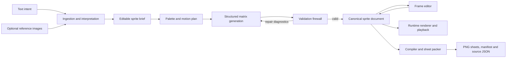

# Sero Design Library: Pixel Studio Feature Specification

**Status:** Concept proposal
**Plugin:** `@sero-ai/plugin-design-library`
**Directory:** `plugins/sero-design-library-plugin`
**Proposed surface:** `Sprites`
**Companion prototype:** `docs/prototypes/sero-design-library-pixel-studio.html`

## 1. Summary

Pixel Studio is an AI-assisted pixel art and animation workbench inside the Sero Design Library plugin.

A user describes a sprite in natural language and may attach visual references from the Library. Sero interprets the request, proposes a constrained palette and animation plan, then uses a configured model to author structured pixel data. The model never supplies the final sprite sheet image. It supplies palette-indexed matrices and bounded patches which are validated, materialised, edited and compiled by deterministic code.

The canonical output is an editable, versioned sprite document. PNG sprite sheets, preview images and engine manifests are build artefacts derived from that document.

> AI proposes pixels. The engine owns geometry, consistency, rendering and export.

## 2. Goals

- Generate original 2D pixel art and short animations from text, with optional visual references.
- Represent all sprite frames as strict palette-indexed integer matrices.
- Prevent frame-to-frame drift in size, anchor, palette, silhouette and important identity details.
- Let users edit every frame directly when the generated result needs small corrections.
- Compile the same source data reproducibly into razor-sharp sprite sheets and metadata.
- Keep the matrix model, validator, renderer, packer and playback logic independent of Sero so they can later be extracted for use by a game engine.
- Reuse Sero's existing plugin runtime, structured AI, model selection, background jobs, storage and provider-neutral media capabilities.

## 3. Non-goals for the first release

- Asking an image generation model to produce a finished raster sprite sheet.
- Bone rigs, skeletal animation or 3D-to-2D rendering.
- Tile maps, terrain autotiling or procedural level generation.
- Arbitrary layer compositing and blend modes.
- Automatic eight-direction character sets.
- Engine-specific exporters for Unity, Godot, Unreal, Phaser or PixiJS.
- Model fine-tuning.

## 4. Product principles

### 4.1 Data is the source of truth

PNG, WebP and GIF files are outputs. The canonical asset is a versioned sprite document containing palette entries, fixed canvas geometry, animations, timings, constraints and full integer matrices.

### 4.2 Deterministic after generation

Given the same valid sprite document and export options, compilation must produce identical logical pixels and metadata. Rendering, scaling, packing and export never call an AI model.

### 4.3 Consistency is enforced, not merely prompted

Frame size, transparent index, palette indexes, anchor, pivot and animation timing are project-level invariants. The model cannot silently change them in an individual frame.

### 4.4 Human edits are first-class

The user can edit every pixel, palette entry, frame duration and animation order. AI changes arrive as reviewable patches and create recoverable revisions.

### 4.5 Provider-neutral architecture

The domain requests capabilities and opaque model IDs. fal.ai-specific endpoints and payloads remain inside its adapter. Matrix generation should normally use Sero's configured structured-output model. fal.ai can optionally generate concept imagery that re-enters through the same interpretation layer as any other reference.

### 4.6 Portable core

The pure pixel engine must not depend on React, Sero, Electron, fal.ai or a browser API. It consumes and emits plain serialisable data.

## 5. Place in the Design Library

Pixel Studio becomes a top-level **Sprites** surface beside Library, Designs, Gallery and Settings.

| Surface | Responsibility |
|---|---|
| Library | Visual references and generated source imagery |
| Designs | Runnable web design generation |
| Sprites | Pixel art, frame editing, animation and sprite-sheet projects |
| Gallery | Intentionally retained immutable outputs |
| Settings | Models, providers and generation defaults |

Sprite projects may use one to six ordered Library references. Imported references are supplied for understanding only. Original images generated by Design Library may be copied into a project as concept material, but no raster reference bypasses the matrix-generation contract.

The feature should remain self-contained in `plugins/sero-design-library-plugin`. Host changes are acceptable only when they expose a reusable generic capability for external plugins.

## 6. User workflow

1. **Create project**
   - Describe the subject, view, action and visual style.
   - Optionally select Library references.
   - Choose logical canvas size, palette limit and initial animation.

2. **Interpret**
   - Sero turns text and reference observations into one editable sprite brief.
   - It identifies the readable silhouette, important identity features, proportions, colour roles and details that should be removed at the requested resolution.

3. **Plan**
   - Sero proposes the palette, anchor, pivot, ground line, key poses, frame timing, contact points and change bounds.
   - The user can lock or edit these constraints before matrix generation.

4. **Generate**
   - The model authors one complete canonical keyframe.
   - Later frames are generated as bounded patches against a named source frame.
   - Deterministic code materialises every patch into a complete candidate matrix.

5. **Validate and repair**
   - Invalid structures are rejected before rendering.
   - Consistency diagnostics identify likely drift, flicker and loop discontinuity.
   - A bounded repair run receives machine-readable failures and only the relevant frame context.

6. **Edit and preview**
   - The user edits pixels directly with onion skinning and normal pixel tools.
   - Animation playback uses the canonical matrices, anchors and durations.
   - AI editing proposes visible diffs which can be applied or rejected.

7. **Compile and export**
   - Pure deterministic code renders frames, packs sheets and writes metadata.
   - The export bundle includes the canonical source document so it can always be rebuilt.

## 7. Conceptual architecture



The architecture is divided into six decoupled areas:

1. ingestion and interpretation;
2. generation orchestration;
3. validation and repair;
4. canonical document persistence;
5. editing and playback;
6. deterministic compilation and export.

AI-specific code ends at the validation boundary. Everything after it operates on the canonical sprite document.

# 8. Ingestion and interpretation layer

## 8.1 Unified output for text and images

Text-only and multimodal requests produce the same editable `SpriteBrief`. Downstream stages do not care where an observation originated.

```ts
interface SpriteBrief {
  schemaVersion: 1;
  subject: string;
  view: 'side' | 'front' | 'back' | 'three-quarter' | 'top-down' | 'isometric';
  action: string;
  styleTerms: string[];
  proportions: string[];
  silhouetteRules: string[];
  materialRules: string[];
  animationRules: string[];
  always: string[];
  never: string[];
  referenceObservations: ReferenceObservation[];
}
```

Generated fields and user overrides should follow the existing Librarian pattern: re-interpretation replaces untouched generated values without overwriting manual edits.

## 8.2 Text-only interpretation

The configured Sero model converts prose into explicit low-resolution constraints:

- subject and view direction;
- intended occupied bounds within the canvas;
- major colour roles;
- readable silhouette and identity features;
- proportions and material separation;
- action phases and contact points;
- details which cannot survive at the selected resolution;
- rules that must hold across every frame.

The UI should surface impossible combinations before generation. A 16x16 sprite cannot reliably retain several tiny accessories and detailed facial animation. The interpretation should propose simplification rather than allowing the generation stage to produce noise.

## 8.3 Reference-image interpretation

Reference handling combines deterministic preprocessing with multimodal reasoning.

### Deterministic preprocessing

The plugin prepares bounded derived observations:

1. normalise orientation and colour format;
2. identify or let the user choose the subject crop;
3. fit the crop to the target logical aspect ratio;
4. derive a coarse occupancy mask;
5. produce candidate palettes at several colour limits;
6. identify high-contrast edges and connected colour regions;
7. calculate aspect ratio, centre of mass and dominant colour areas.

These artefacts are interpretation aids, not final sprite pixels.

### Multimodal reasoning

A vision-capable Sero model receives the original reference through a plugin-owned custom tool plus the deterministic observations. It decides what matters at pixel resolution:

- silhouette and proportion;
- distinctive clothing, equipment or anatomy;
- palette mood and material separation;
- readable pose and motion;
- details to simplify or remove.

As with existing Library analysis, a run that does not call the image-access tool must not be accepted as a valid reference interpretation.

## 8.4 Palette proposal

Deterministic quantisation supplies candidate colours. The model assigns semantic roles such as outline, deepest shadow, body mid-tone, highlight, accent and effect.

Rules:

- index `0` is always transparent;
- remaining indexes are stable within a revision;
- colours may be locked before generation;
- reordering colours in the UI never renumbers matrix values;
- merging colours performs an explicit deterministic index migration across all frames.

# 9. Data generation layer

## 9.1 Treat the model as a constrained spatial calculator

The model is never asked to "create a sprite sheet". It is asked to solve a finite spatial task with:

- a fixed width and height;
- a fixed palette and index meanings;
- a fixed anchor, pivot and optional ground line;
- a named source frame;
- an allowed change region;
- a motion intent for the target frame;
- protected identity masks;
- a maximum changed-cell budget.

## 9.2 Plan before pixels

Each animation begins with a compact, editable plan.

```ts
interface AnimationPlan {
  name: string;
  fps: number;
  loopMode: 'loop' | 'once' | 'ping-pong';
  direction: string;
  frames: Array<{
    id: string;
    phase: number;
    sourceFrameId?: string;
    pose: string;
    contactPoints: Array<{
      name: string;
      x: number;
      y: number;
      locked: boolean;
    }>;
    allowedChangeBounds: Rect;
    maxChangedCells: number;
  }>;
}
```

The plan gives the user a comprehensible animation structure before tokens are spent generating matrices.

## 9.3 Canonical keyframe plus frame patches

The first approved pose is generated as a complete matrix. Later frames are generated as patches against a known source frame.

```ts
interface FramePatch {
  sourceFrameId: string;
  targetFrameId: string;
  changes: Array<{
    x: number;
    y: number;
    paletteIndex: number;
  }>;
}
```

The engine applies the patch to the source matrix and produces a full candidate target matrix. The patch remains in provenance, while the materialised full matrix becomes editable canonical state.

This is the primary defence against pixel drift. Unchanged cells are copied exactly by code rather than recreated probabilistically by the model.

## 9.4 Key poses and in-betweens

For longer animations:

1. generate and approve key poses;
2. generate in-between frames from the nearest approved key pose;
3. preserve explicit motion arcs and contact points;
4. mirror directions deterministically where valid;
5. generate asymmetric directional details only when mirroring would be visually wrong.

The model should not generate a long animation as one unbounded response.

## 9.5 Protected regions

A project may define masks or semantic regions such as head, face, torso emblem, weapon grip and grounded foot. Each region can be:

- `locked`;
- `translation-only`;
- `palette-locked`;
- `free`.

These behaviours are enforced by validation rather than repeated as soft prompt instructions.

## 9.6 AI editing

AI edits use the same patch protocol:

- edit selected cells only;
- repair one frame;
- create an in-between frame;
- adjust a named region across frames;
- rebalance palette usage without changing silhouette;
- add or remove a small detail.

The UI shows a visual diff, changed-cell count and affected constraints before application. Applying the patch creates a recoverable revision.

# 10. Canonical sprite document

```ts
interface SpriteDocument {
  schemaVersion: 1;
  id: string;
  name: string;
  revision: number;
  canvas: {
    width: number;
    height: number;
    pixelAspectRatio: 1;
    anchor: Point;
    pivot: Point;
    groundLine?: number;
  };
  palette: PaletteEntry[];
  animations: SpriteAnimation[];
  regions: SpriteRegion[];
  provenance: SpriteProvenance;
}

interface PaletteEntry {
  index: number;
  name: string;
  rgba: [number, number, number, number];
  role?: string;
  locked?: boolean;
}

interface SpriteAnimation {
  id: string;
  name: string;
  fps: number;
  loopMode: 'loop' | 'once' | 'ping-pong';
  frames: SpriteFrame[];
}

interface SpriteFrame {
  id: string;
  name: string;
  durationMs: number;
  rows: number[][];
  tags?: string[];
  contactPoints?: Array<{ name: string; x: number; y: number }>;
}

interface SpriteRegion {
  id: string;
  name: string;
  mask: boolean[][];
  behaviour: 'locked' | 'translation-only' | 'palette-locked' | 'free';
}
```

Full row-major matrices are deliberately simple. They are language-agnostic, easy to inspect and diff, and trivial for a future runtime to consume. Internal storage may optionally use a lossless compact encoding, but source export must support the plain form.

# 11. Validation firewall

Validation is a hard boundary between model output and canonical state.

## 11.1 Schema and resource limits

Reject immediately when:

- required fields are missing;
- values have the wrong type;
- dimensions exceed configured limits;
- frame, palette or patch counts exceed limits;
- coordinates or indexes are not integers;
- the payload exceeds a bounded generation budget.

## 11.2 Matrix integrity

Reject when:

- row count differs from canvas height;
- any row length differs from canvas width;
- a cell references a missing palette index;
- a patch coordinate is outside the canvas;
- a patch writes the same coordinate more than once;
- a patch modifies a locked cell or region;
- frame identifiers are duplicated or unresolved.

## 11.3 Project invariants

Reject or require an explicit project migration when:

- a frame changes canvas dimensions;
- anchor or pivot changes inside an individual frame;
- transparent index is missing or not index `0`;
- palette indexes are silently renumbered;
- frame timing is zero or negative;
- a target frame cannot materialise from its declared source.

## 11.4 Consistency diagnostics

These checks usually produce warnings and scores rather than hard failures:

- occupied bounding-box movement beyond the planned motion;
- unexpected centre-of-mass movement;
- large silhouette-area changes;
- disconnected one-pixel islands;
- flickering palette-role counts;
- movement of locked contact points;
- unstable outline thickness;
- first-to-last frame discontinuity in a loop;
- protected-region topology changes outside allowed bounds.

The user can accept warnings, edit manually or request repair.

## 11.5 Repair protocol

A repair request contains:

- machine-readable validation codes;
- the source matrix;
- the invalid patch or candidate frame;
- the target frame plan;
- locked palette and geometry;
- a bounded instruction to return corrected data only.

Repair attempts are limited. A failed repair leaves the last valid revision untouched and exposes diagnostics to the user.

# 12. Deterministic compilation layer

## 12.1 Logical pixel rendering

The compiler maps one matrix cell to one logical pixel. Transparent cells write zero alpha. Other cells write the exact RGBA value from the palette. There is no interpolation, antialiasing or AI involvement.

## 12.2 Scaling

Display and export scales are positive integers. Scaling uses nearest-neighbour replication. Browser canvas previews always set `imageSmoothingEnabled = false`.

## 12.3 Sheet packing

First release layouts:

- horizontal strip;
- vertical strip;
- fixed-column grid;
- one sheet per animation;
- all animations in one atlas.

Packing order is stable: animation order, then frame order. Padding and optional edge extrusion use integer logical pixels. The pack result records every frame rectangle, anchor, pivot, duration, tags and source animation.

## 12.4 Export bundle

```text
<sprite-name>/
├── sprite.json
├── manifest.json
├── sheets/
│   ├── idle.png
│   └── walk.png
└── preview.png
```

- `sprite.json` is the canonical editable document.
- `manifest.json` contains packed rectangles and playback metadata.
- `sheets/` contains deterministic PNG output.
- `preview.png` is optional presentation-scale output and is not canonical.

## 12.5 Reproducibility

The build record stores:

- sprite document revision and checksum;
- compiler version;
- export options;
- output checksums.

Rebuilding the same revision with the same compiler version and options must produce pixel-equivalent images and byte-equivalent metadata.

# 13. Editing workbench

## 13.1 Layout

The workbench has four durable regions:

- project and animation rail;
- frame timeline;
- central pixel canvas and playback preview;
- inspector with Palette, Frame, Constraints, AI and Validation tabs.

The interface must remain useful in a narrow plugin container. Rails and inspector are collapsible. The timeline switches between horizontal thumbnails and a compact stacked view.

## 13.2 Editing tools

First release:

- pencil;
- eraser;
- fill;
- eyedropper;
- line;
- rectangular selection;
- move and nudge selection;
- copy and paste;
- flip selection;
- undo and redo;
- previous and next onion skin;
- grid, anchor, pivot, bounds and ground-line overlays.

## 13.3 Frame management

Users can:

- add, duplicate, delete and reorder frames;
- set frame duration;
- copy a frame into another animation;
- generate an in-between;
- regenerate or repair the selected frame only;
- compare a frame with its source or previous revision.

## 13.4 Palette management

Users can:

- edit RGBA values;
- lock colours;
- merge entries through an explicit migration;
- inspect usage per frame and animation;
- ask AI for a palette-reduction proposal without applying it automatically.

## 13.5 Revision and autosave behaviour

Every accepted generation, AI patch and editing session creates recoverable history using the existing Design Library durability model. Cell edits autosave continuously, with revision checkpoints on frame change, animation change, export and explicit close.

# 14. Sero integration

## 14.1 Existing capabilities to reuse

- `useAppState()` for lightweight summaries and view state.
- `useAppTools()` for all domain mutations.
- `createAppRuntime()` for the authoritative background coordinator.
- `host.subagents.runStructured()` for interpretation, planning, matrix generation and repair.
- `useAvailableModels()` and `host.models.list()` for configured model selection.
- Plugin-owned custom tools for bounded reference-image access.
- Plugin-owned storage under the app global directory.
- Existing background job, cancellation, retry and restart-recovery patterns.
- Existing provider-neutral media contract for optional concept imagery.

Large matrices must not be placed in reactive state. State contains project summaries, current pointers, validation summaries and view preferences. Full documents and revisions remain in plugin-owned files and are loaded through tools on demand.

## 14.2 Proposed tool groups

| Tool | Actions |
|---|---|
| `design_library_sprites` | create, list, open, rename, duplicate, soft delete, restore, purge |
| `design_library_sprite_generation` | interpret, plan, generate keyframe, generate frame, repair, cancel, retry |
| `design_library_sprite_documents` | read revision, apply cell edits, apply patch, update animation, update constraints |
| `design_library_sprite_palette` | update, lock, merge, propose reduction |
| `design_library_sprite_export` | preview pack, export bundle, export to workspace |

Only bounded read and create actions should be exposed through `bridgeTools` to the main Sero agent.

## 14.3 Capability boundary

The domain requests capabilities such as:

- `vision-interpretation`;
- `sprite-plan`;
- `sprite-keyframe-matrix`;
- `sprite-frame-patch`;
- `sprite-repair-patch`;
- `concept-image`.

Model IDs remain opaque. fal.ai-specific request shapes remain inside its adapter. The matrix capabilities should use Sero structured AI rather than a raster image endpoint.

## 14.4 Generic host extensions, only if proven necessary

Potential reusable host additions are:

- streaming progress for structured subagent runs;
- larger bounded structured artefact handoff through plugin tools;
- generic binary export to workspace or Downloads;
- generic background-job summaries.

The implementation should first prove whether existing contracts are sufficient.

# 15. Extractable pixel engine

Create a dependency-free engine boundary from the start:

```text
plugins/sero-design-library-plugin/
├── pixel-engine/
│   ├── document.ts
│   ├── validation.ts
│   ├── materialise.ts
│   ├── diff.ts
│   ├── render.ts
│   ├── pack.ts
│   ├── playback.ts
│   └── index.ts
├── runtime/sprites/
└── ui/sprites/
```

Suggested pure API:

```ts
validateDocument(document): ValidationResult
validatePatch(document, sourceFrame, patch, constraints): ValidationResult
materialisePatch(sourceFrame, patch): SpriteFrame
diffFrames(before, after): CellChange[]
renderFrame(frame, palette): RgbaBuffer
packSprite(document, options): PackedSprite
renderPackedSprite(packed): RgbaBuffer[]
advanceAnimation(animation, elapsedMs): FrameCursor
```

A future game engine can consume `SpriteDocument` directly, cache rendered frames as textures and use the same timing, anchor, pivot and contact-point data. Static sprite sheets are one output adapter, not the endpoint of the architecture.

# 16. Persistence

```text
sprites/<sprite-id>/
├── record.json
├── references/
├── revisions/<revision-id>/
│   ├── sprite.json
│   ├── provenance.json
│   └── validation.json
├── generations/<generation-id>/
│   ├── brief.json
│   ├── plan.json
│   ├── responses/
│   └── patches/
└── exports/<export-id>/
```

Writes follow the plugin's existing single-authoritative-writer, path locking and revision compare-and-swap rules.

# 17. First-release scope

## Included

- New Sprites surface and project list.
- Text prompts and optional ordered Library references.
- Logical sizes: 16x16, 24x24, 32x32, 48x48 and 64x64.
- Palette limits from 4 to 32 colours with transparent index `0`.
- One view or direction per animation.
- Canonical keyframe plus patch-based frame generation.
- Structural validation, consistency diagnostics and bounded repair.
- Frame-by-frame pixel editor, onion skinning and playback.
- Multiple animations per project.
- Horizontal, vertical and fixed-column sprite-sheet packing.
- PNG sheets, generic JSON manifest and canonical source JSON export.
- Revision history, autosave, cancellation and restart recovery.
- Dependency-free pixel engine with deterministic unit tests.

## Deferred

- Automatic multi-direction character sets.
- Bone rigs and skeletal animation.
- Tile-map and autotile generation.
- Voxel or 3D sprite workflows.
- Arbitrary layers and blend modes.
- GIF, APNG and video export.
- Engine-specific manifests.
- Collaborative editing.
- Custom model training.
- Large pixel illustrations.

# 18. Acceptance criteria

The feature is acceptable when:

1. Text-only and reference-assisted requests produce the same canonical document type.
2. No model response can be rendered or selected as current before structural validation passes.
3. Every frame in an animation has identical dimensions, palette index meanings, anchor and pivot.
4. Unchanged cells in a patch-generated frame are bit-for-bit identical to the source frame.
5. A user can edit any cell and immediately preview the animation.
6. AI edits are reviewable patches and can be rejected or undone.
7. Invalid model output never corrupts the previous valid revision.
8. The same document and export options produce pixel-equivalent sheets on repeated builds.
9. The project exports its canonical source, generic manifest and sprite sheets together.
10. The pixel engine runs in tests without importing Sero, React, Electron or a provider SDK.

# 19. Recommended implementation sequence

1. Pure document types, validators, patch materialisation, renderer and packer.
2. Deterministic test fixtures proving dimensions, palette safety, patch behaviour and output stability.
3. Project persistence, summaries and tool surface.
4. Sprite list and manual matrix editor using fixture projects.
5. Text interpretation and editable animation planning.
6. Full-keyframe generation and repair.
7. Patch-based animation generation and consistency diagnostics.
8. Reference-image interpretation.
9. Export bundles and workspace export.
10. Gallery integration and optional engine-specific adapters.

The first vertical slice should deliberately avoid multimodal generation: create a text-only 16x16 sprite, generate one keyframe and three patch-based frames, edit a cell, play the animation and export a horizontal PNG plus JSON. This validates the architecture before adding broader reference and provider behaviour.
