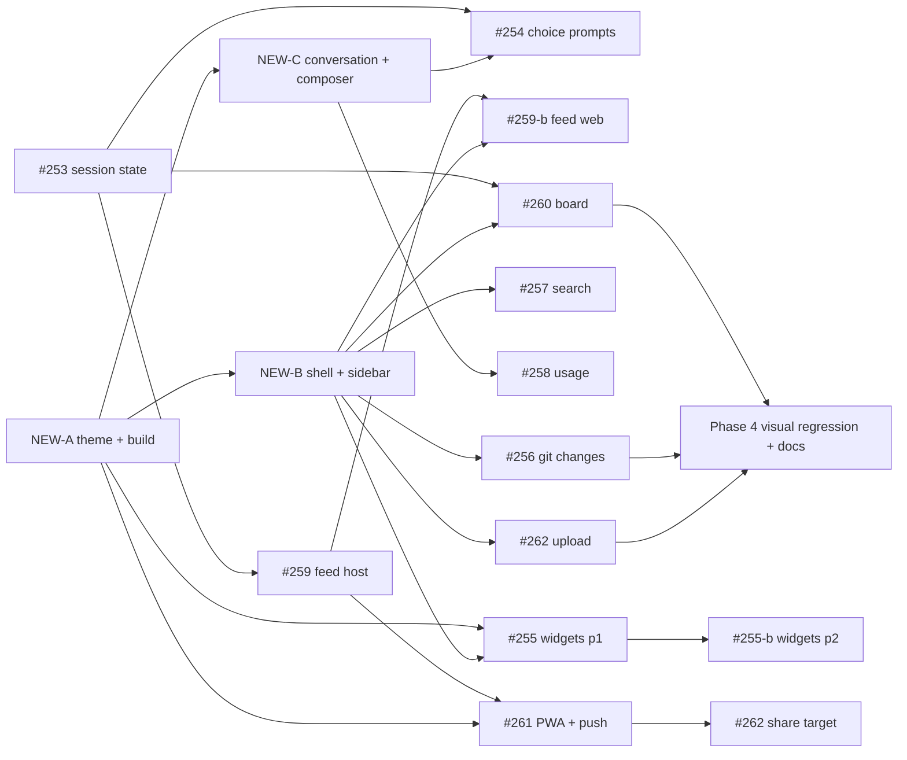

# [Epic] Web-Remote Alignment & Phased Rollout

Tracking issue for modernising `apps/web-remote` to match the desktop renderer (look, layout, `@sero-ai/ui` tokens and primitives) and delivering the `web-remote` roadmap on that base.

Full audit with per-issue decisions: `openspec/changes/web-remote-alignment/issue-audit.md`.

## Goal

- Web-remote uses the same shell dimensions, sidebar tree, chat header, message renderer, tool group, composer and status tokens as the desktop app.
- Every roadmap issue (#253–#262) ships on top of that base, using `@sero-ai/ui` primitives and AI elements rather than custom components.
- Scoped web tokens never receive data or events outside their workspaces.

## Non-goals

- Theme presets over the gateway.
- Extracting desktop components into `@sero-ai/ui`.
- Remote git writes (commit, stage, discard).
- Desktop notification feed UI (only the IPC surface is exposed).

## Architecture decisions

| ID | Decision |
| --- | --- |
| D-G1 | Shared package is `@sero-ai/ui`. AI elements come from `@sero-ai/ui/ai-elements/*`. |
| D-G2 | Desktop renderer is the source of truth; prototypes `agent-node-aligned` and `tool-call-group-expanded` confirm the conventions. System font stack, no Inter. |
| D-G3 | No new shared abstractions. Copy desktop markup for hand-rolled surfaces (session rows, tool group shell, board card). |
| D-G4 | Every protocol change lands on both sides (`protocol*.ts`, `extended-handlers.ts`, `gateway-client.ts`, store, tests) in one PR. |
| D-G5 | New workspace-bound events use a `hasWorkspaceAccess` broadcast helper, not the session-only `broadcastGatewayEvent`. |
| D-G6 | Renderer state persists in IndexedDB via the `token-storage.ts` pattern. No `localStorage`. |
| D-A3 | Markdown renders through `MessageResponse` (Streamdown). `react-markdown` and `rehype-highlight` are removed. |
| D-C3 | Tool calls: desktop `ToolCallGroup` shell + `ai-elements/tool` items. |
| D-C5 | Composer: `PromptInput` family + `Attachments`. No model selector (no gateway request). |
| D-255-5 | Build switches from a single inlined chunk to hashed multi-chunk output (needed by module federation and the service worker). |
| D-256-1 | Diffs render with `ai-elements/code-block` (`language="diff"`) and `ai-elements/commit` file rows. No `@pierre/diffs` dependency. |
| D-258-1 | Usage is "since desktop start" (in-memory `CostTracker`). |
| D-259-1 | #259 splits into host service (#259) and web UI (#259-b). |
| D-255-1 | #255 splits into phase 1 (#255) and interactive phase 2 (#255-b). |

## Questions for the user (product decisions)

- [ ] #260: board as the default landing view. Recommendation: board when the token has more than one workspace or session, otherwise chat.
- [ ] #256: whether remote `git_commit` is wanted at all (follow-up scope).
- [ ] #262: owner-token-only upload in the first iteration (recommended).
- [ ] D-G3: whether session rows, tool group shell and board card should later move into `@sero-ai/ui`.

## Phased rollout

### Phase 1: Theming & Foundations

Sequential. Blocks everything else.

- NEW-A `web-remote: theme and token parity foundation` (theme store, Streamdown, status tokens, prototype for UX review).
- D-255-5 build change (hashed multi-chunk output, `static-files.ts` update). Ships inside NEW-A.

Exit: light and dark render correctly, markdown styled, no palette colours, prototype reviewed.

### Phase 2: Core Components & Layout

NEW-B and NEW-C run in parallel with #253. Both UI issues depend on NEW-A.

- NEW-B `web-remote: shell and sidebar parity` (TitleBar `h-10`, StatusBar `h-6`, resizable sidebar 20%/200px, workspace tree, session rows, APPS rows, activity rail, `list_sessions` metadata).
- NEW-C `web-remote: conversation and composer parity` (`Message`/`MessageResponse`, `Reasoning`, tool group, `PromptInput`, chat header `h-9`).
- #253 session state and turn-completion events (backend; UI checkbox lands in NEW-B's `SessionRow`).

Exit: web-remote is visually aligned with the desktop for the existing feature set; `session_state` and `turn_complete` reach scoped clients correctly.

### Phase 3: Parallel Feature Delivery

All items below can start once their listed blockers are merged. Independent tracks are safe to assign to different people.

| Track | Issue | Blocked by | Parallel with |
| --- | --- | --- | --- |
| Attention | #254 choice prompts | #253, NEW-C | everything else |
| Attention | #259 notification feed (host) | #253 | everything else |
| Attention | #259-b notification bell + feed (web) | #259, NEW-B | #254, #260 |
| Control | #260 session board | #253, NEW-B | #254, #259 |
| Control | #257 cross-session search | NEW-B | all |
| Control | #258 usage badge | NEW-C | all |
| Workspace | #256 git changes panel | NEW-B, #253 (refetch) | all |
| Workspace | #262 upload files (minus share target) | NEW-B | all |
| Plugins | #255 remote widgets phase 1 | NEW-A (build), NEW-B (APPS row) | all |
| Plugins | #255-b interactive widgets | #255 | all |

Exit: each issue's acceptance criteria pass on a phone over Tailscale with an owner token and a scoped token.

### Phase 4: Integration & Visual Regression

- #261 PWA + Web Push (blocked by #259, D-255-5).
- #262 share-target route (blocked by #261).
- Visual regression: Playwright screenshots of web-remote at 1100×760 and 1440×900 (desktop) and 390×844 (mobile) in light and dark, compared with the desktop app screenshots in `apps/styleguide/public/prototypes/screenshots/`.
- Docs: update `apps/docs-site/docs/guide/remote-control.md` screenshots and feature list; scoping notes in `reference/security-privacy.md`.
- Bundle size and cold-load check on mobile after Streamdown, federation runtime and SW.

Exit: screenshots match, docs updated, installable PWA with push on iOS and Android.

## Execution graph

Hard dependencies are the arrows. Everything without an arrow between them runs in parallel. #253 has no UI dependency and can start on day one alongside NEW-A.

## Master progress checklist

Phase 1
- [ ] NEW-A theme and token parity foundation (file issue, link here)
- [ ] D-255-5 hashed multi-chunk build + `static-files.ts`
- [ ] Prototype `web-remote-aligned` reviewed

Phase 2
- [ ] NEW-B shell and sidebar parity (file issue, link here)
- [ ] NEW-C conversation and composer parity (file issue, link here)
- [ ] #253 session state and turn-completion events
- [ ] Milestone: existing feature set visually aligned with desktop

Phase 3
- [ ] #254 answer choice prompts
- [ ] #259 notification feed (host service + protocol)
- [ ] #259-b notification bell and feed (web) (file issue, link here)
- [ ] #260 session board
- [ ] #257 cross-session search
- [ ] #258 usage badge
- [ ] #256 git changes panel
- [ ] #262 upload files (Files panel + drag-drop)
- [ ] #255 remote widgets phase 1
- [ ] #255-b interactive widgets (file issue, link here)
- [ ] Milestone: all Phase 3 acceptance criteria pass with owner and scoped tokens

Phase 4
- [ ] #261 installable PWA with Web Push
- [ ] #262 share-target route
- [ ] Visual regression suite green (light + dark, desktop + mobile)
- [ ] Docs updated (`remote-control.md`, `security-privacy.md`)
- [ ] Milestone: epic complete

## Issue grooming actions

| Issue | Action |
| --- | --- |
| #253 | Keep. Edit: add event shapes, workspace-filtered broadcast helper, UI checkbox blocked by NEW-B. |
| #254 | Keep. Edit: card placement copies desktop `PendingQuestionCard`; global questions owner-only. |
| #255 | Split: phase 2 → #255-b. Edit: add build prerequisite D-255-5 and grid/glass-tile decisions. |
| #256 | Keep. Edit: `code-block` + `commit` primitives replace the diff-library question; truncation cap 200 KB. |
| #257 | Keep. Edit: client-side tier 1, 300 ms debounce, scan bounds. |
| #258 | Keep. Edit: resolve to "since desktop start"; `SessionBadge` popover in the chat header. |
| #259 | Split: web UI → #259-b. Edit: JSONL cap, owner-only global notifications. |
| #260 | Keep. Edit: landing-view rule pending user decision; `BoardCard` styling. |
| #261 | Keep. Edit: hand-written `public/sw.js`, depends on hashed build; `share_target` in manifest. |
| #262 | Keep. Edit: owner-only, `uploads/` default, auto-suffix, 20 MB cap; share target blocked by #261. |
| NEW-A/B/C, #255-b, #259-b | File as new issues with the `web-remote` label and link them above. |
