# @sero-ai/ink-and-bones

Procedural puppet animation: a character is a *program* — a skeleton, parts
painted once in bone-local space, and clips as eased curves — and the engine
bakes it onto a pixel grid, deterministically. No video model, no repair.
Ported from the Godot "CyNinja" Ink & Bones pipeline.

<p align="center">
  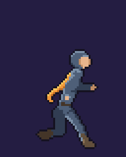
  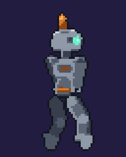
  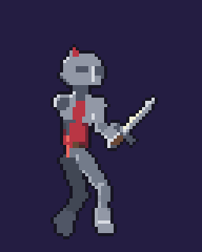
</p>
<p align="center"><em>Every pixel above was computed from a few hundred lines of
TypeScript. No sprite sheets, no image model, no hand-drawn frames.</em></p>

Zero runtime dependencies. No Node, Electron, or DOM imports in the core:
the same code runs in a browser, a worker, and a background runtime (the
three tsconfigs enforce this — the core typechecks against plain ES2023).

## The pipeline

| module | role |
| --- | --- |
| `vec`, `img` | 2D affine math; float RGBA pixel buffer |
| `paint` | painterly part canvas (capsule, ribbon, tint), bone-local |
| `skeleton` | bones, FK, 2-bone IK, verlet chain declarations |
| `motion` | clips as eased curves; gait + plant IK authoring |
| `chains` | the verlet cloth simulation (fixed 60 Hz, warmed up, deterministic) |
| `compositor` | 4x composite, then the grade: quantize, despeckle, ink outline |
| `spec` | **the character contract** (`CharacterSpec`) + bake entry points |
| `player` | renderer-agnostic clip playback (caller feeds time, caller draws) |
| `metrics`, `audit` | measured checks and the eight per-clip audit gates |
| `review` | the images a judge looks at: strips, pose grids, silhouettes |

`paint` draws with `capsule`, `disc`, `polygon`, `stroke`, `ribbon`, two tint
passes and `image` (ready-made pixels). Every helper throws on a mis-shaped
argument rather than drawing nothing — a silently discarded call is the worst
thing that can happen to a generated character, and it happened.

## Try it

```sh
open packages/ink-and-bones/example/index.html
```

No build step — the bundle is committed. The page plays each character on any
of its clips, with the bones overlay, live dials and the audit gates. Move
a slider or flip the theme and the character **rebakes from source**: edits are
diffs, not redraws. Rebuild after editing with `example/build.sh`.

## The examples

The cast uses the same engine for cloth, machinery, an articulated weapon and
a body that is off-vertical by design. The differences stay in the character
files.

| | [`example/scout.ts`](example/scout.ts) | [`example/rivet.ts`](example/rivet.ts) | [`example/knight.ts`](example/knight.ts) | [`example/husk.ts`](example/husk.ts) |
| --- | --- | --- | --- | --- |
| | 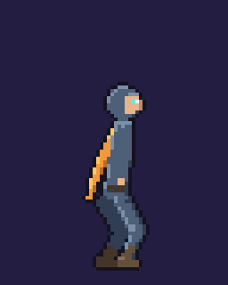 |  |  | 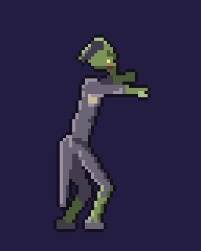 |
| shapes | tapered capsules and discs | flat bevelled polygon panels | plate polygons, mail capsules and a tapered blade | capsules again, but on a hunched, asymmetric frame |
| prop | a heavy, streaming scarf | a stiff, springy antenna | a sword rigged to the hand as a child bone | a coat tail that hangs: gravity beats the wind |
| gait | an airborne run | a grounded plod | a guarded armoured walk | a limp — one stride, two lifts |
| clips | idle, run, run west (mirrored), jump | idle, walk, walk west (mirrored), **startle — not looped** | idle, walk, walk west (mirrored), **slash — not looped** | idle, shamble, shamble west (mirrored), **lunge — not looped** |

<p align="center">
  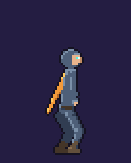
  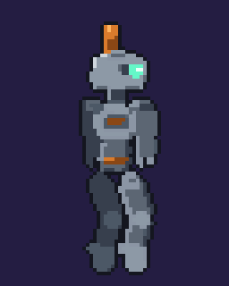
  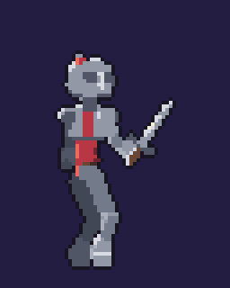
  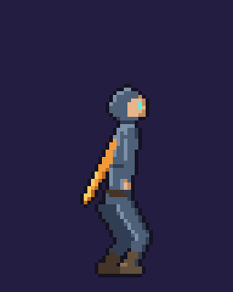
  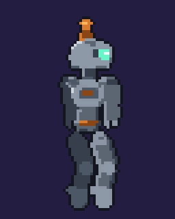
  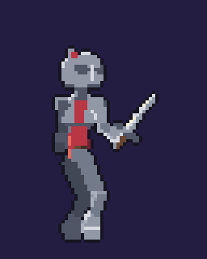
  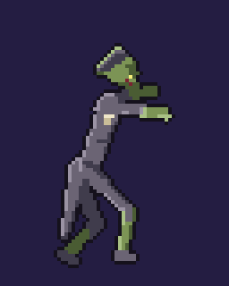
  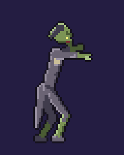
</p>

Regenerate these pictures after a deliberate visual change with
`example/media.sh`.

## Writing your own

Read **[AUTHORING.md](AUTHORING.md)** first — the conventions, the sign traps
and the size budget, in about ten minutes. It is generated from
`AUTHORING_GUIDE`, which is also the system material handed to a model writing
a character, so the two cannot drift.

Then copy an example and change it. The three things that catch everyone:

1. **Angles.** Zero points screen-DOWN and positive swings the tip EAST. A bone
   that stands up rests near 180.
2. **A part is painted in ITS BONE's frame**, with `+Y` along the bone — so on
   an upward bone, local `+X` is screen-WEST and your character's face is at
   negative X.
3. **Coordinates are supersampled**: four of them make one finished pixel. A
   highlight three units deep is under a pixel and will not appear. This is the
   single most common reason a first attempt looks like a stick.

Run `auditCharacter(spec)` as you go, or press the button on the demo page. The
ten gates measure what a still frame will not show you: a limb that detaches
mid-clip, a cycle that walks itself sideways, feet that leave the ground, a
figure too small to read, a colour outside the character's own palette.

They are gates, not taste. Rivet passed all ten while it still looked like a
lump — four visual passes later it looked like a robot and the gates said
exactly the same thing. Useful, and worth knowing the limit of.

## Tests

`pnpm --filter @sero-ai/ink-and-bones test` — the regression net ported from
the Godot `puppet_selftest.gd`, the audit gates run over Scout, Vanguard and Husk,
and golden-frame hashes for byte determinism. After a deliberate visual
change: `UPDATE_GOLDEN=1 pnpm --filter @sero-ai/ink-and-bones test -- golden`.

**Determinism scope:** same source, same bytes — on the same JS engine. The
bake leans on `Math.sin/cos/atan2/acos`, whose last-bit rounding is
implementation-defined, so the contract is per-engine: V8 (Node and
Chromium) is the reference, the goldens are recorded there, and the
background bake service is the canonical baker. A browser preview on another
engine may differ by a pixel; anything durable is baked on V8.

## Status

An experiment, published as-is and **unsupported**. It does what this README
shows and it is fully tested; nobody is on call for it. Fork it freely.

The one thing it does not do: author a character for you. An LLM writing
against this API from a text brief converged on the gates every time and
produced characters nobody could identify — which is the honest and
interesting result, and the reason the repo ships two hand-written examples
instead of a generator.
